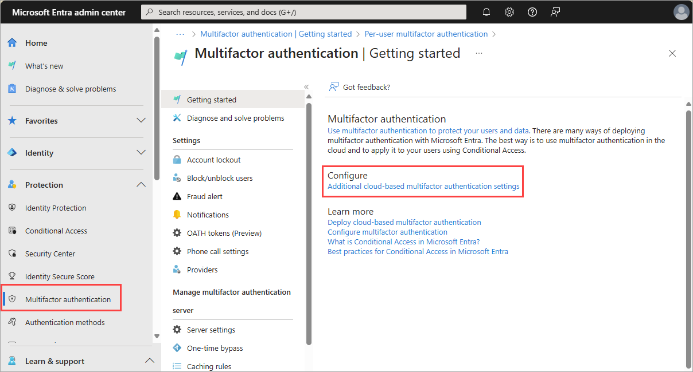
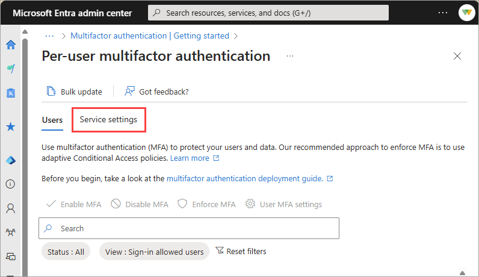
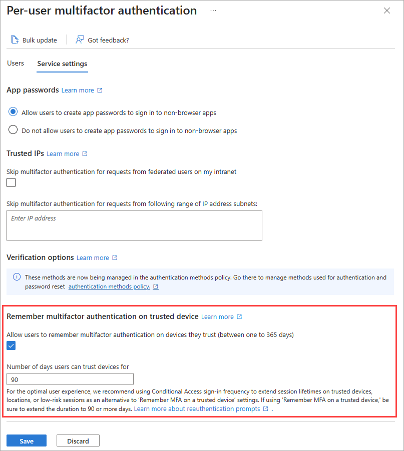

# Microsoft Entra recommendation: Minimize MFA prompts from known devices 

[Microsoft Entra recommendations](overview-recommendations.md) is a feature that provides you with personalized insights and actionable guidance to align your tenant with recommended best practices.

This article covers the recommendation to minimize multifactor authentication prompts from known devices. This recommendation is called `tenantMFA` in the recommendations API in Microsoft Graph. 

## Description

As an admin, you want to maintain security for your company’s resources, but you also want your employees to easily access resources as needed. While enabling MFA is a good practice, you should try to keep the number of MFA prompts your users have to go through at a minimum. One option you have to accomplish this goal is to **allow users to remember multifactor authentication on trusted devices**.

The *remember multifactor authentication on trusted device* feature sets a persistent cookie on the browser when a user selects the *Don't ask again for X days* option at sign-in. The user isn't prompted again for MFA from that browser until the cookie expires. If the user opens a different browser on the same device or clears the cookies, they're prompted again to verify.

For more information, see [Configure Microsoft Entra multifactor authentication settings](../../identity/authentication/howto-mfa-mfasettings.md).

This recommendation shows up if the **remember multifactor authentication** feature is set to less than 30 days.

## Value 

This recommendation improves your user's productivity and minimizes the sign-in time with fewer MFA prompts. Ensure that your most sensitive resources can have the tightest controls, while your least sensitive resources can be more freely accessible.

## Action plan

1. Review the [How to configure Microsoft Entra multifactor authentication settings](../../identity/authentication/howto-mfa-mfasettings.md) article.

1. Sign in to the [Microsoft Entra admin center](https://entra.microsoft.com) as at least an [Authentication Policy Administrator](../../identity/role-based-access-control/permissions-reference.md#authentication-policy-administrator).

1. Browse to **Entra ID** > **Multifactor authentication**.

1. Under the **Configure** heading, select the **Additional cloud-based multifactor authentication settings** link.

    

1. Select the **Service settings** tab.

    

1. Under the **Remember multifactor authentication on trusted device** heading, select the checkbox, and set the number of days to 90.

    

## Related content

- [Review the Microsoft Entra recommendations overview](overview-recommendations.md)
- [Learn how to use Microsoft Entra recommendations](howto-use-recommendations.md)
- [Explore the Microsoft Graph API properties for recommendations](/graph/api/resources/recommendation)
