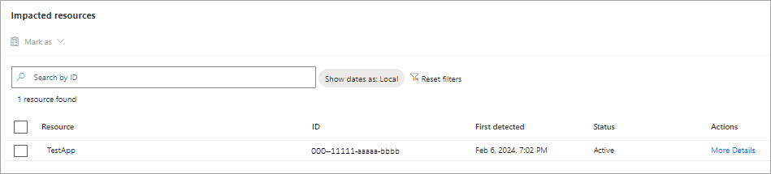
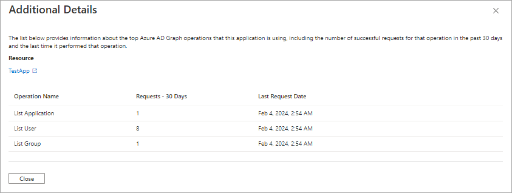

# Microsoft Entra recommendation: Migrate from Azure AD Graph APIs to Microsoft Graph

[Microsoft Entra recommendations](overview-recommendations.md) provide you with personalized insights and actionable guidance to align your tenant with recommended best practices.

This article covers two recommendations to migrate applications and service principals from Azure AD Graph APIs to Microsoft Graph. These recommendations are called `aadGraphDeprecationApplication` and `aadGraphDeprecationServicePrincipal` in the recommendations API in Microsoft Graph.

## Description

The deprecation of Azure Active Directory (Azure AD) Graph APIs was announced in 2020 and are now in the retirement cycle. All applications and service principals need to migrate to the new Microsoft Graph APIs.

In general, applications and service principals that are still using Azure AD Graph APIs were developed by your organization or a vendor. These applications likely need to be updated by your developers or upgraded to a new version.

There are two recommendations associated with the deprecation of Azure AD Graph. One provides a list of applications and one provides a list of service principals. Both recommendations need to be addressed separately.

### Applications and Service Principals

The Applications version of this recommendation details applications that are registered in your tenant and calling Azure AD Graph APIs. Think, app registrations in the Microsoft Entra admin center.

The Service Principals version of this recommendation details applications that are registered in another tenant, but consented for use in your tenant. Think, enterprise applications in the Microsoft Entra admin center. These applications could be supplied by a developer in your multitenant company or a software vendor. For Service Principals, you likely need to contact the vendor to identify how to get an update to a newer version of the application. 

## Value

Microsoft Graph offers a single unified endpoint to access Microsoft Entra and Microsoft 365 services. Microsoft Graph APIs have all the capabilities of Azure AD Graph APIs, plus many newer API features. The Microsoft Graph client libraries offer built-in support for features, such as retry handling, secure redirects, transparent authentication, and payload compression. These capabilities weren't available with Azure AD Graph.

Any applications or service principals still calling Azure AD Graph will be affected by future retirement activity. To prevent loss of functionality, we recommend migrating to Microsoft Graph.

## Action plan

Both of the recommendations include a list of impacted resources. The process to review and update applications and service principals are similar.

1. Review the list of **applications** and **service principals** calling Azure AD Graph under **Impacted Resources** in the recommendations details.

1. Select the **More Details** link to view the following details about the Azure AD Graph API activity.

    

    - **Operation Name**: Description of the API operation, such as List Application, Create User, or Delete Group
    - **Requests - 30 Days**: The number of requests made by this application in the last 30 days
    - **Last Request Date**: The date and time the operation was last performed by the operation.

    

1. Work with the owner or publisher of the corresponding application to identify the steps required to update the application.

These recommendations show as **Active** until there is no Azure AD Graph API activity for 30 days. After 30 days of no Azure AD Graph API activity, that application or service principal is marked as **Completed**. Once all resources are addressed, the recommendation is marked as **Completed**.

## Related content

- [Migrate your apps](/graph/migrate-azure-ad-graph-overview)
- [Migration planning checklist](/graph/migrate-azure-ad-graph-planning-checklist)
- [Migration FAQs](/graph/migrate-azure-ad-graph-faq)
