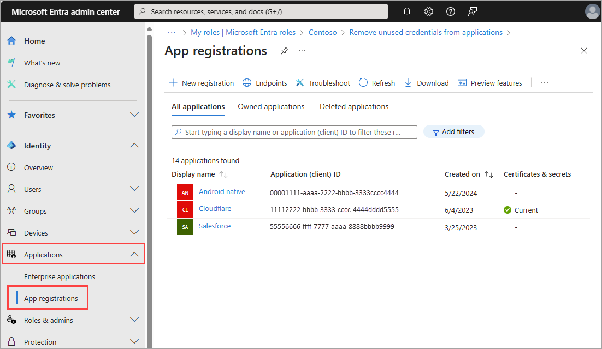

# Microsoft Entra recommendation: Remove unused applications

[Microsoft Entra recommendations](overview-recommendations.md) is a feature that provides you with personalized insights and actionable guidance to align your tenant with recommended best practices.

This article covers the recommendation to investigate unused applications. This recommendation is called `StaleApps` in the recommendations API in Microsoft Graph. 

## Prerequisites

[!INCLUDE [Recommendations roles](../../includes/recommendations-roles.md)]

## Description

This recommendation shows up if your tenant has applications that haven't been used for over 90 days. The following scenarios are included in this recommendation:

- The app was created but never used.
- The app isn't [soft deleted](../../identity-platform/howto-restore-app.md) from the application portfolio.
- The app isn't used by the tenant where it resides nor any of its instances (Service Principal) in other tenants. 
- It's a client app that calls other resource apps, but hasn't been issued any tokens in the past 90 days.
- It's a resource app that doesn't have a record of any client apps requesting a token in the past 90 days.

The following apps are exempted from this recommendation:

- Apps that are managed by Microsoft, including anything created or modified by Microsoft-owned applications.
- Apps that work with other apps to obtain tokens or are used to enable scenarios that don't require tokens.
    - For example, [Peer-to-peer server](/windows/win32/p2psdk/what-is-peer-networking-), [Application proxy](../app-proxy/overview-what-is-app-proxy.md), [Microsoft Entra Cloud Sync](../hybrid/cloud-sync/what-is-cloud-sync.md), [linked single-sign-on](../enterprise-apps/configure-linked-sign-on.md), [password SSO](../enterprise-apps/configure-password-single-sign-on-non-gallery-applications.md), [Office add-ins](/office/dev/add-ins/publish/host-an-office-add-in-on-microsoft-azure), and [managed identities](../managed-identities-azure-resources/overview.md) are excluded from this recommendation.
- Apps that were created within the past 90 days.

## Value

Removing unused applications helps reduce the attack surface area and helps clean up the app portfolio of a tenant.

## Action plan

This recommendation is available in the Microsoft Entra admin center and using the Microsoft Graph API. Once you identify the applications that aren't being used, you can decide whether to remove them or keep them based on your organization's needs. The action plan is therefore broken down into two parts:

1. Review the applications that are flagged as unused.
1. Determine if the application is needed and how to address it.

## [Microsoft Entra admin center](#tab/microsoft-entra-admin-center)

Applications that the recommendation identified appear in the list of **Impacted resources** at the bottom of the recommendation. 

### Review the applications

1. Sign in to the [Microsoft Entra admin center](https://entra.microsoft.com) as at least a [Security Administrator](../role-based-access-control/permissions-reference.md#search-administrator).
1. Browse to **Identity** > **Overview**.
1. Select the **Recommendations** tab and select the **Remove unused applications** recommendation.
1. From the **Impacted resources** table, select **More details** to view more details.
1. Select the **Resource** link to go directly to the app registration for the app.
    1. Alternatively, you can browse to **Identity** > **Applications** > **App registrations** and locate the application that was surfaced as part of this recommendation.

    

### Determine if the application is needed

There are many reasons why an app might be unused. Consider the app's usage scenario and business function. For example:
- Was the app deprecated?
- Is the app used for a business function that only happens at certain times of the year?

To remove the application:

1. [Soft delete](../../identity-platform/howto-restore-app.md) the app from your tenant.
1. Wait 15 days and then [permanently delete the app](../../identity-platform/howto-restore-app.md#permanently-delete-an-application).

To indicate the application is still needed and skip the recommendation:

1. [Update the recommendation status](howto-use-recommendations.md#how-to-update-a-recommendation) to **dismissed** or **postponed**.
    - Use **dismissed** if determined that the app will remain inactive for the rest of its lifecycle.
    - Use **dismissed** if you think the app as included in the recommendation in error.
    - Use **postponed** if you need more time to review the app.

## [Microsoft Graph API](#tab/microsoft-graph-api)

The following requests can be used to retrieve the recommendation and the impacted resources using the Microsoft Graph API. To use the Microsoft Graph API, you need the `DirectoryRecommendations.Read.All` and `DirectoryRecommendations.ReadWrite.All` permissions. For more information, see [How to use Identity Recommendations](howto-use-recommendations.md).

1. Sign in to [Graph Explorer](https://developer.microsoft.com/graph/graph-explorer).
1. Select **GET** as the HTTP method from the dropdown.

### Review the applications

To retrieve all recommendations for your tenant:

```http
GET https://graph.microsoft.com/beta/directory/recommendations
```

From the response, find the ID of the recommendation that matches the following pattern: `{tenantId}_Microsoft.Identity.IAM.Insights.StaleApps`.

To identify impacted resources:

```http
GET https://graph.microsoft.com/beta/directory/recommendations/{tenantId}_Microsoft.Identity.IAM.Insights.StaleApps
```

To filter the resources based on their status (For example, *active* resources):

```http
GET https://graph.microsoft.com/beta/directory/recommendations/536279f6-15cc-45f2-be2d-61e352b51eef_Microsoft.Identity.IAM.Insights.StaleApps/impactedResources?$filter=status eq Microsoft.Graph.recommendationStatus'active' 
```

Identify the `applicationObjectId` or `appId` of the unused app you want to delete. 

#### Sample response

```json
{
    "id": "0000000-000c-0000-000-00000000000f_Microsoft.Identity.IAM.Insights.StaleApps",
    "recommendationType": "staleApps",
    "createdDateTime": "2022-06-16T01:18:55Z",
    "impactStartDateTime": "2022-06-16T01:18:55Z",
    "postponeUntilDateTime": null,
    "lastModifiedDateTime": "2024-07-26T14:17:24Z",
    "lastModifiedBy": "System",
    "displayName": "Remove unused applications",
    "featureAreas": [
        "applications"
    ],
    "insights": "Your tenant has some applications that have not been used in the past 90 days.",
    "benefits": "Removing unused applications improves the security posture and promotes good application hygiene.",
    "category": "identityBestPractice",
    "status": "active",
    "priority": "medium",
    "requiredLicenses": "microsoftEntraWorkloadId",
    "impactType": "apps",
    "actionSteps": [
        {
            "stepNumber": 1,
            "text": "1. Navigate to the app registration blade and delete the unused application."
        },
        {
            "stepNumber": 2,
            "text": "2. We suggest you take appropriate steps to ensure the application is not used in longer intervals of more than 90 days. If so, you should change the frequency of access such that the application’s last used time is within 90 days from its last access date."
        }
    ]
}
```

### Determine if the application is needed

Consider the app's usage scenario and business function:
- Was the app deprecated?
- Is the app used for a business function that only happens at certain times of the year?

If you can delete the app, run one of the following queries to delete the application:

```http
DELETE /applications/{applicationObjectId}
DELETE /applications(appId='{appId}')
```

Wait 15 days and then follow the [Permanently delete an item](/graph/api/directory-deleteditems-delete?view=graph-rest-1.0&preserve-view=true) Microsoft Graph API guidance.

---

## Related content

- [Review the Microsoft Entra recommendations overview](overview-recommendations.md)
- [Learn how to use Microsoft Entra recommendations](howto-use-recommendations.md)
- [Explore the Microsoft Graph API properties for recommendations](/graph/api/resources/recommendation)