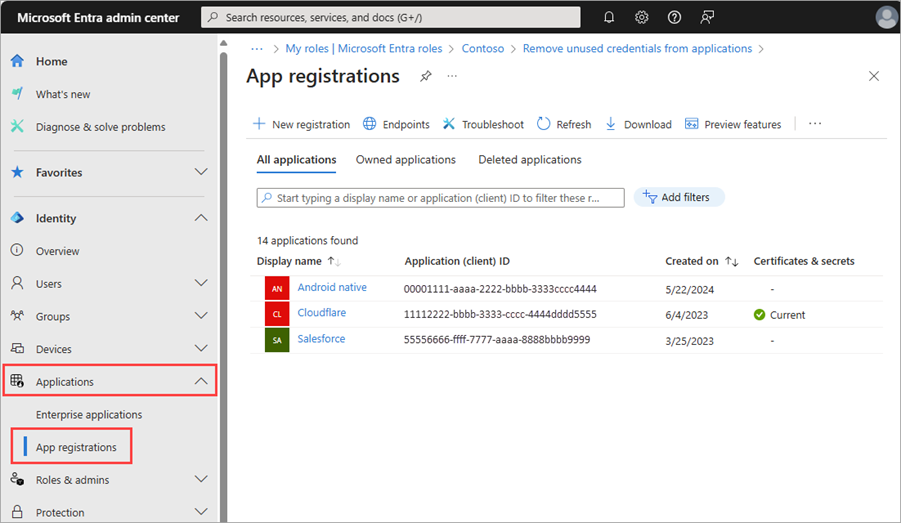
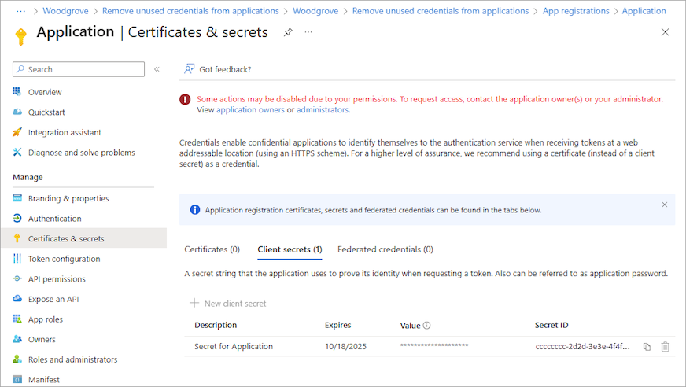

# Microsoft Entra recommendation: Remove unused credentials from apps

[Microsoft Entra recommendations](overview-recommendations.md) is a feature that provides you with personalized insights and actionable guidance to align your tenant with recommended best practices.

This article covers the recommendation to remove unused credentials from apps. This recommendation is called `StaleAppCreds` in the recommendations API in Microsoft Graph. 

## Prerequisites

[!INCLUDE [Recommendations roles](../../includes/recommendations-roles.md)]


## Description

Application credentials can include certificates and other types of secrets that need to be registered with that application. These credentials are used to prove the identity of the application. Only credentials actively in use by an application should remain registered with the application.

A credential is considered unused if:

- It has not been used in the past 30 days.
- It's a credential that was added to an application to be used for OAuth/OIDC flows or to the service principal for SAML flow.

The following credentials are exempted from the recommendation:

- Expired credentials do not show in the **Impacted resources** list.
- Credentials that were identified as unused but have expired since being flagged show as **Completed** in the **Impacted resources** list.

## Value

Removing unused application credentials helps reduce the attack surface area and helps declutter the app portfolio of a tenant. 

## Action plan

This recommendation is available in the Microsoft Entra admin center and using the Microsoft Graph API. 

### [Microsoft Entra admin center](#tab/microsoft-entra-admin-center)

Applications that the recommendation identified appear in the list of **Impacted resources** at the bottom of the recommendation. 

1. Sign in to the [Microsoft Entra admin center](https://entra.microsoft.com) as at least a [Security Administrator](../role-based-access-control/permissions-reference.md#search-administrator).

1. Browse to **Identity** > **Overview**.

1. Select the **Recommendations** tab and select the **Remove unused credentials from applications** recommendation.

1. Take note of the following details from the **Impacted resources** table.
    - The **Resource** column displays the application name
    - The **ID** column displays the application ID

        :::image type="content" source="media/recommendation-remove-unused-credential-from-apps/recommendation-remove-unused-credentials-from-apps.png" alt-text="Screenshot of the recommendation with the More details options highlighted." lightbox="media/recommendation-remove-unused-credential-from-apps/recommendation-remove-unused-credentials-from-apps-expanded.png":::

1. Select **More Details** from the **Actions** column to view more details.

    > [!NOTE]
    > If the origin of the credential is Service Principal, follow the guidance in the [**Service principals**](#service-principals) section.

1. From the panel that opens, select **Update Credential** to navigate directly to the **Certificates & secrets** area of the app registration to remove the unused credential.
    1. Alternatively, browse to **Identity** > **Applications** > **App registrations** and select the application that was surfaced as part of this recommendation. 

        

    1. Then navigate to the **Certificates & Secrets** section of the app registration.
    
        

1. **Locate the unused credential and remove it.**

### [Microsoft Graph API](#tab/microsoft-graph-api)

The following requests can be used to retrieve the recommendation and the impacted resources using the Microsoft Graph API. To use the Microsoft Graph API, you need the `DirectoryRecommendations.Read.All` and `DirectoryRecommendations.ReadWrite.All` permissions. For more information, see [How to use Identity Recommendations](howto-use-recommendations.md#how-to-use-microsoft-graph-with-microsoft-entra-recommendations).

1. Sign in to [Graph Explorer](https://developer.microsoft.com/graph/graph-explorer).
1. Select **GET** as the HTTP method from the dropdown.

To retrieve all recommendations for your tenant:

```http
GET https://graph.microsoft.com/beta/directory/recommendations
```

From the response, find the ID of the recommendation that matches the following pattern: `{tenantId}_Microsoft.Identity.IAM.Insights.StaleAppCreds`.

To identify impacted resources:

```http
GET https://graph.microsoft.com/beta/directory/recommendations/{tenantId}_Microsoft.Identity.IAM.Insights.StaleAppCreds
```

To filter the resources based on their status (For example, *active* resources):

```http
GET https://graph.microsoft.com/eta/directory/recommendations/536279f6-15cc-45f2-be2d-61e352b51eef_Microsoft.Identity.IAM.Insights.StaleAppCreds/impactedResources?$filter=status eq Microsoft.Graph.recommendationStatus'active'
```

- Take note of the `AppId`, `CredentialId`, and origin of the credential you want to remove.
- Use these Microsoft Graph APIs to add a new password or key credential:
    - [removePassword](/graph/api/application-removepassword?view=graph-rest-1.0&preserve-view=true)
    - [removeKey](/graph/api/application-removekey?view=graph-rest-1.0&preserve-view=true)

#### Sample response

```json
{
  "id": "536279f6-15cc-45f2-be2d-61e352b51eef_Microsoft.Identity.IAM.Insights.StaleAppCreds",
  "recommendationType": "staleAppCreds",
  "createdDateTime": "2022-09-07T21:25:36Z",
  "impactStartDateTime": "2022-09-07T21:25:36Z",
  "postponeUntilDateTime": null,
  "lastModifiedDateTime": "2024-07-22T15:23:29Z",
  "lastModifiedBy": "System",
  "displayName": "Remove unused credentials from applications",
  "featureAreas": [
    "applications"
  ],
  "insights": "Your tenant has applications with credentials which have not been used in more than 30 days.",
  "benefits": "An application credential is used to get a token that grants access to a resource or another service.",
  "category": "identityBestPractice",
  "status": "active",
  "priority": "medium",
  "releaseType": "preview",
  "requiredLicenses": "microsoftEntraWorkloadId",
  "impactType": "apps",
  "actionSteps": [
    {
      "stepNumber": 1,
      "text": "1. For application resources, navigate to the app registration section in your tenant."
    },
    {
      "stepNumber": 2,
      "text": "2. In the ‘Certificate and Secrets’ blade, find the credential and remove it."
    },
    {
      "stepNumber": 3,
      "text": "3. To remove a credential from a service principal resource, use the MS Graph Service Principal API service action ",
      "actionUrl": {
        "displayName": "`removePassword`",
        "url": "https://docs.microsoft.com/en-us/graph/api/serviceprincipal-removepassword?view=graph-rest-1.0&tabs=http"
      }
    }
  ]
}
```

---

## Service principals

If the origin of the credential is **service principal**, there are a few considerations and extra steps to follow.

Because there's often multiple service principals for a single application, it may be easier to navigate to Enterprise apps to view everything in one place.

1. In the [Microsoft Entra admin center](https://entra.microsoft.com), browse to **Identity** > **Applications** > **Enterprise applications**.
1. Search for and open the application that was surfaced as part of this recommendation.
1. Select **Single sign-on** from the side menu.

If the credential is a service principal but there are SAML certificates in use, you can identify the details of the credential using the Microsoft Graph API. To use the Microsoft Graph API, you need the `DirectoryRecommendations.Read.All` and `DirectoryRecommendations.ReadWrite.All` permissions. For more information, see [How to use Identity Recommendations](howto-use-recommendations.md#how-to-use-microsoft-graph-with-microsoft-entra-recommendations).

1. Sign in to [Graph Explorer](https://aka.ms/ge).
1. Select **GET** as the HTTP method from the dropdown.
1. Set the API version to **beta**.
1. Query the `keyCredential` and `passwordCredential` endpoints.
1. Use the `removePassword` or `removeKey` endpoints to remove the credential from the service principal.


## Related content

- [Review the Microsoft Entra recommendations overview](overview-recommendations.md)
- [Learn how to use Microsoft Entra recommendations](howto-use-recommendations.md)
- [Explore the Microsoft Graph API properties for recommendations](/graph/api/resources/recommendations-api-overview)
- [Learn about app and service principal objects in Microsoft Entra ID](~/identity-platform/app-objects-and-service-principals.md)