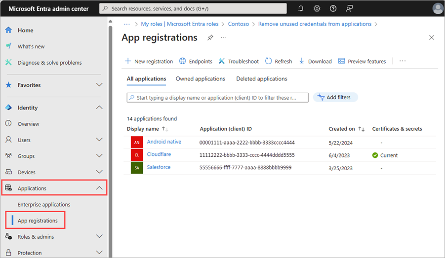

# Microsoft Entra recommendation: Renew expiring service principal credentials (preview)

[Microsoft Entra recommendations](overview-recommendations.md) is a feature that provides you with personalized insights and actionable guidance to align your tenant with recommended best practices.

This article covers the recommendation to renew expiring service principal credentials. This recommendation is called `servicePrincipalKeyExpiry` in the recommendations API in Microsoft Graph. 

## Prerequisites

[!INCLUDE [Recommendations roles](../../includes/recommendations-roles.md)]

## Description

Service principal credentials include certificates and client secrets added to a service principal. The credentials are used to prove the identity of that service principal. If the credentials expire, the service principal can't authenticate, which cause downtime for your business scenario. This recommendation shows up if your tenant has service principals with credentials that are expiring soon.

A service principal credential is expiring if:

- It's on a service principal AND is expiring within the next 30 days.

The following credentials are exempted from this recommendation:

- Credentials that were identified as expiring but have since been removed from the application registration.
- Credentials whose expiration date has lapsed show as **completed** in the list of **Impacted resources**.

## Value

Renewing a service principal's credentials prior to their expiry date is crucial for maintaining uninterrupted operations and minimizing the risk of any downtime resulting from outdated credentials. 

## Action plan

This recommendation is available in the Microsoft Entra admin center and using the Microsoft Graph API.

### [Microsoft Entra admin center](#tab/microsoft-entra-admin-center)

1. Sign in to the [Microsoft Entra admin center](https://entra.microsoft.com) as at least a [Security Administrator](../role-based-access-control/permissions-reference.md#search-administrator).

1. Browse to **Identity** > **Overview**.

1. Select the **Recommendations** tab and select the **Renew expiring service principal credentials** recommendation.

1. Select **More Details** from the **Actions** column.

1. From the panel that opens, select **Update Credential** to navigate directly to the **Single sign-on** area of the app registration.
    1. Alternatively, browse to **Identity** > **Applications** > **App registrations** and locate the application for which the credential needs to be rotated.

        

    1. Navigate to the **Single sign-on** section of the app registration.

1. Edit the **SAML signing certificate** section and follow the prompts to add a new certificate.

    :::image type="content" source="media/recommendation-renew-expiring-service-principal-credential/recommendation-edit-sso.png" alt-text="Screenshot of the edit single-sign-on process." lightbox="media/recommendation-renew-expiring-service-principal-credential/recommendation-edit-sso-expanded.png":::
    
1. Once the certificate or secret is successfully added, update the SAML signing certificate configuration to make the new cert active. 
1. Verify that the application works as expected then remove the inactive SAML certificate from the SAML certificates collection.

> [!NOTE]
> If you don't have any SAML credentials configured but you received this recommendation, use the Microsoft Graph [**ServicePrincipalAPI**](/graph/api/resources/serviceprincipal?view=graph-rest-1.0&preserve-view=true) endpoint to check the `keyCredentials` and `passwordCredentials` properties of the service principal object. Locate and rotate the credential.
>
> We highly recommend changing your service so that it works with the credential defined on the backing application object instead of the service principal.

### [Microsoft Graph API](#tab/microsoft-graph-api)

The following requests can be used to retrieve the recommendation and the impacted resources using the Microsoft Graph API. To use the Microsoft Graph API, you need the `DirectoryRecommendations.Read.All` and `DirectoryRecommendations.ReadWrite.All` permissions. For more information, see [How to use Identity Recommendations](howto-use-recommendations.md).

When renewing service principal credentials using Microsoft Graph, you need to run a query to get the password credentials on a service principal, add a new password credential, then remove the old credentials. 

1. Sign in to [Graph Explorer](https://developer.microsoft.com/graph/graph-explorer).
1. Select **GET** as the HTTP method from the dropdown.

To retrieve all recommendations for your tenant:

```http
GET https://graph.microsoft.com/beta/directory/recommendations
```

From the response, find the ID of the recommendation that matches the following pattern: `{tenantId}_Microsoft.Identity.IAM.Insights.servicePrincipalKeyExpiry`.

To identify impacted resources:

```http
GET https://graph.microsoft.com/beta/directory/recommendations/{tenantId}_Microsoft.Identity.IAM.Insights.servicePrincipalKeyExpiry
```

To filter the list of resources based on their status, for example only resources that are marked as `active`:

```http
https://graph.microsoft.com/beta/directory/recommendations/{tenantId}_Microsoft.Identity.IAM.Insights. servicePrincipalKeyExpiry/impactedResources?$filter=status eq Microsoft.Graph.recommendationStatus'active'
```

- Take note of the `AppId`, `CredentialId`, and the origin of the credential you want to remove.
- Use these Microsoft Graph APIs to add a new password or key credential:
    - [addPassword](/graph/api/serviceprincipal-addpassword?view=graph-rest-1.0&preserve-view=true)
    - [addKey](/graph/api/serviceprincipal-addkey?view=graph-rest-1.0&preserve-view=true)
- Use these Microsoft Graph APIs to remove the old credential:
    - [removePassword](/graph/api/serviceprincipal-removepassword?view=graph-rest-1.0&preserve-view=true)
    - [removeKey](/graph/api/serviceprincipal-removekey?view=graph-rest-1.0&preserve-view=true)

#### Sample response

```json
{
  "id": "536279f6-15cc-45f2-be2d-61e352b51eef_Microsoft.Identity.IAM.Insights.ServicePrincipalKeyExpiry",
  "recommendationType": "servicePrincipalKeyExpiry",
  "createdDateTime": "2022-05-29T00:11:17Z",
  "impactStartDateTime": "2022-05-29T00:11:17Z",
  "postponeUntilDateTime": null,
  "lastModifiedDateTime": "2024-07-26T12:31:58Z",
  "lastModifiedBy": "System",
  "displayName": "Renew expiring service principal credentials",
  "featureAreas": [
    "applications"
  ],
  "insights": "Your tenant has service principals with credentials that will expire soon.",
  "benefits": "Renewing the service principal credential(s) before expiration ensures the application continues to function and reduces the possibility of downtime due to an expired credential.",
  "category": "identityBestPractice",
  "status": "completedBySystem",
  "priority": "high",
  "requiredLicenses": "microsoftEntraWorkloadId",
  "impactType": "apps",
  "actionSteps": [
    {
      "stepNumber": 1,
      "text": "1. Navigate to the Enterprise applications section and locate the Enterprise application for which the credential needs to be rotated."
    },
    {
      "stepNumber": 2,
      "text": "2. Navigate to the “Single sign-on” blade."
    },
    {
      "stepNumber": 3,
      "text": "3. Edit the 'SAML signing certificate' section and follow prompts to add a new certificate."
    },
    {
      "stepNumber": 4,
      "text": "4. After adding the certificate, change its properties to make certificate active. This will make the previous certificate inactive."
    },
    {
      "stepNumber": 5,
      "text": "5. Once the certificate is successfully added and activated, validate that your service is working with the new credential, and remove the old credential."
    },
    {
      "stepNumber": 6,
      "text": "6. If the service principal does not show any credentials after navigating to the enterprise apps blade, we recommend checking the 'passwordCredentials' and 'keyCredentials' property of the service principal object using PowerShell or Microsoft Graph service principal API and use the Microsoft Graph API to rotate credentials."
    }
  ]
}
```
---

## Related content

- [Review the Microsoft Entra recommendations overview](overview-recommendations.md)
- [Learn how to use Microsoft Entra recommendations](howto-use-recommendations.md)
- [Explore the Microsoft Graph API properties for recommendations](/graph/api/resources/recommendation)
- [Learn about securing service principals](~/architecture/service-accounts-principal.md)