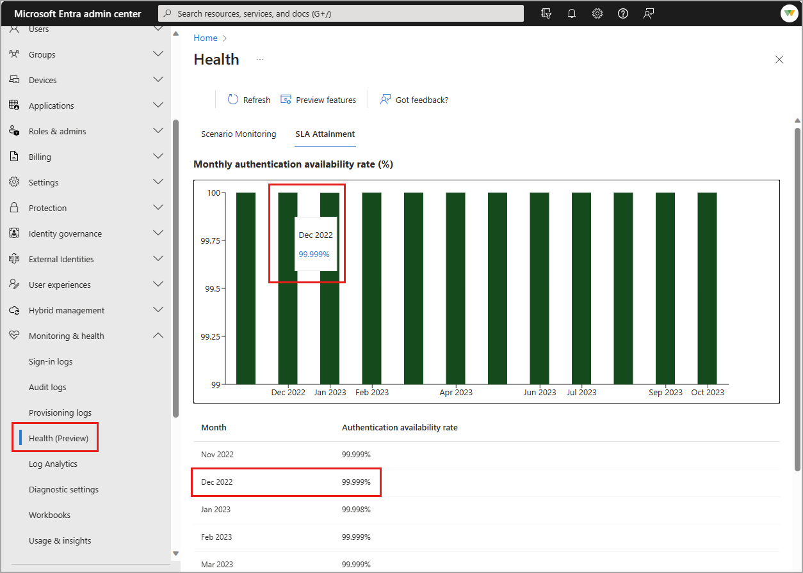

# SLA performance for Microsoft Entra ID

As an identity admin, you might need to track the Microsoft Entra service-level agreement (SLA) performance to make sure Microsoft Entra ID can support your vital apps. This article shows how the Microsoft Entra service has performed according to the [SLA for Microsoft Entra ID](https://azure.microsoft.com/support/legal/sla/active-directory/v1_1/).

You can use this article in discussions with app or business owners to help them understand the performance they can expect from Microsoft Entra ID.

> [!NOTE]
> This article applies to both workforce and external tenants. (Learn more about [tenant configurations](~/external-id/tenant-configurations.md)).

## How is SLA measured for Microsoft Entra ID?

Details on how downtime is defined and how uptime percentage is calculated are provided in the [SLA for Microsoft Entra ID](https://azure.microsoft.com/support/legal/sla/active-directory/v1_1/).

Performance is measured in a way that reflects customer authentication experience, rather than simply reporting on whether the system is available to outside connections. This distinction means that the calculation is based on if:

- Users can authenticate
- Microsoft Entra ID successfully issues tokens for target apps after authentication

## No planned downtime

You rely on Microsoft Entra ID to provide identity and access management for your vital systems. To ensure Microsoft Entra ID is available when business operations require it, Microsoft doesn't plan downtime for Microsoft Entra system maintenance. Instead, maintenance is performed as the service runs, without customer impact.

## Recent worldwide SLA performance

To help you plan for moving workloads to Microsoft Entra ID, we publish past SLA performance. These numbers show the level at which Microsoft Entra ID met the requirements in the [SLA for Microsoft Entra ID](https://azure.microsoft.com/support/legal/sla/active-directory/v1_1/), for all tenants.

The numbers in the table are a global total of Microsoft Entra authentications across all customers and geographies. The number is truncated at three places after the decimal. Numbers aren't rounded up, so actual SLA attainment is higher than indicated.

| Month     | 2021    | 2022    | 2023    | 2024    | 2025    |
| ---       | ---     | ---     | ---     | ---     | ---     |
| January   |         | 99.998% | 99.998% | 99.999% | 99.998% |
| February  | 99.999% | 99.999% | 99.999% | 99.999% | 99.998% |
| March     | 99.568% | 99.998% | 99.999% | 99.999% | 99.996% |
| April     | 99.999% | 99.999% | 99.999% | 99.999% | 99.999%*|
| May       | 99.999% | 99.999% | 99.999% | 99.999% | 99.999% |
| June      | 99.999% | 99.999% | 99.999% | 99.999% | 99.999% |
| July      | 99.999% | 99.999% | 99.999% | 99.999% | 99.999% |
| August    | 99.999% | 99.999% | 99.999% | 99.999% | 99.999% |
| September | 99.999% | 99.998% | 99.999% | 99.999% |         |
| October   | 99.999% | 99.999% | 99.999% | 99.998% |         |
| November  | 99.998% | 99.999% | 99.999% | 99.998% |         |
| December  | 99.978% | 99.999% | 99.999% | 99.998% |         |

*Starting in April 2025, we updated our SLA performance calculations to provide a more complete view of the user experience with authentication availability. The new calculation includes authentication successes from Microsoft Entra's resilient infrastructure, such as when the [backup authentication system](../../architecture/backup-authentication-system.md) succeeds on retry. Prior to April 2025, these successful sign-ins were not included in the SLA calculation. With the addition of this new calculation, the SLA performance percentages will increase. For example, the April 2025 number using the previous calculation logic would have been 99.998%. With new logic, it's 99.999%.

## Incident history

All incidents that seriously affect Microsoft Entra performance are documented in the [Azure status history](https://azure.status.microsoft/status/history/). Not all events documented in Azure status history are serious enough to cause Microsoft Entra ID to go below its SLA. You can view information about the impact of incidents, and a root cause analysis of what caused the incident and what steps Microsoft took to prevent future incidents.

## SLA attainment

In addition to publicly reporting global SLA performance, Microsoft Entra ID provides tenant-level SLA performance for organizations with at least 5000 monthly active users. The Service Level Agreement (SLA) attainment is the user authentication availability for Microsoft Entra ID. For the current availability target and details on how SLA is calculated, see [SLA for Microsoft Entra ID](https://azure.microsoft.com/support/legal/sla/active-directory/v1_1/).

To see the tenant-level SLA:

1. Sign in to the [Microsoft Entra admin center](https://entra.microsoft.com).
1. Browse to **Entra ID** > **Monitoring & health** > **Health**.

Hover your mouse over the bar for a month to view the percentage for that month. A table with the same details appears below the graph.

You can also view SLA attainment using [Microsoft Graph APIs](/graph/api/resources/azureadauthentication?view=graph-rest-beta&preserve-view=true).

## Related content

- [Microsoft Entra monitoring and health overview](overview-monitoring-health.md)
- [Programmatic access to Microsoft Entra reports](howto-enable-microsoft-graph-activity-logs.md)
- [Microsoft Entra risk detections](../../id-protection/overview-identity-protection.md)
