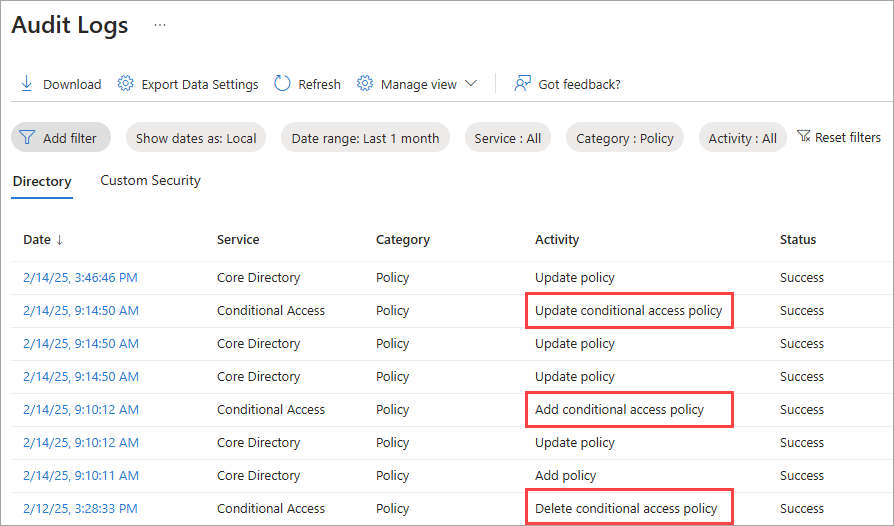

# How to investigate the Conditional Access block policy alert

Microsoft Entra Health monitoring provides a set of tenant-level health metrics you can monitor and alerts for when a potential issue or failure condition is detected. There are multiple health scenarios that can be monitored, including Conditional Access block policies. To learn more about how Microsoft Entra Health works, see:

- [What is Microsoft Entra Health?](concept-microsoft-entra-health.md)
- [How to use Microsoft Entra health monitoring signals and alerts](howto-use-health-scenario-alerts.md)

This article describes the health metrics related to Conditional Access block policies, such as it unexpectedly blocking users from accessing resources or the policy not working as intended. 

> [!IMPORTANT]
> Microsoft Entra Health scenario monitoring and alerts are currently in PREVIEW.
> This information relates to a prerelease product that might be substantially modified before release. Microsoft makes no warranties, expressed or implied, with respect to the information provided here.

## Prerequisites

There are different roles, permissions, and license requirements to view health monitoring signals and configure and receive alerts. We recommend using a role with least privilege access to align with the [Zero Trust guidance](/security/zero-trust/zero-trust-overview).

- A tenant with a [Microsoft Entra P1 or P2 license](../../fundamentals/get-started-premium.md) is required to *view* the Microsoft Entra health scenario monitoring signals.
- A tenant with both a [Microsoft Entra P1 or P2 license](../../fundamentals/get-started-premium.md) *and* at least 100 monthly active users is required to *view alerts* and *receive alert notifications*.
- The [Reports Reader](../role-based-access-control/permissions-reference.md#reports-reader) role is the least privileged role required to *view scenario monitoring signals, alerts, and alert configurations*.
- The [Helpdesk Administrator](../role-based-access-control/permissions-reference.md#helpdesk-administrator) is the least privileged role required to *update alerts* and *update alert notification configurations*.
- The [Conditional Access Administrator](../role-based-access-control/permissions-reference.md#conditional-access-administrator) role is required to *view and modify Conditional Access policies*.
- The `HealthMonitoringAlert.Read.All` permission is required to *view the alerts using the Microsoft Graph API*.
- The `HealthMonitoringAlert.ReadWrite.All` permission is required to *view and modify the alerts using the Microsoft Graph API*.
- For a full list of roles, see [Least privileged role by task](../role-based-access-control/delegate-by-task.md#microsoft-entra-health-least-privileged-roles).

## Investigate the alert and signal

Investigating an alert starts with gathering data. With Microsoft Entra Health in the Microsoft Entra admin center, you can view the signal and alert details in one place. You can also view the signals and alerts using the Microsoft Graph API. For more information, see [How to investigate health scenario alerts](../monitoring-health/howto-investigate-health-scenario-alerts.md) for guidance on how to gather data using the Microsoft Graph API.

1. Sign into the [Microsoft Entra admin center](https://entra.microsoft.com) as at least a [Reports Reader](../role-based-access-control/permissions-reference.md#reports-reader).

1. Browse to **Identity** > **Monitoring and health** > **Health**. The page opens to the Service Level Agreement (SLA) Attainment page.

1. Select the **Health Monitoring** tab.

1. Select the **Conditional Access block policy** scenario and then select an active alert.

1. View the signal from the **View data graph** section to get familiar with the pattern and identify anomalies.

1. Investigate common Conditional Access issues.
    - [Troubleshoot Conditional Access sign-in problems](../conditional-access/troubleshoot-conditional-access.md).
    - [Block access example policy](../conditional-access/policy-block-example.md).

1. Review the sign-in logs.
    - [Review the sign-in log details](concept-sign-in-log-activity-details.md).
    - Look for sign-ins where the Conditional Access status is "failure."

1. Check the audit logs for recent policy changes.
    - [Use the audit logs to troubleshoot Conditional Access policy changes](../conditional-access/troubleshoot-policy-changes-audit-log.md).

## Understand the signal

The Microsoft Entra Health signal for Conditional Access block policy could trigger an alert if there's a spike or dip in the number of users blocked from accessing resources due to a Conditional Access policy.

- A spike could mean a new policy was enabled or an existing policy was modified to target a broader set of users and resources.
- A dip could mean that a policy was disabled or modified to target a smaller set of users and resources.

These changes could be intentional or unintentional.

- If the change was intentional, no other action is likely needed.
- If the change is unintentional, you should review the modified Conditional Access policy in the audit logs.

## Mitigate common issues

The following common issues could cause the Conditional Access block policy alert to trigger an alert. This list isn't exhaustive, but provides a starting point for your investigation.

### Many users are receiving the "You can’t get there from here" message

The Conditional Access block alert can trigger if there’s an increase in the "You can’t get there from here" error message during sign-in. This message appears if the application the user is trying to access can only be accessed from devices or client applications that meet the organization’s mobile device management policy.

- A spike in a large number of users receiving this alert could indicate a change to the organization’s mobile device management policy.
- A spike for a few users could indicate an issue with their specific device.

To investigate:

Go to the **Affected entities** section of the selected scenario and select **View** for users.

- If the issue is affecting a larger number of users, there might be a change to the mobile device management policy that you need to address.
- If the issue is affecting a few users, it could be related to their specific device. They might need to join their devices to the organization's network. Select a user to navigate directly to their profile.

To remediate issues affecting a large number of users:

1. Review the audit logs to see what changes were made to your Conditional Access policies.
    - Filter to **Category: Policy** and look for the following events:
        - **Add conditional access policy**
        - **Delete conditional access policy**
        - **Update conditional access policy**

    

    - You can also use the following Microsoft Graph API queries:
        - GET `https://graph.microsoft.com/beta/auditLogs/directoryAudits?$filter=loggedByService eq 'Conditional Access'`
        - GET `https://graph.microsoft.com/beta/auditLogs/directoryAudits?$filter=loggedByService eq 'Conditional Access' and operationType eq 'Update'`
        - GET `https://graph.microsoft.com/beta/auditLogs/directoryAudits?$filter=loggedByService eq 'Conditional Access' and operationType eq ‘Add’`
        - GET `https://graph.microsoft.com/beta/auditLogs/directoryAudits?$filter=loggedByService eq 'Conditional Access' and operationType eq 'Delete'`
        - GET `https://graph.microsoft.com/beta/auditLogs/directoryAudits?$filter=loggedByService eq 'Conditional Access' and activityDateTime ge 2024-12-04T22:03:57.2013763Z`

1. Review your mobile device management policies to ensure they're configured correctly. Sign in to the [Microsoft Intune admin center](https://intune.microsoft.com/) as an [Intune Administrator](../role-based-access-control/permissions-reference.md#intune-administrator) and browse to **Devices** > **Configuration** to review your policies.

To remediate issues affecting specific users:

- Join their work-owned device to the organization's network.
- Register their personal device with the organization's network.

## Related content

- [Learn about Conditional Access and Intune](/mem/intune/protect/conditional-access)
- [How to investigate health scenario alerts](howto-investigate-health-scenario-alerts.md)