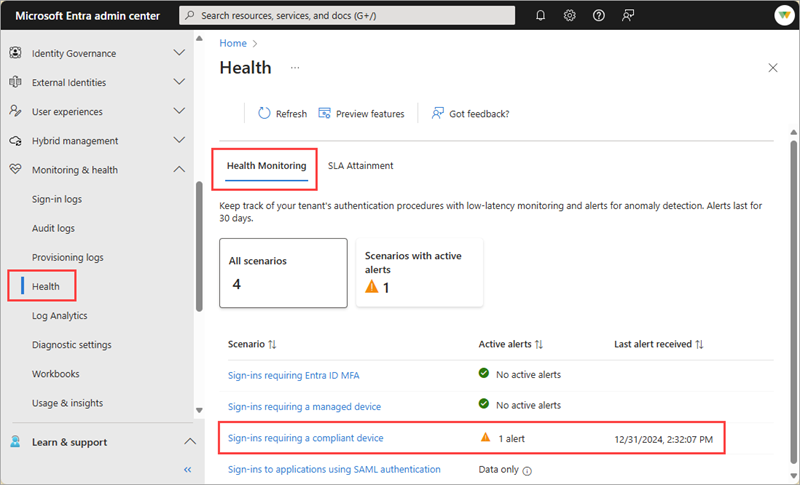
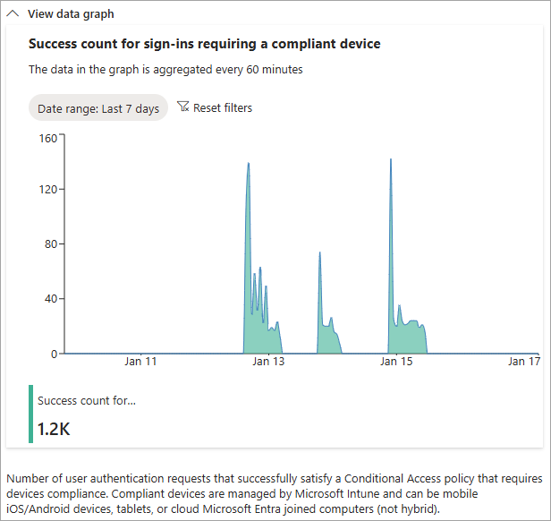

# How to investigate the sign-ins requiring a compliant or managed device alert

Microsoft Entra Health monitoring provides a set of tenant-level health metrics you can monitor and alerts when a potential issue or failure condition is detected. There are multiple health scenarios that can be monitored, including two related to devices:

- Sign-ins requiring a Conditional Access compliant device
- Sign-ins requiring a Conditional Access managed device

These scenarios allow you to monitor and receive alerts on user authentication that satisfy a Conditional Access policy requiring signing in from a compliant or managed device. To learn more about how Microsoft Entra Health works, see:

- [What is Microsoft Entra Health?](concept-microsoft-entra-health.md)
- [How to use Microsoft Entra health monitoring signals and alerts](howto-use-health-scenario-alerts.md)

This article describes the health metrics related to compliant and managed devices and how to troubleshoot a potential issue when you receive an alert.

## Prerequisites

There are different roles, permissions, and license requirements to view health monitoring signals and configure and receive alerts. We recommend using a role with least privilege access to align with the [Zero Trust guidance](/security/zero-trust/zero-trust-overview).

- A tenant with a [Microsoft Entra P1 or P2 license](../../fundamentals/get-started-premium.md) is required to *view* the Microsoft Entra health scenario monitoring signals.
- A tenant with both a [Microsoft Entra P1 or P2 license](../../fundamentals/get-started-premium.md) *and* at least 100 monthly active users is required to *view alerts* and *receive alert notifications*.
- The [Reports Reader](../role-based-access-control/permissions-reference.md#reports-reader) role is the least privileged role required to *view scenario monitoring signals, alerts, and alert configurations*.
- The [Helpdesk Administrator](../role-based-access-control/permissions-reference.md#helpdesk-administrator) is the least privileged role required to *update alerts* and *update alert notification configurations*.
- The `HealthMonitoringAlert.Read.All` permission is required to *view the alerts using the Microsoft Graph API*.
- The `HealthMonitoringAlert.ReadWrite.All` permission is required to *view and modify the alerts using the Microsoft Graph API*.
- For a full list of roles, see [Least privileged role by task](../role-based-access-control/delegate-by-task.md#monitoring-and-health---audit-and-sign-in-logs).

## Investigate the signals and alerts

Investigating an alert starts with gathering data. With Microsoft Entra Health in the Microsoft Entra admin center, you can view the signal and alert details in one place.

1. Sign into the [Microsoft Entra admin center](https://entra.microsoft.com) as at least a [Reports Reader](../role-based-access-control/permissions-reference.md#reports-reader).

1. Browse to **Identity** > **Monitoring and health** > **Health**. The page opens to the Service Level Agreement (SLA) Attainment page.

1. Select the **Health Monitoring** tab.

1. Select the **Sign-ins requiring a compliant device** or **Sign-ins requiring a managed device** scenario and then select an active alert.

    - If using the Microsoft Graph API, you can run the [List alerts](/graph/api/healthmonitoring-healthmonitoringroot-list-alerts?view=graph-rest-beta&preserve-view=true) API to retrieve all alerts or [Get alert](/graph/api/healthmonitoring-alert-get?view=graph-rest-beta&preserve-view=true) API to retrieve the details.
    

1. View the signal from the **View data graph** section to get familiar with the pattern and identify anomalies.
    
    

1. Review your Intune device compliance policies.
    - For more information, see [Intune device compliance overview](/mem/intune/protect/device-compliance-get-started).
    - Learn how to [Monitor device compliance policies](/mem/intune/protect/compliance-policy-monitor).
    - If you're not using Intune, review your device management solution's compliance policies.
1. Investigate common Conditional Access issues.
    - [Troubleshoot Conditional Access device compliance policies](/troubleshoot/mem/intune/device-protection/troubleshoot-conditional-access#devices-appear-compliant-but-users-are-still-blocked).
    - [Troubleshoot Conditional Access sign-in problems](../conditional-access/troubleshoot-conditional-access.md).
1. Review the sign-in logs.
    - [Review the sign-in log details](concept-sign-in-log-activity-details.md).
    - Look for users being blocked from signing in *and* have a compliant device policy applied.
1. Check the audit logs for recent policy changes.
    - [Use the audit logs to troubleshoot Conditional Access policy changes](../conditional-access/troubleshoot-policy-changes-audit-log.md).

## Mitigate common issues

The following common issues could cause a spike in sign-ins requiring a compliant or managed device. This list isn't exhaustive, but provides a starting point for your investigation.

### Many users are blocked from signing in from known devices

If a large group of users are blocked from signing in to known devices, a spike could indicate that these devices have fallen out of compliance. If the number of affected users indicates a high percentage of your organization's users, you might be looking at a wide spread issue.
 
To investigate:
<!-- Need a screenshot here - could try to convert the MFA scenario that has an alert? -->

1. From the **Affected entities** section of the selected scenario, select **View** for users.
    - A sample of affected users appears in a panel. Select a user to navigate directly to their profile where you can view their sign-in activity and other details.
    - With the Microsoft Graph API, look for the "user" `resourceType` and the `impactedCount` value in the impact summary.

1. Check your [Intune device compliance policy](/mem/intune/protect/device-compliance-get-started).

1. Check your [Conditional Access device compliance policies](/troubleshoot/mem/intune/device-protection/troubleshoot-conditional-access#devices-appear-compliant-but-users-are-still-blocked).

<!-- Would like to include how to view the details of a user with Graph -->

### User is blocked from signing in from an unknown device

If the increase in blocked sign-ins is coming from an unknown device, that spike could indicate that an attacker has acquired a user's credentials and is attempting to sign in from a device used for such attacks. If the number affected users shows a small subset of users, the issue might be user-specific.

To investigate:

1. From the **Affected entities** section of the selected scenario, select **View** for users.
    - A list of affected users appears in a panel. Select a user to navigate directly to their profile where you can view their sign-in activity and other details.
    - With the Microsoft Graph API, look for the "user" `resourceType` and the `impactedCount` value in the impact summary.
1. [Review the sign-in logs](../monitoring-health/concept-sign-in-log-activity-details.md).

1. [Investigate risk with Microsoft Entra ID Protection](../../id-protection/howto-identity-protection-investigate-risk.md).
    - Note: Microsoft Entra ID Protection requires a Microsoft Entra P2 license.

<!-- What's the best filter option to narrow the results to unknown devices? -->

### Network issues

There could be a regional system outage that required a large number of users to sign in at the same time.  

To investigate:

1. From the **Affected entities** section of the selected scenario, select **View** for users.
    - A list of affected users appears in a panel. Select a user to navigate directly to their profile where you can view their sign-in activity and other details.
    - With the Microsoft Graph API, look for the "user" `resourceType` and the `impactedCount` value in the impact summary.

1. Check your system and network health to see if an outage or update matches the same timeframe as the anomaly.

1. [Review the sign-in logs](../monitoring-health/concept-sign-in-log-activity-details.md).
    - Adjust your filter to show sign-ins from a region where an affected user is located.

1. If your organization is using Global Secure Access, review the [traffic logs](../../global-secure-access/how-to-view-traffic-logs.md).

## Related content

- [Learn about Conditional Access and Intune](/mem/intune/protect/conditional-access)
- [Learn about Conditional Access and Intune](/mem/intune/protect/conditional-access)
- [Learn about Microsoft Entra hybrid joined devices](../devices/concept-hybrid-join.md)