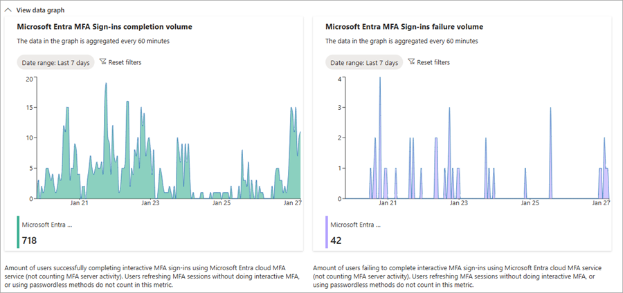

# How to investigate sign-ins requiring multifactor authentication

Microsoft Entra Health monitoring provides a set of tenant-level health metrics you can monitor and alerts when a potential issue or failure condition is detected. There are multiple health scenarios that can be monitored, including multifactor authentication (MFA).

This scenario:

- Aggregates the number of users who successfully completed an MFA sign-in using a Microsoft Entra cloud MFA service.
- Captures interactive sign-ins with MFA, aggregating both successes and failures.
- Excludes when a user refreshes the session without completing the interactive MFA or using passwordless sign-in methods.

This article describes these health metrics and how to troubleshoot a potential issue when you receive an alert.

## Prerequisites

There are different roles, permissions, and license requirements to view health monitoring signals and configure and receive alerts. We recommend using a role with least privilege access to align with the [Zero Trust guidance](/security/zero-trust/zero-trust-overview).

- A tenant with a [Microsoft Entra P1 or P2 license](../../fundamentals/get-started-premium.md) is required to *view* the Microsoft Entra health scenario monitoring signals.
- A tenant with both a [Microsoft Entra P1 or P2 license](../../fundamentals/get-started-premium.md) *and* at least 100 monthly active users is required to *view alerts* and *receive alert notifications*.
- The [Reports Reader](../role-based-access-control/permissions-reference.md#reports-reader) role is the least privileged role required to *view scenario monitoring signals, alerts, and alert configurations*.
- The [Helpdesk Administrator](../role-based-access-control/permissions-reference.md#helpdesk-administrator) is the least privileged role required to *update alerts* and *update alert notification configurations*.
- The `HealthMonitoringAlert.Read.All` permission is required to *view the alerts using the Microsoft Graph API*.
- The `HealthMonitoringAlert.ReadWrite.All` permission is required to *view and modify the alerts using the Microsoft Graph API*.
- For a full list of roles, see [Least privileged role by task](../role-based-access-control/delegate-by-task.md#monitoring-and-health---audit-and-sign-in-logs-and-least-privileged-roles).

## Gather data

Investigating an alert starts with gathering data.

1. Gather the signal details and impact summary.
    - View the signal in the Microsoft Entra admin center to get familiar with the pattern and identify anomalies.
        
    - Run the [List alerts](/graph/api/healthmonitoring-healthmonitoringroot-list-alerts?view=graph-rest-beta&preserve-view=true) API to retrieve all alerts for the tenant.
    - Run the [Get alert](/graph/api/healthmonitoring-alert-get?view=graph-rest-beta&preserve-view=true) API to retrieve the details of a specific alert.
1. Review the sign-in logs.
    - [Review the sign-in log details](concept-sign-in-log-activity-details.md).
    - Look for users being blocked from signing in *and* have a Conditional Access policy requiring MFA applied.
1. Check the audit logs for recent policy changes.
    - [Use the audit logs to troubleshoot Conditional Access policy changes](../conditional-access/troubleshoot-policy-changes-audit-log.md).

## Mitigate common issues

The following common issues could cause a spike in MFA sign-ins. This list isn't exhaustive, but provides a starting point for your investigation.

### Application configuration issues

An increase in sign-ins requiring MFA could indicate a policy change or new feature rollout potentially triggered a large number of users to sign in around the same time.

To investigate:

- In the impact summary, if `resourceType` is "application" and there's only one or two applications listed, check the audit logs for changes to the listed applications.
- In the audit logs, use the **Target** column to filter for the application or open the audit logs from Enterprise Applications, so the filter is already set.
- Determine if the application was recently added or reconfigured. 
- In the sign-in logs, use the **Application** column to filter for the same application or date range to look for any other patterns.

### User authentication issues

An increase in sign-ins requiring MFA could indicate a brute force attack, where multiple unauthorized sign-in attempts are made to a user's account. 

To investigate:

- In the impact summary, if `resourceType` is "user" and the `impactedCount` value shows a small subset of users, the issue might be user-specific.
- Use the following filters in the sign-in logs:
    - **Status**: Failure
    - **Authentication requirement**: Multifactor authentication
    - Adjust the date to match the timeframe indicated in the impact summary.
- Are the failed sign-in attempts coming from the same IP address?
- Are the failed sign-in attempts from the same user?
- Run the [sign-in diagnostic](howto-use-sign-in-diagnostics.md) to rule out standard user error issues or initial MFA setup issues.

### Network issues

There could be a regional system outage that required a large number of users to sign in at the same time. 

To investigate:

- In the impact summary, if `resourceType` is "user" and the `impactedCount` value shows a large percentage of your organization's users, you might be looking at a wide spread issue.
- Check your system and network health to see if an outage or update matches the same timeframe as the anomaly.

## Next steps

- [Configure Conditional Access for MFA for all users](../conditional-access/howto-conditional-access-policy-all-users-mfa.md)
- [Troubleshoot common sign-in errors](howto-troubleshoot-sign-in-errors.md)
- [Learn about Conditional Access and Intune](/mem/intune/protect/conditional-access)
