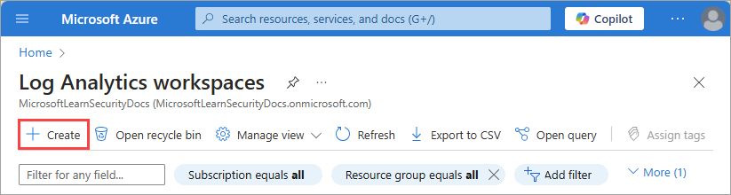
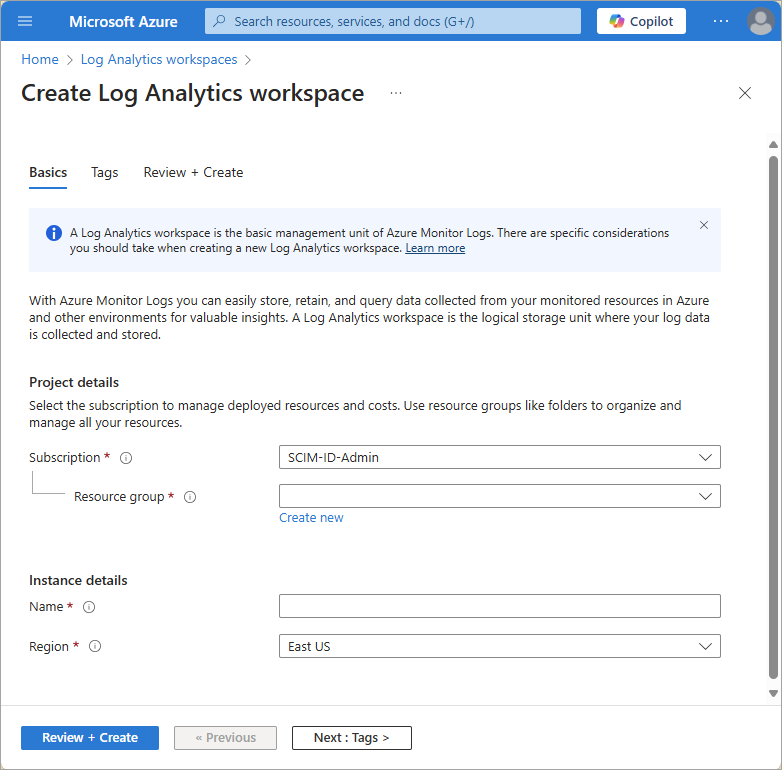
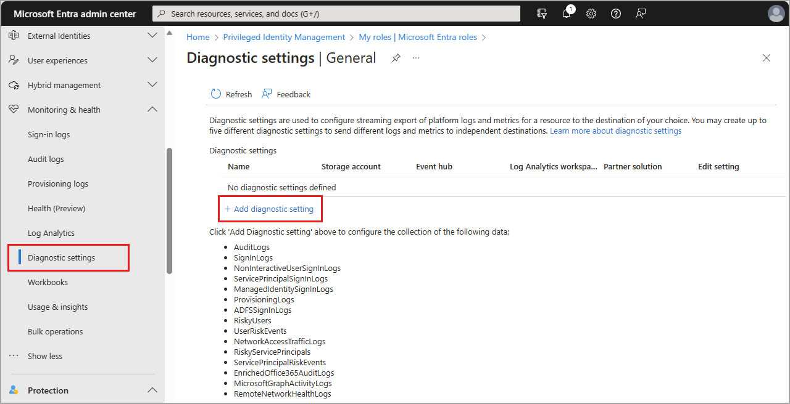
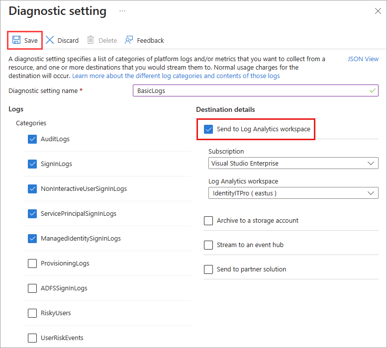

# Tutorial: Create a Log Analytics workspace to analyze sign-in logs

In this tutorial, you learn how to:

> [!div class="checklist"]
> * Create a Log Analytics workspace
> * Configure diagnostic settings to integrate sign-in logs with the Log Analytics workspace
> * Run queries using the Kusto Query Language (KQL)

## Prerequisites

To analyze activity logs with Log Analytics, you need the following roles and requirements:

- [Microsoft Entra monitoring and health licensing](../../fundamentals/licensing.md#microsoft-entra-monitoring-and-health)

- [Access to create a Log Analytics workspace](/azure/azure-monitor/logs/manage-access)

- The appropriate role for Azure Monitor:
  - Monitoring Reader
  - Log Analytics Reader
  - Monitoring Contributor
  - Log Analytics Contributor

- The appropriate role for Microsoft Entra ID:
  - Reports Reader
  - Security Reader
  - Global Reader
  - Security Administrator

## Create a Log Analytics workspace

In this step, you create a Log Analytics workspace, which is where you eventually send your sign-in logs. Before you can create the workspace, you need an [Azure resource group](/azure//azure-resource-manager/management/overview#resource-groups).

1. Sign in to the [Azure portal](https://portal.azure.com) as at least a [Security Administrator](../role-based-access-control/permissions-reference.md#security-administrator) with [Log Analytics Contributor](/azure/azure-monitor/logs/manage-access#log-analytics-contributor) permissions.

1. Browse to **Log Analytics workspaces**.

1. Select **Create**.

    

1.  On the **Create Log Analytics workspace** page, perform the following steps:

    1. Select your subscription.

    2. Select a resource group.
 
    3. Give your workspace a name.

    4. Select your region.

    

1. Select **Review + Create**.

1. Select **Create** and wait for the deployment. You might need to refresh the page to see the new workspace.

## Configure diagnostic settings

To send your identity log information to your new workspace, you need to configure diagnostic settings. There are different diagnostic settings options for Azure and Microsoft Entra, so for the next set of steps let's switch to the Microsoft Entra admin center to make sure everything is identity related.

1. Sign in to the [Microsoft Entra admin center](https://entra.microsoft.com) as at least a [Security Administrator](../role-based-access-control/permissions-reference.md#security-administrator).

1. Browse to **Entra ID** > **Monitoring & health** > **Diagnostic settings**.

1. Select **Add diagnostic setting**.

    

1. On the **Diagnostic setting** page, perform the following steps:

    1. Provide a name for the diagnostic setting.    

    1. Under **Logs**, select **AuditLogs** and **SigninLogs**.

    1. Under **Destination details**, select **Send to Log Analytics**, and then select your new log analytics workspace. 
   
    3. Select **Save**. 

    

Your selected logs might take up to 15 minutes for the logs to populate in your Log Analytics workspace. 

## Run queries in Log Analytics

With your logs streaming to your Log Analytics workspace, you can run queries using the **Kusto Query Language (KQL)**. The least privileged role to run queries is the **Reports Reader** role

1. Browse to **Entra ID** > **Monitoring & health** > **Log Analytics**.

1. In the **Search** textbox, type your query, and select **Run**. 

### Kusto query examples

Take 10 random entries from the input data:

- `SigninLogs | take 10`

Look at the sign-ins where the Conditional Access was a success:

- `SigninLogs | where ConditionalAccessStatus == "success" | project UserDisplayName, ConditionalAccessStatus` 

Count number of successes:

- `SigninLogs | where ConditionalAccessStatus == "success" | project UserDisplayName, ConditionalAccessStatus | count`

Aggregate count of successful sign-ins by user by day:

- `SigninLogs | where ConditionalAccessStatus == "success" | summarize SuccessfulSign-ins = count() by UserDisplayName, bin(TimeGenerated, 1d)` 

View how many times a user does a certain operation in specific time period:

- `AuditLogs | where TimeGenerated > ago(30d) | where OperationName contains "Add member to role" | summarize count() by OperationName, Identity`

Pivot the results on operation name:

- `AuditLogs | where TimeGenerated > ago(30d) | where OperationName contains "Add member to role" | project OperationName, Identity | evaluate pivot(OperationName)`

Merge together Audit and Sign in Logs using an inner join:

- `AuditLogs |where OperationName contains "Add User" |extend UserPrincipalName = tostring(TargetResources[0].userPrincipalName) | |project TimeGenerated, UserPrincipalName |join kind = inner (SigninLogs) on UserPrincipalName |summarize arg_min(TimeGenerated, *) by UserPrincipalName |extend SigninDate = TimeGenerated` 

View number of signs ins by client app type:

- `SigninLogs | summarize count() by ClientAppUsed`

Count the sign ins by day:

- `SigninLogs | summarize NumberOfEntries=count() by bin(TimeGenerated, 1d)`

Take five random entries and project the columns you wish to see in the results:

- `SigninLogs | take 5 | project ClientAppUsed, Identity, ConditionalAccessStatus, Status, TimeGenerated`

Take the top 5 in descending order and project the columns you wish to see:

- `SigninLogs | take 5 | project ClientAppUsed, Identity, ConditionalAccessStatus, Status, TimeGenerated`

Create a new column by combining the values to two other columns:

- `SigninLogs | limit 10 | extend RiskUser = strcat(RiskDetail, "-", Identity) | project RiskUser, ClientAppUsed`

## Next step

> [!div class="nextstepaction"]
> [Create a custom workbook](tutorial-create-log-analytics-workbook.md)
