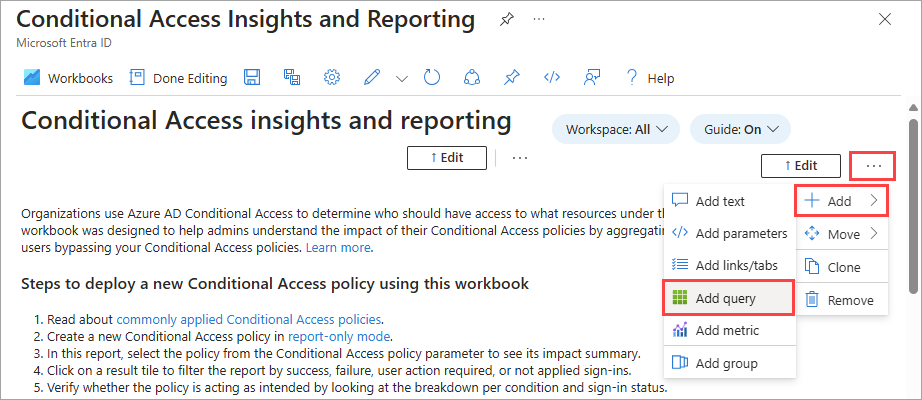

# Tutorial: Create a custom workbook for Microsoft Entra ID

In this tutorial, you learn how to:

> [!div class="checklist"]
> * Create a custom workbook
> * Add a query to an existing workbook template

## Prerequisites

To analyze activity logs with Log Analytics, you need the following roles and requirements:

- [Microsoft Entra monitoring and health licensing](../../fundamentals/licensing.md#microsoft-entra-monitoring-and-health)

- [Access to create a Log Analytics workspace](/azure/azure-monitor/logs/manage-access)

- The appropriate role for Azure Monitor:
  - Monitoring Reader
  - Log Analytics Reader
  - Monitoring Contributor
  - Log Analytics Contributor

- The appropriate role for Microsoft Entra ID:
  - Reports Reader
  - Security Reader
  - Global Reader
  - Security Administrator

If you haven't already created a Log Analytics workspace, complete the [Configure Log Analytics workspace](tutorial-configure-log-analytics-workspace.md) tutorial.

## Create a custom workbook

In addition to querying the data with Kusto Query Language (KQL), you can create a custom workbook for further analysis and alerting. The least privileged role to create or update a workbook is the **Security Administrator** role.

1. Browse to **Entra ID** > **Monitoring & health** > **Workbooks**. 

1. In the **Quickstart** section, select **Empty**.

    

1. From the **Add** menu, select **Add text**.

    

1. In the textbox, enter `# Client apps used in the past week` and select **Done Editing**.

    

1. Below the text window, open the **Add** menu and select **Add query**.

    

1. In the query textbox, enter: `SigninLogs | where TimeGenerated > ago(7d) | project TimeGenerated, UserDisplayName, ClientAppUsed | summarize count() by ClientAppUsed`

1. Select **Run Query**.

    

1. In the toolbar, from the **Visualization** menu select **Pie chart**.

    

1. Select **Done Editing** at the top of the page.

1. Select the **Save** icon to save your workbook.

1. In the dialog box that appears, enter a title, select a Resource group, and select **Apply**.

## Add a query to a workbook template

You can add Kusto queries to your workbook. The example is based on a query that shows the distribution of successful and failed sign-ins with applied Conditional Access policies. The least privileged role to create or update a workbook is the **Security Administrator** role.

1. Browse to **Entra ID** > **Monitoring & health** > **Workbooks**. 

1. In the **Conditional Access** section, select **Conditional Access Insights and Reporting**.

    

1. In the toolbar, select **Edit**.

    

1. In the toolbar, select the three dots next to the Edit button, then **Add**, and then **Add query**.

    

1. In the query textbox, enter: `SigninLogs | where TimeGenerated > ago(20d) | where ConditionalAccessPolicies != "[]" | summarize dcount(UserDisplayName) by bin(TimeGenerated, 1d), ConditionalAccessStatus`

1. Select **Run Query**.

    

1. From the **Time Range** menu, select **Set in query**.

1. From the **Visualization** menu, select **Bar chart**. 

1. Select **Advanced Settings**.

    

1.  In the **Chart title** field, enter `Conditional Access status over the last 20 days`  and select **Done Editing**. 

    

Your Conditional Access success and failure chart displays a color-coded snapshot of your tenant.

## Related content

- [Configure Log Analytics workspace](tutorial-configure-log-analytics-workspace.md)
- [Configure diagnostic settings](howto-configure-diagnostic-settings.md)
- [Integrate activity logs with Log Analytics](howto-integrate-activity-logs-with-azure-monitor-logs.yml)