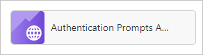
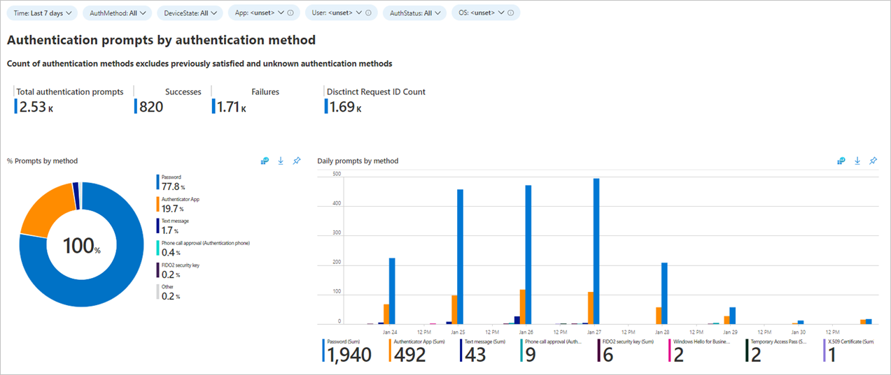
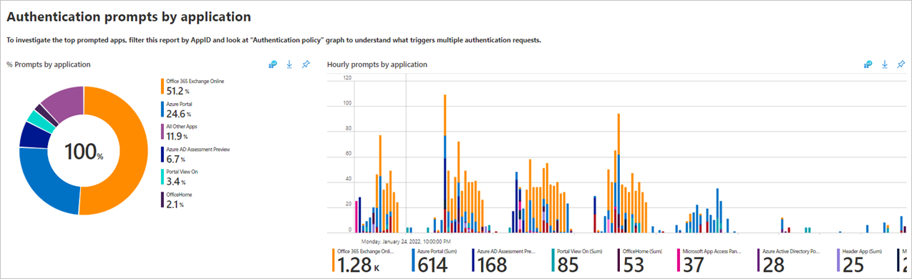
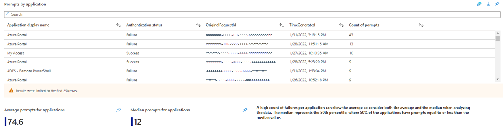
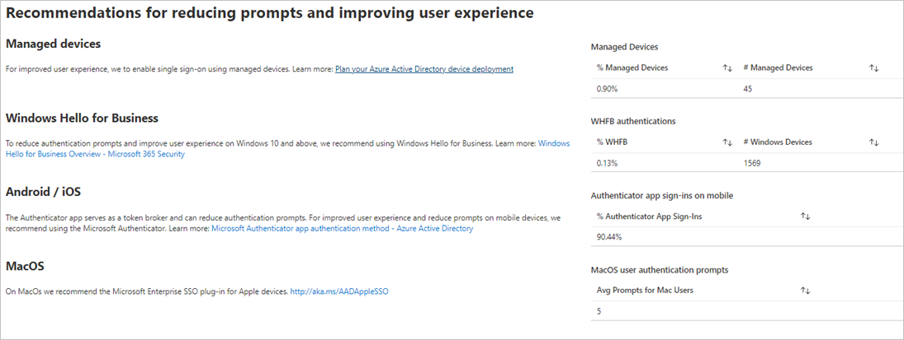
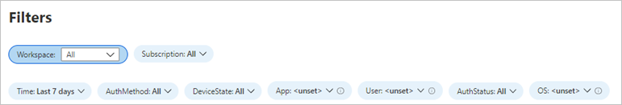
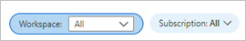
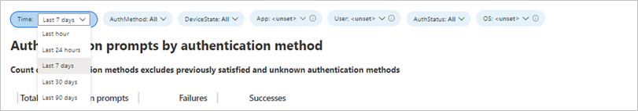

# Authentication prompts analysis workbook

As an IT Pro, you want the right information about authentication prompts in your environment so you can detect unexpected prompts and investigate further. Providing you with this type of information is the goal of the **Authentication Prompts Analysis** workbook. 

## Prerequisites

[!INCLUDE [workbook prerequisites](../../includes/workbook-prerequisites.md)]

## Description

Have you recently received complaints from your users about getting too many authentication prompts?

Over-prompting users can affect productivity and can lead to users getting phished for multifactor authentication (MFA). To be clear, we aren't talking about *if* you should require MFA but *how frequently you should prompt your users*.

The following factors can cause over prompting:

- Misconfigured applications
- Over aggressive prompts policies 
- Cyber-attacks 
 
The authentication prompts analysis workbook identifies various types of authentication prompts. The types are based on different factors including users, applications, operating system, processes, and more.

You can use this workbook in the following scenarios:

- To research feedback of users getting too many prompts.
- To detect over-prompting attributed to one specific authentication method, policy application, or device.
- To view authentication prompt counts of high-profile users.
- To track legacy TLS and other authentication process details.

## How to access the workbook

1. Sign in to the [Microsoft Entra admin center](https://entra.microsoft.com) using the appropriate combination of roles.

1. Browse to **Identity** > **Monitoring & health** > **Workbooks**.

1. Select the **Authentication Prompts Analysis** workbook from the **Usage** section.

## Workbook sections

This workbook breaks down authentication prompts by: 

- Method
- Device state
- Application
- User
- Status
- Operating System
- Process detail
- Policy

In many environments, the most used apps are business productivity apps. Anything that isn’t expected should be investigated. The following charts show authentication prompts by application.

The **prompts by application list view** shows additional information such as timestamps, and request IDs that help with investigations.

Additionally, you get a summary of the average and median prompts count for your tenant. 

This workbook also helps track impactful ways to improve your users’ experience and reduce prompts and the relative percentage.  

 
## Filters

Take advantage of the filters for more granular views of the data: 

Filtering for a specific user that has many authentication requests or only showing applications with sign-in failures can also lead to interesting findings to continue to remediate. 

## Best practices

- If data isn't showing up or seems to be showing up incorrectly, confirm that you set the **Log Analytics Workspace** and **Subscriptions** on the proper resources.

    

- If the visuals are taking too much time to load, try reducing the Time filter to 24 hours or less.

    

- To understand more about the different policies that affect MFA prompts, see [Optimize reauthentication prompts and understand session lifetime for Microsoft Entra multifactor authentication](~/identity/authentication/concepts-azure-multi-factor-authentication-prompts-session-lifetime.md). 

- To learn how to move users from telecom-based methods to the Authenticator app, see [How to run a registration campaign to set up Microsoft Authenticator - Microsoft Authenticator app](~/identity/authentication/how-to-mfa-registration-campaign.md).

## Related content

- [How to use the identity workbooks](how-to-use-workbooks.md)
- [Manage the 'Stay signed in?' prompt](../../fundamentals/how-to-manage-stay-signed-in-prompt.yml)
- [How MFA works](../authentication/concept-mfa-howitworks.md)