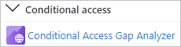
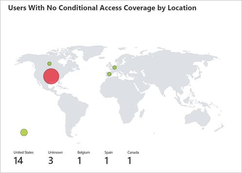
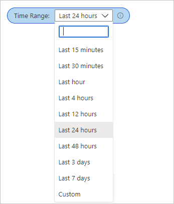

# Conditional Access gap analyzer workbook

In Microsoft Entra ID, you can protect access to your resources by configuring Conditional Access policies.
As an IT administrator, you want to ensure that your Conditional Access policies work as expected to ensure that your resources are properly protected. With the Conditional Access gap analyzer workbook, you can detect gaps in your Conditional Access implementation.  

This article provides you with an overview of the **Conditional Access gap analyzer** workbook.

## Prerequisites

[!INCLUDE [workbook prerequisites](../../includes/workbook-prerequisites.md)]

## Description

As an IT administrator, you want to make sure that only the right people can access your resources. Microsoft Entra Conditional Access helps you to accomplish this goal.  

The Conditional Access gap analyzer workbook helps you to verify that your Conditional Access policies work as expected.

**This workbook:**

- Highlights user sign-ins that have no Conditional Access policies applied to them. 
- Allows you to ensure that there are no users, applications, or locations that were unintentionally excluded from Conditional Access policies.  

## How to access the workbook

1. Sign in to the [Microsoft Entra admin center](https://entra.microsoft.com) using the appropriate combination of roles.

1. Browse to **Identity** > **Monitoring & health** > **Workbooks**.

1. Select the **Conditional Access Gap Analyzer** workbook from the **Conditional Access** section.

## Workbook sections

The workbook has four sections:

- Users signing in using legacy authentication 

- Number of sign-ins by applications that aren't impacted by Conditional Access policies 

- High risk sign-in events bypassing Conditional Access policies 

- Number of sign-ins by location that weren't affected by Conditional Access policies 

Each of these trends offers a breakdown of sign-ins to the user level, so that you can see which users per scenario are bypassing Conditional Access. 

## Filters

This workbook supports setting a time range filter.

## Best practices

Use this workbook to ensure that your tenant is configured to the following Conditional Access best practices:  

- Block all legacy authentication sign-ins 

- Apply at least one Conditional Access Policy to every application 

- Block all high risk sign-ins  

- Block sign-ins from untrusted locations

## Related content

- [How to use the identity workbooks](how-to-use-workbooks.md)
- [What is Conditional Access?](../conditional-access/overview.md)
