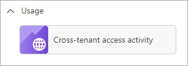
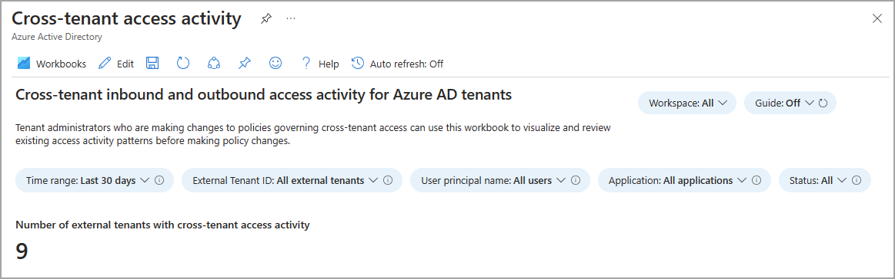
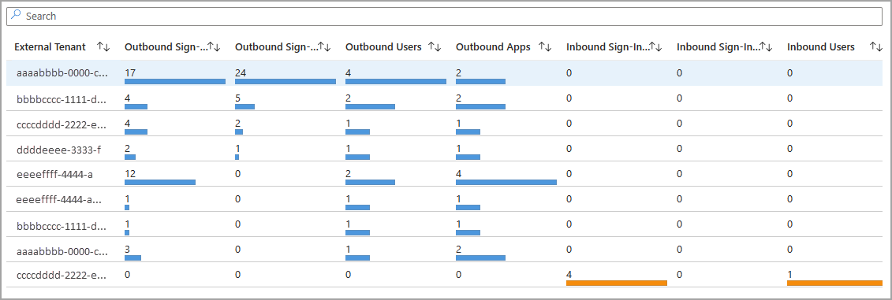
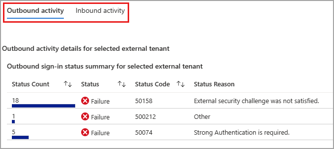
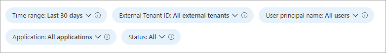

# Cross-tenant access activity workbook

As an IT administrator, you want insights into how your users are collaborating with other organizations. The cross-tenant access activity workbook helps you understand which external users are accessing resources in your organization, and which organizations’ resources your users are accessing. This workbook combines all your organization’s inbound and outbound collaboration into a single view.

This article provides you with an overview of the **Cross-tenant access activity** workbook.

## Prerequisites

[!INCLUDE [workbook prerequisites](../../includes/workbook-prerequisites.md)]

## Description

Tenant administrators who are making changes to policies governing cross-tenant access can use this workbook to visualize and review existing access activity patterns before making policy changes. For example, you can identify the applications your users are accessing in external organizations so that you don't inadvertently block critical business processes. Understanding how external users access resources in your tenant (inbound access) and how users in your tenant access resources in external tenants (outbound access) help ensure you have the right cross-tenant policies in place.

For more information, see the [Microsoft Entra External ID documentation](~/external-id/index.yml).

## How to access the workbook

1. Sign in to the [Microsoft Entra admin center](https://entra.microsoft.com) using the appropriate combination of roles.

1. Browse to **Identity** > **Monitoring & health** > **Workbooks**.

1. Select the **Cross-tenant access activity** workbook from the **Usage** section.

## Workbook sections

This workbook has four sections:

- All inbound and outbound activity by tenant ID

- Sign-in status summary by tenant ID for inbound and outbound collaboration

- Applications accessed for inbound and outbound collaboration by tenant ID

- Individual users for inbound and outbound collaboration by tenant ID

The total number of external tenants that had cross-tenant access activity with your tenant is shown at the top of the workbook. 

The **External Tenant** list shows all the tenants that had inbound or outbound activity with your tenant. When you select an external tenant in the table, the sections after the table display information about outbound and inbound activity for that tenant.

When you select an external tenant from the list with outbound activity, associated details appear in the **Outbound activity** table. The same applies when you select an external tenant with inbound activity. Select the **Inbound activity** tab to view the details of an external tenant with inbound activity.

When you're viewing external tenants with outbound activity, the subsequent two tables display details for the application, and user activity appear. When you're viewing external tenants with inbound activity, the same tables show inbound application and user activity. These tables are dynamic and based on what was previously selected, so make sure you're viewing the correct tenant and activity.

## Filters

This workbook supports multiple filters:

- Time range (up to 90 days)

- External tenant ID

- User principal name

- Application

- Status of the sign-in (success or failure)

## Best practices

Use this workbook to:

- Get the information you need to manage your cross-tenant access settings effectively, without breaking legitimate collaborations

- Identify all inbound sign-ins from external Microsoft Entra organizations

- Identify all outbound sign-ins by your users to external Microsoft Entra organizations

## Related content

- [How to use the identity workbooks](how-to-use-workbooks.md)
- [Introduction to Microsoft Entra External ID](../../external-id/external-identities-overview.md)