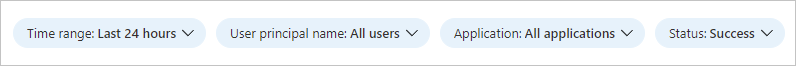

# Sign-ins using legacy authentication workbook

Have you ever wondered how you can determine whether it's safe to turn off legacy authentication in your tenant? The sign-ins using legacy authentication workbook helps you to answer this question.

This article gives you an overview of the **Sign-ins using legacy authentication** workbook.

## Prerequisites

[!INCLUDE [workbook prerequisites](../../includes/workbook-prerequisites.md)]

## Description

Microsoft Entra ID supports several of the most widely used authentication and authorization protocols including legacy authentication. Legacy authentication refers to basic authentication, which was once a widely used industry-standard method for passing user name and password information through a client to an identity provider.

Examples of applications that commonly or only use legacy authentication are:

- Microsoft Office 2013 or older.

- Apps using legacy auth with mail protocols like POP, IMAP, and SMTP AUTH.

Single-factor authentication (for example, username and password) doesn’t provide the required level of protection for today’s computing environments. Passwords are bad as they're easy to guess and humans are bad at choosing good passwords. 

Unfortunately, legacy authentication:

- Doesn't support multifactor authentication (MFA) or other strong authentication methods.

- Makes it impossible for your organization to move to passwordless authentication. 

To improve the security of your Microsoft Entra tenant and experience of your users, you should disable legacy authentication. However, important user experiences in your tenant might depend on legacy authentication. Before shutting off legacy authentication, you might want to find those cases so you can migrate them to more secure authentication. 

The **Sign-ins using legacy authentication** workbook lets you see all legacy authentication sign-ins in your environment. This workbook helps you find and migrate critical workflows to more secure authentication methods before you shut off legacy authentication.

## How to access the workbook

1. Sign in to the [Microsoft Entra admin center](https://entra.microsoft.com) using the appropriate combination of roles.

1. Browse to **Entra ID** > **Monitoring & health** > **Workbooks**.

1. Select the **Sign-ins using legacy authentication** workbook from the **Usage** section.

## Workbook sections

With this workbook, you can distinguish between interactive and non-interactive sign-ins. This workbook highlights which legacy authentication protocols are used throughout your tenant. 

The data collection consists of three steps:

1. Select a legacy authentication protocol, and then select an application to filter by users accessing that application.

2. Select a user to see all their legacy authentication sign-ins to the selected app.

3. View all legacy authentication sign-ins for the user to understand how legacy authentication is being used.

## Filters

This workbook supports multiple filters:

- Time range (up to 90 days)

- User principal name

- Application

- Status of the sign-in (success or failure)

## Best practices

- For guidance on blocking legacy authentication in your environment, see [Block legacy authentication to Microsoft Entra ID with Conditional Access](~/identity/conditional-access/policy-block-legacy-authentication.md).

- Many email protocols that once relied on legacy authentication now support more secure modern authentication methods. If you see legacy email authentication protocols in this workbook, consider migrating to modern authentication for email instead. For more information, see [Deprecation of Basic authentication in Exchange Online](/exchange/clients-and-mobile-in-exchange-online/deprecation-of-basic-authentication-exchange-online).

- Some clients can use both legacy authentication or modern authentication depending on client configuration. If you see “modern mobile/desktop client” or “browser” for a client in the Microsoft Entra logs, it's using modern authentication. If it has a specific client or protocol name, such as “Exchange ActiveSync,” it's using legacy authentication to connect to Microsoft Entra ID. The client types in Conditional Access, and the Microsoft Entra reporting page in the Microsoft Entra admin center demarcate modern authentication clients and legacy authentication clients for you, and only legacy authentication is captured in this workbook. 

- To learn more about identity protection, see [What is identity protection](~/id-protection/overview-identity-protection.md). 

- For more information about Microsoft Entra workbooks, see [How to use Microsoft Entra workbooks](./howto-use-workbooks.md).

## Related content

- [How to use the identity workbooks](howto-use-workbooks.md)
- [Authentication methods overview](../authentication/concept-authentication-methods.md)