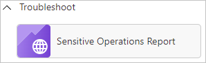
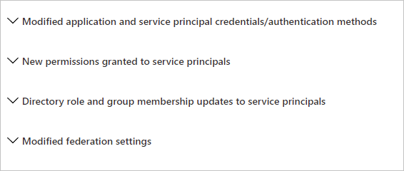

# Sensitive operations report workbook

The sensitive operations report workbook is intended to help identify suspicious application and service principal activity that might indicate compromises in your environment.

This article provides you with an overview of the **Sensitive Operations Report** workbook.

## Prerequisites

[!INCLUDE [workbook prerequisites](../../includes/workbook-prerequisites.md)]

## Description

This workbook identifies recent sensitive operations performed in your tenant.

If your organization is new to Azure monitor workbooks, you need to integrate your Microsoft Entra sign-in and audit logs with Azure Monitor before accessing the workbook. This integration allows you to store, query, and visualize your logs using workbooks for up to two years. Only sign-in and audit events created after Azure Monitor integration are stored, so the workbook won't contain insights before that date. For more information, see [Integrate Microsoft Entra logs with Azure Monitor](howto-integrate-activity-logs-with-azure-monitor-logs.yml).
 
## How to access the workbook

1. Sign in to the [Microsoft Entra admin center](https://entra.microsoft.com) using the appropriate combination of roles.

1. Browse to **Identity** > **Monitoring & health** > **Workbooks**.

1. Select the **Sensitive Operations Report** workbook from the **Troubleshoot** section.

## Sections

This workbook is split into four sections:

- **Modified application and service principal credentials/authentication methods** - This report flags actors who recently changed many service principal credentials, and how many of each type of service principal credentials changed.

- **New permissions granted to service principals** - This workbook also highlights recently granted OAuth 2.0 permissions to service principals. 

- **Directory role and group membership updates for service principals**

- **Modified federation settings** - This report highlights when a user or application modifies federation settings on a domain. For example, it reports when a new Active Directory Federated Service (ADFS) TrustedRealm object, such as a signing certificate, is added to the domain. Modification to domain federation settings should be rare. 

### Modified application and service principal credentials/authentication methods

One of the most common ways for attackers to gain access in the environment is by adding new credentials to existing applications and service principals. The credentials allow the attacker to authenticate as the target application or service principal, granting them access to all resources to which it has permissions.

This section includes the following data to help you detect:

- All new credentials added to apps and service principals, including the credential type

- Top actors and the number of credentials modifications they performed

- A timeline for all credential changes

### New permissions granted to service principals

Attackers often attempt to add permissions to another service principal or application if they can't find a service principal or application with a high privilege set of permissions through which to gain access.

This section includes a breakdown of the AppOnly permissions grants to existing service principals. Admins should investigate any instances of excessive high permissions being granted, including, but not limited to, Exchange Online, and Microsoft Graph.

### Directory role and group membership updates for service principals 

Following the logic of the attacker adding new permissions to existing service principals and applications, another approach is adding them to existing directory roles or groups.

This section includes an overview of all changes made to service principal memberships and should be reviewed for any additions to high privilege roles and groups.

### Modified federation settings

Another common approach to gain a long-term foothold in the environment is to:

- Modify the tenant’s federated domain trusts.
- Add another SAML IDP that the attacker controls as a trusted authentication source. 

This section includes the following data:

- Changes performed to existing domain federation trusts

- Addition of new domains and trusts

## Filters

This paragraph lists the supported filters for each section.

### Modified Application and Service Principal Credentials/Authentication Methods

- Time range
- Operation name
- Credential
- Actor
- Exclude actor

### New permissions granted to service principals

- Time range
- Client app
- Resource

### Directory role and group membership updates to service principals

- Time range
- Operation
- Initiating user or app

### Modified federation settings

- Time range
- Operation
- Initiating user or app

## Best practices

- **Use modified application and service principal credentials** to look out for credentials being added to service principals that aren't frequently used in your organization. Use the filters present in this section to further investigate any of the suspicious actors or service principals that were modified.

- **Use new permissions granted to service principals** to look out for broad or excessive permissions being added to service principals by actors that might be compromised.  

- **Use modified federation settings** section to confirm that the added or modified target domain/URL is a legitimate admin behavior. Actions that modify or add domain federation trusts are rare and should be treated as high fidelity to be investigated as soon as possible.

## Related content

- [How to use the identity workbooks](how-to-use-workbooks.md)
- [Service principal sign-in logs](concept-service-principal-sign-ins.md)