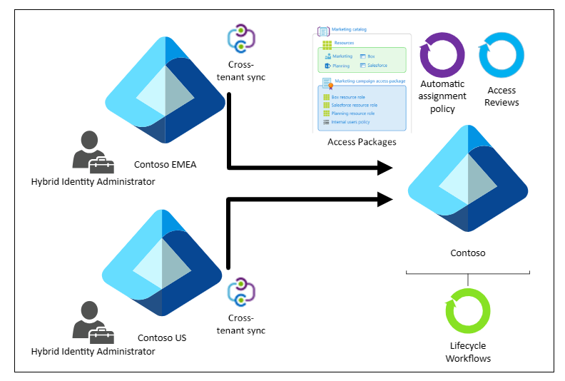
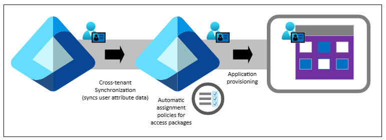

# Governance and cross-tenant synchronization

Cross-tenant synchronization is a flexible and ready-to-use solution to provision accounts and facilitate seamless collaboration across tenants in an organization. Cross-tenant synchronization automatically manages user identity lifecycle across tenants. It provisions, synchronizes, and deprovisions users in the scope of synchronization from source tenants.

This article describes how [Microsoft Entra ID Governance](~/id-governance/identity-governance-overview.md) customers can use cross-tenant synchronization to manage identity and access lifecycles across multitenant organizations.

## Deployment example

In this example, Contoso is a multitenant organization with three production Microsoft Entra tenants. Contoso is deploying cross-tenant synchronization and Microsoft Entra ID Governance features to address the following scenarios:

* Manage employee identity lifecycles across multiple tenants
* Use workflows to automate lifecycle processes for employees that originate in other tenants
* Assign resource access automatically to employees that originate in other tenants
* Allow employees to request access to resources in multiple tenants
* Review the access of synchronized users

From a cross-tenant synchronization perspective, Contoso Europe, Middle East, and Africa (Contoso EMEA) and Contoso United States (Contoso US) are source tenants and Contoso is a target tenant. The following diagram illustrates the topology.

   

This supported [topology for cross-tenant synchronization](~/identity/multi-tenant-organizations/cross-tenant-synchronization-topology.md) is one of many in Microsoft Entra ID. Tenants can be a source tenant, a target tenant, or both. In the following sections, learn how cross-tenant synchronization and Microsoft Entra ID Governance features address several scenarios.

## Manage employee lifecycles across tenants

[Cross-tenant synchronization in Microsoft Entra ID](~/identity/multi-tenant-organizations/cross-tenant-synchronization-overview.md) automates creating, updating, and deleting B2B collaboration users.

When organizations create, or provision, a B2B collaboration user in a tenant, user access depends partly on how the organization provisioned them: Guest or Member user type. When you select user type, consider the various [properties of a Microsoft Entra B2B collaboration user](~/external-id/user-properties.md). The Member user type is suitable if users are part of the larger multitenant organization and need member-level access to resources in the organizational tenants. Microsoft Teams requires the Member user type in [Multitenant organizations](/microsoft-365/enterprise/plan-multi-tenant-org-overview?view=o365-worldwide&preserve-view=true).

By default, cross-tenant synchronization includes commonly used attributes on the user object in Microsoft Entra ID. The following diagram illustrates this scenario.

   

Organizations use the attributes to help create dynamic membership of groups and access packages in the source and target tenant. Some Microsoft Entra ID features have user attributes to target, such as lifecycle workflow user scoping.

To remove, or deprovision, a B2B collaboration user from a tenant automatically stops access to resources in that tenant. This configuration is relevant when employees leave an organization.

## Automate lifecycle processes with workflows

Microsoft Entra ID lifecycle workflows are an identity governance feature to manage Microsoft Entra users. Organizations can automate joiner, mover, and leaver processes.

With cross-tenant synchronization, multitenant organizations can configure lifecycle workflows to run automatically for B2B collaboration users it manages. For example, configure a user onboarding workflow, triggered by the `createdDateTime` event user attribute, to request access package assignment for new B2B collaboration users. Use attributes such as `userType` and `userPrincipalName` to scope lifecycle workflows for users homed in other tenants the organization owns.

## Govern synchronized user access with access packages

Multitenant organizations can ensure B2B collaboration users have access to shared resources in a target tenant. Users can request access, where needed. In the following scenarios, see how the identity governance feature, [entitlement management](~/id-governance/entitlement-management-overview.md) access packages govern resource access.

### Automatically assign access in target tenants to employees from source tenants

The term birthright assignment refers to automatically granting resource access based on one or more user properties. To configure birthright assignment, create [automatic assignment policies for access packages](~/id-governance/entitlement-management-access-package-auto-assignment-policy.md) in entitlement management and configure resource roles to grant shared resource access.

Organizations manage cross-tenant synchronization configuration in the source tenant. Therefore, organizations can delegate resource access management to other source tenant administrators for synchronized B2B collaboration users:

 - In the source tenant, administrators configure cross-tenant synchronization attribute mappings for the users that require cross-tenant resource access
 - In the target tenant, administrators use attributes in automatic assignment policies to determine access package membership for synchronized B2B collaboration users

To drive automatic assignment policies in the target tenant, synchronize default attribute mappings, such as department or map directory extensions, in the source tenant.

### Enable source-tenant employees to request access to target-tenant shared resources

With identity governance [access package](~/id-governance/entitlement-management-access-package-create.md) policies, multitenant organizations can allow B2B collaboration users, created by cross-tenant synchronization, to request access to shared resources in a target tenant. This process is useful if employees need just-in-time (JIT) access to a resource that another tenant owns.

## Review synchronized-user access

[Access reviews in Microsoft Entra ID](~/id-governance/access-reviews-overview.md) enable organizations to manage group memberships, access to enterprise applications, and role assignments. Regularly review user access to ensure the right people have access.

When resource access configuration doesn't automatically assign access, such as with dynamic groups or access packages, configure access reviews to apply the results to resources upon completion. The following sections describe how multitenant organizations can configure access reviews for users across tenants in source and target tenants.

### Review source-tenant user access

Multitenant organizations can include internal users in access reviews. This action enables access recertification in source tenants that synchronizes users. Use this approach for regular review of security groups assigned to cross-tenant synchronization. Therefore, ongoing B2B collaboration access to other tenants has approval in the user home tenant.

Use access reviews of users in source tenants to avoid potential conflicts between cross-tenant synchronization and access reviews that remove denied users upon completion.

### Review target-tenant user access

Organizations can include B2B collaboration users in access reviews, including users provisioned by cross-tenant synchronization in target tenants. This option enables access recertification of resources in target tenants. Although organizations can target all users in access reviews, guest users can be explicitly targeted if necessary.

For organizations that synchronize B2B collaboration users, typically Microsoft doesn't recommend removing denied guest users automatically from access reviews. Cross-tenant synchronization reprovisions the users if they're in the synchronization scope.

## Next steps

* [Multitenant organizations and Microsoft 365](multi-tenant-organization-microsoft-365.md)
* [Multitenant organization templates](multi-tenant-organization-templates.md)
* [Topologies for cross-tenant synchronization](cross-tenant-synchronization-topology.md)
