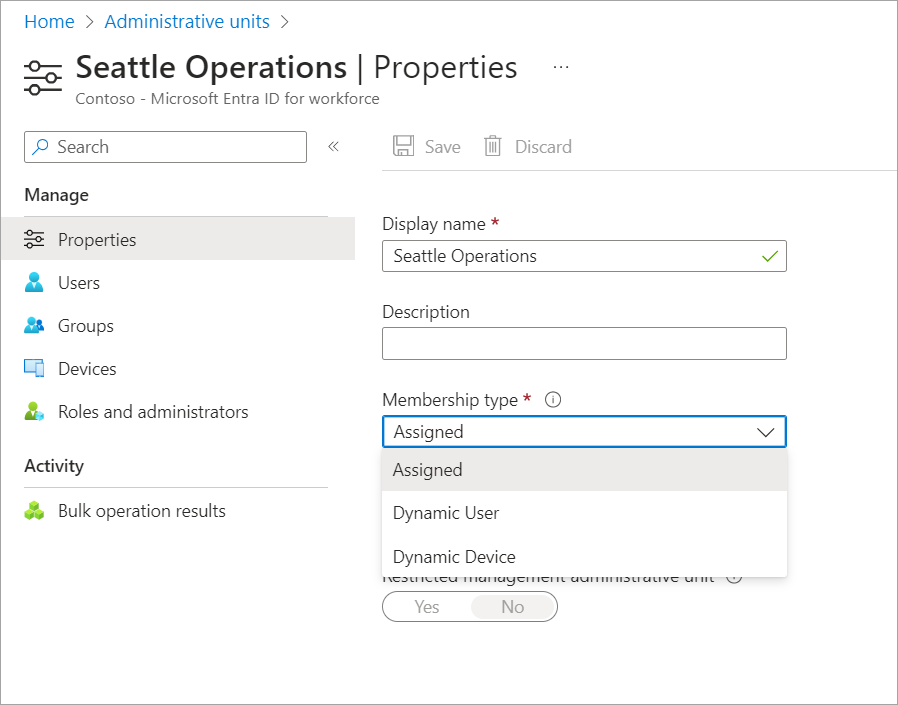

# Manage users or devices for an administrative unit with rules for dynamic membership groups (Preview)

> [!IMPORTANT]
> Dynamic membership rules for administrative units are currently in PREVIEW.
> See the [Product Terms](https://aka.ms/EntraPreviewsTermsOfUse) for legal terms that apply to Azure features that are in beta, preview, or otherwise not yet released into general availability.

You can add or remove users or devices for administrative units manually. With this preview, you can add or remove users or devices for administrative units dynamically using rules. This article describes how to create administrative units with rules for dynamic membership groups using the Microsoft Entra admin center, PowerShell, or Microsoft Graph API.

> [!NOTE]
> Dynamic membership rules for administrative units can be created using the same attributes available for dynamic membership groups. For more information about the specific attributes available and examples on how to use them, see [Manage rules for dynamic membership groups in Microsoft Entra ID](~/identity/users/groups-dynamic-membership.md).

Although administrative units with members assigned manually support multiple object types, such as user, group, and devices, it is currently not possible to create an administrative unit with rules for dynamic membership groups that includes more than one object type. For example, you can create administrative units with rules for dynamic membership groups for users or devices, but not both. Administrative units with rules for dynamic membership groups for groups are currently not supported.

## Prerequisites

- Microsoft Entra ID P1 or P2 license for each administrative unit administrator
- Microsoft Entra ID P1 or P2 license for each administrative unit member
- Privileged Role Administrator
- Microsoft Graph PowerShell SDK installed when using PowerShell
- Admin consent when using Graph Explorer for Microsoft Graph API
- Global Azure cloud (not available in specialized clouds, such as Azure Government or Microsoft Azure operated by 21Vianet)

> [!NOTE]
> Dynamic membership rules for administrative units requires a Microsoft Entra ID P1 license for each unique user that is a member of one or more dynamic administrative units. You don't have to assign licenses to users for them to be members of dynamic administrative units, but you must have the minimum number of licenses in the Microsoft Entra organization to cover all such users. For example, if you had a total of 1,000 unique users in all dynamic administrative units in your organization, you would need at least 1,000 licenses for Microsoft Entra ID P1 to meet the license requirement. No license is required for devices that are members of a dynamic device administrative unit.

For more information, see [Prerequisites to use PowerShell or Graph Explorer](prerequisites.md).

## Add rules for dynamic membership groups

Follow these steps to create administrative units with rules for dynamic membership groups for users or devices.

### Microsoft Entra admin center

[!INCLUDE [portal updates](~/includes/portal-update.md)]

1. Sign in to the [Microsoft Entra admin center](https://entra.microsoft.com) as at least a [Privileged Role Administrator](~/identity/role-based-access-control/permissions-reference.md#privileged-role-administrator).

1. Select the administrative unit that you want to add users or devices to.

1. Select **Properties**.

1. In the **Membership type** list, select **Dynamic User** or **Dynamic Device**, depending on the type of rule you want to add.

    

1. Select **Add dynamic query**.

1. Use the rule builder to specify the dynamic membership groups rule. For more information, see [Rule builder in the Azure portal](~/identity/users/groups-dynamic-membership.md#rule-builder-in-the-azure-portal).

    

1. When finished, select **Save** to save the dynamic membership groups rule.

1. On the **Properties** page, select **Save** to save the membership type and query.

    The following message is displayed:

    After changing the administrative unit type, the existing membership might change based on the dynamic membership groups rule you provide.

1. Select **Yes** to continue.

For steps on how to edit your rule, see the following [Edit rules for dynamic membership groups](#edit-rules-for-dynamic-membership-groups) section.

### PowerShell

1. Create a dynamic membership groups rule. For more information, see [Manage rules for dynamic membership groups in Microsoft Entra ID](~/identity/users/groups-dynamic-membership.md).

1. Use the [Connect-MgGraph](/powershell/microsoftgraph/authentication-commands#using-connect-mggraph) command to connect with Microsoft Entra ID with a user that has been assigned the Privileged Role Administrator role.

    ```powershell
    Connect-MgGraph -Scopes "AdministrativeUnit.ReadWrite.All"
    ```

1. Use the [New-MgDirectoryAdministrativeUnit](/powershell/module/microsoft.graph.identity.directorymanagement/new-mgdirectoryadministrativeunit) command to create a new administrative unit with a dynamic membership groups rule using the following parameters:

    - `MembershipType`: `Dynamic` or `Assigned`
    - `MembershipRule`: Dynamic membership rule you created in a previous step
    - `MembershipRuleProcessingState`: `On` or `Paused`

    ```powershell
    # Create an administrative unit for users in the United States
    $params = @{
       displayName = "Example Admin Unit"
       description = "Example Dynamic Membership Admin Unit"
       membershipType = "Dynamic"
       membershipRule = "(user.country -eq 'United States')"
       membershipRuleProcessingState = "On"
    }

    New-MgDirectoryAdministrativeUnit -BodyParameter $params
    ```

### Microsoft Graph API

1. Create a dynamic membership groups rule. For more information, see [Dynamic membership rules for groups in Microsoft Entra ID](~/identity/users/groups-dynamic-membership.md).

1. Use the [Create administrativeUnit](/graph/api/directory-post-administrativeunits?view=graph-rest-beta&preserve-view=true) API to create a new administrative unit with a dynamic membership groups rule.

    The following shows an example of a dynamic membership groups rule that applies to Windows devices.

    Request

    ```http
    POST https://graph.microsoft.com/beta/administrativeUnits
    ```

    Body

    ```http
    {
      "displayName": "Windows Devices",
      "description": "All Contoso devices running Windows",
      "membershipType": "Dynamic",
      "membershipRule": "(deviceOSType -eq 'Windows')",
      "membershipRuleProcessingState": "On"
    }
    ```

## Edit rules for dynamic membership groups

When an administrative unit has been configured for dynamic membership groups, the usual commands to add or remove members for the administrative unit are disabled as the dynamic membership groups engine retains the sole ownership of adding or removing members. To make changes to the membership, you can edit the rules for dynamic membership groups.

### Microsoft Entra admin center

1. Sign in to the [Microsoft Entra admin center](https://entra.microsoft.com) as at least a [Privileged Role Administrator](~/identity/role-based-access-control/permissions-reference.md#privileged-role-administrator).

1. Browse to **Identity** > **Roles & admins** > **Admin units**.

1. Select the administrative unit that has the rules for dynamic membership groups you want to edit.

1. Select **Membership rules** to edit the rules for dynamic membership groups using the rule builder.

    

    You can also open the rule builder by selecting **Dynamic membership rules** in the left navigation.

1. When finished, select **Save** to save the dynamic membership groups rule changes.

### PowerShell

Use the [Update-MgDirectoryAdministrativeUnit](/powershell/module/microsoft.graph.identity.directorymanagement/update-mgdirectoryadministrativeunit) command to edit the dynamic membership groups rule.

```powershell
# Set a new dynamic membership groups rule for an administrative unit
$adminUnit = Get-MgDirectoryAdministrativeUnit -Filter "displayName eq 'Example Admin Unit'"
$params = @{
   membershipRule = "(user.country -eq 'Germany')"
}

Update-MgDirectoryAdministrativeUnit -AdministrativeUnitId $adminUnit.Id -BodyParameter $params
```

### Microsoft Graph API

Use the [Update administrativeUnit](/graph/api/administrativeunit-update?view=graph-rest-beta&preserve-view=true) API to edit the dynamic membership groups rule.

Request

```http
PATCH https://graph.microsoft.com/beta/administrativeUnits/{id}
```

Body

```http
{
  "membershipRule": "(user.country -eq "Germany")"
}
```

## Change a dynamic administrative unit to assigned

Follow these steps to change an administrative unit with rules for dynamic membership groups to an administrative unit where members are manually assigned.

### Microsoft Entra admin center

1. Sign in to the [Microsoft Entra admin center](https://entra.microsoft.com) as at least a [Privileged Role Administrator](~/identity/role-based-access-control/permissions-reference.md#privileged-role-administrator).

1. Browse to **Identity** > **Roles & admins** > **Admin units**.

1. Select the administrative unit that you want to change to assigned.

1. Select **Properties**.

1. In the **Membership type** list, select **Assigned**.

    

1. Select **Save** to save the membership type.

    The following message is displayed:

    After changing the administrative unit type, the dynamic rule will no longer be processed. Current administrative unit members will remain in the administrative unit and the administrative unit will have assigned membership.

1. Select **Yes** to continue.

    When the membership type setting is changed from dynamic to assigned, the current members remain intact in the administrative unit. Additionally, the ability to add groups to the administrative unit is enabled.

### PowerShell

Use the [Update-MgDirectoryAdministrativeUnit](/powershell/module/microsoft.graph.identity.directorymanagement/update-mgdirectoryadministrativeunit) command to edit the dynamic membership groups rule.

```powershell
# Change an administrative unit to assigned
$adminUnit = Get-MgDirectoryAdministrativeUnit -Filter "displayName eq 'Example Admin Unit'"
$params = @{
   membershipRuleProcessingState = "Paused"
   membershipType = "Assigned"
}

Update-MgDirectoryAdministrativeUnit -AdministrativeUnitId $adminUnit.Id -BodyParameter $params
```

### Microsoft Graph API

Use the [Update administrativeUnit](/graph/api/administrativeunit-update?view=graph-rest-beta&preserve-view=true) API to change the membership type setting.

Request

```http
PATCH https://graph.microsoft.com/beta/administrativeUnits/{id}
```

Body

```http
{
  "membershipType": "Assigned"
}
```

## Next steps

- [Assign Microsoft Entra roles with administrative unit scope](admin-units-assign-roles.md)
- [Add users or groups to an administrative unit](admin-units-members-add.md)
- [Microsoft Entra administrative units: Troubleshooting and FAQ](admin-units-faq-troubleshoot.yml)
