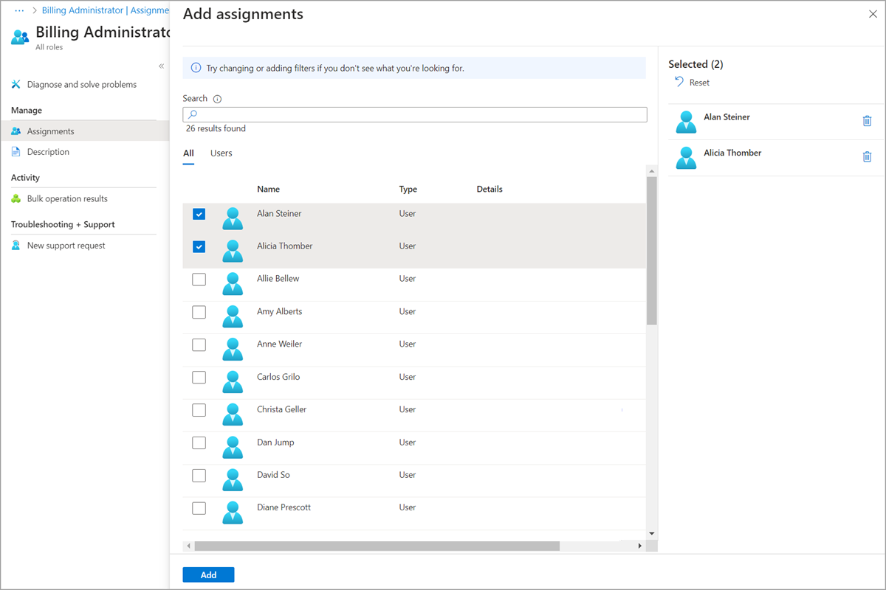

# Assign Microsoft Entra roles at different scopes

In Microsoft Entra ID, roles are typically assigned to apply to the entire tenant. However, you can also assign Microsoft Entra roles for different resources, such as administrative units or application registrations. For example, you could assign the Helpdesk Administrator role so that it just applies to a particular administrative unit and not the entire tenant. The resources that a role assignment applies to is also called the scope. Restricting the scope of a role assignment is supported for built-in and custom roles. For more information about scope, see [Overview of role-based access control (RBAC) in Microsoft Entra ID](custom-overview.md#scope).

This article describes how to assign Microsoft Entra roles at tenant, administrative unit, and application registration scopes.

[!INCLUDE [portal updates](~/includes/portal-update.md)]

## Prerequisites

- Privileged Role Administrator
- Microsoft Graph PowerShell SDK installed when using PowerShell
- Admin consent when using Graph Explorer for Microsoft Graph API

For more information, see [Prerequisites to use PowerShell or Graph Explorer](prerequisites.md).

## Assign roles scoped to the tenant

This section describes how to assign roles at the tenant scope.

### Microsoft Entra admin center

1. Sign in to the [Microsoft Entra admin center](https://entra.microsoft.com) as at least a [Privileged Role Administrator](~/identity/role-based-access-control/permissions-reference.md#privileged-role-administrator).

1. Browse to **Identity** > **Roles & admins** > **Roles & admins**.

    

1. Select a role to see its assignments. To help you find the role you need, use **Add filters** to filter the roles.

1. Select **Add assignments** and then select the users you want to assign to this role.

    

1. Select **Add** to assign the role.

### PowerShell

Follow these steps to assign Microsoft Entra roles using PowerShell.

1. Open a PowerShell window. If necessary, use [Install-Module](/powershell/module/powershellget/install-module) to install Microsoft Graph PowerShell. For more information, see [Prerequisites to use PowerShell or Graph Explorer](prerequisites.md).

    ```powershell
    Install-Module Microsoft.Graph -Scope CurrentUser
    ```

1. In a PowerShell window, use [Connect-MgGraph](/powershell/microsoftgraph/authentication-commands#using-connect-mggraph) to sign in to your tenant.

    ```powershell
    Connect-MgGraph -Scopes "RoleManagement.Read.Directory","User.Read.All","RoleManagement.ReadWrite.Directory"
    ```

1. Use [Get-MgUser](/powershell/module/microsoft.graph.users/get-mguser) to get the user.

    ```powershell
    $user = Get-MgUser -Filter "userPrincipalName eq 'alice@contoso.com'"
    ```

1. Use [Get-MgRoleManagementDirectoryRoleDefinition](/powershell/module/microsoft.graph.identity.governance/get-mgrolemanagementdirectoryroledefinition) to get the role you want to assign.

    ```powershell
    $roleDefinition = Get-MgRoleManagementDirectoryRoleDefinition -Filter "displayName eq 'Billing Administrator'"
    ```

1. Set tenant as scope of role assignment.

    ```powershell
    $directoryScope = '/'
    ```

1. Use [New-MgRoleManagementDirectoryRoleAssignment](/powershell/module/microsoft.graph.identity.governance/new-mgrolemanagementdirectoryroleassignment) to assign the role.

    ```powershell
    $roleAssignment = New-MgRoleManagementDirectoryRoleAssignment `
       -DirectoryScopeId $directoryScope -PrincipalId $user.Id `
       -RoleDefinitionId $roleDefinition.Id
    ```

### Microsoft Graph API

Follow these instructions to assign a role using the Microsoft Graph API in [Graph Explorer](https://aka.ms/ge).

1. Sign in to the [Graph Explorer](https://aka.ms/ge).

1. Use [List users](/graph/api/user-list) API to get the user.

    ```http
    GET https://graph.microsoft.com/v1.0/users?$filter=userPrincipalName eq 'alice@contoso.com'
    ```

1. Use the [List unifiedRoleDefinitions](/graph/api/rbacapplication-list-roledefinitions) API to get the role you want to assign.

    ```http
    GET https://graph.microsoft.com/v1.0/rolemanagement/directory/roleDefinitions?$filter=displayName eq 'Billing Administrator'
    ```

1. Use the [Create unifiedRoleAssignment](/graph/api/rbacapplication-post-roleassignments) API to assign the role.

    ```http
    POST https://graph.microsoft.com/v1.0/roleManagement/directory/roleAssignments
    {
        "@odata.type": "#microsoft.graph.unifiedRoleAssignment",
        "principalId": "<provide objectId of the user obtained above>",
        "roleDefinitionId": "<provide templateId of the role obtained above>",
        "directoryScopeId": "/"
    }
    ```

## Assign roles scoped to an app registration

Built-in roles and custom roles are assigned by default at tenant scope to grant access permissions over all app registrations in your organization. Additionally, custom roles and some relevant built-in roles (depending on the type of Microsoft Entra resource) can also be assigned at the scope of a single Microsoft Entra resource. This allows you to give the user the permission to update credentials and basic properties of a single app without having to create a second custom role.

This section describes how to assign roles at an application registration scope.

### Microsoft Entra admin center

1. Sign in to the [Microsoft Entra admin center](https://entra.microsoft.com) as at least a [Application Developer](./permissions-reference.md#application-developer).

1. Browse to **Identity** > **Applications** > **App registrations**.

1. Select an application. You can use search box to find the desired app.

    You might have to select **All applications** to see the complete list of app registrations in your tenant.

    

1. Select **Roles and administrators** from the left navigation menu to see the list of all roles available to be assigned over the app registration.

    

1. Select the desired role.

1. Select **Add assignments** and then select the users or group you want to assign this role to.

    

1. Select **Add** to assign the role scoped over the app registration.

    

    

>[!NOTE]
> You will not see the entire list of Microsoft Entra built-in or custom roles here. This is expected. We show the roles which have permissions related to managing app registrations only.

### PowerShell

Follow these steps to assign Microsoft Entra roles at application scope using PowerShell.

1. Open a PowerShell window. If necessary, use [Install-Module](/powershell/module/powershellget/install-module) to install Microsoft Graph PowerShell. For more information, see [Prerequisites to use PowerShell or Graph Explorer](prerequisites.md).

    ```powershell
    Install-Module Microsoft.Graph -Scope CurrentUser
    ```

1. In a PowerShell window, use [Connect-MgGraph](/powershell/microsoftgraph/authentication-commands#using-connect-mggraph) to sign in to your tenant.

    ```powershell
    Connect-MgGraph -Scopes "Application.Read.All","RoleManagement.Read.Directory","User.Read.All","RoleManagement.ReadWrite.Directory"
    ```

1. Use [Get-MgUser](/powershell/module/microsoft.graph.users/get-mguser) to get the user.

    ```powershell
    $user = Get-MgUser -Filter "userPrincipalName eq 'alice@contoso.com'"
    ```

1. Use [Get-MgRoleManagementDirectoryRoleDefinition](/powershell/module/microsoft.graph.identity.governance/get-mgrolemanagementdirectoryroledefinition) to get the role you want to assign.

    ```powershell
    $roleDefinition = Get-MgRoleManagementDirectoryRoleDefinition `
       -Filter "displayName eq 'Application Administrator'"
    ```

1. Use [Get-MgApplication](/powershell/module/microsoft.graph.applications/get-mgapplication) to get the app registration you want the role assignment to be scoped to.

    ```powershell
    $appRegistration = Get-MgApplication -Filter "displayName eq 'f/128 Filter Photos'"
    $directoryScope = '/' + $appRegistration.Id
    ```

1. Use [New-MgRoleManagementDirectoryRoleAssignment](/powershell/module/microsoft.graph.identity.governance/new-mgrolemanagementdirectoryroleassignment) to assign the role.

    ```powershell
    $roleAssignment = New-MgRoleManagementDirectoryRoleAssignment `
       -DirectoryScopeId $directoryScope -PrincipalId $user.Id `
       -RoleDefinitionId $roleDefinition.Id 
    ```

To assign the role to a service principal instead of a user, use the [Get-MgServicePrincipal](/powershell/module/Microsoft.Graph.Applications/Get-MgServicePrincipal) cmdlet.

### Microsoft Graph API

Follow these instructions to assign a role at application scope using the Microsoft Graph API in [Graph Explorer](https://aka.ms/ge).

1. Sign in to the [Graph Explorer](https://aka.ms/ge).

1. Use [List users](/graph/api/user-list) API to get the user.

    ```http
    GET https://graph.microsoft.com/v1.0/users?$filter=userPrincipalName eq 'alice@contoso.com'
    ```

1. Use the [List unifiedRoleDefinitions](/graph/api/rbacapplication-list-roledefinitions) API to get the role you want to assign.

    ```http
    GET https://graph.microsoft.com/v1.0/rolemanagement/directory/roleDefinitions?$filter=displayName eq 'Application Administrator'
    ```

1. Use the [List applications](/graph/api/application-list) API to get the administrative unit you want the role assignment to be scoped to.

    ```http
    GET https://graph.microsoft.com/v1.0/applications?$filter=displayName eq 'f/128 Filter Photos'
    ```

1. Use the [Create unifiedRoleAssignment](/graph/api/rbacapplication-post-roleassignments) API to assign the role.

    ```http
    POST https://graph.microsoft.com/v1.0/roleManagement/directory/roleAssignments

    {
        "@odata.type": "#microsoft.graph.unifiedRoleAssignment",
        "principalId": "<provide objectId of the user obtained above>",
        "roleDefinitionId": "<provide templateId of the role obtained above>",
        "directoryScopeId": "/<provide objectId of the app registration obtained above>"
    }
    ```

    Response
    
    ```http
    HTTP/1.1 201 Created
    ```

>[!NOTE]
> Here directoryScopeId is specified as */foo*, unlike the section above. It is by design. The scope of */foo* means the principal can manage that Microsoft Entra object. The scope */administrativeUnits/foo* means the principal can manage the members of the administrative unit (based on the role that she is assigned), not the administrative unit itself.

## Assign roles scoped to an administrative unit

In Microsoft Entra ID, for more granular administrative control, you can assign a Microsoft Entra role with a scope that's limited to one or more [administrative units](./administrative-units.md). When a Microsoft Entra role is assigned at the scope of an administrative unit, role permissions apply only when managing members of the administrative unit itself, and don't apply to tenant-wide settings or configurations.

For example, an administrator who is assigned the Groups Administrator role at the scope of an administrative unit can manage groups that are members of the administrative unit, but they can't manage other groups in the tenant. They also can't manage tenant-level settings related to groups, such as expiration or group naming policies.

This section describes how to assign Microsoft Entra roles with administrative unit scope.

> [!NOTE]
> To assign a role on an administrative unit by using Microsoft Entra Privileged Identity Management (PIM), see [Assign Microsoft Entra roles in PIM](~/id-governance/privileged-identity-management/pim-how-to-add-role-to-user.md?tabs=new#assign-a-role-with-restricted-scope).

### Prerequisites

- Microsoft Entra ID P1 or P2 license for each administrative unit administrator
- Microsoft Entra ID Free licenses for administrative unit members
- Privileged Role Administrator
- Microsoft Graph PowerShell module when using PowerShell
- Admin consent when using Graph Explorer for Microsoft Graph API

For more information, see [Prerequisites to use PowerShell or Graph Explorer](prerequisites.md).

### Roles that can be assigned with administrative unit scope

The following Microsoft Entra roles can be assigned with administrative unit scope. Additionally, any [custom role](custom-create.yml) can be assigned with administrative unit scope as long as the custom role's permissions include at least one permission relevant to users, groups, or devices.

| Role | Description |
| -----| ----------- |
| [Authentication Administrator](permissions-reference.md#authentication-administrator) | Has access to view, set, and reset authentication method information for any non-admin user in the assigned administrative unit only. |
| [Cloud Device Administrator](permissions-reference.md#cloud-device-administrator) | Limited access to manage devices in Microsoft Entra ID. |
| [Groups Administrator](permissions-reference.md#groups-administrator) | Can manage all aspects of groups in the assigned administrative unit only. |
| [Helpdesk Administrator](permissions-reference.md#helpdesk-administrator) | Can reset passwords for non-administrators in the assigned administrative unit only. |
| [License Administrator](permissions-reference.md#license-administrator) | Can assign, remove, and update license assignments within the administrative unit only. |
| [Password Administrator](permissions-reference.md#password-administrator) | Can reset passwords for non-administrators within the assigned administrative unit only. |
| [Printer Administrator](permissions-reference.md#printer-administrator) | Can manage printers and printer connectors. For more information, see [Delegate administration of printers in Universal Print](/universal-print/portal/delegated-admin#scoped-admin-vs-tenant-printer-admin). |
| [Privileged Authentication Administrator](permissions-reference.md#privileged-authentication-administrator) | Can access to view, set and reset authentication method information for any user (admin or non-admin). |
| [SharePoint Administrator](permissions-reference.md#sharepoint-administrator) | Can manage Microsoft 365 groups in the assigned administrative unit only. For SharePoint sites associated with Microsoft 365 groups in an administrative unit, can also update site properties (site name, URL, and external sharing policy) using the Microsoft 365 admin center. Cannot use the SharePoint admin center or SharePoint APIs to manage sites. |
| [Teams Administrator](permissions-reference.md#teams-administrator) | Can manage Microsoft 365 groups in the assigned administrative unit only. Can manage team members in the Microsoft 365 admin center for teams associated with groups in the assigned administrative unit only. Cannot use the Teams admin center. |
| [Teams Devices Administrator](permissions-reference.md#teams-devices-administrator) | Can perform management related tasks on Teams certified devices. |
| [User Administrator](permissions-reference.md#user-administrator) | Can manage all aspects of users and groups, including resetting passwords for limited admins within the assigned administrative unit only. Cannot currently manage users' profile photographs. |
| [&lt;Custom role&gt;](custom-create.yml) | Can perform actions that apply to users, groups, or devices, according to the definition of the custom role. |

Certain role permissions apply only to non-administrator users when assigned with the scope of an administrative unit. In other words, administrative unit scoped [Helpdesk Administrators](permissions-reference.md#helpdesk-administrator) can reset passwords for users in the administrative unit only if those users don't have administrator roles. The following list of permissions are restricted when the target of an action is another administrator:

-	Read and modify user authentication methods, or reset user passwords
-	Modify sensitive user properties such as telephone numbers, alternate email addresses, or Open Authorization (OAuth) secret keys
- Delete or restore user accounts

### Security principals that can be assigned with administrative unit scope

The following security principals can be assigned to a role with an administrative unit scope:

- Users
- Microsoft Entra role-assignable groups
- Service principals

### Service principals and guest users

Service principals and guest users won't be able to use a role assignment scoped to an administrative unit unless they're also assigned corresponding permissions to read the objects. This is because service principals and guest users don't receive directory read permissions by default, which are required to perform administrative actions. To enable a service principal or guest user to use a role assignment scoped to an administrative unit, you must assign the [Directory Readers](permissions-reference.md#directory-readers) role (or another role that includes read permissions) at a tenant scope.

It isn't currently possible to assign directory read permissions scoped to an administrative unit. For more information about default permissions for users, see [default user permissions](~/fundamentals/users-default-permissions.md). 

### Microsoft Entra admin center

1. Sign in to the [Microsoft Entra admin center](https://entra.microsoft.com) as at least a [Privileged Role Administrator](~/identity/role-based-access-control/permissions-reference.md#privileged-role-administrator).

1. Browse to **Identity** > **Roles & admins** > **Admin units**.

1. Select an administrative unit.

    

1. Select **Roles and administrators** from the left navigation menu to see the list of all roles available to be assigned over an administrative unit.

    

1. Select the desired role.

1. Select **Add assignments** and then select the users or group you want to assign this role to.

1. Select **Add** to assign the role scoped over the administrative unit.

>[!NOTE]
> You will not see the entire list of Microsoft Entra built-in or custom roles here. This is expected. We show the roles which have permissions related to the objects that are supported within the administrative unit. To see the list of objects supported within an administrative unit, see [Administrative units in Microsoft Entra ID](administrative-units.md).

### PowerShell

Follow these steps to assign Microsoft Entra roles at administrative unit scope using PowerShell.

1. Open a PowerShell window. If necessary, use [Install-Module](/powershell/module/powershellget/install-module) to install Microsoft Graph PowerShell. For more information, see [Prerequisites to use PowerShell or Graph Explorer](prerequisites.md).

    ```powershell
    Install-Module Microsoft.Graph -Scope CurrentUser
    ```

1. In a PowerShell window, use [Connect-MgGraph](/powershell/microsoftgraph/authentication-commands#using-connect-mggraph) to sign in to your tenant.

    ```powershell
    Connect-MgGraph -Scopes "Directory.Read.All","RoleManagement.Read.Directory","User.Read.All","RoleManagement.ReadWrite.Directory"
    ```

1. Use [Get-MgUser](/powershell/module/microsoft.graph.users/get-mguser) to get the user.

    ```powershell
    $user = Get-MgUser -Filter "userPrincipalName eq 'alice@contoso.com'"
    ```

1. Use [Get-MgRoleManagementDirectoryRoleDefinition](/powershell/module/microsoft.graph.identity.governance/get-mgrolemanagementdirectoryroledefinition) to get the role you want to assign.

    ```powershell
    $roleDefinition = Get-MgRoleManagementDirectoryRoleDefinition `
       -Filter "displayName eq 'User Administrator'"
    ```

1. Use [Get-MgDirectoryAdministrativeUnit](/powershell/module/microsoft.graph.identity.directorymanagement/get-mgdirectoryadministrativeunit) to get the administrative unit you want the role assignment to be scoped to.

    ```powershell
    $adminUnit = Get-MgDirectoryAdministrativeUnit -Filter "displayName eq 'Seattle Admin Unit'"
    $directoryScope = '/administrativeUnits/' + $adminUnit.Id
    ```

1. Use [New-MgRoleManagementDirectoryRoleAssignment](/powershell/module/microsoft.graph.identity.governance/new-mgrolemanagementdirectoryroleassignment) to assign the role.

    ```powershell
    $roleAssignment = New-MgRoleManagementDirectoryRoleAssignment `
       -DirectoryScopeId $directoryScope -PrincipalId $user.Id `
       -RoleDefinitionId $roleDefinition.Id
    ```

### Microsoft Graph API

Follow these instructions to assign a role at administrative unit scope using the Microsoft Graph API in [Graph Explorer](https://aka.ms/ge).

#### Assign role using Create unifiedRoleAssignment API

1. Sign in to the [Graph Explorer](https://aka.ms/ge).

1. Use [List users](/graph/api/user-list) API to get the user.

    ```http
    GET https://graph.microsoft.com/v1.0/users?$filter=userPrincipalName eq 'alice@contoso.com'
    ```

1. Use the [List unifiedRoleDefinitions](/graph/api/rbacapplication-list-roledefinitions) API to get the role you want to assign.

    ```http
    GET https://graph.microsoft.com/v1.0/rolemanagement/directory/roleDefinitions?$filter=displayName eq 'User Administrator'
    ```

1. Use the [List administrativeUnits](/graph/api/directory-list-administrativeunits) API to get the administrative unit you want the role assignment to be scoped to.

    ```http
    GET https://graph.microsoft.com/v1.0/directory/administrativeUnits?$filter=displayName eq 'Seattle Admin Unit'
    ```

1. Use the [Create unifiedRoleAssignment](/graph/api/rbacapplication-post-roleassignments) API to assign the role.

    ```http
    POST https://graph.microsoft.com/v1.0/roleManagement/directory/roleAssignments
    {
        "@odata.type": "#microsoft.graph.unifiedRoleAssignment",
        "principalId": "<provide objectId of the user obtained above>",
        "roleDefinitionId": "<provide templateId of the role obtained above>",
        "directoryScopeId": "/administrativeUnits/<provide objectId of the admin unit obtained above>"
    }
    ```

    Response
    
    ```http
    HTTP/1.1 201 Created
    ```

    If the role is not supported, the response is bad request.

    ```http
    HTTP/1.1 400 Bad Request
    {
        "odata.error":
        {
            "code":"Request_BadRequest",
            "message":
            {
                "message":"The given built-in role is not supported to be assigned to a single resource scope."
            }
        }
    }
    ```

    >[!NOTE]
    > Here directoryScopeId is specified as */administrativeUnits/foo*, instead of */foo*. It is by design. The scope */administrativeUnits/foo* means the principal can manage the members of the administrative unit (based on the role that she is assigned), not the administrative unit itself. The scope of */foo* means the principal can manage that Microsoft Entra object itself. In the subsequent section, you will see that the scope is */foo* because a role scoped over an app registration grants the privilege to manage the object itself.

#### Assign role using Add a scopedRoleMember API

Alternatively, you can use the [Add a scopedRoleMember](/graph/api/administrativeunit-post-scopedrolemembers) API to assign a role with administrative unit scope.

Request

```http
POST /directory/administrativeUnits/{admin-unit-id}/scopedRoleMembers
```

Body

```http
{
  "roleId": "roleId-value",
  "roleMemberInfo": {
    "id": "id-value"
  }
}
```

## Next steps

- [List Microsoft Entra role assignments](view-assignments.md).
- [Assign Microsoft Entra roles to users](manage-roles-portal.yml).
- [Assign Microsoft Entra roles to groups](groups-assign-role.md)
