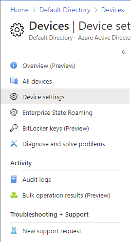

# Device management permissions for Microsoft Entra custom roles

Device management permissions can be used in custom role definitions in Microsoft Entra ID to grant fine-grained access such as the following:

- Enable or disable devices
- Delete devices
- Read BitLocker recovery keys
- Read BitLocker metadata
- Read device registration policies
- Update device registration policies

This article lists the permissions you can use in your custom roles for different device management scenarios. For information about how to create custom roles, see [Create a custom role in Microsoft Entra ID](custom-create.md).

## Enable or disable devices

The following permissions are available to toggle device states.

- microsoft.directory/devices/enable
- microsoft.directory/devices/disable

## Read BitLocker recovery keys

The following permission is available to read BitLocker metadata and recovery keys. Note that this single permission provides read for both BitLocker metadata and recovery keys.

- microsoft.directory/bitlockerKeys/key/read

You can view the BitLocker recovery key by selecting a device from the **All Devices** page, and then selecting **Show Recovery Key**. For more information about reading BitLocker recovery keys, see [View or copy BitLocker keys](~/identity/devices/manage-device-identities.md#view-or-copy-bitlocker-keys).

> [!NOTE]
> When devices that utilize [Windows Autopilot](/mem/autopilot/windows-autopilot) are reused to join to Entra, **and there is a new device owner**, that new device owner must contact an administrator to acquire the BitLocker recovery key for that device. Custom role or administrative unit scoped administrators will lose access to BitLocker recovery keys for those devices that have undergone device ownership changes. These scoped administrators will need to contact a non-scoped administrator for the recovery keys. For more information, see the article [Find the primary user of an Intune device](/mem/intune/remote-actions/find-primary-user#change-a-devices-primary-user).

## Read BitLocker metadata

The following permission is available to read the BitLocker metadata for all devices.

- microsoft.directory/bitlockerKeys/metadata/read

You can read the BitLocker metadata for all devices, but you can't read the BitLocker recovery key.

## Read device registration policies

The following permission is available to read tenant-wide device registration settings.

- microsoft.directory/deviceRegistrationPolicy/standard/read

You can read device settings in the Microsoft Entra admin center.

## Update device registration policies

The following permission is available to update tenant-wide device registration settings.

- microsoft.directory/deviceRegistrationPolicy/basic/update

## Full list of permissions

#### Read

> [!div class="mx-tableFixed"]
> | Permission | Description |
> | ---------- | ----------- |
> | microsoft.directory/devices/createdFrom/read | Read created from Internet of Things (IoT) device template links |
> | microsoft.directory/devices/registeredOwners/read | Read registered owners of devices |
> | microsoft.directory/devices/registeredUsers/read | Read registered users of devices |
> | microsoft.directory/devices/standard/read | Read basic properties on devices |
> | microsoft.directory/bitlockerKeys/key/read | Read bitlocker metadata and key on devices |
> | microsoft.directory/bitlockerKeys/metadata/read | Read bitlocker key metadata on devices |
> | microsoft.directory/deviceRegistrationPolicy/standard/read | Read standard properties on device registration policies |

#### Update

> [!div class="mx-tableFixed"]
> | Permission | Description |
> | ---------- | ----------- |
> | microsoft.directory/devices/registeredOwners/update | Update registered owners of devices |
> | microsoft.directory/devices/registeredUsers/update | Update registered users of devices |
> | microsoft.directory/devices/enable | Enable devices in Microsoft Entra ID |
> | microsoft.directory/devices/disable | Disable devices in Microsoft Entra ID |
> | microsoft.directory/deviceRegistrationPolicy/basic/update | Update basic properties on device registration policies |

#### Delete

> [!div class="mx-tableFixed"]
> | Permission | Description |
> | ---------- | ----------- |
> | microsoft.directory/devices/delete | Delete devices from Microsoft Entra ID |

## Next steps

- [Create a custom role in Microsoft Entra ID](custom-create.md)
- [List Microsoft Entra role assignments](view-assignments.md)
