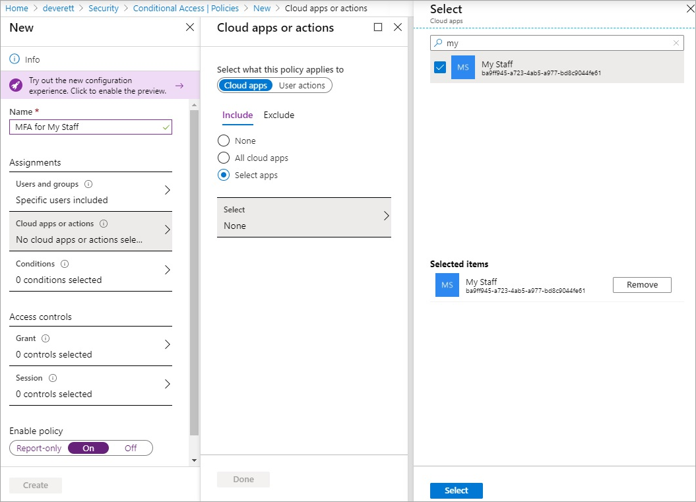
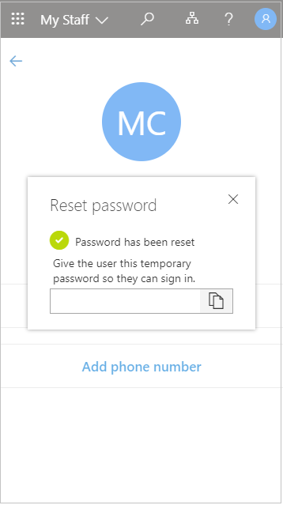

# Manage your users with My Staff

My Staff enables you to delegate permissions to a figure of authority, such as a store manager or a team lead, ensuring that staff members are able to access their Microsoft Entra accounts. Instead of relying on a central helpdesk, organizations can delegate common tasks such as resetting passwords or changing phone numbers to a local team manager. With My Staff, a user who can't access their account can regain access in just a couple of clicks, with no helpdesk or IT staff required.

Before you configure My Staff for your organization, we recommend that you review this documentation as well as the [user documentation](https://support.microsoft.com/account-billing/manage-front-line-users-with-my-staff-c65b9673-7e1c-4ad6-812b-1a31ce4460bd) to ensure you understand how it works and how it impacts your users. You can leverage the user documentation to train and prepare your users for the new experience and help to ensure a successful rollout.

## How My Staff works

My Staff is based on administrative units, which are a container of resources that can be used to restrict the scope of a role assignment's administrative control. For more information, see [Administrative units management in Microsoft Entra ID](administrative-units.md). In My Staff, administrative units can be used to contain a group of users in a store or department. A team manager can then be assigned to an administrative role at a scope of one or more units.

## Before you begin

To complete the steps in this article, you need the following resources and privileges:

* An active Azure subscription.

  * If you don't have an Azure subscription, [create an account](https://azure.microsoft.com/pricing/purchase-options/azure-account?cid=msft_learn).
* A Microsoft Entra tenant associated with your subscription.

  * If needed, [create a Microsoft Entra tenant](~/fundamentals/sign-up-organization.md) or [associate an Azure subscription with your account](~/fundamentals/how-subscriptions-associated-directory.md).
* You need *Authentication Policy Administrator* privileges in your Microsoft Entra tenant to enable SMS-based authentication.
* Each user who's enabled in the text message authentication method policy must be licensed, even if they don't use it. Each enabled user must have one of the following Microsoft Entra ID or Microsoft 365 licenses:

  * [Microsoft Entra ID P1 or P2](https://www.microsoft.com/security/business/identity-access-management/azure-ad-pricing)
  * [Microsoft 365 F1 or F3](https://www.microsoft.com/licensing/news/m365-firstline-workers)
  * [Enterprise Mobility + Security (EMS) E3 or E5](https://www.microsoft.com/microsoft-365/enterprise-mobility-security/compare-plans-and-pricing) or [Microsoft 365 E3 or E5](https://www.microsoft.com/microsoft-365/compare-microsoft-365-enterprise-plans)

## Who can access My Staff

Access to My Staff is determined by administrative role assignment. Only users who are assigned an administrative role can access My Staff, and the administrative unit scope of that role assignment determines which users they can manage. After you configure administrative units and assign roles, those users can sign in to My Staff at [https://mystaff.microsoft.com](https://mystaff.microsoft.com).

> [!NOTE]
> The legacy My Apps and My Staff experience settings, such as **Administrators can access My Staff** under **Manage user feature settings**, are no longer used by the service and don't affect user behavior. These settings are being removed from the Microsoft Entra admin center. No administrator action is required.

## Conditional Access

You can protect the My Staff portal using Microsoft Entra Conditional Access policy. Use it for tasks like requiring multifactor authentication before accessing My Staff.

We strongly recommend that you protect My Staff using [Microsoft Entra Conditional Access policies](~/identity/conditional-access/index.yml). To apply a Conditional Access policy to My Staff, you must first visit the My Staff site once for a few minutes to automatically provision the service principal in your tenant for use by Conditional Access.

You'll see the service principal when you create a Conditional Access policy that applies to the My Staff cloud application.

## Using My Staff

When a user selects My Staff, they are shown the names of the [administrative units](administrative-units.md) over which they have administrative permissions. In the [My Staff user documentation](https://support.microsoft.com/account-billing/manage-front-line-users-with-my-staff-c65b9673-7e1c-4ad6-812b-1a31ce4460bd), we use the term "location" to refer to administrative units. If an administrator's permissions don't have an administrative unit scope, then the permissions apply across the organization. 

Users who are assigned an administrative role can access My Staff through [https://mystaff.microsoft.com](https://mystaff.microsoft.com). They can select an administrative unit to view the users in that unit, and select a user to open their profile.

### Limitations
My Staff shows up to 999 users per administrative unit.

## Reset a user's password

Before you can reset passwords for on-premises users, you must fulfill the following prerequisite conditions. For detailed instructions, see [Enable self-service password reset](~/identity/authentication/tutorial-enable-sspr-writeback.md) tutorial.

* Configure permissions for password writeback
* Enable password writeback in Microsoft Entra Connect
* Enable password writeback in Microsoft Entra self-service password reset (SSPR)

The following roles have permission to reset a user's password:

* [Authentication Administrator](permissions-reference.md#authentication-administrator)
* [Privileged Authentication Administrator](permissions-reference.md#privileged-authentication-administrator)
* [Helpdesk Administrator](permissions-reference.md#helpdesk-administrator)
* [User Administrator](permissions-reference.md#user-administrator)
* [Password Administrator](permissions-reference.md#password-administrator)

From **My Staff**, open a user's profile. Select **Reset password**.

* If the user is cloud-only, you can see a temporary password that you can give to the user.
* If the user is synced from on-premises Active Directory, you can enter a password that meets your on-premises domain policies. You can then give that password to the user.

    

The user needs to change their password the next time they sign in.

## Manage a phone number

From **My Staff**, open a user's profile.

* Select **Add phone number** section to add a phone number for the user
* Select **Edit phone number** to change the phone number
* Select **Remove phone number** to remove the phone number for the user

Depending on your settings, the user can then use the phone number you set up to sign in with SMS, perform multifactor authentication, and perform self-service password reset.

To manage a user's phone number, you must be assigned one of the following roles:

* [Authentication Administrator](permissions-reference.md#authentication-administrator)
* [Privileged Authentication Administrator](permissions-reference.md#privileged-authentication-administrator)

## Manage QR code authentication

You can use **My Staff** to manage the QR code authentication method for users.

### Add QR code authentication method for a user in My Staff

[!Include [Add QR code](../../includes/add-qr-code-my-staff.md)]

### Edit the QR code authentication method for a user in My Staff

[!Include [Edit QR code](../../includes/edit-qr-code-my-staff.md)]

### Delete the QR code authentication method for a user in My Staff

[!Include [Delete QR authentication method](../../includes/delete-qr-code-authentication-method-my-staff.md)]

## Search

You can search for administrative units and users in your organization using the search bar in My Staff. You can search across all administrative units and users in your organization, but you can only make changes to users who are in an administrative unit over which you have been given admin permissions.

## Audit logs

You can view audit logs for actions taken in My Staff in the Microsoft Entra admin center. If an audit log was generated by an action taken in My Staff, you will see this indicated under ADDITIONAL DETAILS in the audit event.

## Next steps

[My Staff user documentation](https://support.microsoft.com/account-billing/manage-front-line-users-with-my-staff-c65b9673-7e1c-4ad6-812b-1a31ce4460bd)
[Administrative units documentation](administrative-units.md)
