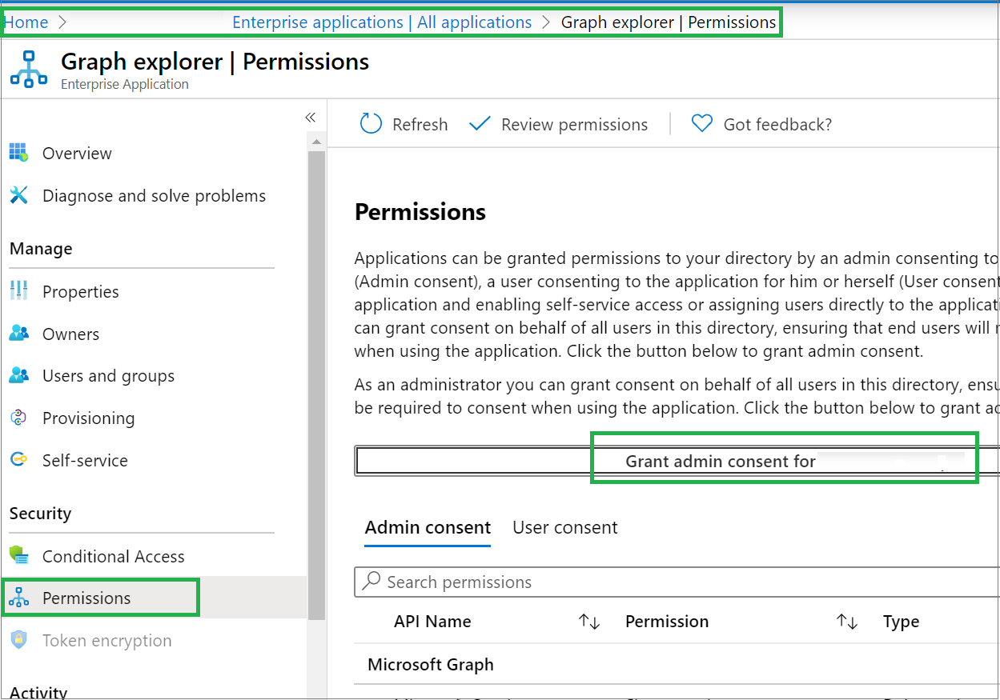

# Prerequisites to use PowerShell or Graph Explorer for Microsoft Entra roles

If you want to manage Microsoft Entra roles using PowerShell or Graph Explorer, you must have the required prerequisites. This article lists the PowerShell and Graph Explorer prerequisites for different Microsoft Entra role features.

## Microsoft Graph PowerShell

To use PowerShell commands to do the following:

- Add users, groups, or devices to an administrative unit
- Create a new group in an administrative unit

You must have the Microsoft Graph PowerShell SDK installed:

- [Microsoft Graph PowerShell SDK](/powershell/microsoftgraph/installation)

## Graph Explorer

To manage Microsoft Entra roles using the [Microsoft Graph API](/graph/overview) and [Graph Explorer](/graph/graph-explorer/graph-explorer-overview), you must do the following:

1. If you don't have an Azure subscription, create a [free account](https://azure.microsoft.com/free/?WT.mc_id=A261C142F) before you begin.

1. Sign in to the [Microsoft Entra admin center](https://entra.microsoft.com).

1. Browse to **Entra ID** > **Enterprise apps**.

1. In the applications list, find and select **Graph explorer**.

1. Select **Permissions**.

1. Select **Grant admin consent for Graph explorer**.

    

1. Use [Graph Explorer tool](https://aka.ms/ge).

## Next steps

- [Microsoft Graph PowerShell documentation](/powershell/microsoftgraph/)
- [Graph Explorer](/graph/graph-explorer/graph-explorer-overview)
