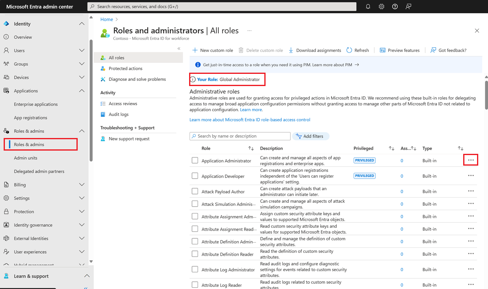
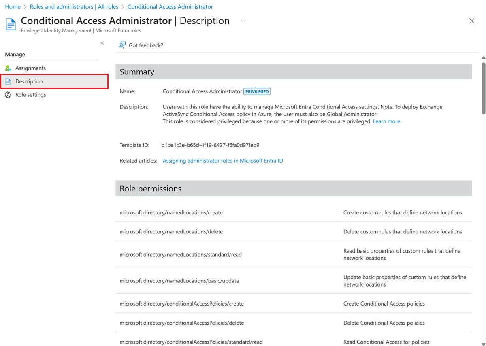

# List Microsoft Entra role definitions

A role definition is a collection of permissions that can be performed, such as read, write, and delete. It's typically just called a role. Microsoft Entra ID has over 60 built-in roles or you can create your own custom roles. If you ever wondered "What the do these roles really do?", you can see a detailed list of permissions for each of the roles.

This article describes how to list the Microsoft Entra built-in and custom roles along with their permissions.

## Prerequisites

- Microsoft Graph PowerShell SDK installed when using PowerShell
- Admin consent when using Graph explorer for Microsoft Graph API

For more information, see [Prerequisites to use PowerShell or Graph Explorer](prerequisites.md).

## Microsoft Entra admin center

[!INCLUDE [portal updates](~/includes/portal-update.md)]

1. Sign in to the [Microsoft Entra admin center](https://entra.microsoft.com).

1. Browse to **Identity** > **Roles & admins** > **Roles & admins**.

    

1. On the right, select the ellipsis and then **Description** to see the complete list of permissions for a role.

    The page includes links to relevant documentation to help guide you through managing roles.

    

## PowerShell

Follow these steps to list Microsoft Entra roles using PowerShell.

1. Open a PowerShell window. If necessary, use [Install-Module](/powershell/module/powershellget/install-module) to install Microsoft Graph PowerShell. For more information, see [Prerequisites to use PowerShell or Graph Explorer](prerequisites.md).

    ```powershell
    Install-Module Microsoft.Graph -Scope CurrentUser
    ```

2. In a PowerShell window, use [Connect-MgGraph](/powershell/microsoftgraph/authentication-commands#using-connect-mggraph) to sign in to your tenant.

    ```powershell
    Connect-MgGraph -Scopes "RoleManagement.Read.All"
    ```

3. Use [Get-MgRoleManagementDirectoryRoleDefinition](/powershell/module/microsoft.graph.identity.governance/get-mgrolemanagementdirectoryroledefinition) to get all roles.

    ```powershell
    Get-MgRoleManagementDirectoryRoleDefinition
    ```

4. To view the list of permissions of a role, use the following cmdlet.

    ```powershell
    # Do this avoid truncation of the list of permissions
    $FormatEnumerationLimit = -1
    
    (Get-MgRoleManagementDirectoryRoleDefinition -Filter "displayName eq 'Conditional Access Administrator'").RolePermissions | Format-list
    ```

## Microsoft Graph API

Follow these instructions to list Microsoft Entra roles using the Microsoft Graph API in [Graph Explorer](https://aka.ms/ge).

1. Sign in to the [Graph Explorer](https://aka.ms/ge).
2. Select **GET** as the HTTP method from the dropdown. 
3. Select the API version to **v1.0**.
4. Add the following query to use the [List unifiedRoleDefinitions](/graph/api/rbacapplication-list-roledefinitions) API.

   ```http
   GET https://graph.microsoft.com/v1.0/roleManagement/directory/roleDefinitions
   ```

5. Select **Run query** to list the roles.
6. To view permissions of a role, use the following API.

   ```http
   GET https://graph.microsoft.com/v1.0/roleManagement/directory/roleDefinitions?$filter=DisplayName eq 'Conditional Access Administrator'&$select=rolePermissions
   ```

## Next steps

* [List Microsoft Entra role assignments](view-assignments.md).
* [Assign Microsoft Entra roles to users](manage-roles-portal.yml).
* [Microsoft Entra built-in roles](permissions-reference.md).
