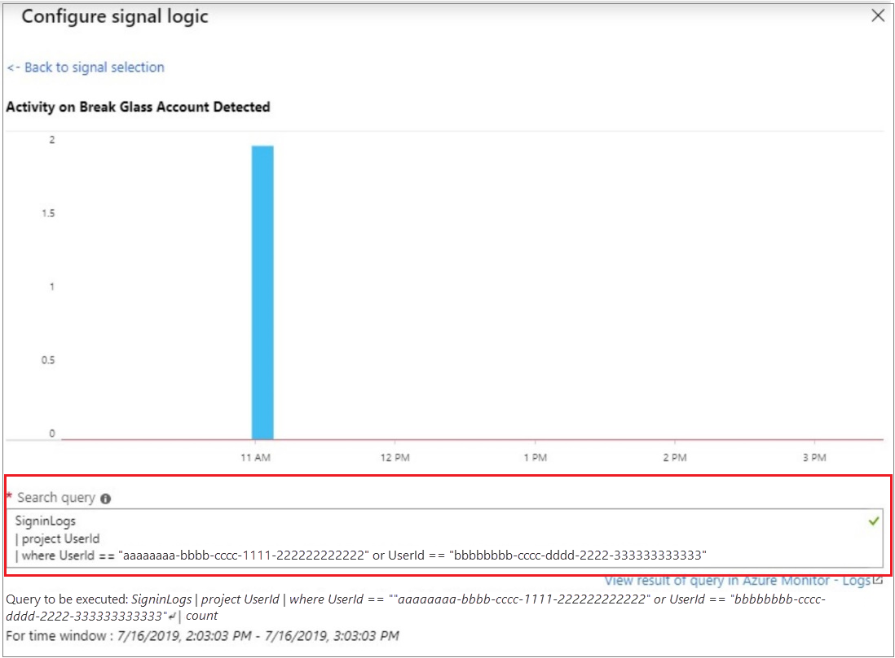
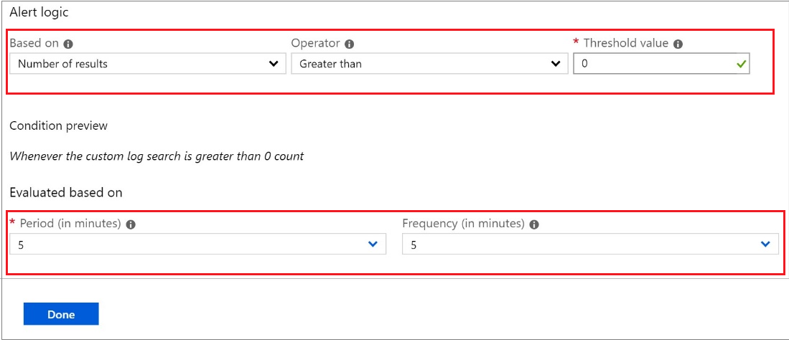
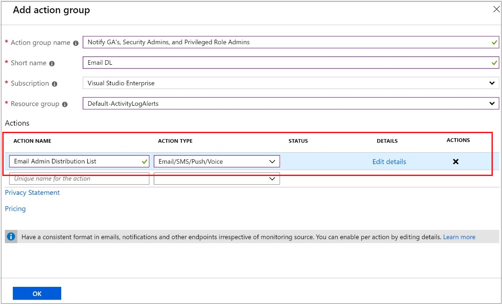

# Manage emergency access accounts in Microsoft Entra ID

It's important that you prevent being accidentally locked out of your Microsoft Entra organization because you can't sign in or activate a role. You can mitigate the impact of accidental lack of administrative access by creating two or more *emergency access accounts* in your organization.

User accounts with the Global Administrator role have high privileges in the system, this includes emergency access accounts with the Global Administrator role. Emergency access accounts are limited to emergency or "break glass" scenarios where normal administrative accounts can't be used. We recommend that you maintain a goal of restricting emergency account use to only the times when it's absolutely necessary.

This article provides guidelines for managing emergency access accounts in Microsoft Entra ID.

## Why use an emergency access account

An organization might need to use an emergency access account in the following situations:

- The user accounts are federated, and federation is currently unavailable because of a cell-network break or an identity-provider outage. For example, if the identity provider host in your environment has gone down, users might be unable to sign in when Microsoft Entra ID redirects to their identity provider.
- The administrators are registered through Microsoft Entra multifactor authentication, and all their individual devices are unavailable or the service is unavailable. Users might be unable to complete multifactor authentication to activate a role. For example, a cell network outage is preventing them from answering phone calls or receiving text messages, the only two authentication mechanisms that they registered for their device.
- The person with the most recent Global Administrator access has left the organization. Microsoft Entra ID prevents the last Global Administrator account from being deleted, but it doesn't prevent the account from being deleted or disabled on-premises. Either situation might make the organization unable to recover the account.
- Unforeseen circumstances such as a natural disaster emergency, during which a mobile phone or other networks might be unavailable.
- If role assignments for Global Administrator and Privileged Role Administrator roles are eligible, approval is required for activation, but no approvers are selected (or all approvers are removed from the directory). Active Global Administrators and Privileged Role Administrators are default approvers. But there will be no active Global Administrators and Privileged Role Administrators and administration of the tenant will effectively be locked, unless emergency access accounts are used.
- Organization has unlicensed Global Administrators who need to receive admin Email Notifications. Only licensed Global Admininstrator accounts receive email notifications and using a mail-enabled break glass account to forward mail to unlicensed Global Administrors is the recommended solution.

## Create emergency access accounts

Create two or more emergency access accounts. These accounts should be cloud-only accounts that use the \*.onmicrosoft.com domain and that aren't federated or synchronized from an on-premises environment. At a high level, follow these steps.

1. Find your existing emergency access accounts or create new accounts with the Global Administrator role.

    :::image type="content" source="./media/security-emergency-access/create-emergency-access-account.png" alt-text="Screenshot of creating an emergency access account in Microsoft Entra ID." lightbox="./media/security-emergency-access/create-emergency-access-account.png":::

1. Select one of these passwordless authentication methods for your emergency access accounts. These methods satisfy the [mandatory multifactor authentication requirements](../authentication/concept-mandatory-multifactor-authentication.md).

    - [Passkey (FIDO2)](../authentication/concept-authentication-passwordless.md#passkeys-fido2) (Recommended)
    - [Certificate-based authentication](../authentication/concept-authentication-passwordless.md#certificate-based-authentication) if your organization already has a Public Key Infrastructure (PKI) setup

1. [Configure your emergency access accounts](#configuration-requirements) to use passwordless authentication.

    - [Enable passkeys (FIDO2) for your organization](../authentication/how-to-enable-passkey-fido2.md)
    - [Register a passkey (FIDO2)](../authentication/how-to-register-passkey-with-security-key.md)
    - [Configure certificate-based authentication](../authentication/concept-certificate-based-authentication.md)

1. [Require phishing-resistant multifactor authentication](../conditional-access/policy-admin-phish-resistant-mfa.md) for all of your emergency accounts.

1. [Store account credentials safely](#store-account-credentials-safely).

1. [Monitor sign-in and audit logs](#monitor-sign-in-and-audit-logs).

1. [Validate accounts regularly](#validate-accounts-regularly).

## Forward Admin Email Notifications to administrators using PIM or with separate unlicensed global admin accounts
1. Make the account a shared mailbox
   
1. Create a distribution group containing the licensed user account for users who use PIM or have seaprate unlicensed admin accounts
   
1. Forward mail from the breakglass account to the distribution group created in the step above

## Configuration requirements

When you configure these accounts, the following requirements must be met:

- In most organizations, emergency access accounts aren't associated with any individual user in the organization. Credentials are in a known secure location available to multiple members of administration team and not connected with any employee-supplied devices such as phones. This approach is commonly used to unify emergency access accounts management: most organizations need emergency access accounts not only for Microsoft Cloud infrastructure, but also on-premises environment, federated SaaS applications, and other critical systems.

    Alternatively, you can choose to create individual emergency access accounts for administrators. This solution promotes accountability and allows administrators to use emergency access accounts from remote locations.

- Use strong authentication for your emergency access accounts and make sure it doesn't use the same authentication methods as your other administrative accounts. For example, if your normal administrator account uses the Microsoft Authenticator app for strong authentication, use a FIDO2 security key for your emergency accounts. Consider the [dependencies of various authentication methods](~/architecture/resilience-in-credentials.md), to avoid adding external requirements into the authentication process.

- The device or credential must not expire or be in scope of automated cleanup due to lack of use.  

- In Microsoft Entra Privileged Identity Management, you should make the Global Administrator role assignment active permanent rather than eligible for your emergency access accounts.

- Individuals authorized to use these emergency access accounts must utilize a designated, secure workstation or similar client computing environment, such as a Privileged Access Workstation. These workstations should be employed when interacting with the emergency access accounts. For more information about configuring a Microsoft Entra tenant where there are designated workstations, see [deploying a privileged access solution](/security/privileged-access-workstations/privileged-access-deployment).

## Federation guidance

Some organizations use Active Directory Domain Services and Active Directory Federation Service (AD FS) or similar identity provider to federate to Microsoft Entra ID. The emergency access for on-premises systems and the emergency access for cloud services should be kept distinct, with no dependency of one on the other. Mastering and or sourcing authentication for accounts with emergency access privileges from other systems adds unnecessary risk in the event of an outage of those systems.

## Store account credentials safely

Organizations need to ensure that the credentials for emergency access accounts are kept secure and known only to individuals who are authorized to use them. For example, you might use [FIDO2 security keys](../authentication/how-to-enable-passkey-fido2.md) for Microsoft Entra ID or smartcards for Windows Server Active Directory. Credentials should be stored in secure, fireproof safes that are in secure, separate locations.

## Monitor sign-in and audit logs

Organizations should monitor sign-in and audit log activity from the emergency accounts and trigger notifications to other administrators. When you monitor the activity for emergency access accounts, you can verify these accounts are only used for testing or actual emergencies. You can use Azure Monitor, Microsoft Sentinel, or other tools to monitor the sign-in logs and trigger email and SMS alerts to your administrators whenever emergency access accounts sign in. This section illustrates using Azure Monitor.

### Prerequisites

- [Send Microsoft Entra sign-in logs](~/identity/monitoring-health/howto-integrate-activity-logs-with-azure-monitor-logs.yml) to Azure Monitor.

### Obtain Object IDs of the emergency access accounts

1. Sign in to the [Microsoft Entra admin center](https://entra.microsoft.com) as at least a [User Administrator](~/identity/role-based-access-control/permissions-reference.md#user-administrator).

1. Browse to **Entra ID** > **Users**.

1. Search for the emergency access account and select the user's name.

1. Copy and save the Object ID attribute so that you can use it later.

1. Repeat previous steps for second emergency access account.

### Create an alert rule

1. Sign in to the [Azure portal](https://portal.azure.com) as at least a [Monitoring Contributor](/azure/role-based-access-control/built-in-roles#monitoring-contributor).

1. Browse to **Monitor** > **Log Analytics workspaces**.

1. Select a workspace.

1. In your workspace, select **Alerts** > **New alert rule**.

    1. Under **Resource**, verify that the subscription is the one with which you want to associate the alert rule.
    1. Under **Condition**, select **Add**.
    1. Select **Custom log search** under **Signal name**.
    1. Under **Search query**, enter the following query, inserting the object IDs of the two emergency access accounts.
    
        > [!NOTE]
        > For each additional emergency access account you want to include, add another `or UserId == "ObjectGuid"` to the query.
                
        Sample queries:
        ```kusto
        // Search for a single Object ID (UserID)
        SigninLogs
        | project UserId 
        | where UserId == "00aa00aa-bb11-cc22-dd33-44ee44ee44ee"
        ```
        
        ```kusto
        // Search for multiple Object IDs (UserIds)
        SigninLogs
        | project UserId 
        | where UserId == "00aa00aa-bb11-cc22-dd33-44ee44ee44ee" or UserId == "11bb11bb-cc22-dd33-ee44-55ff55ff55ff"
        ```
        
        ```kusto
        // Search for a single UserPrincipalName
        SigninLogs
        | project UserPrincipalName 
        | where UserPrincipalName == "user@yourdomain.onmicrosoft.com"
        ```
        
        

    1. Under **Alert logic**, enter the following:

        - Based on: Number of results
        - Operator: Greater than
        - Threshold value: 0

    1. Under **Evaluated based on**, select the **Period (in minutes)** for how long you want the query to run, and the **Frequency (in minutes)** for how often you want the query to run. The frequency should be less than or equal to the period.

        

    1. Select **Done**. You can now view the estimated monthly cost of this alert.

1. Select an action group of users to be notified by the alert. If you want to create one, see [Create an action group](#create-an-action-group).

1. To customize the email notification sent to the members of the action group, select actions under **Customize Actions**.

1. Under **Alert Details**, specify the alert rule name and add an optional description.

1. Set the **Severity level** of the event. We recommend that you set it to **Critical(Sev 0)**.

1. Under **Enable rule upon creation**, leave it set as **yes**.

1. To turn off alerts for a while, select the **Suppress Alerts** check box and enter the wait duration before alerting again, and then select **Save**.

1. Select **Create alert rule**.

### Create an action group

1. Select **Create an action group**.

    

1. Enter the action group name and a short name.

1. Verify the subscription and resource group.

1. Under action type, select **Email/SMS/Push/Voice**.

1. Enter an action name such as **Notify Global Administrator**.

1. Select the **Action Type** as **Email/SMS/Push/Voice**.

1. Select **Edit details** to select the notification methods you want to configure and enter the required contact information, and then select **Ok** to save the details.

1. Add any additional actions you want to trigger.

1. Select **OK**.

### Prepare a post-mortem team to evaluate each emergency access account credential use
 
If the alert is triggered, preserve the logs from Microsoft Entra and other workloads. Conduct a review of the circumstances and the results of the emergency access account usage. This review will determine whether the account was used: 

- For a planned drill to validate its suitability
- In response to an actual emergency where no administrator could use their regular accounts
- Or as a result of misuse or unauthorized usage of the account
 
Next, examine the logs to determine what actions were taken by the individual with the emergency access account to ensure that those actions align with the authorized use of the account. 

## Validate accounts regularly

In addition to training staff members to use emergency access accounts, you should also have an ongoing process to validate the emergency access accounts remain accessible to authorized staff. Regular drills should be conducted to validate the functionality of the accounts and to confirm that monitoring and alerting rules are triggered in case an account is subsequently misused. At a minimum, the following steps should be performed at regular intervals:

- Ensure that security-monitoring staff is aware that the account-check activity is ongoing.
- Review and update the list of individuals authorized to use the emergency access account credentials.
- Ensure that the emergency break glass process to use these accounts is documented and current.
- Ensure that administrators and security officers who might need to perform these steps during an emergency are trained on the process.
- Validate that the emergency access accounts can sign-in and perform administrative tasks.
- Ensure that users haven't registered multifactor authentication or self-service password reset (SSPR) to any individual user's device or personal details. 
- If the accounts are registered for multifactor authentication to a device, for use during sign-in or role activation, ensure that the device is accessible to all administrators who might need to use it during an emergency. Also verify that the device can communicate through at least two network paths that don't share a common failure mode. For example, the device can communicate to the internet through both a facility's wireless network and a cell provider network.
- Change the combinations on any safes after someone with access leaves the organization, as well as on a regular basis.

These steps should be performed at regular intervals and for key changes:

- At least every 90 days
- When there has been a recent change in IT staff, such as after termination or position change
- When the Microsoft Entra subscriptions in the organization have changed

## Next steps

- [How to verify that users are set up for mandatory MFA](../authentication/how-to-mandatory-multifactor-authentication.md)
- [Require phishing-resistant multifactor authentication for administrators](../conditional-access/policy-admin-phish-resistant-mfa.md)
- [Securing privileged access for hybrid and cloud deployments in Microsoft Entra ID](security-planning.md)
- [Configure additional protections for privileged roles in Microsoft 365](/microsoft-365/enterprise/protect-your-global-administrator-accounts), if you're using Microsoft 365
- [Start an access review of privileged roles](../../id-governance/privileged-identity-management/pim-create-roles-and-resource-roles-review.md) and [transition existing privileged role assignments to more specific administrator roles](permissions-reference.md)
