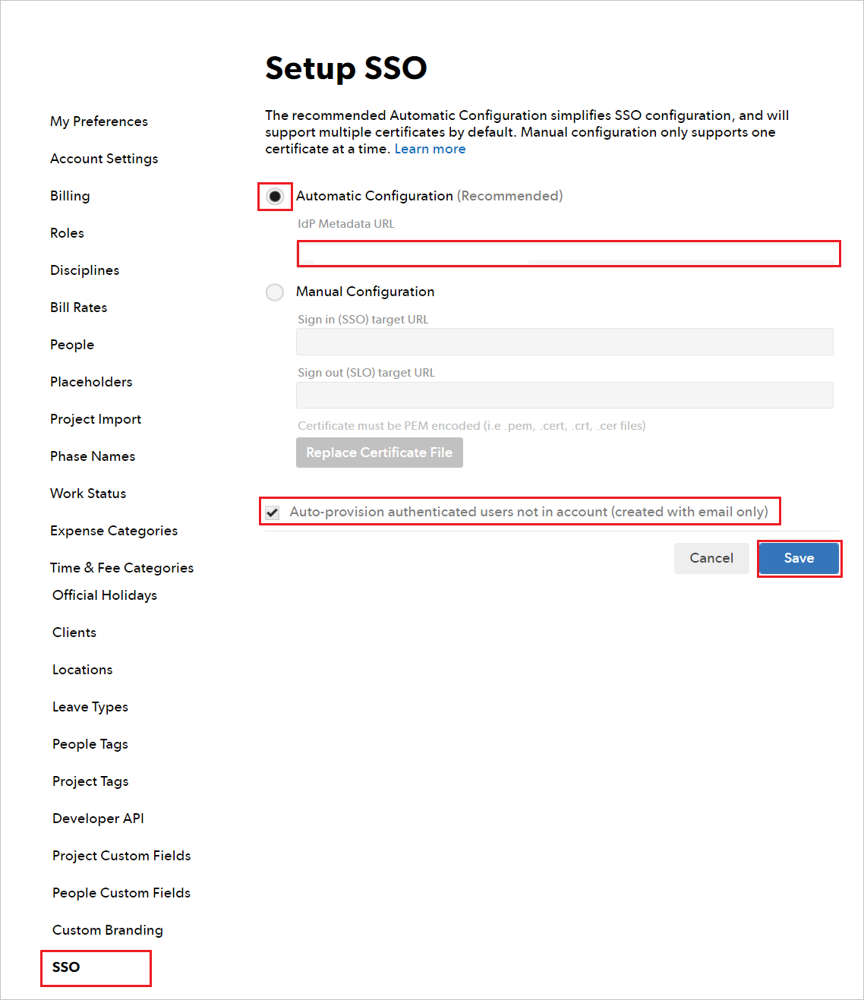

# Microsoft Entra SSO integration with 10,000ft Plans

In this article,  you learn how to integrate 10,000ft Plans with Microsoft Entra ID. When you integrate 10,000ft Plans with Microsoft Entra ID, you can:

* Control in Microsoft Entra ID who has access to 10,000ft Plans.
* Enable your users to be automatically signed-in to 10,000ft Plans with their Microsoft Entra accounts.
* Manage your accounts in one central location.

## Prerequisites
The scenario outlined in this article assumes that you already have the following prerequisites:
[!INCLUDE [common-prerequisites.md](~/identity/saas-apps/includes/common-prerequisites.md)]
* 10,000ft Plans single sign-on enabled subscription.

## Scenario description

In this article,  you configure and test Microsoft Entra single sign-on in a test environment.

* 10,000ft Plans supports **SP** initiated SSO.
* 10,000ft Plans supports **Just In Time** user provisioning.

## Add 10,000ft Plans from the gallery

To configure the integration of 10,000ft Plans into Microsoft Entra ID, you need to add 10,000ft Plans from the gallery to your list of managed SaaS apps.

1. Sign in to the [Microsoft Entra admin center](https://entra.microsoft.com) as at least a [Cloud Application Administrator](~/identity/role-based-access-control/permissions-reference.md#cloud-application-administrator).
1. Browse to **Entra ID** > **Enterprise apps** > **New application**.
1. In the **Add from the gallery** section, type **10,000ft Plans** in the search box.
1. Select **10,000ft Plans** from results panel and then add the app. Wait a few seconds while the app is added to your tenant.

 Alternatively, you can also use the [Enterprise App Configuration Wizard](https://portal.office.com/AdminPortal/home?Q=Docs#/azureadappintegration). In this wizard, you can add an application to your tenant, add users/groups to the app, assign roles, and walk through the SSO configuration as well. [Learn more about Microsoft 365 wizards.](/microsoft-365/admin/misc/azure-ad-setup-guides)

## Configure and test Microsoft Entra SSO for 10,000ft Plans

Configure and test Microsoft Entra SSO with 10,000ft Plans using a test user called **B.Simon**. For SSO to work, you need to establish a link relationship between a Microsoft Entra user and the related user in 10,000ft Plans.

To configure and test Microsoft Entra SSO with 10,000ft Plans, perform the following steps:

1. **[Configure Microsoft Entra SSO](#configure-azure-ad-sso)** - to enable your users to use this feature.
    1. **Create a Microsoft Entra test user** - to test Microsoft Entra single sign-on with B.Simon.
    1. **Assign the Microsoft Entra test user** - to enable B.Simon to use Microsoft Entra single sign-on.
1. **[Configure 10,000ft Plans SSO](#configure-10000ft-plans-sso)** - to configure the single sign-on settings on application side.
    1. **[Create 10,000ft Plans test user](#create-10000ft-plans-test-user)** - to have a counterpart of B.Simon in 10,000ft Plans that's linked to the Microsoft Entra representation of user.
1. **[Test SSO](#test-sso)** - to verify whether the configuration works.

## Configure Microsoft Entra SSO

Follow these steps to enable Microsoft Entra SSO.

1. Sign in to the [Microsoft Entra admin center](https://entra.microsoft.com) as at least a [Cloud Application Administrator](~/identity/role-based-access-control/permissions-reference.md#cloud-application-administrator).
1. Browse to **Entra ID** > **Enterprise apps** > **10,000ft Plans** > **Single sign-on**.
1. On the **Select a single sign-on method** page, select **SAML**.
1. On the **Set up single sign-on with SAML** page, select the pencil icon for **Basic SAML Configuration** to edit the settings.

   

1. On the **Basic SAML Configuration** section, perform the following steps:

	a. In the **Identifier (Entity ID)** text box, type the URL:
    `https://rm.smartsheet.com/saml/metadata`

    b. In the **Reply URL** text box, type the URL:
    `https://rm.smartsheet.com/saml/acs`
    
    c. In the **Sign-on URL** text box, type the URL:
    ` https://rm.smartsheet.com`

1. On the **Set up single sign-on with SAML** page, in the **SAML Signing Certificate** section, select the copy icon to copy **App Federation Metadata Url**. Save it on your computer.

	

[!INCLUDE [create-assign-users-sso.md](~/identity/saas-apps/includes/create-assign-users-sso.md)]

## Configure 10000ft Plans SSO

1. Sign in to your 10000ft Plans website as an administrator.

1. Select **Settings** and select **Account Settings** from the dropdown.

    

1. Select **SSO** at the left menu and perform the following steps:

    

    a. Select **Automatic Configuration** in the Setup SSO section.

    b. In the **IdP Metadata URL** text box, enter the **App Federation Metadata Url** value which you copied previously.

    c. Enable the **Auto-provision authenticated users not in account** checkbox.

    d. Select **Save**.

### Create 10000ft Plans test user

In this section, a user called Britta Simon is created in 10,000ft Plans. 10,000ft Plans supports just-in-time user provisioning, which is enabled by default. There's no action item for you in this section. If a user doesn't already exist in 10,000ft Plans, a new one is created after authentication.

## Test SSO

In this section, you test your Microsoft Entra single sign-on configuration with following options. 

* Select **Test this application**, this option redirects to 10,000ft Plans Sign on URL where you can initiate the login flow. 

* Go to 10,000ft Plans Sign on URL directly and initiate the login flow from there.

* You can use Microsoft My Apps. When you select the 10,000ft Plans tile in the My Apps, this option redirects to 10,000ft Plans Sign on URL. For more information about the My Apps, see [Introduction to the My Apps](https://support.microsoft.com/account-billing/sign-in-and-start-apps-from-the-my-apps-portal-2f3b1bae-0e5a-4a86-a33e-876fbd2a4510).

## Related content

Once you configure 10,000ft Plans you can enforce session control, which protects exfiltration and infiltration of your organization’s sensitive data in real time. Session control extends from Conditional Access. [Learn how to enforce session control with Microsoft Defender for Cloud Apps](/cloud-app-security/proxy-deployment-any-app).
