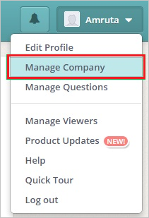
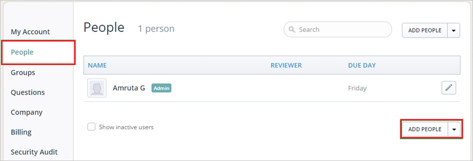
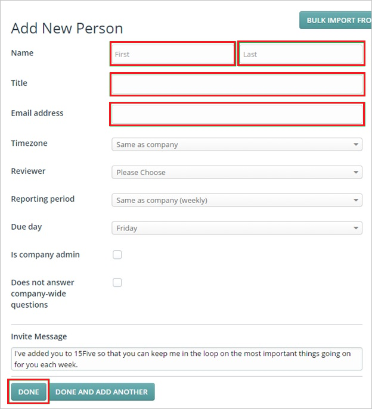

# Configure 15Five for Single sign-on with Microsoft Entra ID

In this article,  you learn how to integrate 15Five with Microsoft Entra ID. When you integrate 15Five with Microsoft Entra ID, you can:

* Control in Microsoft Entra ID who has access to 15Five.
* Enable your users to be automatically signed-in to 15Five with their Microsoft Entra accounts.
* Manage your accounts in one central location.

## Prerequisites

The scenario outlined in this article assumes that you already have the following prerequisites:

[!INCLUDE [common-prerequisites.md](~/identity/saas-apps/includes/common-prerequisites.md)]
* 15Five single sign-on (SSO) enabled subscription.

## Scenario description

In this article,  you configure and test Microsoft Entra single sign-on in a test environment.

* 15Five supports **SP** initiated SSO.
* 15Five supports [Automated user provisioning](15five-provisioning-tutorial.md).

## Add 15Five from the gallery

To configure the integration of 15Five into Microsoft Entra ID, you need to add 15Five from the gallery to your list of managed SaaS apps.

1. Sign in to the [Microsoft Entra admin center](https://entra.microsoft.com) as at least a [Cloud Application Administrator](~/identity/role-based-access-control/permissions-reference.md#cloud-application-administrator).
1. Browse to **Entra ID** > **Enterprise apps** > **New application**.
1. In the **Add from the gallery** section, type **15Five** in the search box.
1. Select **15Five** from results panel and then add the app. Wait a few seconds while the app is added to your tenant.

 [!INCLUDE [sso-wizard.md](~/identity/saas-apps/includes/sso-wizard.md)]

## Configure and test Microsoft Entra SSO for 15Five

Configure and test Microsoft Entra SSO with 15Five using a test user called **B.Simon**. For SSO to work, you need to establish a link relationship between a Microsoft Entra user and the related user in 15Five.

To configure and test Microsoft Entra SSO with 15Five, perform the following steps:

1. **[Configure Microsoft Entra SSO](#configure-azure-ad-sso)** - to enable your users to use this feature.
    1. **Create a Microsoft Entra test user** - to test Microsoft Entra single sign-on with B.Simon.
    1. **Assign the Microsoft Entra test user** - to enable B.Simon to use Microsoft Entra single sign-on.
1. **[Configure 15Five SSO](#configure-15five-sso)** - to configure the single sign-on settings on application side.
    1. **[Create 15Five test user](#create-15five-test-user)** - to have a counterpart of B.Simon in 15Five that's linked to the Microsoft Entra representation of user.
1. **[Test SSO](#test-sso)** - to verify whether the configuration works.

## Configure Microsoft Entra SSO

Follow these steps to enable Microsoft Entra SSO.

1. Sign in to the [Microsoft Entra admin center](https://entra.microsoft.com) as at least a [Cloud Application Administrator](~/identity/role-based-access-control/permissions-reference.md#cloud-application-administrator).
1. Browse to **Entra ID** > **Enterprise apps** > **15Five** > **Single sign-on**.
1. On the **Select a single sign-on method** page, select **SAML**.
1. On the **Set up single sign-on with SAML** page, select the pencil icon for **Basic SAML Configuration** to edit the settings.

   

1. On the **Basic SAML Configuration** section, perform the following steps:

    a. In the **Sign on URL** text box, type a URL using the following pattern:
    `https://<COMPANY_NAME>.15five.com`

    b. In the **Identifier (Entity ID)** text box, type a URL using the following pattern:
    `https://<COMPANY_NAME>.15five.com/saml2/metadata/`

    > [!NOTE]
    > These values aren't real. Update these values with the actual Sign on URL and Identifier. Contact [15Five Client support team](https://www.15five.com/contact/) to get these values. You can also refer to the patterns shown in the **Basic SAML Configuration** section.

1. On the **Set up Single Sign-On with SAML** page, in the **SAML Signing Certificate** section, select **Download** to download the **Federation Metadata XML** from the given options as per your requirement and save it on your computer.

    

1. On the **Set up 15Five** section, copy the appropriate URL(s) as per your requirement.

    

[!INCLUDE [create-assign-users-sso.md](~/identity/saas-apps/includes/create-assign-users-sso.md)]

## Configure 15Five SSO

To configure single sign-on on **15Five** side, you need to send the downloaded **Federation Metadata XML** and appropriate copied URLs from the application configuration to [15Five support team](https://www.15five.com/contact/). They set this setting to have the SAML SSO connection set properly on both sides.

### Create 15Five test user

To enable Microsoft Entra users to log in to 15Five, they must be provisioned into 15Five. When 15Five, provisioning is a manual task.

### To configure user provisioning, perform the following steps:

1. Log in to your **15Five** company site as administrator.

2. Go to **Manage Company**.

    

3. Go to **People** > **Add PEOPLE**.

    

4. In the **Add New Person** section, perform the following steps:

    

    a. Type the **First Name**, **Last Name**, **Title**, **Email address** of a valid Microsoft Entra account you want to provision into the related textboxes.

    b. Select **Done**.

    > [!NOTE]
    > The Microsoft Entra account holder receives an email including a link to confirm the account before it becomes active.

## Test SSO

In this section, you test your Microsoft Entra single sign-on configuration with following options. 

* Select **Test this application**, this option redirects to 15Five Sign-on URL where you can initiate the login flow. 

* Go to 15Five Sign-on URL directly and initiate the login flow from there.

* You can use Microsoft My Apps. When you select the 15Five tile in the My Apps, this option redirects to 15Five Sign-on URL. For more information about the My Apps, see [Introduction to the My Apps](https://support.microsoft.com/account-billing/sign-in-and-start-apps-from-the-my-apps-portal-2f3b1bae-0e5a-4a86-a33e-876fbd2a4510).

## Related content

Once you configure 15Five you can enforce session control, which protects exfiltration and infiltration of your organization’s sensitive data in real time. Session control extends from Conditional Access. [Learn how to enforce session control with Microsoft Defender for Cloud Apps](/cloud-app-security/proxy-deployment-aad).
