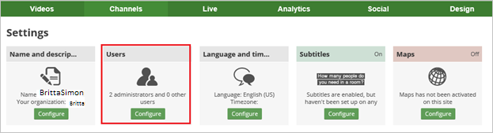
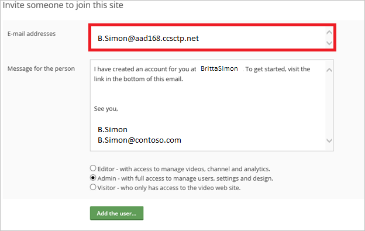

# Configure 23 Video for Single sign-on with Microsoft Entra ID

In this article,  you learn how to integrate 23 Video with Microsoft Entra ID. When you integrate 23 Video with Microsoft Entra ID, you can:

* Control in Microsoft Entra ID who has access to 23 Video.
* Enable your users to be automatically signed-in to 23 Video with their Microsoft Entra accounts.
* Manage your accounts in one central location.

## Prerequisites

The scenario outlined in this article assumes that you already have the following prerequisites:

[!INCLUDE [common-prerequisites.md](~/identity/saas-apps/includes/common-prerequisites.md)]
* 23 Video single sign-on (SSO) enabled subscription.

## Scenario description

In this article,  you configure and test Microsoft Entra SSO in a test environment.

* 23 Video supports **SP** initiated SSO.

## Add 23 Video from the gallery

To configure the integration of 23 Video into Microsoft Entra ID, you need to add 23 Video from the gallery to your list of managed SaaS apps.

1. Sign in to the [Microsoft Entra admin center](https://entra.microsoft.com) as at least a [Cloud Application Administrator](~/identity/role-based-access-control/permissions-reference.md#cloud-application-administrator).
1. Browse to **Entra ID** > **Enterprise apps** > **New application**.
1. In the **Add from the gallery** section, type **23 Video** in the search box.
1. Select **23 Video** from results panel and then add the app. Wait a few seconds while the app is added to your tenant.

 [!INCLUDE [sso-wizard.md](~/identity/saas-apps/includes/sso-wizard.md)]

## Configure and test Microsoft Entra SSO for 23 Video

Configure and test Microsoft Entra SSO with 23 Video using a test user called **B.Simon**. For SSO to work, you need to establish a link relationship between a Microsoft Entra user and the related user in 23 Video.

To configure and test Microsoft Entra SSO with 23 Video, perform the following steps:

1. **[Configure Microsoft Entra SSO](#configure-azure-ad-sso)** - to enable your users to use this feature.
    1. **Create a Microsoft Entra test user** - to test Microsoft Entra single sign-on with B.Simon.
    1. **Assign the Microsoft Entra test user** - to enable B.Simon to use Microsoft Entra single sign-on.
1. **[Configure 23 Video SSO](#configure-23-video-sso)** - to configure the single sign-on settings on application side.
    1. **[Create 23 Video test user](#create-23-video-test-user)** - to have a counterpart of B.Simon in 23 Video that's linked to the Microsoft Entra representation of user.
1. **[Test SSO](#test-sso)** - to verify whether the configuration works.

## Configure Microsoft Entra SSO

Follow these steps to enable Microsoft Entra SSO.

1. Sign in to the [Microsoft Entra admin center](https://entra.microsoft.com) as at least a [Cloud Application Administrator](~/identity/role-based-access-control/permissions-reference.md#cloud-application-administrator).
1. Browse to **Entra ID** > **Enterprise apps** > **23 Video** application integration page, find the **Manage** section and select **Single sign-on**.
1. On the **Select a Single sign-on method** page, select **SAML**.
1. On the **Set up Single Sign-On with SAML** page, select the pencil icon for **Basic SAML Configuration** to edit the settings.

   

1. On the **Basic SAML Configuration** section, perform the following steps:

    a. In the **Identifier (Entity ID)** text box, type a URL using the following pattern:
    `https://www.23video.com/saml/trust/<uniqueid>`

	b. In the **Sign on URL** text box, type a URL using the following pattern:
    `https://<subdomain>.23video.com`

	> [!NOTE]
	> These values aren't real. Update these values with the actual Identifier and Sign on URL. Contact [23 Video Client support team](mailto:support@23company.com) to get these values. You can also refer to the patterns shown in the **Basic SAML Configuration** section.

1. On the **Set up Single Sign-On with SAML** page, in the **SAML Signing Certificate** section,  find **Certificate (Base64)** and select **Download** to download the certificate and save it on your computer.

	

1. On the **Set up 23 Video** section, copy the appropriate URL(s) based on your requirement.

	

[!INCLUDE [create-assign-users-sso.md](~/identity/saas-apps/includes/create-assign-users-sso.md)]

## Configure 23 Video SSO

To configure single sign-on on **23 Video** side, you need to send the downloaded **Certificate (Base64)** and appropriate copied URLs from the application configuration to [23 Video support team](mailto:support@23company.com). They set this setting to have the SAML SSO connection set properly on both sides.

### Create 23 Video test user

The objective of this section is to create a user called B.Simon in 23 Video.

**To create a user called B.Simon in 23 Video, perform the following steps:**

1. Sign on to your 23 Video company site as administrator.

2. Go to **Settings**.

3. In **Users** section, select **Configure**.

    

4. Select **Add a new user**.

    

5. In the **Invite someone to join this site** section, perform the following steps:

    

    a. In the **E-mail addresses** textbox, type the email address of a user like B.Simon@contoso.com.  

    b. Select **Add the user..**.

## Test SSO

In this section, you test your Microsoft Entra single sign-on configuration with following options. 

* Select **Test this application**, this option redirects to 23 Video Sign-on URL where you can initiate the login flow. 

* Go to 23 Video Sign-on URL directly and initiate the login flow from there.

* You can use Microsoft My Apps. When you select the 23 Video tile in the My Apps, this option redirects to 23 Video Sign-on URL. For more information, see [Microsoft Entra My Apps](/azure/active-directory/manage-apps/end-user-experiences#azure-ad-my-apps).

## Related content

Once you configure 23 Video you can enforce session control, which protects exfiltration and infiltration of your organization’s sensitive data in real time. Session control extends from Conditional Access. [Learn how to enforce session control with Microsoft Defender for Cloud Apps](/cloud-app-security/proxy-deployment-aad).
