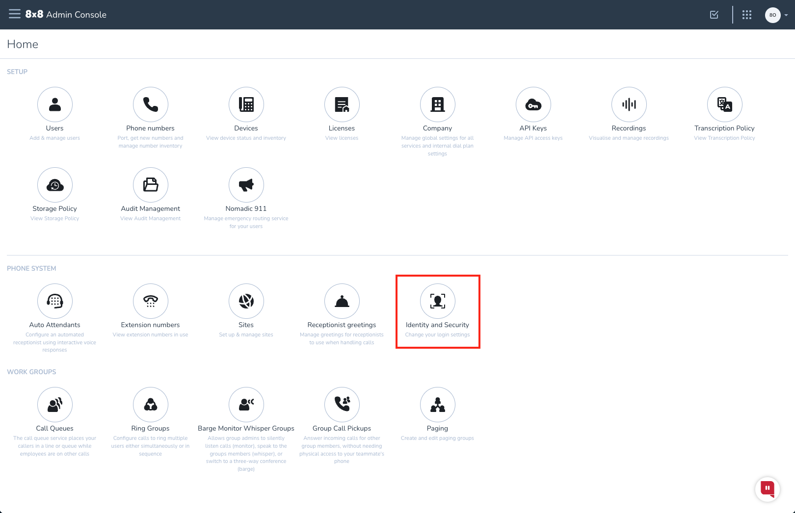
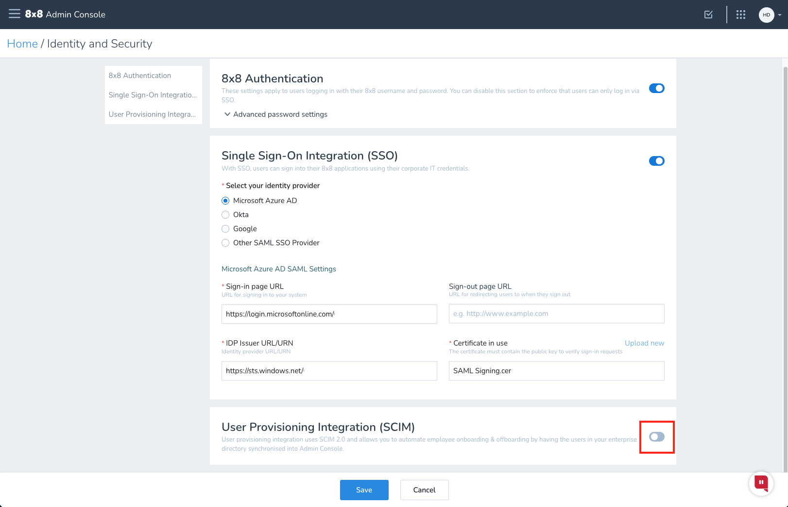
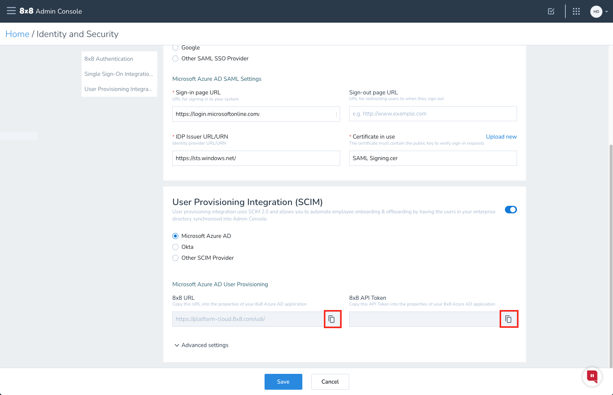

# Configure 8x8 for automatic user provisioning with Microsoft Entra ID

This article describes the steps you need to perform in both 8x8 Admin Console and Microsoft Entra ID to configure automatic user provisioning. When configured, Microsoft Entra ID automatically provisions and de-provisions users and groups to [8x8](https://www.8x8.com) using the Microsoft Entra provisioning service. For important details on what this service does, how it works, and frequently asked questions, see [Automate user provisioning and deprovisioning to SaaS applications with Microsoft Entra ID](~/identity/app-provisioning/user-provisioning.md). 

## Capabilities supported
> [!div class="checklist"]
> * Create users in 8x8
> * Deactivate users in 8x8 when they don't require access anymore
> * Keep user attributes synchronized between Microsoft Entra ID and 8x8
> * [Single sign-on](./8x8virtualoffice-tutorial.md) to 8x8 (recommended)

## Prerequisites

The scenario outlined in this article assumes that you already have the following prerequisites:

* [A Microsoft Entra tenant](~/identity-platform/quickstart-create-new-tenant.md) 
* A user account in Microsoft Entra ID with [permission](~/identity/role-based-access-control/permissions-reference.md) to configure provisioning (like [Application Administrator](/entra/identity/role-based-access-control/permissions-reference#application-administrator), [Cloud Application Administrator](/entra/identity/role-based-access-control/permissions-reference#cloud-application-administrator), or [Application Owner](/entra/fundamentals/users-default-permissions#owned-enterprise-applications)).
* An 8x8 X series subscription of any level.
* An 8x8 user account with administrator permission in [Admin Console](https://vo-cm.8x8.com).
* [Single sign-on with Microsoft Entra ID](./8x8virtualoffice-tutorial.md) has already been configured.

> [!NOTE]
> This integration is also available to use from Microsoft Entra US Government Cloud environment. You can find this application in the Microsoft Entra US Government Cloud Application Gallery and configure it in the same way as you do from public cloud.

## Step 1: Plan your provisioning deployment
1. Learn about [how the provisioning service works](~/identity/app-provisioning/user-provisioning.md).
2. Determine who is in [scope for provisioning](~/identity/app-provisioning/define-conditional-rules-for-provisioning-user-accounts.md).
3. Determine what data to [map between Microsoft Entra ID and 8x8](~/identity/app-provisioning/customize-application-attributes.md).

## Step 2: Configure 8x8 to support provisioning with Microsoft Entra ID

This section guides you through the steps to configure 8x8 to support provisioning with Microsoft Entra ID.

### To configure a user provisioning access token in 8x8 Admin Console:

1. Sign in to [Admin Console](https://admin.8x8.com). Select **Identity and Security**.

   

2. In the **User Provisioning Integration (SCIM)** pane, select the toggle to enable and then select **Save**.

   

3. Copy the **8x8 URL** and **8x8 API Token** values. These values are entered in the **Tenant URL** and **Secret Token** fields respectively in the Provisioning tab of your 8x8 application.

   

## Step 3: Add 8x8 from the Microsoft Entra application gallery

Add 8x8 from the Microsoft Entra application gallery to start managing provisioning to 8x8. If you have previously setup 8x8 for SSO, you can use the same application. However it's recommended that you create a separate app when testing out the integration initially. Learn more about adding an application from the gallery [here](~/identity/enterprise-apps/add-application-portal.md).

## Step 4: Define who is in scope for provisioning

[!INCLUDE [create-assign-users-provisioning.md](~/identity/saas-apps/includes/create-assign-users-provisioning.md)]

## Step 5: Configure automatic user provisioning to 8x8 

This section guides you through the steps to configure the Microsoft Entra provisioning service to create, update, and disable users and/or groups in 8x8 based on user and/or group assignments in Microsoft Entra ID.

### To configure automatic user provisioning for 8x8 in Microsoft Entra ID:

1. Sign in to the [Microsoft Entra admin center](https://entra.microsoft.com) as at least a [Cloud Application Administrator](~/identity/role-based-access-control/permissions-reference.md#cloud-application-administrator).
1. Browse to **Entra ID** > **Enterprise apps**

	

1. In the applications list, select **8x8**.

	

3. Select the **Provisioning** tab. Select **Get started**.

	

4. Set the **Provisioning Mode** to **Automatic**.

	

5. Under the **Admin Credentials** section, copy the **8x8 URL** from Admin Console into **Tenant URL**. Copy the **8x8 API Token** from Admin Console into **Secret Token**. Select **Test Connection** to ensure Microsoft Entra ID can connect to 8x8. If the connection fails, ensure your 8x8 account has Admin permissions and try again.

	

6. In the **Notification Email** field, enter the email address of a person or group who should receive the provisioning error notifications and select the **Send an email notification when a failure occurs** check box.

	

7. Select **Save**.

8. Under the **Mappings** section, select **Provision Microsoft Entra users**.

9. Review the user attributes that are synchronized from Microsoft Entra ID to 8x8 in the **Attribute-Mapping** section. The attributes selected as **Matching** properties are used to match the user accounts in 8x8 for update operations. If you choose to change the [matching target attribute](~/identity/app-provisioning/customize-application-attributes.md), you need to ensure that the 8x8 API supports filtering users based on that attribute. Select the **Save** button to commit any changes.

   |Attribute|Type|Notes|
   |---|---|---|
   |userName|String|Sets both Username and Federation ID|
   |externalId|String||
   |active|Boolean||
   |title|String||
   |emails[type eq "work"].value|String||
   |name.givenName|String||
   |name.familyName|String||
   |phoneNumbers[type eq "mobile"].value|String|Personal Contact Number|
   |phoneNumbers[type eq "work"].value|String|Personal Contact Number|
   |urn:ietf:params:scim:schemas:extension:enterprise:2.0:User:department|String||
   |urn:ietf:params:scim:schemas:extension:8x8:1.1:User:site|String|Can't be updated after user creation|
   |locale|String|Not mapped by default|
   |timezone|String|Not mapped by default|

10. To configure scoping filters, refer to the following instructions provided in the [Scoping filter  article](~/identity/app-provisioning/define-conditional-rules-for-provisioning-user-accounts.md).

11. To enable the Microsoft Entra provisioning service for 8x8, change the **Provisioning Status** to **On** in the **Settings** section.

	

12. Define the users and/or groups that you would like to provision to 8x8 by choosing the desired values in **Scope** in the **Settings** section.

	

13. When you're ready to provision, select **Save**.

	

This operation starts the initial synchronization cycle of all users and groups defined in **Scope** in the **Settings** section. The initial cycle takes longer to perform than subsequent cycles, which occur approximately every 40 minutes as long as the Microsoft Entra provisioning service is running. 

## Step 6: Monitor your deployment

[!INCLUDE [monitor-deployment.md](~/identity/saas-apps/includes/monitor-deployment.md)]

## Additional resources

* [Managing user account provisioning for Enterprise Apps](~/identity/app-provisioning/configure-automatic-user-provisioning-portal.md)
* [What is application access and Single sign-on with Microsoft Entra ID?](~/identity/enterprise-apps/what-is-single-sign-on.md)

## Related content

* [Learn how to review logs and get reports on provisioning activity](~/identity/app-provisioning/check-status-user-account-provisioning.md)
