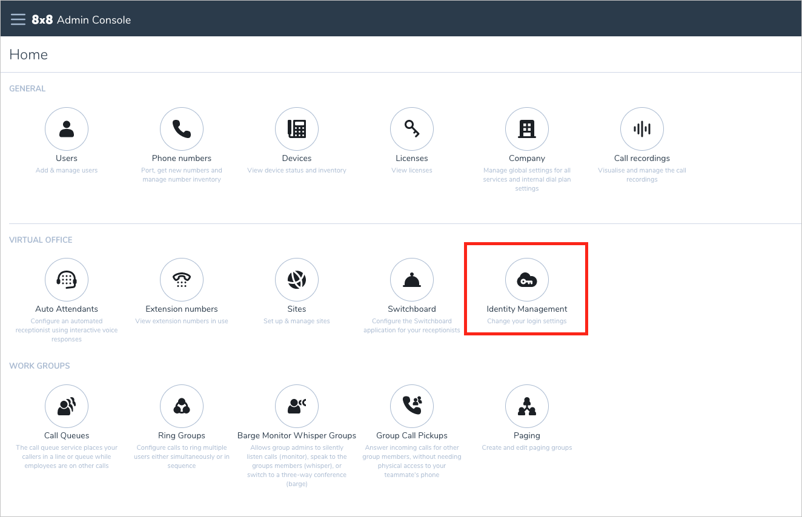

# Configure 8x8 for Single sign-on with Microsoft Entra ID

In this article,  you learn how to integrate 8x8 with Microsoft Entra ID. When you integrate 8x8 with Microsoft Entra ID, you can:

* Control in Microsoft Entra ID who has access to 8x8.
* Enable your users to be automatically signed-in to 8x8 with their Microsoft Entra accounts.
* Manage your accounts in one central location.

## Prerequisites

The scenario outlined in this article assumes that you already have the following prerequisites:

[!INCLUDE [common-prerequisites.md](~/identity/saas-apps/includes/common-prerequisites.md)]
* An 8x8 subscription.

> [!NOTE]
> This integration is also available to use from Microsoft Entra US Government Cloud environment. You can find this application in the Microsoft Entra US Government Cloud Application Gallery and configure it in the same way as you do from public cloud.

## Scenario description

In this article,  you configure and test Microsoft Entra SSO in a test environment.

* 8x8 supports both **SP and IDP** initiated SSO.
* 8x8 supports [**Automated** user provisioning and deprovisioning](8x8-provisioning-tutorial.md) (recommended).

> [!NOTE]
> The Identifier of this application is a fixed string value so only one instance can be configured in one tenant.

## Add 8x8 from the gallery

To configure the integration of 8x8 into Microsoft Entra ID, you need to add 8x8 from the gallery to your list of managed SaaS apps.

1. Sign in to the [Microsoft Entra admin center](https://entra.microsoft.com) as at least a [Cloud Application Administrator](~/identity/role-based-access-control/permissions-reference.md#cloud-application-administrator).
1. Browse to **Entra ID** > **Enterprise apps** > **New application**.
1. In the **Add from the gallery** section, type **8x8** in the search box.
1. Select **8x8** from results panel and then add the app. Wait a few seconds while the app is added to your tenant.

 [!INCLUDE [sso-wizard.md](~/identity/saas-apps/includes/sso-wizard.md)]

## Configure and test Microsoft Entra SSO for 8x8

Configure and test Microsoft Entra SSO with 8x8 using a test user called **B.Simon**. For SSO to work, you need to establish a link relationship between a Microsoft Entra user and the related user in 8x8.

To configure and test Microsoft Entra SSO with 8x8, perform the following steps:

1. **[Configure Microsoft Entra SSO](#configure-microsoft-entra-sso)** - to enable your users to use this feature.
    1. **Create a Microsoft Entra test user** - to test Microsoft Entra single sign-on with B.Simon.
    1. **Assign the Microsoft Entra test user** - to enable B.Simon to use Microsoft Entra single sign-on.
1. **[Configure 8x8 SSO in 8x8 Admin Console](#configure-8x8-sso-in-8x8-admin-console)** - to configure the single sign-on settings on application side.
    1. **[Create 8x8 test user](#create-8x8-test-user)** - to have a counterpart of B.Simon in 8x8 that's linked to the Microsoft Entra representation of user.
1. **[Test SSO](#test-sso)** - to verify whether the configuration works.

## Configure Microsoft Entra SSO

Follow these steps to enable Microsoft Entra SSO.

1. Sign in to the [Microsoft Entra admin center](https://entra.microsoft.com) as at least a [Cloud Application Administrator](~/identity/role-based-access-control/permissions-reference.md#cloud-application-administrator).
1. Browse to **Entra ID** > **Enterprise apps** > **8x8** > **Single sign-on**.
1. On the **Select a single sign-on method** page, select **SAML**.
1. On the **Set up single sign-on with SAML** page, select the pencil icon for **Basic SAML Configuration** to edit the settings.

   

1. On the **Basic SAML Configuration** section, perform the following steps:

    a. In the **Identifier** text box, type the URL: `https://sso.8x8.com/saml2`

    b. In the **Reply URL** text box, type the URL: `https://sso.8x8.com/saml2`

1. Perform the following step, if you wish to configure the application in SP initiated mode:
    
    In the **Sign on URL** text box, type the URL:
    `https://sso.8x8.com`

1. On the **Set up single sign-on with SAML** page, in the **SAML Signing Certificate** section,  find **Certificate (Base64)** and select **Download** to download the certificate and save it on your computer. You use the certificate later in the article in the **Configure 8x8 SSO** section.

	

1. On the **Set up 8x8** section, copy the URL(s) and you use these URL values later in the article: login URL, identifier, and logout URL.

[!INCLUDE [create-assign-users-sso.md](~/identity/saas-apps/includes/create-assign-users-sso.md)]

### Configure 8x8 SSO in 8x8 Admin Console

1. In a different web browser window, sign in to the 8x8 [Admin Console](https://admin.8x8.com/) as an administrator.

1. From the home page select **Identity Management**.

    

1. Check **Single Sign On (SSO)** then select **Microsoft Entra ID**.

1. Copy the three URLs and signing certificate from the **Set up Single Sign-On with SAML** page in Microsoft Entra ID into the **Microsoft Entra SAML Settings** section in 8x8 Admin Console.

    a. Copy **Login URL** from Microsoft Entra admin center and paste in the **IDP Login URL** field.

    b. Copy **Microsoft Entra Identifier** from Microsoft Entra admin center and paste in the **IDP Issuer URL/URN** field.

    c. Copy **Logout URL** from Microsoft Entra admin center and paste in the **IDP Logout URL** (optional) field.

    d. Download the **Certificate (Base64)** from Microsoft Entra admin center and upload into the **Certificate**.

    e. Select **Save**.

### Create 8x8 test user

Create a user called Britta Simon in 8x8 Admin Console. Users must be created in 8x8 Admin Console before you can use single sign-on.

## Test SSO

In this section, you test your Microsoft Entra single sign-on configuration with either an SP initiated flow which starts at the 8x8 login page, or an IDP initiated flow which starts at the Microsoft My Apps. 

#### SP initiated:

* Go to the 8x8 [Sign-on URL](https://sso.8x8.com) directly and initiate the login flow from there.

#### IDP initiated:

* Select **Test this application**, and you should be automatically signed in to the 8x8 for which you set up the SSO 

You can also use Microsoft My Apps to test the application in any mode. When you select the 8x8 tile in the My Apps, if configured in SP mode you would be redirected to the application sign-on page for initiating the login flow and if configured in IDP mode, you should be automatically signed in to the 8x8 for which you set up the SSO. For more information about the My Apps, see [Introduction to the My Apps](https://support.microsoft.com/account-billing/sign-in-and-start-apps-from-the-my-apps-portal-2f3b1bae-0e5a-4a86-a33e-876fbd2a4510).

## Related content

Once you configure 8x8 you can enforce session control, which protects exfiltration and infiltration of your organization’s sensitive data in real time. Session control extends from Conditional Access. [Learn how to enforce session control with Microsoft Defender for Cloud Apps](/cloud-app-security/proxy-deployment-any-app).