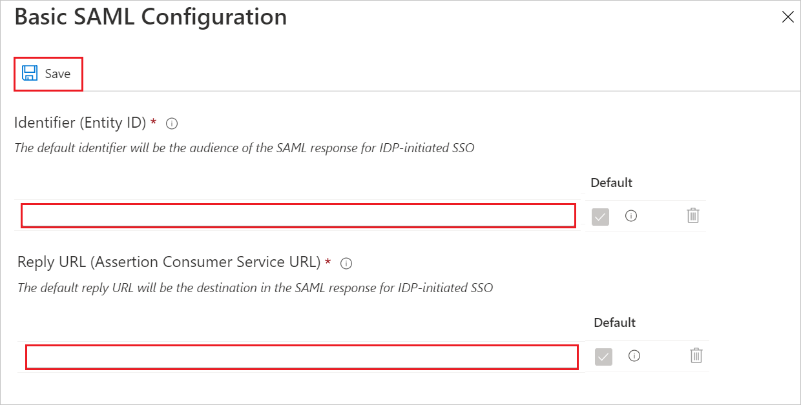

# Configure Accredible for Single sign-on with Microsoft Entra ID

In this article,  you learn how to integrate Accredible with Microsoft Entra ID.
Integrating Accredible with Microsoft Entra ID provides you with the following benefits:

* You can control in Microsoft Entra ID who has access to Accredible.
* You can enable your users to be automatically signed-in to Accredible (Single Sign-On) with their Microsoft Entra accounts.
* You can manage your accounts in one central location.

If you want to know more details about SaaS app integration with Microsoft Entra ID, see [What is application access and single sign-on with Microsoft Entra ID](~/identity/enterprise-apps/what-is-single-sign-on.md).
If you don't have an Azure subscription, [create a free account](https://azure.microsoft.com/free/) before you begin.

## Prerequisites

The scenario outlined in this article assumes that you already have the following prerequisites:

[!INCLUDE [common-prerequisites.md](~/identity/saas-apps/includes/common-prerequisites.md)]
* Accredible single sign-on enabled subscription

## Scenario description

In this article,  you configure and test Microsoft Entra single sign-on in a test environment.

* Accredible supports **IDP** initiated SSO

## Adding Accredible from the gallery

To configure the integration of Accredible into Microsoft Entra ID, you need to add Accredible from the gallery to your list of managed SaaS apps.

**To add Accredible from the gallery, do the following steps:**

1. Sign in to the [Microsoft Entra admin center](https://entra.microsoft.com) as at least a [Cloud Application Administrator](~/identity/role-based-access-control/permissions-reference.md#cloud-application-administrator).
1. Browse to **Entra ID** > **Enterprise apps** > **New application**.
1. In the **Add from the gallery** section, type **Accredible**, select **Accredible** from result panel then select **Add** button to add the application.

    

<a name='configure-and-test-azure-ad-single-sign-on'></a>

## Configure and test Microsoft Entra single sign-on

In this section, you configure and test Microsoft Entra single sign-on with Accredible based on a test user called **Britta Simon**.
For single sign-on to work, a link relationship between a Microsoft Entra user and the related user in Accredible needs to be established.

To configure and test Microsoft Entra single sign-on with Accredible, you need to complete the following building blocks:

1. **[Configure Microsoft Entra Single Sign-On](#configure-azure-ad-single-sign-on)** - to enable your users to use this feature.
2. **[Configure Accredible Single Sign-On](#configure-accredible-single-sign-on)** - to configure the Single Sign-On settings on application side.
3. **Create a Microsoft Entra test user** - to test Microsoft Entra single sign-on with Britta Simon.
4. **Assign the Microsoft Entra test user** - to enable Britta Simon to use Microsoft Entra single sign-on.
5. **[Create Accredible test user](#create-accredible-test-user)** - to have a counterpart of Britta Simon in Accredible that's linked to the Microsoft Entra representation of user.
6. **[Test single sign-on](#test-single-sign-on)** - to verify whether the configuration works.

<a name='configure-azure-ad-single-sign-on'></a>

### Configure Microsoft Entra single sign-on

In this section, you enable Microsoft Entra single sign-on.

To configure Microsoft Entra single sign-on with Accredible, perform the following steps:

1. Sign in to the [Microsoft Entra admin center](https://entra.microsoft.com) as at least a [Cloud Application Administrator](~/identity/role-based-access-control/permissions-reference.md#cloud-application-administrator).
1. Browse to **Entra ID** > **Enterprise apps** > **Accredible** application integration page, select **Single sign-on**.

    

1. On the **Select a Single sign-on method** dialog, select **SAML/WS-Fed** mode to enable single sign-on.

    

1. On the **Set up Single Sign-On with SAML** page, select **Edit** icon to open **Basic SAML Configuration** dialog.

    

1. On the **Set up Single Sign-On with SAML** page, perform the following steps:

    

    a. In the **Identifier** text box, type a URL using the following pattern:

    ```http
    https://api.accredible.com/sp/admin/accredible
    https://api.accredible.com/sp/user/accredible
    ```

    b. In the **Reply URL** text box, type a URL using the following pattern:
    `https://api.accredible.com/v1/saml/admin/<Unique id>/consume`

    > [!NOTE]
    > The Reply URL value isn't  real. According to the role of user, use the identifier value respectively. Each customer has a unique Reply URL depending on their ID. Contact [Accredible support team](mailto:support@accredible.com) to get these values.

1. On the **Set-up Single Sign-On with SAML** page, in the **SAML Signing Certificate** section, select **Download** to download the **Federation Metadata XML** from the given options as per your requirement and save it on your computer.

    

1. On the **Set up Accredible** section, copy the appropriate URL(s) as per your requirement.

    

    a. Login URL

    b. Microsoft Entra Identifier

    c. Logout URL

### Configure Accredible Single Sign-On

To configure single sign-on on **Accredible** side, you need to send the downloaded **Federation Metadata XML** and appropriate copied URLs from the application configuration to [Accredible support team](mailto:support@accredible.com). They set this setting to have the SAML SSO connection set properly on both sides.

<a name='create-an-azure-ad-test-user'></a>

[!INCLUDE [create-assign-users-sso.md](~/identity/saas-apps/includes/create-assign-users-sso.md)]

### Create Accredible test user

In this section, you create a user called Britta Simon in Accredible. You need to send the user's email id to [Accredible support team](mailto:support@accredible.com), then they verify the email and send you the invite mail so that you can add user in accredible platform.

### Test single sign-on

In this section, you test your Microsoft Entra single sign-on configuration using the Access Panel.

When you select the Accredible tile in the Access Panel, you should be automatically signed in to the Accredible for which you set up SSO. For more information about the Access Panel, see [Introduction to the Access Panel](https://support.microsoft.com/account-billing/sign-in-and-start-apps-from-the-my-apps-portal-2f3b1bae-0e5a-4a86-a33e-876fbd2a4510).

## Additional Resources

- [List of articles on How to Integrate SaaS Apps with Microsoft Entra ID](./tutorial-list.md)

- [What is application access and single sign-on with Microsoft Entra ID?](~/identity/enterprise-apps/what-is-single-sign-on.md)

- [What is Conditional Access in Microsoft Entra ID?](~/identity/conditional-access/overview.md)
