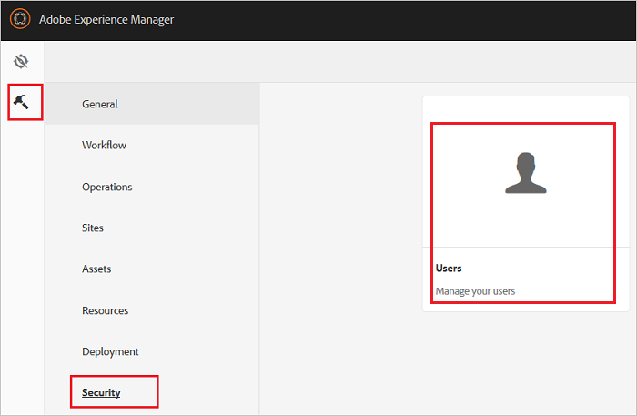
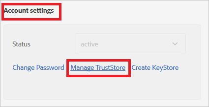
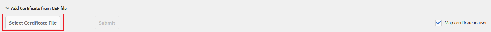
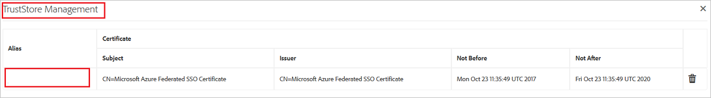
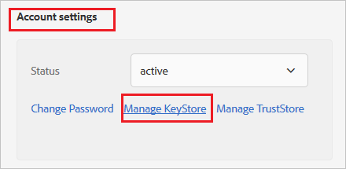
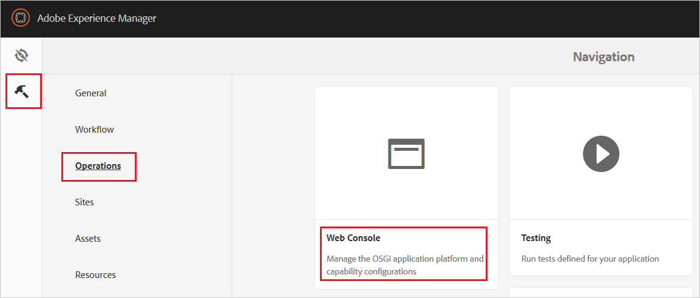
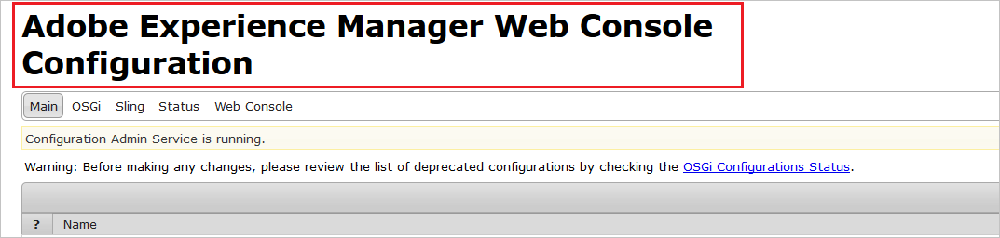
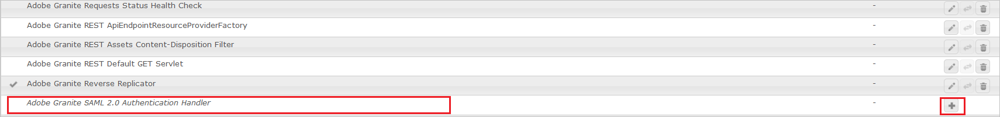
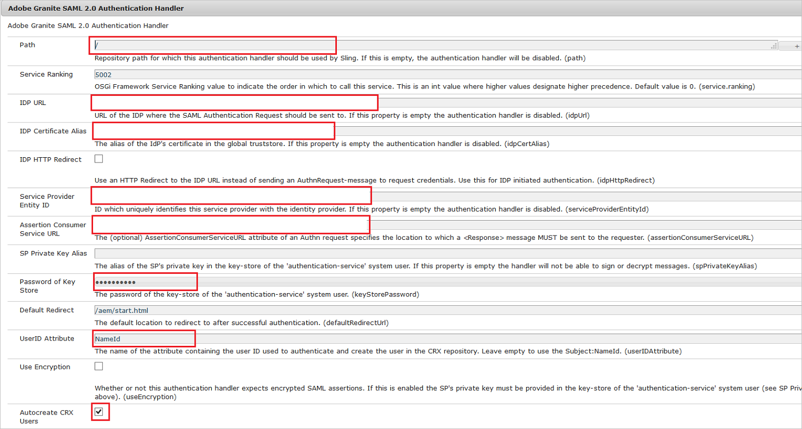
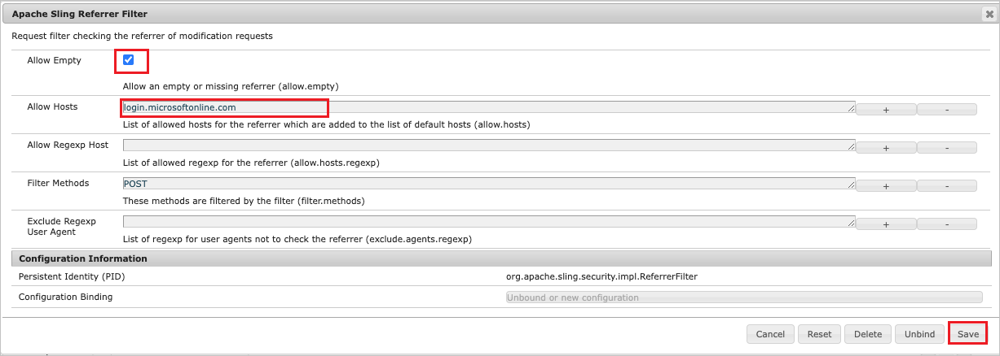

# Configure Adobe Experience Manager for Single sign-on with Microsoft Entra ID

In this article,  you learn how to integrate Adobe Experience Manager with Microsoft Entra ID. When you integrate Adobe Experience Manager with Microsoft Entra ID, you can:

* Control in Microsoft Entra ID who has access to Adobe Experience Manager.
* Enable your users to be automatically signed-in to Adobe Experience Manager with their Microsoft Entra accounts.
* Manage your accounts in one central location.

## Prerequisites

The scenario outlined in this article assumes that you already have the following prerequisites:

[!INCLUDE [common-prerequisites.md](~/identity/saas-apps/includes/common-prerequisites.md)]
* Adobe Experience Manager single sign-on (SSO) enabled subscription.

## Scenario description

In this article,  you configure and test Microsoft Entra SSO in a test environment.

* Adobe Experience Manager supports **SP and IDP** initiated SSO

* Adobe Experience Manager supports **Just In Time** user provisioning

## Adding Adobe Experience Manager from the gallery

To configure the integration of Adobe Experience Manager into Microsoft Entra ID, you need to add Adobe Experience Manager from the gallery to your list of managed SaaS apps.

1. Sign in to the [Microsoft Entra admin center](https://entra.microsoft.com) as at least a [Cloud Application Administrator](~/identity/role-based-access-control/permissions-reference.md#cloud-application-administrator).
1. Browse to **Entra ID** > **Enterprise apps** > **New application**.
1. In the **Add from the gallery** section, type **Adobe Experience Manager** in the search box.
1. Select **Adobe Experience Manager** from results panel and then add the app. Wait a few seconds while the app is added to your tenant.

 [!INCLUDE [sso-wizard.md](~/identity/saas-apps/includes/sso-wizard.md)]

## Configure and test Microsoft Entra SSO for Adobe Experience Manager

Configure and test Microsoft Entra SSO with Adobe Experience Manager using a test user called **B.Simon**. For SSO to work, you need to establish a link relationship between a Microsoft Entra user and the related user in Adobe Experience Manager.

To configure and test Microsoft Entra SSO with Adobe Experience Manager, perform the following steps:

1. **[Configure Microsoft Entra SSO](#configure-azure-ad-sso)** - to enable your users to use this feature.
    1. **Create a Microsoft Entra test user** - to test Microsoft Entra single sign-on with B.Simon.
    1. **Assign the Microsoft Entra test user** - to enable B.Simon to use Microsoft Entra single sign-on.
2. **[Configure Adobe Experience Manager SSO](#configure-adobe-experience-manager-sso)** - to configure the Single Sign-On settings on application side.
    1. **[Create Adobe Experience Manager test user](#create-adobe-experience-manager-test-user)** - to have a counterpart of Britta Simon in Adobe Experience Manager that's linked to the Microsoft Entra representation of user.
6. **[Test SSO](#test-sso)** - to verify whether the configuration works.

## Configure Microsoft Entra SSO

Follow these steps to enable Microsoft Entra SSO.

1. Sign in to the [Microsoft Entra admin center](https://entra.microsoft.com) as at least a [Cloud Application Administrator](~/identity/role-based-access-control/permissions-reference.md#cloud-application-administrator).
1. Browse to **Entra ID** > **Enterprise apps** > **Adobe Experience Manager** > **Single sign-on**.
1. On the **Select a single sign-on method** page, select **SAML**.
1. On the **Set up single sign-on with SAML** page, select the pencil icon for **Basic SAML Configuration** to edit the settings.

   

1. On the **Basic SAML Configuration** section, if you wish to configure the application in **IDP** initiated mode, enter the values for the following fields:

    a. In the **Identifier** text box, type a unique value that you define on your AEM server as well.

    b. In the **Reply URL** text box, type a URL using the following pattern:
    `https://<AEM Server Url>/saml_login`

    > [!NOTE]
    > The Reply URL value isn't  real. Update Reply URL value with the actual reply URL. To get this value, contact the [Adobe Experience Manager Client support team](https://helpx.adobe.com/support/experience-manager.html) to get this value. You can also refer to the patterns shown in the **Basic SAML Configuration** section.

1. Select **Set additional URLs** and perform the following step if you wish to configure the application in **SP** initiated mode:

    In the **Sign-on URL** text box, type your Adobe Experience Manager server URL.

1. On the **Set up Single Sign-On with SAML** page, in the **SAML Signing Certificate** section, select **Download** to download the **Certificate (Base64)** from the given options as per your requirement and save it on your computer.

    

1. On the **Set up Adobe Experience Manager** section, copy the appropriate URL(s) as per your requirement.

    

[!INCLUDE [create-assign-users-sso.md](~/identity/saas-apps/includes/create-assign-users-sso.md)]

## Configure Adobe Experience Manager SSO

1. In another browser window, open the **Adobe Experience Manager** admin portal.

2. Select **Settings** > **Security** > **Users**.

    

3. Select **Administrator** or any other relevant user.
4. Select **Account settings** > **Manage TrustStore**.

    

5. Under **Add Certificate from CER file**, select **Select Certificate File**. Browse to and select the certificate file, which you already downloaded.

    

6. The certificate is added to the TrustStore. Note the alias of the certificate.

    

7. On the **Users** page, select **authentication-service**.

    

8. Select **Account settings** > **Create/Manage KeyStore**. Create KeyStore by supplying a password.

    

9. Go back to the admin screen. Then select **Settings** > **Operations** > **Web Console**.

    

    This opens the configuration page.

    

10. Find **Adobe Granite SAML 2.0 Authentication Handler**. Then select the **Add** icon.

    

11. Take the following actions on this page.

    

    a. In the **Path** box, enter **/**.

    b. In the **IDP URL** box, enter the **Login URL** value that you copied.

    c. In the **IDP Certificate Alias** box, enter the **Certificate Alias** value that you added in TrustStore.

    d. In the **Security Provided Entity ID** box, enter the unique **Microsoft Entra Identifier** value that you configured.

    e. In the **Assertion Consumer Service URL** box, enter the **Reply URL** value that you configured.

    f. In the **Password of Key Store** box, enter the **Password** that you set in KeyStore.

    g. In the **User Attribute ID** box, enter the **Name ID** or another user ID that's relevant in your case.

    h. Select **Autocreate CRX Users**.

    i. In the **Logout URL** box, enter the unique **Logout URL** value that you got.

    j. Select **Save**.

1. In **Apache Sling Referrer Filter** section, perform the below steps:

    

    a. Ensure **allow.empty** value is set to true.

    b. Add `login.microsoftonline.com` to the **Allow Hosts**.

    c. Select **Save**.

### Create Adobe Experience Manager test user

In this section, you create a user called Britta Simon in Adobe Experience Manager. If you selected the **Autocreate CRX Users** option, users are created automatically after successful authentication.

If you want to create users manually, work with the [Adobe Experience Manager support team](https://helpx.adobe.com/support/experience-manager.html) to add the users in the Adobe Experience Manager platform.

## Test SSO 

In this section, you test your Microsoft Entra single sign-on configuration with following options. 

#### SP initiated:

* Select **Test this application**, this option redirects to Adobe Experience Manager Sign-on URL where you can initiate the login flow.  

* Go to Adobe Experience Manager Sign on URL directly and initiate the login flow from there.

#### IDP initiated:

* Select **Test this application**, and you should be automatically signed in to the Adobe Experience Manager for which you set up the SSO 

You can also use Microsoft My Apps to test the application in any mode. When you select the Adobe Experience Manager tile in the My Apps, if configured in SP mode you would be redirected to the application sign-on page for initiating the login flow and if configured in IDP mode, you should be automatically signed in to the Adobe Experience Manager for which you set up the SSO. For more information about the My Apps, see [Introduction to the My Apps](https://support.microsoft.com/account-billing/sign-in-and-start-apps-from-the-my-apps-portal-2f3b1bae-0e5a-4a86-a33e-876fbd2a4510).

## Related content

Once you configure Adobe Experience Manager you can enforce session control, which protects exfiltration and infiltration of your organization’s sensitive data in real time. Session control extends from Conditional Access. [Learn how to enforce session control with Microsoft Defender for Cloud Apps](/cloud-app-security/proxy-deployment-any-app).
