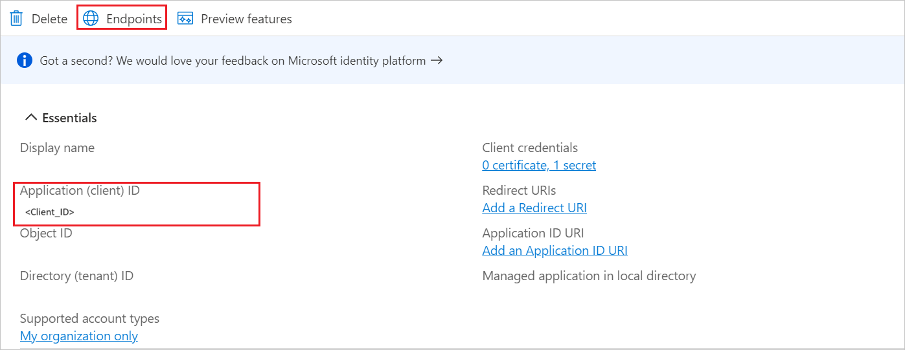

# Configure ADP (OIDC) for Single sign-on with Microsoft Entra ID

In this article,  you learn how to integrate ADP (OIDC) with Microsoft Entra ID. When you integrate ADP (OIDC) with Microsoft Entra ID, you can:

Use Microsoft Entra ID to control who can access ADP (OIDC).
Enable your users to be automatically signed in to ADP (OIDC) with their Microsoft Entra accounts.
Manage your accounts in one central location: the Azure portal.

## Prerequisites

To get started, you need the following items:

* A Microsoft Entra subscription. If you don't have a subscription, you can get a [free account](https://azure.microsoft.com/free/).
* ADP (OIDC) single sign-on (SSO) enabled subscription.

## Add ADP (OIDC) from the gallery

To configure the integration of ADP (OIDC) into Microsoft Entra ID, you need to add ADP (OIDC) from the gallery to your list of managed SaaS apps.

1. Sign in to the [Microsoft Entra admin center](https://entra.microsoft.com) as at least a [Cloud Application Administrator](~/identity/role-based-access-control/permissions-reference.md#cloud-application-administrator).

1. Browse to **Entra ID** > **Enterprise apps** > **New application**.

1. In the **Add from the gallery** section, enter **ADP (OIDC)** in the search box.

1. Select **ADP (OIDC)** in the results panel and then add the app. Wait a few seconds while the app is added to your tenant.

## Configure Microsoft Entra SSO

Follow these steps to enable Microsoft Entra SSO in the Microsoft Entra admin center.

1. Sign in to the [Microsoft Entra admin center](https://entra.microsoft.com) as at least a [Cloud Application Administrator](~/identity/role-based-access-control/permissions-reference.md#cloud-application-administrator).

1. Browse to **Entra ID** > **Enterprise apps** > **ADP (OIDC)** > **Single sign-on**.

1. Perform the following steps in the below section:

    1. Select **Go to application**.

        

    1. Copy **Application (client) ID** and use it later in the ADP (OIDC) side configuration.

        

    1. Under **Endpoints** tab, copy **OpenID Connect metadata document** link and use it later in the ADP (OIDC) side configuration.

        

1. Navigate to **Authentication** tab on the left menu and perform the following steps:

    1. In the **Redirect URIs** textbox, paste the **Relying Party Redirect URI** value, which you have copied from ADP (OIDC) side.

        

    1. Select **Configure** button.

1. Navigate to **Certificates & secrets** on the left menu and perform the following steps:

    1. Go to **Client secrets** tab and select **+New client secret**.
    1. Enter a valid **Description** in the textbox and select **Expires** days from the drop-down as per your requirement and select **Add**.

        

    1. Once you add a client secret, **Value** is generated. Copy the value and use it later in the ADP (OIDC) side configuration.

        

### Create a Microsoft Entra test user

In this section, you create a test user called B.Simon.

1. Sign in to the [Microsoft Entra admin center](https://entra.microsoft.com) as at least a [User Administrator](~/identity/role-based-access-control/permissions-reference.md#user-administrator).
1. Browse to **Entra ID** > **Users**.
1. Select **New user** > **Create new user**, at the top of the screen.
1. In the **User** properties, follow these steps:
   1. In the **Display name** field, enter `B.Simon`.  
   1. In the **User principal name** field, enter the username@companydomain.extension. For example, `B.Simon@contoso.com`.
   1. Select the **Show password** check box, and then write down the value that's displayed in the **Password** box.
   1. Select **Review + create**.
1. Select **Create**.

### Assign the Microsoft Entra test user

In this section, you enable B.Simon to use single sign-on by granting access to ADP (OIDC).

1. Sign in to the [Microsoft Entra admin center](https://entra.microsoft.com) as at least a [Cloud Application Administrator](~/identity/role-based-access-control/permissions-reference.md#cloud-application-administrator).
1. Browse to **Entra ID** > **Enterprise apps** > **ADP (OIDC)**.
1. In the app's overview page, select **Users and groups**.
1. Select **Add user/group**, then select **Users and groups** in the **Add Assignment** dialog.
   1. In the **Users and groups** dialog, select **B.Simon** from the Users list, then select the **Select** button at the bottom of the screen.
   1. If you're expecting a role to be assigned to the users, you can select it from the **Select a role** dropdown. If no role has been set up for this app, you see "Default Access" role selected.
   1. In the **Add Assignment** dialog, select the **Assign** button.

## Configure ADP (OIDC) SSO

Below are the configuration steps to complete the OAuth/OIDC federation setup:

1. Sign into the ADP Federated SSO site with your ADP issued credentials (`https://identityfederation.adp.com/`).

2. Select **Federation Setup**, select your Identity Provider as **Microsoft Azure**.

    

3. Enable OIDC Federation by selecting Enable OIDC Setup.

4. Perform the following steps in the **OIDC Setup** tab.

    

    a. Copy the **Relying Party Redirect URI** value and use it later in the Entra configuration.

    b. Paste the **Open ID Connect metadata document** value in the **Well-known URL** field which you have copied from Entra page and select **RETRIEVE** to auto populate the values in **Endpoints**.

    c. In the **Application Detail** tab, paste the **Application ID** value in the **Application Client ID** field.

    d. Paste the **Application ID** in the **Audience** field.

    e. In the **Application Client Secrets** field, paste the value which you have copied from **Certificates &  Secrets** in Entra.

    f. The **User Identifier** should be the name of the attribute of your unique identifier which is synchronized between ADP and the identity provider.

    g. Select **SAVE**.

    h. Once you save the configuration, select **ACTIVATE CONNECTION**.
