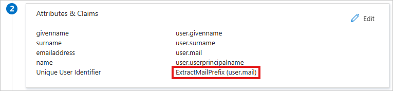
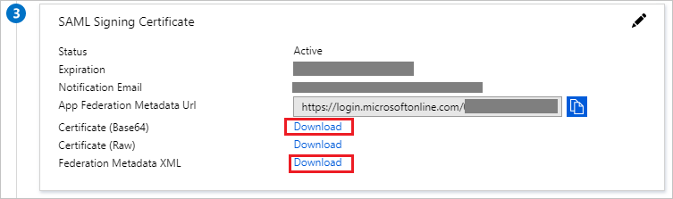
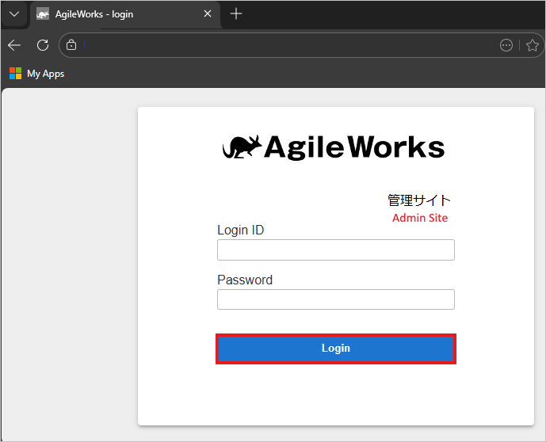
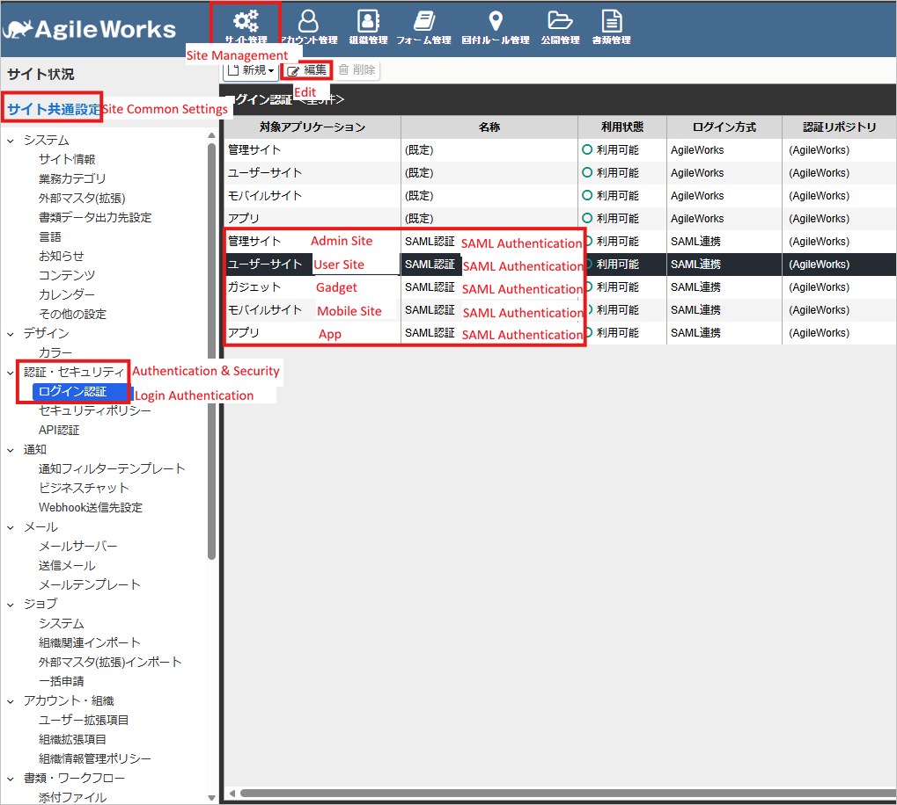
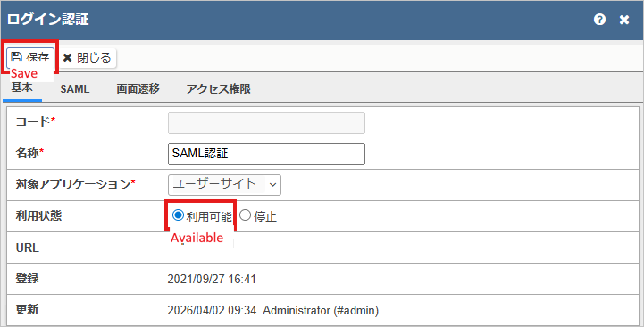
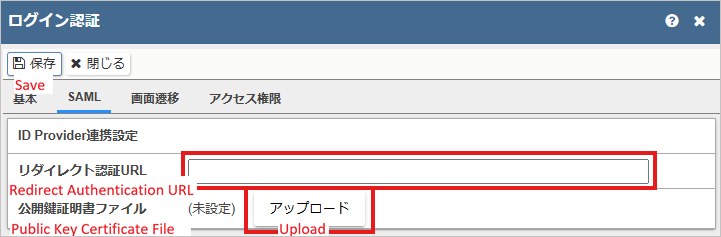
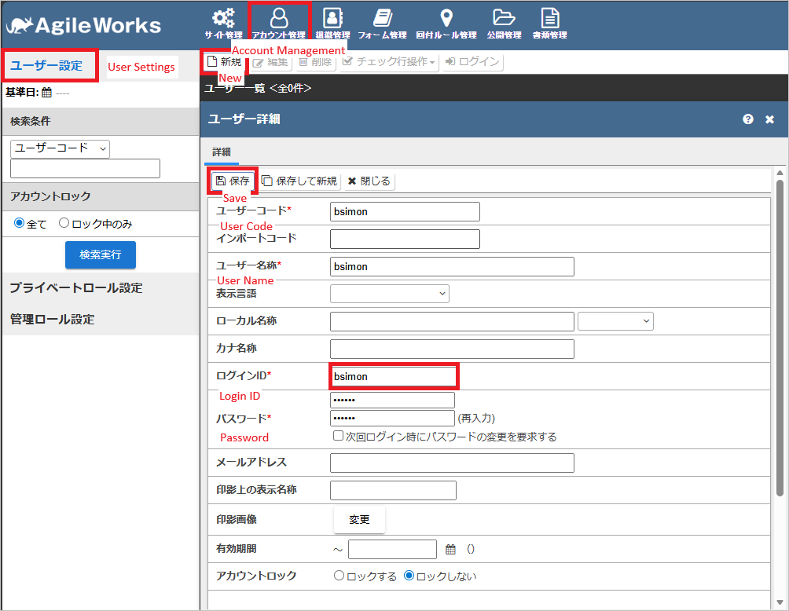

# Configure AgileWorksクラウド版 for single sign-on with Microsoft Entra ID

In this article, you learn how to integrate AgileWorksクラウド版 with Microsoft Entra ID. When you integrate AgileWorksクラウド版 with Microsoft Entra ID, you can:

* Control in Microsoft Entra ID who has access to AgileWorksクラウド版.
* Enable your users to be automatically signed in to AgileWorksクラウド版 with their Microsoft Entra accounts.
* Manage your accounts in one central location.

## Prerequisites

The scenario outlined in this article assumes that you already have the following prerequisites:

[!INCLUDE [common-prerequisites.md](~/identity/saas-apps/includes/common-prerequisites.md)]
* AgileWorksクラウド版 single sign-on (SSO) enabled subscription.

## Scenario description

In this article, you configure and test Microsoft Entra SSO in a test environment.

* AgileWorksクラウド版 supports **SP** initiated SSO.

## Adding AgileWorksクラウド版 from the gallery

To configure the integration of AgileWorksクラウド版 into Microsoft Entra ID, you need to add AgileWorksクラウド版 from the gallery to your list of managed SaaS apps.

1. Sign in to the [Microsoft Entra admin center](https://entra.microsoft.com) as at least a [Cloud Application Administrator](~/identity/role-based-access-control/permissions-reference.md#cloud-application-administrator).
1. Browse to **Entra ID** > **Enterprise apps** > **New application**.
1. In the **Add from the gallery** section, type **AgileWorksクラウド版** in the search box.
1. Select **AgileWorksクラウド版** from results panel and then add the app. Wait a few seconds while the app is added to your tenant.

 [!INCLUDE [sso-wizard.md](~/identity/saas-apps/includes/sso-wizard.md)]

## Configure and test Microsoft Entra SSO for AgileWorksクラウド版

Configure and test Microsoft Entra SSO with AgileWorksクラウド版 using a test user called **B.Simon**. For SSO to work, you need to establish a link relationship between a Microsoft Entra user and the related user in AgileWorksクラウド版.

To configure and test Microsoft Entra SSO with AgileWorksクラウド版, perform the following steps:

1. **[Configure Microsoft Entra SSO](#configure-microsoft-entra-sso)** - to enable your users to use this feature.
    1. **Create a Microsoft Entra test user** - to test Microsoft Entra single sign-on with B.Simon.
    1. **Assign the Microsoft Entra test user** - to enable B.Simon to use Microsoft Entra single sign-on.
1. **[Configure AgileWorksクラウド版 SSO](#configure-agileworksクラウド版-sso)** - to configure the single sign-on settings on application side.
    1. **[Create AgileWorksクラウド版 test user](#create-agileworksクラウド版-test-user)** - to have a counterpart of B.Simon in AgileWorksクラウド版 that's linked to the Microsoft Entra representation of user.
1. **[Test SSO](#test-sso)** - to verify whether the configuration works.

## Configure Microsoft Entra SSO

Follow these steps to enable Microsoft Entra SSO.

1. Sign in to the [Microsoft Entra admin center](https://entra.microsoft.com) as at least a [Cloud Application Administrator](~/identity/role-based-access-control/permissions-reference.md#cloud-application-administrator).
1. Browse to **Entra ID** > **Enterprise apps** > **AgileWorksクラウド版** > **Single sign-on**.
1. On the **Select a single sign-on method** page, select **SAML**.

1. On the **Set up single sign-on with SAML** page, select the pencil icon for **Basic SAML Configuration** to edit the settings.

   

1. On the **Basic SAML Configuration** section, perform the following steps:

    a. In the **Identifier (Entity ID)** text box, type the value: `atled.jp`.

    > [!NOTE]
    > The default Identifier value is `atled.jp`. If your administrator has changed this value in the system settings, use that updated value instead.

    b. In the **Reply URL** textbox, type a URL using one of the following patterns:

    | **Reply URL** | **Site**|
    |-------------|---------|
    |`https://<SUBDOMAIN>.atledcloud.jp/AgileWorks/Broker/PicusSAML` | (User Site)|
    | `https://<SUBDOMAIN>.atledcloud.jp/AgileWorks/Broker/EMMASAML` |(Admin Site)|
    | `https://<SUBDOMAIN>.atledcloud.jp/AgileWorks/Broker/MobileSAML` |(Mobile Site)|
    |`https://<SUBDOMAIN>.atledcloud.jp/AgileWorks/Broker/AppSAML` |(App)|
    |`https://<SUBDOMAIN>.atledcloud.jp/AgileWorks/Broker/GadgetSAML`| (Gadget)|

    > [!NOTE]
    > Replace `<SUBDOMAIN>` in `https://<SUBDOMAIN>.atledcloud.jp` with the subdomain of your AgileWorksクラウド版 instance.

    c. In the **Sign on URL** text box, enter the same URL that you set as the default (first) Reply URL.

    > [!NOTE]
    > This setting is optional in production and can be left blank after testing. It's required only for the **Test this application** button in the Microsoft Entra admin center to work correctly. If omitted, the **Test this application** button may fail because the test adds extra data to the link, which can make the URL too long and cause the request to fail.

1. AgileWorksクラウド版 application expects the SAML assertions in a specific format, which requires you to add custom attribute mappings to your SAML token attributes configuration. The following screenshot shows the list of default attributes, whereas **Unique User Identifier (Name ID)** is mapped with **user.userprincipalname**. AgileWorksクラウド版 application expects **Unique User Identifier (Name ID)** to be mapped with **ExtractMailPrefix(user.mail)**, so you need to edit the attribute mapping by selecting **Edit** icon and change the attribute mapping.

    

1. On the **Set up single sign-on with SAML** page, in the **SAML Signing Certificate** section, find **Certificate (Base64)** and select **Download** to download the certificate and save it on your computer.

    

1. On the **Set up AgileWorksクラウド版** section, copy the appropriate URL(s) based on your requirement.

    

## Create and assign Microsoft Entra test user

Follow the guidelines in the [create and assign a user account](~/identity/enterprise-apps/add-application-portal-assign-users.md) quickstart to create a test user account called B.Simon.

> [!NOTE]
> Set the test user's Email (user.mail) when you create the Microsoft Entra test user, and record the value. You'll use it in the **Create AgileWorksクラウド版 test user** section.

## Configure AgileWorksクラウド版 SSO

1. Sign in to the AgileWorksクラウド版 administration site (for example, `https://<SUBDOMAIN>.atledcloud.jp/AgileWorks/Broker/EMMA`).

    

1. Navigate to **Site Administration** > **Site Common Settings** > **Authentication & Security** > **Login Authentication**, select the row named **SAML Authentication**, and then select **Edit**.

    

1. Set the status to **Available** and select **Save**.

    

1. On the **SAML** tab, configure the following settings and select **Save**.

    | AgileWorksクラウド版 field | Value |
    | :--- | :--- |
    | **Redirect Authentication URL** | **Login URL** copied from Microsoft Entra |
    | **Public Key Certificate File** | **Certificate (Base64)** downloaded from Microsoft Entra |

    

### Create AgileWorksクラウド版 test user

In this section, you create a user in AgileWorksクラウド版 that corresponds to a user in Microsoft Entra ID.

1. AgileWorksクラウド版 uses the SAML **NameID** to identify the user at login. Microsoft Entra ID is configured to send the **NameID** using the `ExtractMailPrefix(user.mail)` transformation, which extracts the part before `@` from the user's email address.

1. You must set the same value as the **Login ID** in AgileWorksクラウド版.

**Example:**
| Microsoft Entra user email | AgileWorksクラウド版 Login ID |
| :--- | :--- |
| `bsimon@example.com` | `bsimon` |

Before you can use single sign-on, ensure the user is created and activated in AgileWorksクラウド版.

> [!NOTE]
> If Microsoft Entra ID is configured to send the SAML NameID using a different attribute (for example: user.userprincipalname or mail), make sure the AgileWorks Login ID for the corresponding user matches the value sent in the SAML NameID.

## Test SSO

In this section, you test your Microsoft Entra single sign-on configuration with following options.

> [!NOTE]
> The **Test this application** button works correctly only if a **Sign on URL** is set in the Basic SAML Configuration.

* Select **Test this application**, which redirects to the AgileWorksクラウド版 Sign on URL where you can initiate the login flow.

* Go to AgileWorksクラウド版 Reply URL (for example, `https://<SUBDOMAIN>.atledcloud.jp/AgileWorks/Broker/PicusSAML`) directly and initiate the login flow from there.

* You can use Microsoft My Apps. When you select the AgileWorksクラウド版 tile in My Apps, it redirects to the AgileWorksクラウド版 Reply URL (for example, `https://<SUBDOMAIN>.atledcloud.jp/AgileWorks/Broker/PicusSAML`). For more information about My Apps, see [Introduction to the My Apps](https://support.microsoft.com/account-billing/sign-in-and-start-apps-from-the-my-apps-portal-2f3b1bae-0e5a-4a86-a33e-876fbd2a4510).

## Next step

Once you configure AgileWorksクラウド版 you can enforce session control, which protects exfiltration and infiltration of your organization’s sensitive data in real time. Session control extends from Conditional Access. [Learn how to enforce session control with Microsoft Defender for Cloud Apps](/cloud-app-security/proxy-deployment-any-app).
