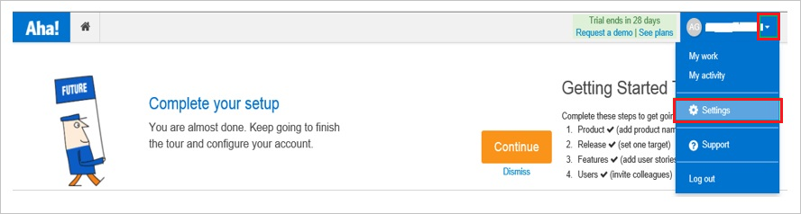
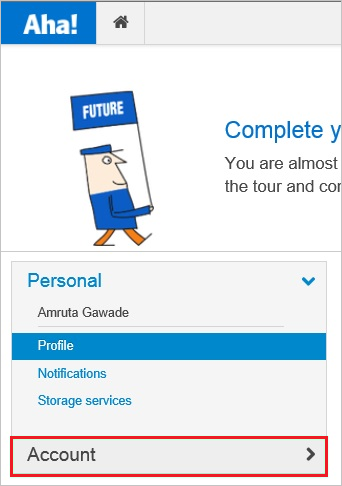
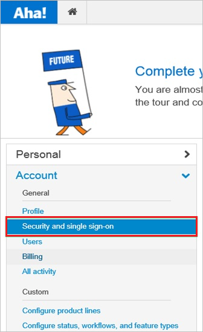
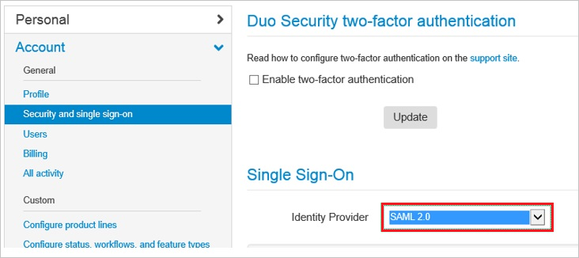
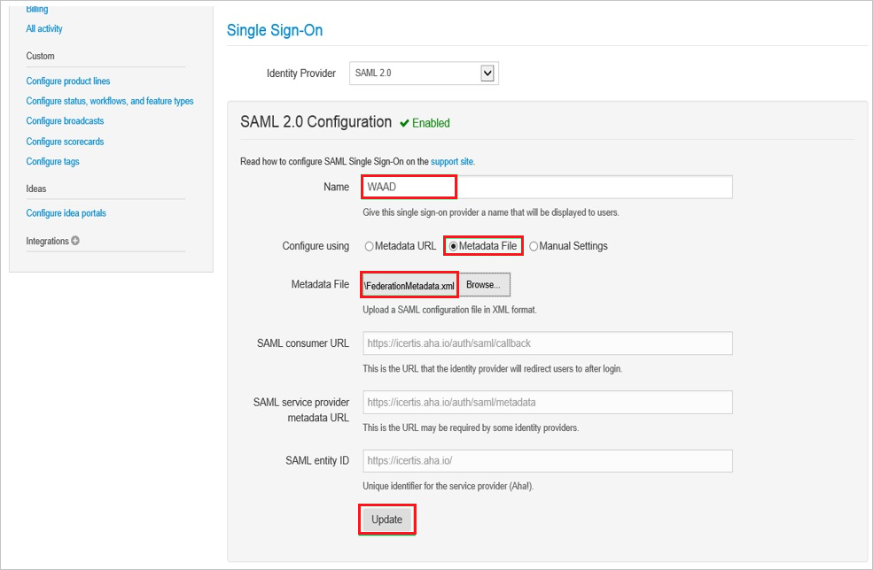

# Configure Aha! for Single sign-on with Microsoft Entra ID

In this article,  you learn how to integrate Aha! with Microsoft Entra ID. When you integrate Aha! with Microsoft Entra ID, you can:

* Control in Microsoft Entra ID who has access to Aha!.
* Enable your users to be automatically signed-in to Aha! with their Microsoft Entra accounts.
* Manage your accounts in one central location.

## Prerequisites

The scenario outlined in this article assumes that you already have the following prerequisites:

[!INCLUDE [common-prerequisites.md](~/identity/saas-apps/includes/common-prerequisites.md)]
* Aha! single sign-on (SSO) enabled subscription.

> [!NOTE]
> This integration is also available to use from Microsoft Entra US Government Cloud environment. You can find this application in the Microsoft Entra US Government Cloud Application Gallery and configure it in the same way as you do from public cloud.

## Scenario description

In this article,  you configure and test Microsoft Entra SSO in a test environment.

* Aha! supports **SP** initiated SSO
* Aha! supports **Just In Time** user provisioning

## Add Aha! from the gallery

To configure the integration of Aha! into Microsoft Entra ID, you need to add Aha! from the gallery to your list of managed SaaS apps.

1. Sign in to the [Microsoft Entra admin center](https://entra.microsoft.com) as at least a [Cloud Application Administrator](~/identity/role-based-access-control/permissions-reference.md#cloud-application-administrator).
1. Browse to **Entra ID** > **Enterprise apps** > **New application**.
1. In the **Add from the gallery** section, type **Aha!** in the search box.
1. Select **Aha!** from results panel and then add the app. Wait a few seconds while the app is added to your tenant.

 [!INCLUDE [sso-wizard.md](~/identity/saas-apps/includes/sso-wizard.md)]

## Configure and test Microsoft Entra SSO for Aha!

Configure and test Microsoft Entra SSO with Aha! using a test user called **B.Simon**. For SSO to work, you need to establish a link relationship between a Microsoft Entra user and the related user in Aha!.

To configure and test Microsoft Entra SSO with Aha!, perform the following steps:

1. **[Configure Microsoft Entra SSO](#configure-azure-ad-sso)** - to enable your users to use this feature.
    1. **Create a Microsoft Entra test user** - to test Microsoft Entra single sign-on with B.Simon.
    1. **Assign the Microsoft Entra test user** - to enable B.Simon to use Microsoft Entra single sign-on.
2. **[Configure Aha! SSO](#configure-aha-sso)** - to configure the single sign-on settings on application side.
    1. **[Create Aha! test user](#create-aha-test-user)** - to have a counterpart of B.Simon in Aha! that's linked to the Microsoft Entra representation of user.
3. **[Test SSO](#test-sso)** - to verify whether the configuration works.

## Configure Microsoft Entra SSO

Follow these steps to enable Microsoft Entra SSO.

1. Sign in to the [Microsoft Entra admin center](https://entra.microsoft.com) as at least a [Cloud Application Administrator](~/identity/role-based-access-control/permissions-reference.md#cloud-application-administrator).
1. Browse to **Entra ID** > **Enterprise apps** > **Aha!** application integration page, find the **Manage** section and select **Single sign-on**.
1. On the **Select a Single sign-on method** page, select **SAML**.
1. On the **Set up Single Sign-On with SAML** page, select the pencil icon for **Basic SAML Configuration** to edit the settings.

    

1. On the **Basic SAML Configuration** section, perform the following steps:

    a. In the **Sign on URL** text box, type a URL using the following pattern:
    `https://<companyname>.aha.io/session/new`

    b. In the **Identifier (Entity ID)** text box, type a URL using the following pattern:
    `https://<companyname>.aha.io`

    > [!NOTE]
    > These values aren't real. Update these values with the actual Sign on URL and Identifier. Contact [Aha! Client support team](https://www.aha.io/company/contact) to get these values. You can also refer to the patterns shown in the **Basic SAML Configuration** section.

1. On the **Set up Single Sign-On with SAML** page, in the **SAML Signing Certificate** section,  find **Federation Metadata XML** and select **Download** to download the certificate and save it on your computer.

    

1. On the **Set up Aha!** section, copy the appropriate URL(s) based on your requirement.

    

[!INCLUDE [create-assign-users-sso.md](~/identity/saas-apps/includes/create-assign-users-sso.md)]

## Configure Aha! SSO

1. In a different web browser window, sign in to your Aha! company site as an administrator

4. In the menu on the top, select **Settings**.

    

5. Select **Account**.

    

6. Select **Security and single sign-on**.

    

7. In **Single Sign-On** section, as **Identity Provider**, select **SAML2.0**.

    

8. On the **Single Sign-On** configuration page, perform the following steps:

    

    a. In the **Name** textbox, type a name for your configuration.

    b. For **Configure using**, select **Metadata File**.

    c. To upload your downloaded metadata file, select **Browse**.

    d. Select **Update**.

### Create Aha! test user

In this section, a user called B.Simon is created in Aha!. Aha! supports just-in-time user provisioning, which is enabled by default. There's no action item for you in this section. If a user doesn't already exist in Aha!, a new one is created after authentication.

## Test SSO 

In this section, you test your Microsoft Entra single sign-on configuration with following options. 

* Select **Test this application**, this option redirects to Aha! Sign-on URL where you can initiate the login flow. 

* Go to Aha! Sign-on URL directly and initiate the login flow from there.

* You can use Microsoft My Apps. When you select the Aha! tile in the My Apps, this option redirects to Aha! Sign-on URL. For more information about the My Apps, see [Introduction to the My Apps](https://support.microsoft.com/account-billing/sign-in-and-start-apps-from-the-my-apps-portal-2f3b1bae-0e5a-4a86-a33e-876fbd2a4510).

## Related content

Once you configure Aha! you can enforce session control, which protects exfiltration and infiltration of your organization’s sensitive data in real time. Session control extends from Conditional Access. [Learn how to enforce session control with Microsoft Defender for Cloud Apps](/cloud-app-security/proxy-deployment-any-app).
