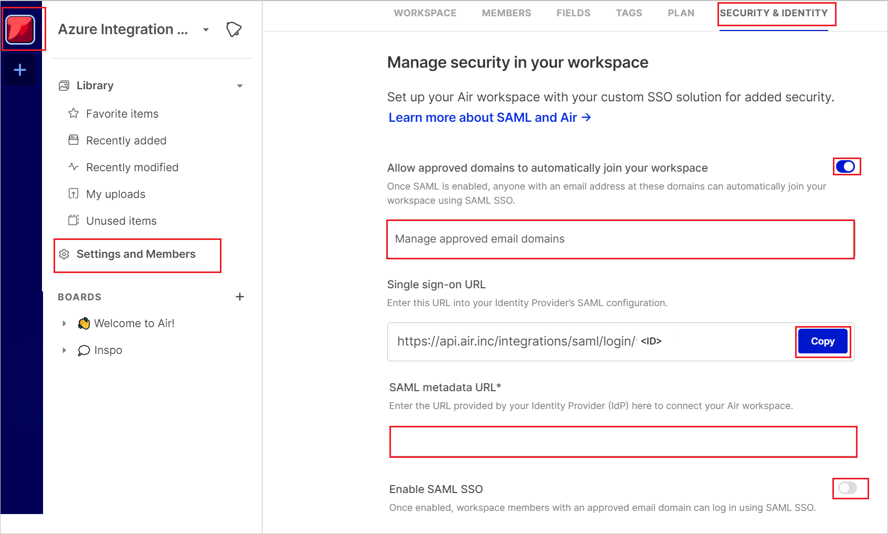
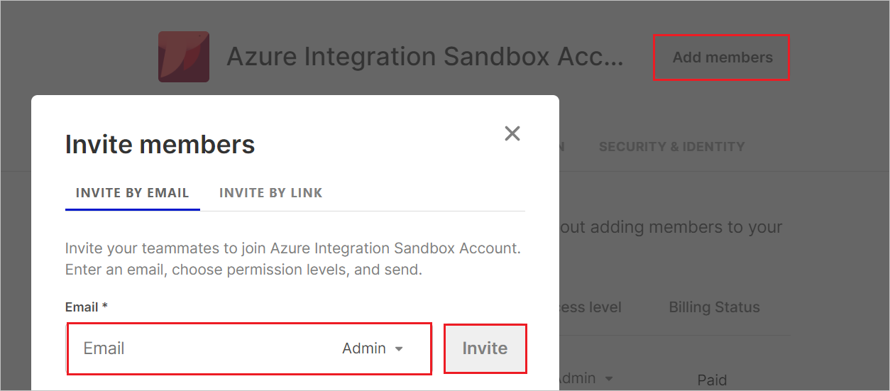

# Configure Air for Single sign-on with Microsoft Entra ID

In this article,  you learn how to integrate Air with Microsoft Entra ID. When you integrate Air with Microsoft Entra ID, you can:

* Control in Microsoft Entra ID who has access to Air.
* Enable your users to be automatically signed-in to Air with their Microsoft Entra accounts.
* Manage your accounts in one central location.

## Prerequisites

The scenario outlined in this article assumes that you already have the following prerequisites:

[!INCLUDE [common-prerequisites.md](~/identity/saas-apps/includes/common-prerequisites.md)]
* Air single sign-on (SSO) enabled subscription.

## Scenario description

In this article,  you configure and test Microsoft Entra SSO in a test environment.

* Air supports **SP and IDP** initiated SSO.

## Adding Air from the gallery

To configure the integration of Air into Microsoft Entra ID, you need to add Air from the gallery to your list of managed SaaS apps.

1. Sign in to the [Microsoft Entra admin center](https://entra.microsoft.com) as at least a [Cloud Application Administrator](~/identity/role-based-access-control/permissions-reference.md#cloud-application-administrator).
1. Browse to **Entra ID** > **Enterprise apps** > **New application**.
1. In the **Add from the gallery** section, type **Air** in the search box.
1. Select **Air** from results panel and then add the app. Wait a few seconds while the app is added to your tenant.

 [!INCLUDE [sso-wizard.md](~/identity/saas-apps/includes/sso-wizard.md)]

## Configure and test Microsoft Entra SSO for Air

Configure and test Microsoft Entra SSO with Air using a test user called **B.Simon**. For SSO to work, you need to establish a link relationship between a Microsoft Entra user and the related user in Air.

To configure and test Microsoft Entra SSO with Air, perform the following steps:

1. **[Configure Microsoft Entra SSO](#configure-azure-ad-sso)** - to enable your users to use this feature.
    1. **Create a Microsoft Entra test user** - to test Microsoft Entra single sign-on with B.Simon.
    1. **Assign the Microsoft Entra test user** - to enable B.Simon to use Microsoft Entra single sign-on.
1. **[Configure Air SSO](#configure-air-sso)** - to configure the single sign-on settings on application side.
    1. **[Create Air test user](#create-air-test-user)** - to have a counterpart of B.Simon in Air that's linked to the Microsoft Entra representation of user.
1. **[Test SSO](#test-sso)** - to verify whether the configuration works.

## Configure Microsoft Entra SSO

Follow these steps to enable Microsoft Entra SSO.

1. Sign in to the [Microsoft Entra admin center](https://entra.microsoft.com) as at least a [Cloud Application Administrator](~/identity/role-based-access-control/permissions-reference.md#cloud-application-administrator).
1. Browse to **Entra ID** > **Enterprise apps** > **Air** > **Single sign-on**.
1. On the **Select a single sign-on method** page, select **SAML**.
1. On the **Set up single sign-on with SAML** page, select the pencil icon for **Basic SAML Configuration** to edit the settings.

   

1. On the **Basic SAML Configuration** section, if you wish to configure the application in **IDP** initiated mode, enter the values for the following fields:

    a. In the **Identifier** text box, type the value:
    `urn:amazon:cognito:sp:us-east-1_hFBg5izBk`

    b. In the **Reply URL** text box, type the URL:
    `https://auth.air.inc/saml2/idpresponse`

1. Select **Set additional URLs** and perform the following step if you wish to configure the application in **SP** initiated mode:

    In the **Sign-on URL** text box, type a URL using the following pattern:
    `https://api.air.inc/integrations/saml/login/<CustomerID>`

	> [!NOTE]
	> The value isn't  real. Update the value with the actual Sign-on URL. Contact [Air Client support team](mailto:dev@air.inc) to get the value. You can also refer to the patterns shown in the **Basic SAML Configuration** section.

1. On the **Set up single sign-on with SAML** page, In the **SAML Signing Certificate** section, select copy button to copy **App Federation Metadata Url** and save it on your computer.

	

[!INCLUDE [create-assign-users-sso.md](~/identity/saas-apps/includes/create-assign-users-sso.md)]

## Configure Air SSO

1. Log in to the Air website as an administrator.

1. Select the **Workspace** at the top left corner.

1. Go to the **Settings** > **SECURITY &IDENTITY** tab and perform the perform the following steps:

    

    a. In the **Manage approved email domains** text box, add your organizations email domains to the approved domains list to allow users with these domains to authenticate using SAML SSO. 
    
    b. Copy **Single sign-on URL** value, paste this value into the **Sign on URL** text box in the **Basic SAML Configuration** section.

    c. In the SAML metadata URL text box, paste the **App Federation Metadata Url** value which you have copied.

    d. Select **Enable SAML SSO**.

### Create Air test user

Log in to the Air website as an administrator.

1. Select the **Workspace** at the top left corner.

1. Go to the **Settings** > **MEMBERS** tab and select **Add members**.

1. Give the Email address and select **Invite**.

    

## Test SSO 

In this section, you test your Microsoft Entra single sign-on configuration with following options.

#### SP initiated:

* Select **Test this application**, this option redirects to Air Sign on URL where you can initiate the login flow.

* Go to Air Sign-on URL directly and initiate the login flow from there.

#### IDP initiated:

* Select **Test this application**, and you should be automatically signed in to the Air for which you set up the SSO

You can also use Microsoft My Apps to test the application in any mode. When you select the Air tile in the My Apps, if configured in SP mode you would be redirected to the application sign on page for initiating the login flow and if configured in IDP mode, you should be automatically signed in to the Air for which you set up the SSO. For more information, see [Microsoft Entra My Apps](/azure/active-directory/manage-apps/end-user-experiences#azure-ad-my-apps).

## Related content

Once you configure Air you can enforce session control, which protects exfiltration and infiltration of your organization’s sensitive data in real time. Session control extends from Conditional Access. [Learn how to enforce session control with Microsoft Defender for Cloud Apps](/cloud-app-security/proxy-deployment-aad).
