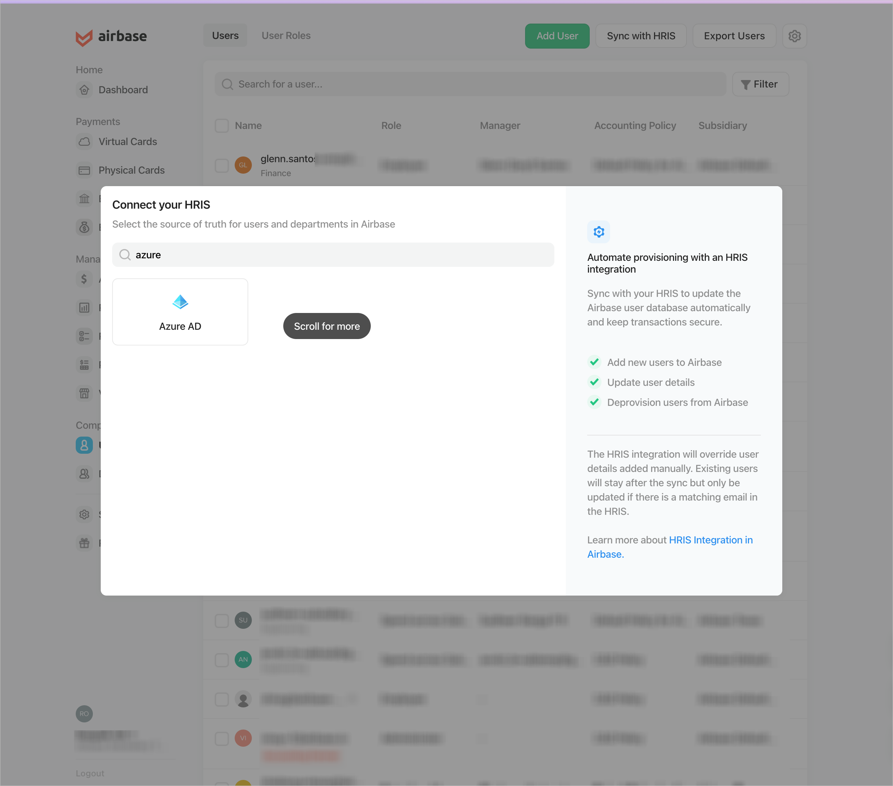
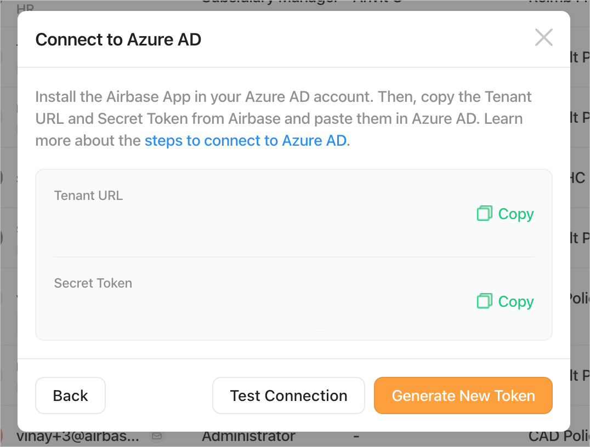

# Configure Airbase for automatic user provisioning with Microsoft Entra ID

This article describes the steps you need to perform in both Airbase and Microsoft Entra ID to configure automatic user provisioning. When configured, Microsoft Entra ID automatically provisions and deprovisions users to [Airbase](https://www.airbase.com/) using the Microsoft Entra provisioning service. For important details on what this service does, how it works, and frequently asked questions, see [Automate user provisioning and deprovisioning to SaaS applications with Microsoft Entra ID](~/identity/app-provisioning/user-provisioning.md). 

## Supported capabilities
> [!div class="checklist"]
> * Create users in Airbase.
> * Remove users in Airbase when they don't require access anymore.
> * Keep user attributes synchronized between Microsoft Entra ID and Airbase.
> * [Single sign-on](airbase-tutorial.md) to Airbase (recommended).

## Prerequisites

The scenario outlined in this article assumes that you already have the following prerequisites:

* [A Microsoft Entra tenant](~/identity-platform/quickstart-create-new-tenant.md) 
* One of the following roles: [Application Administrator](/entra/identity/role-based-access-control/permissions-reference#application-administrator), [Cloud Application Administrator](/entra/identity/role-based-access-control/permissions-reference#cloud-application-administrator), or [Application Owner](/entra/fundamentals/users-default-permissions#owned-enterprise-applications).
* A user account in Airbase with Admin permissions.

## Step 1: Plan your provisioning deployment
* Learn about [how the provisioning service works](~/identity/app-provisioning/user-provisioning.md).
* Determine who is in [scope for provisioning](~/identity/app-provisioning/define-conditional-rules-for-provisioning-user-accounts.md).
* Determine what data to [map between Microsoft Entra ID and Airbase](~/identity/app-provisioning/customize-application-attributes.md).

## Step 2: Configure Airbase to support provisioning with Microsoft Entra ID

1. Log in to Airbase portal.
1. Navigate to the Users section.
1. Select Sync with HRIS.

   

1. Select Microsoft Entra ID from the list of HRIS.
1. Make a note of the Base URL and API Token.

   
   
1. Use these values in Step 5.5.

## Step 3: Add Airbase from the Microsoft Entra application gallery

Add Airbase from the Microsoft Entra application gallery to start managing provisioning to Airbase. If you have previously setup Airbase for SSO you can use the same application. However it's recommended that you create a separate app when testing out the integration initially. Learn more about adding an application from the gallery [here](~/identity/enterprise-apps/add-application-portal.md). 

## Step 4: Define who is in scope for provisioning 

[!INCLUDE [create-assign-users-provisioning.md](~/identity/saas-apps/includes/create-assign-users-provisioning.md)]

## Step 5: Configure automatic user provisioning to Airbase 

This section guides you through the steps to configure the Microsoft Entra provisioning service to create, update, and disable users in TestApp based on user assignments in Microsoft Entra ID.

### To configure automatic user provisioning for Airbase in Microsoft Entra ID:

1. Sign in to the [Microsoft Entra admin center](https://entra.microsoft.com) as at least a [Cloud Application Administrator](~/identity/role-based-access-control/permissions-reference.md#cloud-application-administrator).
1. Browse to **Entra ID** > **Enterprise apps**

	

1. In the applications list, select **Airbase**.

	

1. Select the **Provisioning** tab.

	

1. Set **+ New configuration**.

	

1. In the **Tenant URL** field, input your Airbase Tenant URL and Secret Token. Select **Test Connection** to ensure Microsoft Entra ID can connect to Airbase. If the connection fails, ensure your Airbase account has the required admin permissions and try again.

   

1. Select **Create** to create your configuration.	

1. Select **Properties** in the **Overview** page. 

1. Select the pencil to edit the properties. Enable notification emails and provide an email to receive quarantine emails. Enable accidental deletions prevention. Select **Apply** to save the changes.

   

1. Select **Attribute Mapping** in the left panel and select users.

1. Review the user attributes that are synchronized from Microsoft Entra ID to Airbase in the **Attribute-Mapping** section. The attributes selected as **Matching** properties are used to match the user accounts in Airbase for update operations. If you choose to change the [matching target attribute](~/identity/app-provisioning/customize-application-attributes.md), you need to ensure that the Airbase API supports filtering users based on that attribute. Select the **Save** button to commit any changes.

   |Attribute|Type|Supported for filtering|Required by Airbase|
   |---|---|---|---|
   |userName|String|&check;|&check;
   |active|Boolean||&check;
   |emails[type eq "work"].value|String||&check;
   |name.givenName|String||
   |name.familyName|String||
   |externalId|String||&check;
   |urn:ietf:params:scim:schemas:extension:enterprise:2.0:User:department|String||
   |urn:ietf:params:scim:schemas:extension:enterprise:2.0:User:manager|Reference||
   |urn:ietf:params:scim:schemas:extension:airbase:2.0:User:accountingPolicy|String||
   |urn:ietf:params:scim:schemas:extension:airbase:2.0:User:subsidiary|String||
   |urn:ietf:params:scim:schemas:extension:airbase:2.0:User:role|String||

1. To configure scoping filters, refer to the following instructions provided in the [Scoping filter article](~/identity/app-provisioning/define-conditional-rules-for-provisioning-user-accounts.md) article.

1. Use [on-demand provisioning](~/identity/app-provisioning/provision-on-demand.md) to validate sync with a small number of users before deploying more broadly in your organization.  

1. When you're ready to provision, select **Start Provisioning** from the **Overview** page.

## Step 6: Monitor your deployment

[!INCLUDE [monitor-deployment.md](~/identity/saas-apps/includes/monitor-deployment.md)]

## More resources

* [Managing user account provisioning for Enterprise Apps](~/identity/app-provisioning/configure-automatic-user-provisioning-portal.md)
* [What is application access and single sign-on with Microsoft Entra ID?](~/identity/enterprise-apps/what-is-single-sign-on.md)

## Related content

* [Learn how to review logs and get reports on provisioning activity](~/identity/app-provisioning/check-status-user-account-provisioning.md)
