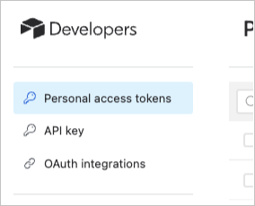
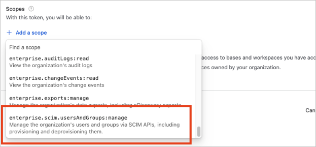

# Configure Airtable for automatic user provisioning with Microsoft Entra ID

This article describes the steps you need to perform in both Airtable and Microsoft Entra ID to configure automatic user provisioning. When configured, Microsoft Entra ID automatically provisions and deprovisions users and groups to [Airtable](https://www.airtable.com) using the Microsoft Entra provisioning service. For important details on what this service does, how it works, and frequently asked questions, see [Automate user provisioning and deprovisioning to SaaS applications with Microsoft Entra ID](~/identity/app-provisioning/user-provisioning.md). 

## Supported capabilities
> [!div class="checklist"]
> * Create users in Airtable.
> * Remove users in Airtable when they don't require access anymore.
> * Keep user attributes synchronized between Microsoft Entra ID and Airtable.
> * Provision groups and group memberships in Airtable.
> * [Single sign-on](airtable-tutorial.md) to Airtable (recommended).

## Prerequisites

The scenario outlined in this article assumes that you already have the following prerequisites:

* [A Microsoft Entra tenant](~/identity-platform/quickstart-create-new-tenant.md). 
* One of the following roles: [Application Administrator](/entra/identity/role-based-access-control/permissions-reference#application-administrator), [Cloud Application Administrator](/entra/identity/role-based-access-control/permissions-reference#cloud-application-administrator), or [Application Owner](/entra/fundamentals/users-default-permissions#owned-enterprise-applications).
* An Airtable tenant.
* A user account in Airtable with Admin permissions.

## Step 1: Plan your provisioning deployment
* Learn about [how the provisioning service works](~/identity/app-provisioning/user-provisioning.md).
* Determine who is in [scope for provisioning](~/identity/app-provisioning/define-conditional-rules-for-provisioning-user-accounts.md).
*  Determine what data to [map between Microsoft Entra ID and Airtable](~/identity/app-provisioning/customize-application-attributes.md).

## Step 2: Create an Airtable Personal Access Token to authorize provisioning with Microsoft Entra ID.

1. Login to [Airtable Developer Hub](https://airtable.com) as an Admin user, and then navigate to `https://airtable.com/create/tokens`.
1. Select "Personal Access Tokens" from the left hand navigation bar.

   

1. Create a new token with a memorable name such as "AzureAdScimProvisioning".
1. Add the "enterprise.scim.usersAndGroups:manage" scope.

   

1. Select "Create Token" and copy the resulting token for use in **Step 5** below.

## Step 3: Add Airtable from the Microsoft Entra application gallery

Add Airtable from the Microsoft Entra application gallery to start managing provisioning to Airtable. If you have previously setup Airtable for SSO, you can use the same application. However it's recommended that you create a separate app when testing out the integration initially. Learn more about adding an application from the gallery [here](~/identity/enterprise-apps/add-application-portal.md). 

## Step 4: Define who is in scope for provisioning 

[!INCLUDE [create-assign-users-provisioning.md](~/identity/saas-apps/includes/create-assign-users-provisioning.md)]

## Step 5: Configure automatic user provisioning to Airtable 

This section guides you through the steps to configure the Microsoft Entra provisioning service to create, update, and disable users and/or groups in TestApp based on user and/or group assignments in Microsoft Entra ID.

### To configure automatic user provisioning for Airtable in Microsoft Entra ID:

1. Sign in to the [Microsoft Entra admin center](https://entra.microsoft.com) as at least a [Cloud Application Administrator](~/identity/role-based-access-control/permissions-reference.md#cloud-application-administrator).
1. Browse to **Entra ID** > **Enterprise apps**

	

1. In the applications list, select **Airtable**.

	

1. Select the **Provisioning** tab.

	

1. Set **+ New configuration**.

	

1. In the **Tenant URL** field, input your Airtable Tenant URL and Secret Token. Select **Test Connection** to ensure Microsoft Entra ID can connect to Airtable. If the connection fails, ensure your Airtable account has the required admin permissions and try again.

   

1. Select **Create** to create your configuration.	

1. Select **Properties** in the **Overview** page. 

1. Select the pencil to edit the properties. Enable notification emails and provide an email to receive quarantine emails. Enable accidental deletions prevention. Select **Apply** to save the changes.

   

1. Select **Attribute Mapping** in the left panel and select **users**.

1. Review the user attributes that are synchronized from Microsoft Entra ID to Airtable in the **Attribute-Mapping** section. The attributes selected as **Matching** properties are used to match the user accounts in Airtable for update operations. If you choose to change the [matching target attribute](~/identity/app-provisioning/customize-application-attributes.md), you need to ensure that the Airtable API supports filtering users based on that attribute. Select the **Save** button to commit any changes.

   |Attribute|Type|Supported for filtering|Required by Airtable|
   |---|---|---|---|
   |userName|String|&check;|&check;
   |active|Boolean||
   |displayName|String||
   |title|String||
   |emails[type eq "work"].value|String||
   |preferredLanguage|String||
   |name.givenName|String||&check;
   |name.familyName|String||&check;
   |name.formatted|String||
   |addresses[type eq "work"].formatted|String||
   |addresses[type eq "work"].streetAddress|String||
   |addresses[type eq "work"].locality|String||
   |addresses[type eq "work"].region|String||
   |addresses[type eq "work"].postalCode|String||
   |addresses[type eq "work"].country|String||
   |phoneNumbers[type eq "work"].value|String||
   |phoneNumbers[type eq "mobile"].value|String||
   |phoneNumbers[type eq "fax"].value|String||
   |externalId|String||
   |nickName|String||
   |urn:ietf:params:scim:schemas:extension:enterprise:2.0:User:employeeNumber|String||
   |urn:ietf:params:scim:schemas:extension:enterprise:2.0:User:department|String||
   |urn:ietf:params:scim:schemas:extension:enterprise:2.0:User:manager.value|String||
   |addresses[type eq "home"].formatted|String||
   |addresses[type eq "home"].streetAddress|String||
   |addresses[type eq "home"].locality|String||
   |addresses[type eq "home"].region|String||
   |addresses[type eq "home"].postalCode|String||
   |addresses[type eq "home"].country|String||
   |addresses[type eq "other"].formatted|String||
   |addresses[type eq "other"].streetAddress|String||
   |addresses[type eq "other"].locality|String||
   |addresses[type eq "other"].region|String||
   |addresses[type eq "other"].postalCode|String||
   |addresses[type eq "other"].country|String||
   |emails[type eq "home"].value|String||
   |emails[type eq "other"].value|String||
   |locale|String||
   |name.honorificPrefix|String||
   |name.honorificSuffix|String||
   |name.middleName|String||
   |name.familyName|String||
   |phoneNumbers[type eq "home"].value|String||
   |phoneNumbers[type eq "other"].value|String||
   |phoneNumbers[type eq "pager"].value|String||
   |timezone|String||
   |urn:ietf:params:scim:schemas:extension:enterprise:2.0:User:costCenter|String||
   |urn:ietf:params:scim:schemas:extension:enterprise:2.0:User:division|String||
   |urn:ietf:params:scim:schemas:extension:enterprise:2.0:User:organization|String||
   |userType|String||

1. Select **Groups**.

1. Review the group attributes that are synchronized from Microsoft Entra ID to Airtable in the **Attribute-Mapping** section. The attributes selected as **Matching** properties are used to match the groups in Airtable for update operations. Select the **Save** button to commit any changes.

   |Attribute|Type|Supported for filtering|Required by Airtable|
   |---|---|---|---|
   |displayName|String|&check;|&check;
   |members|Reference||
   
1. To configure scoping filters, refer to the following instructions provided in the [Scoping filter article](~/identity/app-provisioning/define-conditional-rules-for-provisioning-user-accounts.md).

1. Use [on-demand provisioning](~/identity/app-provisioning/provision-on-demand.md) to validate sync with a few users before deploying more broadly in your organization.  

1. When you're ready to provision, select **Start Provisioning** from the **Overview** page.

## Step 6: Monitor your deployment

[!INCLUDE [monitor-deployment.md](~/identity/saas-apps/includes/monitor-deployment.md)]

## More resources

* [Managing user account provisioning for Enterprise Apps](~/identity/app-provisioning/configure-automatic-user-provisioning-portal.md)
* [What is application access and single sign-on with Microsoft Entra ID?](~/identity/enterprise-apps/what-is-single-sign-on.md)

## Related content

* [Learn how to review logs and get reports on provisioning activity](~/identity/app-provisioning/check-status-user-account-provisioning.md)
