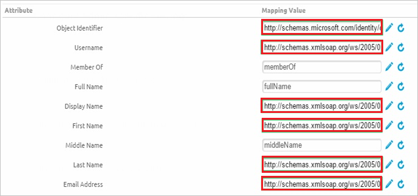

# Configure AirWatch for Single sign-on with Microsoft Entra ID

In this article,  you learn how to integrate AirWatch with Microsoft Entra ID. When you integrate AirWatch with Microsoft Entra ID, you can:

* Control in Microsoft Entra ID who has access to AirWatch.
* Enable your users to be automatically signed-in to AirWatch with their Microsoft Entra accounts.
* Manage your accounts in one central location.

## Prerequisites

The scenario outlined in this article assumes that you already have the following prerequisites:

[!INCLUDE [common-prerequisites.md](~/identity/saas-apps/includes/common-prerequisites.md)]
* AirWatch single sign-on (SSO)-enabled subscription.

> [!NOTE]
> Identifier of this application is a fixed string value so only one instance can be configured in one tenant.

## Scenario description

In this article,  you configure and test Microsoft Entra SSO in a test environment. 

* AirWatch supports **SP** initiated SSO.

## Add AirWatch from the gallery

To configure the integration of AirWatch into Microsoft Entra ID, you need to add AirWatch from the gallery to your list of managed SaaS apps.

1. Sign in to the [Microsoft Entra admin center](https://entra.microsoft.com) as at least a [Cloud Application Administrator](~/identity/role-based-access-control/permissions-reference.md#cloud-application-administrator).
1. Browse to **Entra ID** > **Enterprise apps** > **New application**.
1. In the **Add from the gallery** section, type **AirWatch** in the search box.
1. Select **AirWatch** from results panel and then add the app. Wait a few seconds while the app is added to your tenant.

 [!INCLUDE [sso-wizard.md](~/identity/saas-apps/includes/sso-wizard.md)]

## Configure and test Microsoft Entra SSO for AirWatch

Configure and test Microsoft Entra SSO with AirWatch using a test user called **B.Simon**. For SSO to work, you need to establish a link relationship between a Microsoft Entra user and the related user in AirWatch.

To configure and test Microsoft Entra SSO with AirWatch, perform the following steps:

1. **[Configure Microsoft Entra SSO](#configure-azure-ad-sso)** - to enable your users to use this feature.
    1. **Create a Microsoft Entra test user** - to test Microsoft Entra single sign-on with B.Simon.
    1. **Assign the Microsoft Entra test user** - to enable B.Simon to use Microsoft Entra single sign-on.
1. **[Configure AirWatch SSO](#configure-airwatch-sso)** - to configure the single sign-on settings on application side.
    1. **[Create AirWatch test user](#create-airwatch-test-user)** - to have a counterpart of B.Simon in AirWatch that's linked to the Microsoft Entra representation of user.
1. **[Test SSO](#test-sso)** - to verify whether the configuration works.

## Configure Microsoft Entra SSO

Follow these steps to enable Microsoft Entra SSO.

1. Sign in to the [Microsoft Entra admin center](https://entra.microsoft.com) as at least a [Cloud Application Administrator](~/identity/role-based-access-control/permissions-reference.md#cloud-application-administrator).
1. Browse to **Entra ID** > **Enterprise apps** > **AirWatch** application integration page, find the **Manage** section and select **Single sign-on**.
1. On the **Select a Single sign-on method** page, select **SAML**.
1. On the **Set up Single Sign-On with SAML** page, select the pencil icon for **Basic SAML Configuration** to edit the settings.

   

1. On the **Basic SAML Configuration** page, enter the values for the following fields:

   a. In the **Identifier (Entity ID)** text box, type the value as:
    `AirWatch`

   b. In the **Reply URL** text box, type a URL using one of the following patterns:

   | Reply URL|
   |-----------|
   | `https://<SUBDOMAIN>.awmdm.com/<COMPANY_CODE>` |
   | `https://<SUBDOMAIN>.airwatchportals.com/<COMPANY_CODE>` |
   |

   c. In the **Sign on URL** text box, type a URL using the following pattern:
    `https://<subdomain>.awmdm.com/AirWatch/Login?gid=companycode`

	> [!NOTE]
	> These values aren't the real. Update these values with the actual Reply URL and Sign-on URL. Contact [AirWatch Client support team](https://customerconnect.omnissa.com/home) to get these values. You can also refer to the patterns shown in the **Basic SAML Configuration** section.

1. AirWatch application expects the SAML assertions in a specific format. Configure the following claims for this application. You can manage the values of these attributes from the **User Attributes** section on application integration page. On the **Set up Single Sign-On with SAML** page, select **Edit** button to open **User Attributes** dialog.

	

1. In the **User Claims** section on the **User Attributes** dialog, edit the claims by using **Edit icon** or add the claims by using **Add new claim** to configure SAML token attribute as shown in the image above and perform the following steps:

	| Name |  Source Attribute|
	|---------------|----------------|
	| UID | user.userprincipalname |
    | | |

	a. Select **Add new claim** to open the **Manage user claims** dialog.

	b. In the **Name** textbox, type the attribute name shown for that row.

	c. Leave the **Namespace** blank.

	d. Select Source as **Attribute**.

	e. From the **Source attribute** list, type the attribute value shown for that row.

	f. Select **Ok**

	g. Select **Save**.

1. On the **Set up Single Sign-On with SAML** page, in the **SAML Signing Certificate** section, find **Federation Metadata XML** and select **Download** to download the Metadata XML and save it on your computer.

   

1. On the **Set up AirWatch** section, copy the appropriate URL(s) based on your requirement.

   

[!INCLUDE [create-assign-users-sso.md](~/identity/saas-apps/includes/create-assign-users-sso.md)]

## Configure AirWatch SSO

1. In a different web browser window, sign in to your AirWatch company site as an administrator.

1. In the left navigation pane, select **Groups & Settings**, and then select **All Settings**.
1. Next, go to **System > Enterprise Integration > Directory Services**.
1. Select the **User** tab, in the **Base DN** field, type your `domain name`, and then select **Save**.
1. Select the **Group** tab, in the **Base DN** field, type your `domain name`, and then select **Save**.
1. Select the **Server** tab and perform the following steps:
   1. As **Directory Type**, select **None**.
   1. Enable the **Use SAML For Authentication** option.
   1. Select the **Import Identity Provider Settings** and select **Upload** to upload the XML file that you downloaded in Step4 above.
1. In the **Request** section, perform the following steps:
   1. As **Request Binding Type**, select **POST**.
   1. Browse to **Entra ID** > **Enterprise apps** > **AirWatch**. 
   1. Under the **AirWatch Configuration** section, select **Configure AirWatch** to open **Configure sign-on** window
   1. Copy the **SAML Single Sign-On Service URL** from the **Quick Reference** section, and then paste it into the **Identity Provider Single Sign-On URL** textbox.
   1. As **NameID Format**, select **Email Address**.
   1. Select **Save**.
1. In the **Response** section, under **Response Binding Type**, select **Post**.
1. Select the **User** tab again.
1. Select **Show Advanced** to display the advanced user settings. 
1. In the **Attribute** section, perform the following steps:

   

   1. In the **Object Identifier** textbox, type `http://schemas.microsoft.com/identity/claims/objectidentifier`.
   1. In the **Username** textbox, type `http://schemas.xmlsoap.org/ws/2005/05/identity/claims/emailaddress`.
   1. In the **Display Name** textbox, type `http://schemas.xmlsoap.org/ws/2005/05/identity/claims/givenname`.
   1. In the **First Name** textbox, type `http://schemas.xmlsoap.org/ws/2005/05/identity/claims/givenname`.
   1. In the **Last Name** textbox, type `http://schemas.xmlsoap.org/ws/2005/05/identity/claims/surname`.
   1. In the **Email** textbox, type `http://schemas.xmlsoap.org/ws/2005/05/identity/claims/emailaddress`.
   1. Select **Save**.

### Create AirWatch test user

To enable Microsoft Entra users to sign in to AirWatch, they must be provisioned in to AirWatch. In the case of AirWatch, provisioning is a manual task.

**To configure user provisioning, perform the following steps:**

1. Sign in to your **AirWatch** company site as administrator.

2. In the navigation pane on the left side, select **Accounts**, and then select **Users**.

3. In the **Users** menu, select **List View**, and then select **Add > Add User**.

4. On the **Add / Edit User** dialog, perform the following steps:

   a. Type the **Username**, **Password**, **Confirm Password**, **First Name**, **Last Name**, **Email Address** of a valid Microsoft Entra account you want to provision into the related textboxes.

   b. Select **Save**.

> [!NOTE]
> You can use any other AirWatch user account creation tools or APIs provided by AirWatch to provision Microsoft Entra user accounts.

## Test SSO

In this section, you test your Microsoft Entra single sign-on configuration with following options. 

* Select **Test this application**, this option redirects to AirWatch Sign-on URL where you can initiate the login flow. 

* Go to AirWatch Sign-on URL directly and initiate the login flow from there.

* You can use Microsoft My Apps. When you select the AirWatch tile in the My Apps, this option redirects to AirWatch Sign-on URL. For more information about the My Apps, see [Introduction to the My Apps](https://support.microsoft.com/account-billing/sign-in-and-start-apps-from-the-my-apps-portal-2f3b1bae-0e5a-4a86-a33e-876fbd2a4510).

## Related content

Once you configure AirWatch you can enforce session control, which protects exfiltration and infiltration of your organization’s sensitive data in real time. Session control extends from Conditional Access. [Learn how to enforce session control with Microsoft Defender for Cloud Apps](/cloud-app-security/proxy-deployment-any-app).
