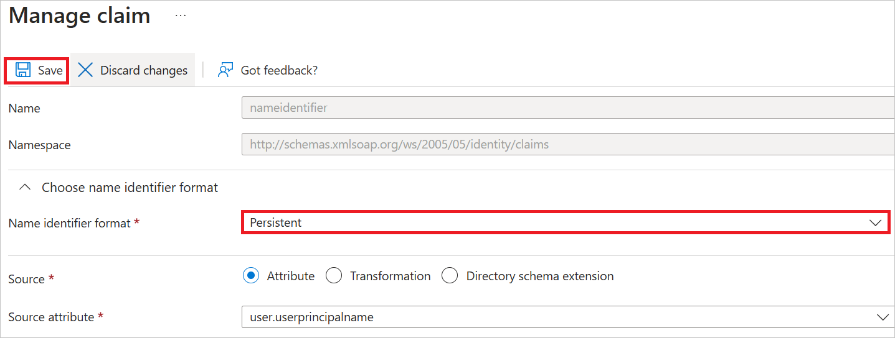
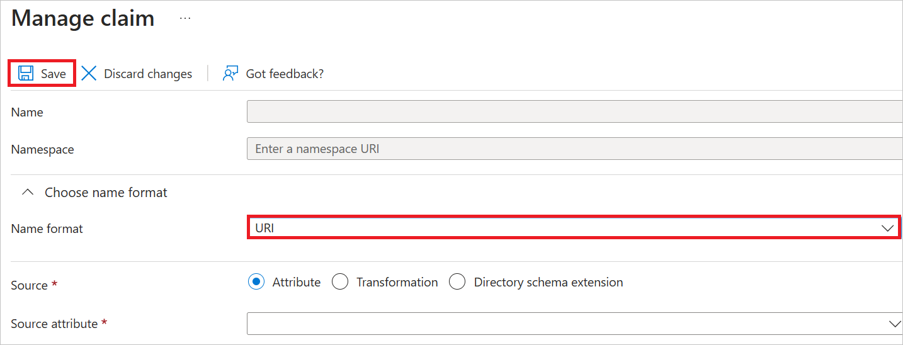

# Configure Alation Data Catalog for Single sign-on with Microsoft Entra ID

In this article,  you learn how to integrate Alation Data Catalog with Microsoft Entra ID. When you integrate Alation Data Catalog with Microsoft Entra ID, you can:

* Control in Microsoft Entra ID who has access to Alation Data Catalog.
* Enable your users to be automatically signed-in to Alation Data Catalog with their Microsoft Entra accounts.
* Manage your accounts in one central location.

## Prerequisites

The scenario outlined in this article assumes that you already have the following prerequisites:

[!INCLUDE [common-prerequisites.md](~/identity/saas-apps/includes/common-prerequisites.md)]
* Alation Data Catalog single sign-on (SSO) enabled subscription.

## Scenario description

In this article,  you configure and test Microsoft Entra SSO in a test environment.

* Alation Data Catalog supports both **SP and IDP** initiated SSO.
* Alation Data Catalog supports **Just In Time** user provisioning.

> [!NOTE]
> Identifier of this application is a fixed string value so only one instance can be configured in one tenant.

## Add Alation Data Catalog from the gallery

To configure the integration of Alation Data Catalog into Microsoft Entra ID, you need to add Alation Data Catalog from the gallery to your list of managed SaaS apps.

1. Sign in to the [Microsoft Entra admin center](https://entra.microsoft.com) as at least a [Cloud Application Administrator](~/identity/role-based-access-control/permissions-reference.md#cloud-application-administrator).
1. Browse to **Entra ID** > **Enterprise apps** > **New application**.
1. In the **Add from the gallery** section, type **Alation Data Catalog** in the search box.
1. Select **Alation Data Catalog** from results panel and then add the app. Wait a few seconds while the app is added to your tenant.

[!INCLUDE [sso-wizard.md](~/identity/saas-apps/includes/sso-wizard.md)]

## Configure and test Microsoft Entra SSO for Alation Data Catalog

Configure and test Microsoft Entra SSO with Alation Data Catalog using a test user called **B.Simon**. For SSO to work, you need to establish a link relationship between a Microsoft Entra user and the related user in Alation Data Catalog.

To configure and test Microsoft Entra SSO with Alation Data Catalog, perform the following steps:

1. **[Configure Microsoft Entra SSO](#configure-microsoft-entra-sso)** - to enable your users to use this feature.
    1. **Create a Microsoft Entra test user** - to test Microsoft Entra single sign-on with B.Simon.
    1. **Create a Microsoft Entra test user** - to enable B.Simon to use Microsoft Entra single sign-on.
1. **[Configure Alation Data Catalog SSO](#configure-alation-data-catalog-sso)** - to configure the single sign-on settings on application side.
    1. **[Create Alation Data Catalog test user](#create-alation-data-catalog-test-user)** - to have a counterpart of B.Simon in Alation Data Catalog that's linked to the Microsoft Entra ID representation of user.
1. **[Test SSO](#test-sso)** - to verify whether the configuration works.

## Configure Microsoft Entra SSO

Follow these steps to enable Microsoft Entra SSO in the Microsoft Entra admin center.

1. Sign in to the [Microsoft Entra admin center](https://entra.microsoft.com) as at least a [Cloud Application Administrator](~/identity/role-based-access-control/permissions-reference.md#cloud-application-administrator).
1. Browse to **Entra ID** > **Enterprise apps** > **Alation Data Catalog** > **Single sign-on**.
1. On the **Select a single sign-on method** page, select **SAML**.
1. On the **Set up single sign-on with SAML** page, select the pencil icon for **Basic SAML Configuration** to edit the settings.

   

1. On the **Basic SAML Configuration** section, perform the following steps:

    a. In the **Identifier** text box, type the URL:
    `http://alation.com/`

    b. In the **Reply URL** text box, type a URL using the following pattern:
    `https://<Customer_Name>.<Domain>.<Extension>/saml2/acs/`

1. Perform the following step, if you wish to configure the application in **SP** initiated mode:

    In the **Sign-on URL** text box, type a URL using the following pattern:
    `https://<Customer_Name>.<Domain>.<Extension>/`

	> [!NOTE]
	> These values aren't real. Update these values with the actual Reply URL and Sign on URL. Contact [Alation Data Catalog support team](mailto:support-all@alation.com ) to get these values. You can also refer to the patterns shown in the **Basic SAML Configuration** section in the Microsoft Entra admin center.

1. Alation Data Catalog application expects the SAML assertions in a specific format, which requires you to add custom attribute mappings to your SAML token attributes configuration. The following screenshot shows the list of default attributes.

	

    > [!NOTE]
    > For **Unique User Identifier (Name ID)** claim, choose **Name identifier format** as **Persistent** from the drop-down under **Manage claim** section and select **Save**.
    
 
1. In addition to above, Alation Data Catalog application expects few more attributes to be passed back in SAML response which are shown below. These attributes are also pre populated but you can review them as per your requirements.
	
	| Name | Source Attribute |
	| ---- | ---------------- |
	| urn:oid:2.5.4.42 | user.givenname |
	| urn:oid:2.5.4.4 | user.surname |
	| urn:oid:0.9.2342.19200300.100.1.3 | user.mail |
	| urn:oid:0.9.2342.19200300.100.1.1 | user.userprincipalname |
    | urn:oid:2.5.4.12 | user.jobtitle |

    > [!NOTE]
    > For all the above Required Claims, choose **Name identifier format** as **URI** from the drop-down under **Manage claim** section and select **Save**.
    

1. On the **Set up single sign-on with SAML** page, in the **SAML Signing Certificate** section, find **Federation Metadata XML** and select **Download** to download the certificate and save it on your computer.

	

1. On the **Set up Alation Data Catalog** section, copy the appropriate URL(s) based on your requirement.

	

[!INCLUDE [create-assign-users-sso.md](~/identity/saas-apps/includes/create-assign-users-sso.md)]

## Configure Alation Data Catalog SSO

To configure single sign-on on **Alation Data Catalog** side, you need to send the downloaded **Federation Metadata XML** and appropriate copied URLs from Microsoft Entra admin center to [Alation Data Catalog support team](mailto:support-all@alation.com ). They set this setting to have the SAML SSO connection set properly on both sides.

### Create Alation Data Catalog test user

In this section, a user called Britta Simon is created in Alation Data Catalog. Alation Data Catalog supports just-in-time user provisioning, which is enabled by default. There's no action item for you in this section. If a user doesn't already exist in Alation Data Catalog, a new one is created after authentication.

## Test SSO 

In this section, you test your Microsoft Entra single sign-on configuration with following options.
 
#### SP initiated:
 
* Select **Test this application** in Microsoft Entra admin center. This option redirects to Alation Data Catalog Sign on URL where you can initiate the login flow.  
 
* Go to Alation Data Catalog Sign-on URL directly and initiate the login flow from there.
 
#### IDP initiated:
 
* Select **Test this application** in Microsoft Entra admin center and you should be automatically signed in to the Alation Data Catalog for which you set up the SSO.
 
You can also use Microsoft My Apps to test the application in any mode. When you select the Alation Data Catalog tile in the My Apps, if configured in SP mode you would be redirected to the application sign-on page for initiating the login flow and if configured in IDP mode, you should be automatically signed in to the Alation Data Catalog for which you set up the SSO. For more information about the My Apps, see [Introduction to the My Apps](https://support.microsoft.com/account-billing/sign-in-and-start-apps-from-the-my-apps-portal-2f3b1bae-0e5a-4a86-a33e-876fbd2a4510).

## Related content

Once you configure Alation Data Catalog you can enforce session control, which protects exfiltration and infiltration of your organization's sensitive data in real time. Session control extends from Conditional Access. [Learn how to enforce session control with Microsoft Defender for Cloud Apps](/cloud-app-security/proxy-deployment-any-app).