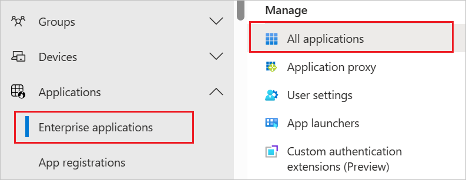

# Configure AlertMedia for automatic user provisioning with Microsoft Entra ID

This article describes the steps you need to perform in both AlertMedia and Microsoft Entra ID to configure automatic user provisioning. When configured, Microsoft Entra ID automatically provisions and de-provisions users and groups to [AlertMedia](https://www.alertmedia.com/) using the Microsoft Entra provisioning service. For important details on what this service does, how it works, and frequently asked questions, see [Automate user provisioning and deprovisioning to SaaS applications with Microsoft Entra ID](~/identity/app-provisioning/user-provisioning.md). 

## Capabilities supported
> [!div class="checklist"]
> * Create users in AlertMedia
> * Remove users in AlertMedia when they don't require access anymore
> * Keep user attributes synchronized between Microsoft Entra ID and AlertMedia
> * Provision groups and group memberships in AlertMedia
> * [Single sign-on](./alertmedia-tutorial.md) to AlertMedia (recommended)

## Prerequisites

The scenario outlined in this article assumes that you already have the following prerequisites:

* An [Microsoft Entra tenant](~/identity-platform/quickstart-create-new-tenant.md).
* One of the following roles: [Application Administrator](/entra/identity/role-based-access-control/permissions-reference#application-administrator), [Cloud Application Administrator](/entra/identity/role-based-access-control/permissions-reference#cloud-application-administrator), or [Application Owner](/entra/fundamentals/users-default-permissions#owned-enterprise-applications). 
* An [AlertMedia tenant](https://dashboard.alertmedia.com/#/login).
* A user account in AlertMedia with Admin permissions to configure an API Integration.

## Step 1: Plan your provisioning deployment
1. Learn about [how the provisioning service works](~/identity/app-provisioning/user-provisioning.md).
2. Determine who is in [scope for provisioning](~/identity/app-provisioning/define-conditional-rules-for-provisioning-user-accounts.md).
3. Determine what data to [map between Microsoft Entra ID and AlertMedia](~/identity/app-provisioning/customize-application-attributes.md). 

## Step 2: Configure AlertMedia to support provisioning with Microsoft Entra ID

1. Log into your AlertMedia account. Navigate to **Company > API**.
2. Select **Add New**.
3. Choose to give your **API Integration** a name to help you easily recognize where the keys are being used.
4. Select the admin with which you’d like to associate the integration.
5. Select the **Generate Keys** and **Save** button.
6. Copy and save the **Client Token** from your integration. This is used as the **Secret Token** in the Provisioning tab of your AlertMedia application.

## Step 3: Add AlertMedia from the Microsoft Entra application gallery

Add AlertMedia from the Microsoft Entra application gallery to start managing provisioning to AlertMedia. If you have previously setup AlertMedia for SSO, you can use the same application. However it's recommended that you create a separate app when testing out the integration initially. Learn more about adding an application from the gallery [here](~/identity/enterprise-apps/add-application-portal.md). 

## Step 4: Define who is in scope for provisioning 

[!INCLUDE [create-assign-users-provisioning.md](~/identity/saas-apps/includes/create-assign-users-provisioning.md)]

## Step 5: Configure automatic user provisioning to AlertMedia 

This section guides you through the steps to configure the Microsoft Entra provisioning service to create, update, and disable users and/or groups in TestApp based on user and/or group assignments in Microsoft Entra ID.

### To configure automatic user provisioning for AlertMedia in Microsoft Entra ID:

1. Sign in to the [Microsoft Entra admin center](https://entra.microsoft.com) as at least a [Cloud Application Administrator](~/identity/role-based-access-control/permissions-reference.md#cloud-application-administrator).
1. Browse to **Entra ID** > **Enterprise apps**

	

1. In the applications list, select **AlertMedia**.

	

3. Select the **Provisioning** tab.

	

4. Set the **Provisioning Mode** to **Automatic**.

	

5. Under the **Admin Credentials** section, input your AlertMedia **Tenant URL** as one of the following.
      * (no custom domain) `https://dashboard.alertmedia.com/api/scim/v3`

      * (custom domain) `https://subdomain.alertmedia.com/api/scim/v3`

      Input the **Secret Token** as retrieved earlier in Step 2. Select **Test Connection** to ensure Microsoft Entra ID can connect to AlertMedia. If the connection fails, ensure your AlertMedia account has Admin permissions and try again.

      

6. In the **Notification Email** field, enter the email address of a person or group who should receive the provisioning error notifications and select the **Send an email notification when a failure occurs** check box.

	

7. Select **Save**.

8. Under the **Mappings** section, select **Synchronize Microsoft Entra users to AlertMedia**.

9. Review the user attributes that are synchronized from Microsoft Entra ID to AlertMedia in the **Attribute-Mapping** section. The attributes selected as **Matching** properties are used to match the user accounts in AlertMedia for update operations. If you choose to change the [matching target attribute](~/identity/app-provisioning/customize-application-attributes.md), you need to ensure that the AlertMedia API supports filtering users based on that attribute. Select the **Save** button to commit any changes.

   |Attribute|Type|
   |---|---|
   |userName|String|
   |active|Boolean|
   |urn:ietf:params:scim:schemas:extension:alertmedia:2.0:CustomAttribute:User:first_name|String|
   |urn:ietf:params:scim:schemas:extension:alertmedia:2.0:CustomAttribute:User:last_name|String|
   |urn:ietf:params:scim:schemas:extension:alertmedia:2.0:CustomAttribute:User:email|String|
   |urn:ietf:params:scim:schemas:extension:alertmedia:2.0:CustomAttribute:User:email2|String|
   |urn:ietf:params:scim:schemas:extension:alertmedia:2.0:CustomAttribute:User:email3|String|
   |urn:ietf:params:scim:schemas:extension:alertmedia:2.0:CustomAttribute:User:title|String|
   |urn:ietf:params:scim:schemas:extension:alertmedia:2.0:CustomAttribute:User:mobile_phone|String|
   |urn:ietf:params:scim:schemas:extension:alertmedia:2.0:CustomAttribute:User:mobile_phone_post_dial|String|
   |urn:ietf:params:scim:schemas:extension:alertmedia:2.0:CustomAttribute:User:mobile_phone2|String|
   |urn:ietf:params:scim:schemas:extension:alertmedia:2.0:CustomAttribute:User:mobile_phone2_post_dial|String|
   |urn:ietf:params:scim:schemas:extension:alertmedia:2.0:CustomAttribute:User:mobile_phone3|String|
   |urn:ietf:params:scim:schemas:extension:alertmedia:2.0:CustomAttribute:User:mobile_phone3_post_dial|String|
   |urn:ietf:params:scim:schemas:extension:alertmedia:2.0:CustomAttribute:User:home_phone|String|
   |urn:ietf:params:scim:schemas:extension:alertmedia:2.0:CustomAttribute:User:home_phone_post_dial|String|
   |urn:ietf:params:scim:schemas:extension:alertmedia:2.0:CustomAttribute:User:office_phone|String|
   |urn:ietf:params:scim:schemas:extension:alertmedia:2.0:CustomAttribute:User:office_phone_post_dial|String|
   |urn:ietf:params:scim:schemas:extension:alertmedia:2.0:CustomAttribute:User:address|String|
   |urn:ietf:params:scim:schemas:extension:alertmedia:2.0:CustomAttribute:User:address2|String|
   |urn:ietf:params:scim:schemas:extension:alertmedia:2.0:CustomAttribute:User:city|String|
   |urn:ietf:params:scim:schemas:extension:alertmedia:2.0:CustomAttribute:User:state|String|
   |urn:ietf:params:scim:schemas:extension:alertmedia:2.0:CustomAttribute:User:country|String|
   |urn:ietf:params:scim:schemas:extension:alertmedia:2.0:CustomAttribute:User:zipcode|String|
   |urn:ietf:params:scim:schemas:extension:alertmedia:2.0:CustomAttribute:User:notes|String|
   |urn:ietf:params:scim:schemas:extension:alertmedia:2.0:CustomAttribute:User:customer_user_id|String|
   |urn:ietf:params:scim:schemas:extension:alertmedia:2.0:CustomAttribute:User:user_type|String|

10. Under the **Mappings** section, select **Synchronize Microsoft Entra groups to AlertMedia**.

11. Review the group attributes that are synchronized from Microsoft Entra ID to AlertMedia in the **Attribute-Mapping** section. The attributes selected as **Matching** properties are used to match the groups in AlertMedia for update operations. Select the **Save** button to commit any changes.

      |Attribute|Type|
      |---|---|
      |displayName|String|
      |members|Reference|

12. To configure scoping filters, refer to the following instructions provided in the [Scoping filter  article](~/identity/app-provisioning/define-conditional-rules-for-provisioning-user-accounts.md).

13. To enable the Microsoft Entra provisioning service for AlertMedia, change the **Provisioning Status** to **On** in the **Settings** section.

	

14. Define the users and/or groups that you would like to provision to AlertMediaAlertMedia by choosing the desired values in **Scope** in the **Settings** section.

	

15. When you're ready to provision, select **Save**.

	

This operation starts the initial synchronization cycle of all users and groups defined in **Scope** in the **Settings** section. The initial cycle takes longer to perform than subsequent cycles, which occur approximately every 40 minutes as long as the Microsoft Entra provisioning service is running. 

## Step 6: Monitor your deployment

[!INCLUDE [monitor-deployment.md](~/identity/saas-apps/includes/monitor-deployment.md)]

## Additional resources

* [Managing user account provisioning for Enterprise Apps](~/identity/app-provisioning/configure-automatic-user-provisioning-portal.md)
* [What is application access and single sign-on with Microsoft Entra ID?](~/identity/enterprise-apps/what-is-single-sign-on.md)

## Related content

* [Learn how to review logs and get reports on provisioning activity](~/identity/app-provisioning/check-status-user-account-provisioning.md)
