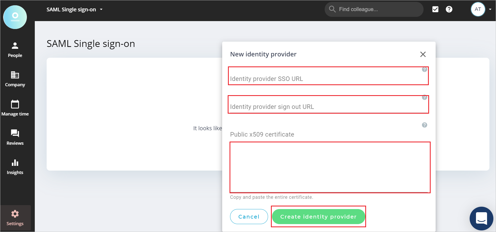
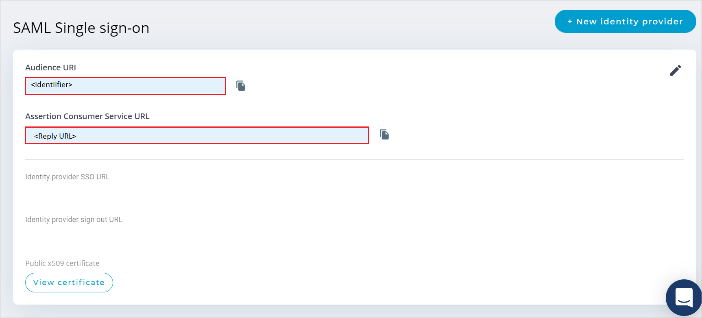

# Configure AlexisHR for Single sign-on with Microsoft Entra ID

In this article,  you learn how to integrate AlexisHR with Microsoft Entra ID. When you integrate AlexisHR with Microsoft Entra ID, you can:

* Control in Microsoft Entra ID who has access to AlexisHR.
* Enable your users to be automatically signed-in to AlexisHR with their Microsoft Entra accounts.
* Manage your accounts in one central location.

## Prerequisites

The scenario outlined in this article assumes that you already have the following prerequisites:

[!INCLUDE [common-prerequisites.md](~/identity/saas-apps/includes/common-prerequisites.md)]
* AlexisHR single sign-on (SSO) enabled subscription.

## Scenario description

In this article,  you configure and test Microsoft Entra SSO in a test environment.

* AlexisHR supports **IDP** initiated SSO.

## Add AlexisHR from the gallery

To configure the integration of AlexisHR into Microsoft Entra ID, you need to add AlexisHR from the gallery to your list of managed SaaS apps.

1. Sign in to the [Microsoft Entra admin center](https://entra.microsoft.com) as at least a [Cloud Application Administrator](~/identity/role-based-access-control/permissions-reference.md#cloud-application-administrator).
1. Browse to **Entra ID** > **Enterprise apps** > **New application**.
1. In the **Add from the gallery** section, type **AlexisHR** in the search box.
1. Select **AlexisHR** from results panel and then add the app. Wait a few seconds while the app is added to your tenant.

 [!INCLUDE [sso-wizard.md](~/identity/saas-apps/includes/sso-wizard.md)]

## Configure and test Microsoft Entra SSO for AlexisHR

Configure and test Microsoft Entra SSO with AlexisHR using a test user called **B.Simon**. For SSO to work, you need to establish a link relationship between a Microsoft Entra user and the related user in AlexisHR.

To configure and test Microsoft Entra SSO with AlexisHR, perform the following steps:

1. **[Configure Microsoft Entra SSO](#configure-azure-ad-sso)** - to enable your users to use this feature.
    1. **Create a Microsoft Entra test user** - to test Microsoft Entra single sign-on with B.Simon.
    1. **Assign the Microsoft Entra test user** - to enable B.Simon to use Microsoft Entra single sign-on.
1. **[Configure AlexisHR SSO](#configure-alexishr-sso)** - to configure the single sign-on settings on application side.
    1. **[Create AlexisHR test user](#create-alexishr-test-user)** - to have a counterpart of B.Simon in AlexisHR that's linked to the Microsoft Entra representation of user.
1. **[Test SSO](#test-sso)** - to verify whether the configuration works.

## Configure Microsoft Entra SSO

Follow these steps to enable Microsoft Entra SSO.

1. Sign in to the [Microsoft Entra admin center](https://entra.microsoft.com) as at least a [Cloud Application Administrator](~/identity/role-based-access-control/permissions-reference.md#cloud-application-administrator).
1. Browse to **Entra ID** > **Enterprise apps** > **AlexisHR** > **Single sign-on**.
1. On the **Select a single sign-on method** page, select **SAML**.
1. On the **Set up single sign-on with SAML** page, select the pencil icon for **Basic SAML Configuration** to edit the settings.

   

1. On the **Basic SAML Configuration** section, perform the following steps:

    a. In the **Identifier** text box, type a value using the following pattern:
    `urn:auth0:alexishr:<YOUR_CONNECTION_NAME>`

    b. In the **Reply URL** text box, type a URL using the following pattern:
    `https://auth.alexishr.com/login/callback?connection=<YOUR_CONNECTION_NAME>`

	> [!NOTE]
	> These values aren't real. Update these values with the actual Identifier and Reply URL. Contact [AlexisHR Client support team](mailto:support@alexishr.com) to get these values. You can also refer to the patterns shown in the **Basic SAML Configuration** section.

1. AlexisHR application expects the SAML assertions in a specific format, which requires you to add custom attribute mappings to your SAML token attributes configuration. The following screenshot shows the list of default attributes.

	

1. In addition to above, AlexisHR application expects few more attributes to be passed back in SAML response which are shown below. These attributes are also pre-populated but you can review them as per your requirements.
	
	| Name | Source Attribute |
	| ------------ | --------- |
	| email | user.mail |

1. On the **Set up single sign-on with SAML** page, in the **SAML Signing Certificate** section,  find **Certificate (Base64)** and select **Download** to download the certificate and save it on your computer.

	

1. On the **Set up AlexisHR** section, copy the appropriate URL(s) based on your requirement.

	

[!INCLUDE [create-assign-users-sso.md](~/identity/saas-apps/includes/create-assign-users-sso.md)]

## Configure AlexisHR SSO

1. Log in to your AlexisHR company site as an administrator.

1. Go to **Settings** > **SAML Single sign-on** and select **New identity provider**.

1. In the **New identity provider** section, perform the following steps:

    

    1. In the **Identity provider SSO URL** textbox, paste the **Login URL** value which you copied previously.

    1. In the **Identity provider sign out URL** textbox,   paste the **Logout URL** value which you copied previously.

    1. Open the downloaded **Certificate (Base64)** into Notepad and paste the content into the **Public x509 certificate** textbox.

    1. Select **Create identity provider**.

1. After creating identity provider, you receive the following information.

    

    1. Copy **Audience URI** value, paste this value into the **Identifier** text box in the **Basic SAML Configuration** section.

    1. Copy **Assertion Consumer Service URL** value, paste this value into the **Reply URL** text box in the **Basic SAML Configuration** section.

### Create AlexisHR test user

In this section, you create a user called Britta Simon in AlexisHR. Work with [AlexisHR support team](mailto:support@alexishr.com) to add the users in the AlexisHR platform. Users must be created and activated before you use single sign-on.

## Test SSO 

In this section, you test your Microsoft Entra single sign-on configuration with following options.

* Select **Test this application**, and you should be automatically signed in to the AlexisHR for which you set up the SSO.

* You can use Microsoft My Apps. When you select the AlexisHR tile in the My Apps, you should be automatically signed in to the AlexisHR for which you set up the SSO. For more information, see [Microsoft Entra My Apps](/azure/active-directory/manage-apps/end-user-experiences#azure-ad-my-apps).

## Related content

Once you configure AlexisHR you can enforce session control, which protects exfiltration and infiltration of your organization’s sensitive data in real time. Session control extends from Conditional Access. [Learn how to enforce session control with Microsoft Defender for Cloud Apps](/cloud-app-security/proxy-deployment-aad).
