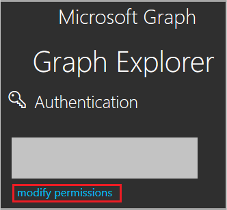
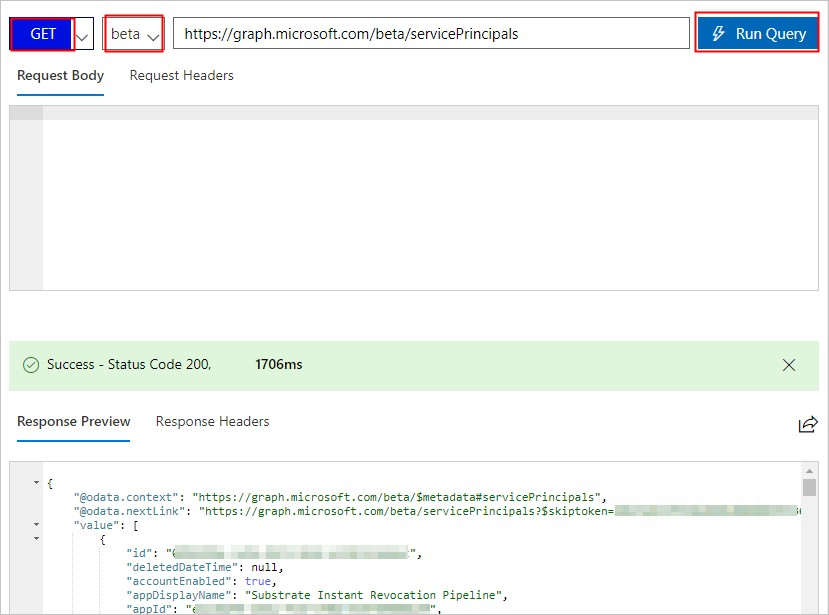
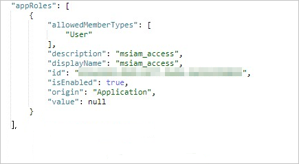
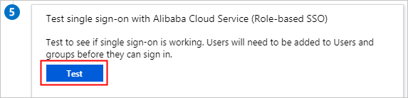
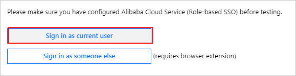
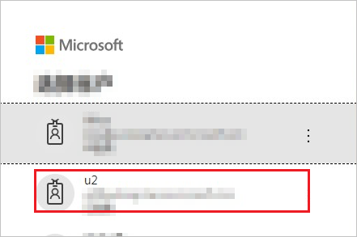
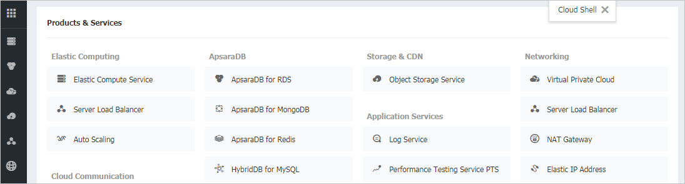

# Configure Alibaba Cloud Service (Role-based SSO) for Single sign-on with Microsoft Entra ID

In this article,  you learn how to integrate Alibaba Cloud Service (Role-based SSO) with Microsoft Entra ID. When you integrate Alibaba Cloud Service (Role-based SSO) with Microsoft Entra ID, you can:

* Control in Microsoft Entra ID who has access to Alibaba Cloud Service (Role-based SSO).
* Enable your users to be automatically signed-in to Alibaba Cloud Service (Role-based SSO) with their Microsoft Entra accounts.
* Manage your accounts in one central location.

## Prerequisites

The scenario outlined in this article assumes that you already have the following prerequisites:

[!INCLUDE [common-prerequisites.md](~/identity/saas-apps/includes/common-prerequisites.md)]
* Alibaba Cloud Service (Role-based SSO) single sign-on (SSO) enabled subscription.

## Scenario description

In this article,  you configure and test Microsoft Entra SSO in a test environment.

* Alibaba Cloud Service (Role-based SSO) supports **IDP** initiated SSO

## Adding Alibaba Cloud Service (Role-based SSO) from the gallery

To configure the integration of Alibaba Cloud Service (Role-based SSO) into Microsoft Entra ID, you need to add Alibaba Cloud Service (Role-based SSO) from the gallery to your list of managed SaaS apps.

1. Sign in to the [Microsoft Entra admin center](https://entra.microsoft.com) as at least a [Cloud Application Administrator](~/identity/role-based-access-control/permissions-reference.md#cloud-application-administrator).
1. Browse to **Entra ID** > **Enterprise apps** > **New application**.
1. In the **Add from the gallery** section, type **Alibaba Cloud Service (Role-based SSO)** in the search box.
1. Select **Alibaba Cloud Service (Role-based SSO)** from results panel and then add the app. Wait a few seconds while the app is added to your tenant.
5. On the **Alibaba Cloud Service (Role-based SSO)** page, select **Properties** in the left-side navigation pane, and copy the **object ID** and save it on your computer for subsequent use.

    

 [!INCLUDE [sso-wizard.md](~/identity/saas-apps/includes/sso-wizard.md)]

<a name='configure-and-test-azure-ad-sso-for-alibaba-cloud-service-role-based-sso'></a>

## Configure and test Microsoft Entra SSO for Alibaba Cloud Service (Role-based SSO)

Configure and test Microsoft Entra SSO with Alibaba Cloud Service (Role-based SSO) using a test user called **B.Simon**. For SSO to work, you need to establish a link relationship between a Microsoft Entra user and the related user in Alibaba Cloud Service (Role-based SSO).

To configure and test Microsoft Entra SSO with Alibaba Cloud Service (Role-based SSO), perform the following steps:

1. **[Configure Microsoft Entra SSO](#configure-azure-ad-sso)** - to enable your users to use this feature.
    1. **Create a Microsoft Entra test user** - to test Microsoft Entra single sign-on with Britta Simon.
    1. **Assign the Microsoft Entra test user** - to enable Britta Simon to use Microsoft Entra single sign-on.
2. **[Configure Role-Based Single Sign-On in Alibaba Cloud Service](#configure-role-based-single-sign-on-in-alibaba-cloud-service)** - to enable your users to use this feature.
    1. **[Configure Alibaba Cloud Service (Role-based SSO) SSO](#configure-alibaba-cloud-service-role-based-sso-sso)** - to configure the Single Sign-On settings on application side.
    1. **[Create Alibaba Cloud Service (Role-based SSO) test user](#create-alibaba-cloud-service-role-based-sso-test-user)** - to have a counterpart of Britta Simon in Alibaba Cloud Service (Role-based SSO) that's linked to the Microsoft Entra representation of user.
3. **[Test SSO](#test-sso)** - to verify whether the configuration works.

<a name='configure-azure-ad-sso'></a>

## Configure Microsoft Entra SSO

Follow these steps to enable Microsoft Entra SSO.

1. Sign in to the [Microsoft Entra admin center](https://entra.microsoft.com) as at least a [Cloud Application Administrator](~/identity/role-based-access-control/permissions-reference.md#cloud-application-administrator).
1. Browse to **Entra ID** > **Enterprise apps** > **Alibaba Cloud Service (Role-based SSO)** > **Single sign-on**.
1. On the **Select a single sign-on method** page, select **SAML**.
1. On the **Set up single sign-on with SAML** page, select the edit/pen icon for **Basic SAML Configuration** to edit the settings.

    

1. On the **Basic SAML Configuration** section, if you have **Service Provider metadata file**, perform the following steps:

    a. Select **Upload metadata file**.

    b. Select **folder logo** to select the metadata file and select **Upload**.


    >[!NOTE]
    >1. For Alibaba Cloud International Site, please download the Service Provider metadata from [this](https://signin.alibabacloud.com/saml-role/sp-metadata.xml) link.
    > 1. For Alibaba Cloud Service(CN) Site, please download the Service Provider metadata from [this](https://signin.aliyun.com/saml-role/sp-metadata.xml) link.

    c. Once the metadata file is successfully uploaded, the **Identifier** and **Reply URL** values get auto populated in Alibaba Cloud Service (Role-based SSO) section textbox:

    > [!Note]
    > If the **Identifier** and **Reply URL** values don't get auto populated, then fill in the values manually according to your requirement.

1. Alibaba Cloud Service (Role-based SSO) require roles to be configured in Microsoft Entra ID. The role claim is pre-configured so you don't have to configure it but you still need to create them in Microsoft Entra ID using this [article](~/identity-platform/howto-add-app-roles-in-apps.md#app-roles-ui).

1. On the **Set up single sign-on with SAML** page, in the **SAML Signing Certificate** section,  find **Federation Metadata XML** and select **Download** to download the certificate and save it on your computer.

    

1. On the **Set up Alibaba Cloud Service (Role-based SSO)** section, copy the appropriate URL(s) based on your requirement.

    

<a name='create-an-azure-ad-test-user'></a>

[!INCLUDE [create-assign-users-sso.md](~/identity/saas-apps/includes/create-assign-users-sso.md)]

## Configure Role-Based Single Sign-On in Alibaba Cloud Service

1. Sign in to the Alibaba Cloud [RAM console](https://account.alibabacloud.com/login/login.htm?oauth_callback=https%3A%2F%2Fram.console.aliyun.com%2F%3Fspm%3Da2c63.p38356.879954.8.7d904e167h6Yg9) by using Account1.

2. In the left-side navigation pane, select **SSO**.

3. On the **Role-based SSO** tab, select **Create IdP**.

4. On the displayed page, enter `AAD` in the IdP Name field, enter a description in the **Note** field, select **Upload** to upload the federation metadata file you downloaded before, and select **OK**.

5. After the IdP is successfully created, select **Create RAM Role**.

6. In the **RAM Role Name** field enter `AADrole`, select `AAD` from the **Select IdP** drop-down list and select OK.

   >[!NOTE]
   >You can grant permission to the role as needed. After creating the IdP and the corresponding role, we recommend that you save the ARNs of the IdP and the role for subsequent use. You can obtain the ARNs on the IdP information page and the role information page.

7. Associate the Alibaba Cloud RAM role (AADrole) with the Microsoft Entra user (u2):

   To associate the RAM role with the Microsoft Entra user, you must create a role in Microsoft Entra ID by following these steps:

   1. Sign in to the [Microsoft Graph Explorer](https://developer.microsoft.com/graph/graph-explorer).

   1. Select **modify permissions** to obtain required permissions for creating a role.

       

   1. Select the following permissions from the list and select **Modify Permissions**, as shown in the following figure.

       

       > [!NOTE]
       > After permissions are granted, sign in to the Graph Explorer again.

   1. On the Graph Explorer page, select **GET** from the first drop-down list and **beta** from the second drop-down list. Then enter `https://graph.microsoft.com/beta/servicePrincipals` in the field next to the drop-down lists, and select **Run Query**.

       

       > [!NOTE]
       > If you're using multiple directories, you can enter `https://graph.microsoft.com/beta/contoso.com/servicePrincipals` in the field of the query.

   1. In the **Response Preview** section, extract the appRoles property from the 'Service Principal' for subsequent use.

       

       > [!NOTE]
       > You can locate the appRoles property by entering `https://graph.microsoft.com/beta/servicePrincipals/<objectID>` in the field of the query. Note that the `objectID` is the object ID you have copied from the Microsoft Entra ID **Properties** page.

   1. Go back to the Graph Explorer, change the method from **GET** to **PATCH**, paste the following content into the **Request Body** section, and select **Run Query**:

       ```json
         {
           "appRoles": [
             {
               "allowedMemberTypes": [
                 "User"
               ],
               "description": "msiam_access",
               "displayName": "msiam_access",
               "id": "41be2db8-48d9-4277-8e86-f6d22d35****",
               "isEnabled": true,
               "origin": "Application",
               "value": null
             },
             {
               "allowedMemberTypes": [
                 "User"
               ],
               "description": "Admin,AzureADProd",
               "displayName": "Admin,AzureADProd",
               "id": "68adae10-8b6b-47e6-9142-6476078cdbce",
               "isEnabled": true,
               "origin": "ServicePrincipal",
               "value": "acs:ram::187125022722****:role/aadrole,acs:ram::187125022722****:saml-provider/AAD"
             }
           ]
         }
       ```

       > [!NOTE]
       > The `value` is the ARNs of the IdP and the role you created in the RAM console. Here, you can add multiple roles as needed. Microsoft Entra ID sends the value of these roles as the claim value in SAML response. However, you can only add new roles after the `msiam_access` part for the patch operation. To smooth the creation process, we recommend that you use an ID generator, such as GUID Generator, to generate IDs in real time.

   1. After the 'Service Principal' is patched with the required role, attach the role with the Microsoft Entra user (u2) by following the steps of **Assign the Microsoft Entra test user** section of the article.

### Configure Alibaba Cloud Service (Role-based SSO) SSO

To configure single sign-on on **Alibaba Cloud Service (Role-based SSO)** side, you need to send the downloaded **Federation Metadata XML** and appropriate copied URLs from the application configuration to [Alibaba Cloud Service (Role-based SSO) support team](https://www.aliyun.com/service/). They set this setting to have the SAML SSO connection set properly on both sides.

### Create Alibaba Cloud Service (Role-based SSO) test user

In this section, you create a user called Britta Simon in Alibaba Cloud Service (Role-based SSO). Work with [Alibaba Cloud Service (Role-based SSO) support team](https://www.aliyun.com/service/) to add the users in the Alibaba Cloud Service (Role-based SSO) platform. Users must be created and activated before you use single sign-on.

## Test SSO 

After the preceding configurations are completed, test Alibaba Cloud Service (Role-based SSO) by following these steps:

1. Sign in to the [Microsoft Entra admin center](https://entra.microsoft.com) as at least a [Cloud Application Administrator](~/identity/role-based-access-control/permissions-reference.md#cloud-application-administrator).
1. Browse to **Entra ID** > **Enterprise apps** > **Alibaba Cloud Service (Role-based SSO)**.
1. Select **Single sign-on**, and select **Test**.

    

1. Select **Sign in as current user**.

    

1. On the account selection page, select u2.

    

1. The following page is displayed, indicating that role-based SSO is successful.

    

## Related content

Once you configure Alibaba Cloud Service (Role-based SSO) you can enforce session control, which protects exfiltration and infiltration of your organization’s sensitive data in real time. Session control extends from Conditional Access. [Learn how to enforce session control with Microsoft Defender for Cloud Apps](/cloud-app-security/proxy-deployment-any-app).
