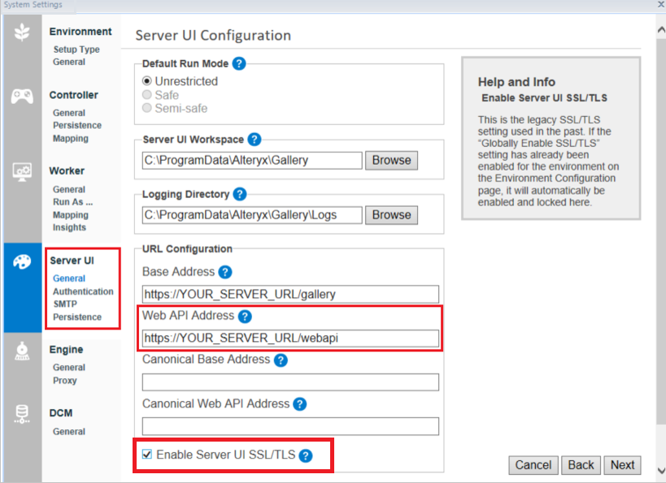
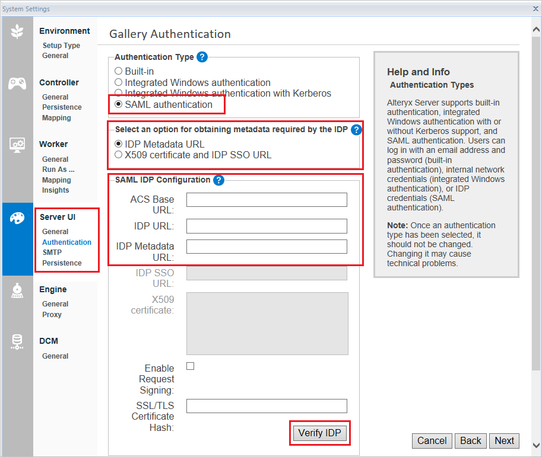

# Configure Alteryx Server for Single sign-on with Microsoft Entra ID

In this article,  you learn how to integrate Alteryx Server with Microsoft Entra ID. When you integrate Alteryx Server with Microsoft Entra ID, you can:

* Control in Microsoft Entra ID who has access to Alteryx Server.
* Enable your users to be automatically signed-in to Alteryx Server with their Microsoft Entra accounts.
* Manage your accounts in one central location.

## Prerequisites

The scenario outlined in this article assumes that you already have the following prerequisites:

[!INCLUDE [common-prerequisites.md](~/identity/saas-apps/includes/common-prerequisites.md)]
* Alteryx Server single sign-on (SSO) enabled subscription.

## Scenario description

In this article,  you configure and test Microsoft Entra SSO in a test environment.

* Alteryx Server supports both **SP and IDP** initiated SSO.

## Add Alteryx Server from the gallery

To configure the integration of Alteryx Server into Microsoft Entra ID, you need to add Alteryx Server from the gallery to your list of managed SaaS apps.

1. Sign in to the [Microsoft Entra admin center](https://entra.microsoft.com) as at least a [Cloud Application Administrator](~/identity/role-based-access-control/permissions-reference.md#cloud-application-administrator).
1. Browse to **Entra ID** > **Enterprise apps** > **New application**.
1. In the **Add from the gallery** section, type **Alteryx Server** in the search box.
1. Select **Alteryx Server** from results panel and then add the app. Wait a few seconds while the app is added to your tenant.

[!INCLUDE [sso-wizard.md](~/identity/saas-apps/includes/sso-wizard.md)]

## Configure and test Microsoft Entra SSO for Alteryx Server

Configure and test Microsoft Entra SSO with Alteryx Server using a test user called **B.Simon**. For SSO to work, you need to establish a link relationship between a Microsoft Entra user and the related user in Alteryx Server.

To configure and test Microsoft Entra SSO with Alteryx Server, perform the following steps:

1. **[Configure Microsoft Entra SSO](#configure-microsoft-entra-sso)** - to enable your users to use this feature.
    1. **Create a Microsoft Entra test user** - to test Microsoft Entra single sign-on with B.Simon.
    1. **Create a Microsoft Entra test user** - to enable B.Simon to use Microsoft Entra single sign-on.
1. **[Configure Alteryx Server SSO](#configure-alteryx-server-sso)** - to configure the single sign-on settings on application side.
    1. **[Create Alteryx Server test user](#create-alteryx-server-test-user)** - to have a counterpart of B.Simon in Alteryx Server that's linked to the Microsoft Entra ID representation of user.
1. **[Test SSO](#test-sso)** - to verify whether the configuration works.

## Configure Microsoft Entra SSO

Follow these steps to enable Microsoft Entra SSO in the Microsoft Entra admin center.

1. Sign in to the [Microsoft Entra admin center](https://entra.microsoft.com) as at least a [Cloud Application Administrator](~/identity/role-based-access-control/permissions-reference.md#cloud-application-administrator).
1. Browse to **Entra ID** > **Enterprise apps** > **Alteryx Server** > **Single sign-on**.
1. On the **Select a single sign-on method** page, select **SAML**.
1. On the **Set up single sign-on with SAML** page, select the pencil icon for **Basic SAML Configuration** to edit the settings.

   

1. On the **Basic SAML Configuration** section, perform the following steps:

    a. In the **Identifier** text box, type a URL using the following pattern:
    `https://<CustomerName>.<DOMAIN>.<EXTENSION>/webapi/Saml2`

    b. In the **Reply URL** text box, type a URL using the following pattern:
    `https://<CustomerName>.<DOMAIN>.<EXTENSION>/webapi/Saml2/acs`

1. Perform the following step, if you wish to configure the application in **SP** initiated mode:

    In the **Sign-on URL** text box, type a URL using the following pattern:
    `https://<CustomerName>.<DOMAIN>.<EXTENSION>/webapi/saml2/signin`

	> [!NOTE]
	> These values aren't real. Update these values with the actual Identifier, Reply URL and Sign on URL. Contact [Alteryx Server support team](mailto:support@alteryx.com) to get these values. You can also refer to the patterns shown in the **Basic SAML Configuration** section in the Microsoft Entra admin center.

1. On the **Set up single sign-on with SAML** page, in the **SAML Signing Certificate** section, select copy button to copy **App Federation Metadata Url** and save it on your computer.

	

[!INCLUDE [create-assign-users-sso.md](~/identity/saas-apps/includes/create-assign-users-sso.md)]

## Configure Alteryx Server SSO

1. Log in to Alteryx Server company site as an administrator.

1. Go to **System Settings** > **Server UI** > **General** and select **Enable Server UI SSL/TLS** to make sure SSL is enabled. You must have a certificate installed on the Server. For more information, please refer [Configuring Alteryx Server for SSL: Obtaining and Installing Certificates.](https://knowledge.alteryx.com/index/s/article/Configuring-Alteryx-Server-for-SSL-Obtaining-and-Installing-Certificates-1583459841225)

    

1. Navigate to **System Settings** > **Server UI** > **Authentication** and perform the following steps.

    

    1. Select **SAML Authentication** as the **Authentication Type**.

    1. Select either **IDP Metadata URL** or **X509 certificate and IDP SSO URL** according to your requirement.

    1. The **ACS Base URL** field autopopulates and gets configured with HTTPS.

    1. In the **IDP URL** field, paste the **Microsoft Entra Identifier**, which you have copied from the Microsoft Entra admin center.

    1. In the **IDP Metadata URL** field, paste the **App Federation Metadata Url**, which you have copied from the Microsoft Entra admin center.

    1. Select **Verify IDP**.

### Create Alteryx Server test user

In this section, you create a user called B.Simon in Alteryx Server. Work with [Alteryx Server support team](mailto:support@alteryx.com) to add the users in the Alteryx Server platform. Users must be created and activated before you use single sign-on.

## Test SSO 

In this section, you test your Microsoft Entra single sign-on configuration with following options.
 
#### SP initiated:
 
* Select **Test this application** in Microsoft Entra admin center. This option redirects to Alteryx Server Sign on URL where you can initiate the login flow.  
 
* Go to Alteryx Server Sign-on URL directly and initiate the login flow from there.
 
#### IDP initiated:
 
* Select **Test this application** in Microsoft Entra admin center and you should be automatically signed in to the Alteryx Server for which you set up the SSO.
 
You can also use Microsoft My Apps to test the application in any mode. When you select the Alteryx Server tile in the My Apps, if configured in SP mode you would be redirected to the application sign-on page for initiating the login flow and if configured in IDP mode, you should be automatically signed in to the Alteryx Server for which you set up the SSO. For more information about the My Apps, see [Introduction to the My Apps](https://support.microsoft.com/account-billing/sign-in-and-start-apps-from-the-my-apps-portal-2f3b1bae-0e5a-4a86-a33e-876fbd2a4510).

## Related content

Once you configure Alteryx Server you can enforce session control, which protects exfiltration and infiltration of your organization's sensitive data in real time. Session control extends from Conditional Access. [Learn how to enforce session control with Microsoft Defender for Cloud Apps](/cloud-app-security/proxy-deployment-any-app).
