# Configure Amazon Business for Single sign-on with Microsoft Entra ID

In this article,  you learn how to integrate Amazon Business with Microsoft Entra ID. When you integrate Amazon Business with Microsoft Entra ID, you can:

* Control in Microsoft Entra ID who has access to Amazon Business.
* Enable your users to be automatically signed-in to Amazon Business with their Microsoft Entra accounts.
* Manage your accounts in one central location.

> [!VIDEO ab3feca1-0ca8-46e6-90a1-76704fdbd844]

## Prerequisites

The scenario outlined in this article assumes that you already have the following prerequisites:

[!INCLUDE [common-prerequisites.md](~/identity/saas-apps/includes/common-prerequisites.md)]
* An Amazon Business single sign-on (SSO) enabled subscription. Go to the [Amazon Business](https://www.amazon.com/business/register/org/landing?ref_=ab_reg_mlp) page to create an Amazon Business account.

## Scenario description

In this article,  you configure and test Microsoft Entra SSO in an existing Amazon Business account.

* Amazon Business supports **SP and IDP** initiated SSO.
* Amazon Business supports **Just In Time** user provisioning.
* Amazon Business supports [Automated user provisioning](amazon-business-provisioning-tutorial.md).

> [!NOTE]
> Identifier of this application is a fixed string value so only one instance can be configured in one tenant.

## Add Amazon Business from the gallery

To configure the integration of Amazon Business into Microsoft Entra ID, you need to add Amazon Business from the gallery to your list of managed SaaS apps.

1. Sign in to the [Microsoft Entra admin center](https://entra.microsoft.com) as at least a [Cloud Application Administrator](~/identity/role-based-access-control/permissions-reference.md#cloud-application-administrator).
1. Browse to **Entra ID** > **Enterprise apps** > **New application**.
1. In the **Add from the gallery** section, type **Amazon Business** in the search box.
1. Select **Amazon Business** from results panel and then add the app. Wait a few seconds while the app is added to your tenant.

 [!INCLUDE [sso-wizard.md](~/identity/saas-apps/includes/sso-wizard.md)]

## Configure and test Microsoft Entra SSO for Amazon Business

Configure and test Microsoft Entra SSO with Amazon Business using a test user called **B.Simon**. For SSO to work, you need to establish a link relationship between a Microsoft Entra user and the related user in Amazon Business.

To configure and test Microsoft Entra SSO with Amazon Business, perform the following steps:

1. **[Configure Microsoft Entra SSO](#configure-azure-ad-sso)** - to enable your users to use this feature.
    1. **Create a Microsoft Entra test user** - to test Microsoft Entra single sign-on with B.Simon.
    1. **Assign the Microsoft Entra test user** - to enable B.Simon to use Microsoft Entra single sign-on.
1. **[Configure Amazon Business SSO](#configure-amazon-business-sso)** - to configure the single sign-on settings on application side.
    1. **[Create Amazon Business test user](#create-amazon-business-test-user)** - to have a counterpart of B.Simon in Amazon Business that's linked to the Microsoft Entra representation of user.
1. **[Test SSO](#test-sso)** - to verify whether the configuration works.

## Configure Microsoft Entra SSO

Follow these steps to enable Microsoft Entra SSO.

1. Sign in to the [Microsoft Entra admin center](https://entra.microsoft.com) as at least a [Cloud Application Administrator](~/identity/role-based-access-control/permissions-reference.md#cloud-application-administrator).
1. Browse to **Entra ID** > **Enterprise apps** > **Amazon Business** application integration page, find the **Manage** section and select **Single sign-on**.
1. On the **Select a Single sign-on method** page, select **SAML**.
1. On the **Set up Single Sign-On with SAML** page, select the pencil icon for **Basic SAML Configuration** to edit the settings.

    

1. On the **Basic SAML Configuration** section, if you wish to configure in **IDP** initiated mode, perform the following steps:

    1. In the **Identifier (Entity ID)** text box, type one of the following URLs:

       | URL | Region |
       |-|-|
       | `https://www.amazon.com`| North America |
       | `https://www.amazon.co.jp`| East Asia |
       | `https://www.amazon.de`| Europe |

    1. In the **Reply URL** text box, type a URL using one of the following patterns:

       | URL | Region |
       |-|-|
       | `https://www.amazon.com/bb/feature/sso/action/3p_redirect?idpid={idpid}`| North America |
       | `https://www.amazon.co.jp/bb/feature/sso/action/3p_redirect?idpid={idpid}`| East Asia |
       | `https://www.amazon.de/bb/feature/sso/action/3p_redirect?idpid={idpid}`| Europe |

       > [!NOTE]
       > The Reply URL value isn't  real. Update this value with the actual Reply URL. You get the `<idpid>` value from the Amazon Business SSO configuration section, which is explained later in the article. You can also refer to the patterns shown in the **Basic SAML Configuration** section.

1. If you want to configure the application in **SP** initiated mode, you need to add the full URL provided in the Amazon Business configuration to the **Sign-on URL** in the **Set additional URLs** section.

1. The following screenshot shows the list of default attributes. Edit the attributes by selecting the **pencil** icon in the **User Attributes & Claims** section.

    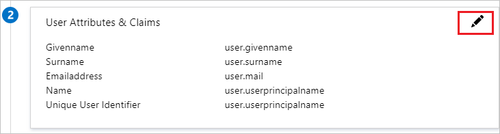

1. Edit Attributes and copy **Namespace** value of these attributes into the Notepad.

    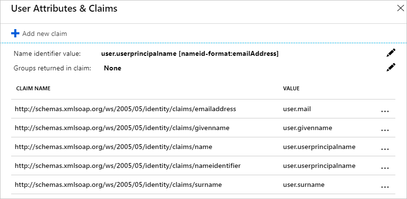

1. In addition to above, Amazon Business application expects few more attributes to be passed back in SAML response. In the **User Attributes & Claims** section on the **Group Claims** dialog, perform the following steps:

    1. Select the **pen** next to **Groups returned in claim**.

        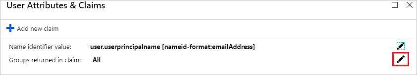

    1. In the **Group Claims** dialog, select **All Groups** from the radio list.

    1. Select **Group ID** as **Source attribute**.

    1. Check **Customize the name of the group claim** checkbox and enter the group name according to your Organization requirement.

    1. Select **Save**.

1. On the **Set up single sign-on with SAML** page, In the **SAML Signing Certificate** section, select copy button to copy **App Federation Metadata Url** and save it on your computer.

    

1. On the **Set up Amazon Business** section, copy the appropriate URLs based on your requirement.

    

[!INCLUDE [create-assign-users-sso.md](~/identity/saas-apps/includes/create-assign-users-sso.md)]

### Assign the Microsoft Entra Security Group in the Azure portal

1. Sign in to the [Microsoft Entra admin center](https://entra.microsoft.com) as at least a [Cloud Application Administrator](~/identity/role-based-access-control/permissions-reference.md#cloud-application-administrator).
1. Browse to **Entra ID** > **Enterprise apps** > **Amazon Business**.
2. In the applications list, type and select **Amazon Business**.
3. In the menu on the left, select **Users and groups**.
4. Select the **Added user**.
5. Search for the Security Group you want to use, then select the group to add it to the Select members section. Select **Select**, then select **Assign**.

    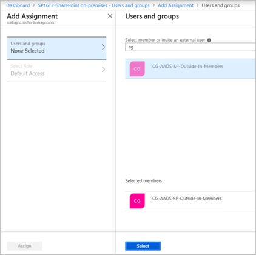

    > [!NOTE]
    > Check the notifications in the menu bar to be notified that the Group was successfully assigned to the Enterprise application.

## Configure Amazon Business SSO

1. In a different web browser window, sign in to your up Amazon Business company site as an administrator

1. Select the **User Profile** and select **Business Settings**.

    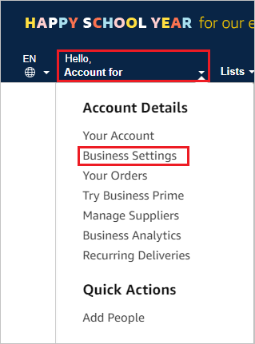

1. On the **System integrations** wizard, select **Single Sign-On (SSO)**.

    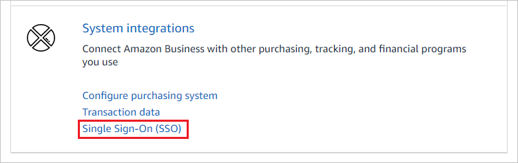

1. On the **Set up SSO** wizard, select the provider according to your Organizational requirements and select **Next**.

    > [!NOTE]
    > Although Microsoft ADFS is a listed option, it won't work with Microsoft Entra SSO.

1. On the **New user account defaults** wizard, select the **Default Group** and then select **Default Buying Role** according to user role in your Organization and select **Next**.

    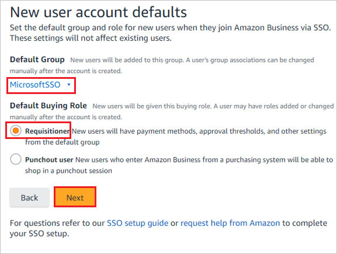

1. On the **Upload your metadata file** wizard, choose **Paste XML Link** option to paste the **App Federation Metadata URL** value, and select **Validate**.

    >[!NOTE]
    > Alternatively, you can also upload the **Federation Metadata XML** file by selecting the **Upload XML File** option.

1. After uploading the downloaded metadata file, the fields in the **Connection data** section populates automatically. After that select **Next**.

1. On the **Upload your Attribute statement** wizard, select **Skip**.

    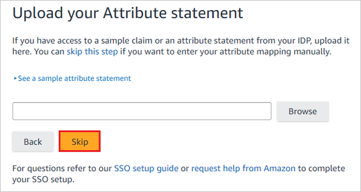

1. On the **Attribute mapping** wizard, add the requirement fields by selecting the **+ Add a field** option. Add the attribute values including the namespace, which you have copied from the **User Attributes & Claims** section of Azure portal into the  **SAML AttributeName** field, and select **Next**.

    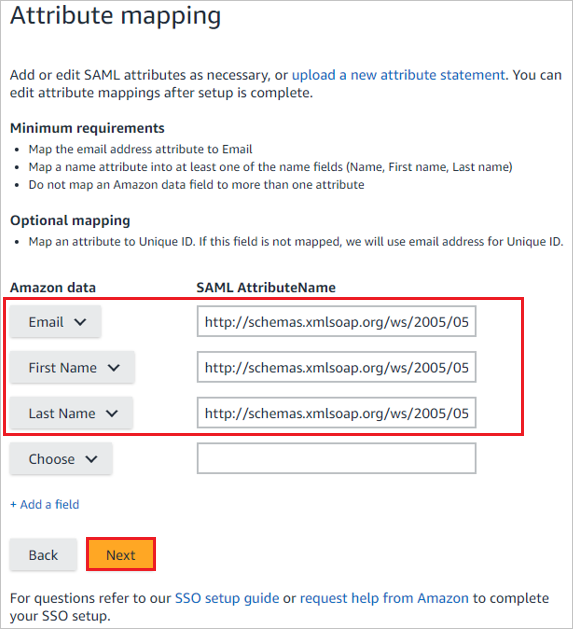

1. On the **Amazon connection data** wizard, please confirm your IDP has configured and select **Continue**.

    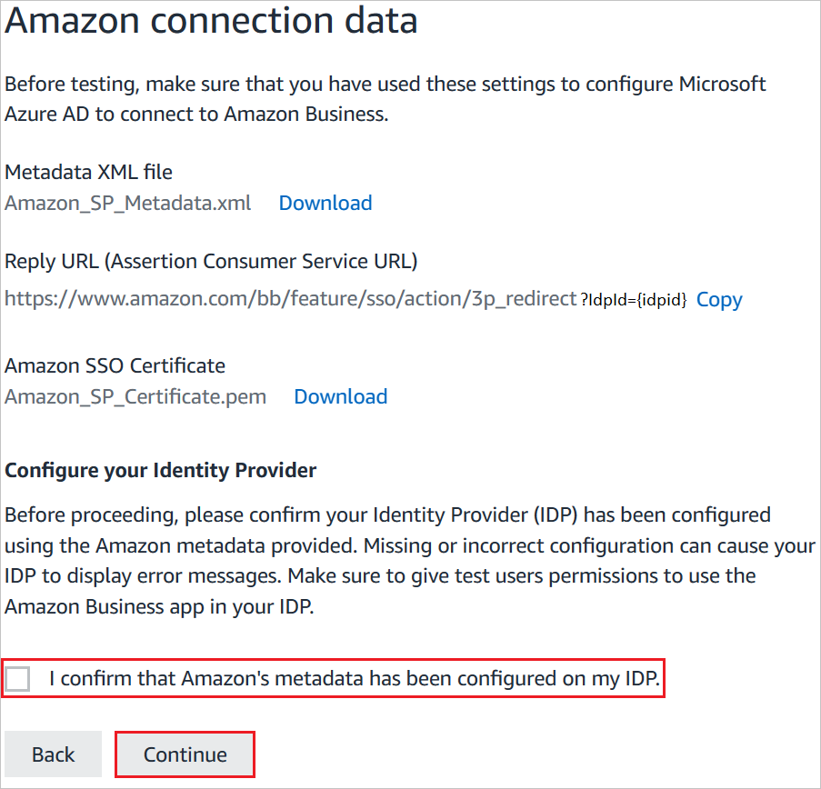

1. Check the **Status** of the steps that have been configured and select **Start testing**.

1. On the **Test SSO Connection** wizard, select **Test**.

    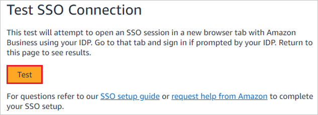

1. On the **IDP initiated URL** wizard, before you select **Activate**, copy the value, which is assigned to **idpid** and paste into the **idpid** parameter in the **Reply URL** in the **Basic SAML Configuration** section.

    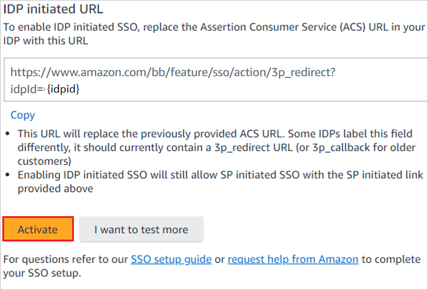

1. On the **Are you ready to switch to active  SSO?** wizard, check **I have fully tested SSO and am ready to go live** checkbox and select **Switch to active**.

    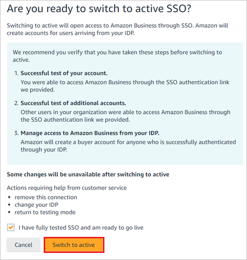

1. Finally in the **SSO Connection Details** section the **Status** is shown as **Active**.

    > [!NOTE]
    > If you want to configure the application in **SP** initiated mode, complete the following step, paste the sign-on URL from the screenshot above in the **Sign-on URL** text box of the **Set additional URLs** section. Use the following format:
    >
    > `https://www.amazon.<TLD>/bb/feature/sso/action/start?domain_hint=<UNIQUE_ID>`

### Create Amazon Business test user

In this section, a user called B.Simon is created in Amazon Business. Amazon Business supports just-in-time user provisioning, which is enabled by default. There's no action item for you in this section. If a user doesn't already exist in Amazon Business, a new one is created after authentication.

## Test SSO

In this section, you test your Microsoft Entra single sign-on configuration with following options. 

#### SP initiated:

* Select **Test this application**, this option redirects to Amazon Business Sign-on URL where you can initiate the sign-in flow.  

* Go to the Amazon Business Single Sign-on URL directly and initiate the sign-in flow from there.

#### IDP initiated:

* Select **Test this application**, and you should be automatically signed in to the Amazon Business for which you set up the SSO. 

You can also use Microsoft My Apps to test the application in any mode. When you select the Amazon Business tile in the My Apps, if configured in SP mode you would be redirected to the application sign-on page for initiating the sign-in flow and if configured in IDP mode, you should be automatically signed in to the Amazon Business for which you set up the SSO. For more information about the My Apps, see [Introduction to the My Apps](https://support.microsoft.com/account-billing/sign-in-and-start-apps-from-the-my-apps-portal-2f3b1bae-0e5a-4a86-a33e-876fbd2a4510).

## Reconfiguring Service Provider Settings from ADFS to Microsoft Entra ID

1. Prepare Microsoft Entra ID Environment
   1. Verify Microsoft Entra ID Premium Subscription
    Ensure you have a Microsoft Entra ID Premium subscription, which is required for single sign-on (SSO) and other advanced features.

1. Register the Application in Microsoft Entra ID
   1. Navigate to Microsoft Entra ID in the Azure portal.
   1. Select "App registrations" > "New registration".
   1. Fill in the required details: 
      1. Name: Enter a meaningful name for the application.
      1. Supported account types: Choose the appropriate option for your environment.
      1. Redirect URI: Enter the necessary redirect URIs (usually your application’s sign-in URL).
      
1. Configure Microsoft Entra ID SSO
   1. Set Up single sign-on in Microsoft Entra ID. 
   1. In the Azure portal, go to Microsoft Entra ID > Enterprise applications.
   1. Select your application from the list.
   1. Under "Manage", select "Single sign-on".
   1. Choose "SAML" as the Single Sign-On method.
   1. Edit the Basic SAML Configuration:
      1. Identifier (Entity ID): Enter the SP Entity ID.
      1. Reply URL (Assertion Consumer Service URL): Enter the SP ACS URL.
      1. Sign on URL: Enter the application sign-on URL if applicable.

1. Configure User Attributes & Claims
   1. In the SAML-based Sign-On settings, select "User Attributes & Claims".
   1. Edit and configure claims to match those required by your SP. Typically, this includes:
      1. NameIdentifier
      1. Email
      1. GivenName
      1. Surname
      1. etc.

1. Download Microsoft Entra ID SSO Metadata
1. In the SAML Signing Certificate section, download the Federation Metadata XML. This is used to configure your SP.

1. Reconfigure Service Provider (SP)
   1. Update SP to Use Microsoft Entra ID Metadata
   1. Access your SP’s configuration settings.
   1. Update the IdP metadata URL or upload the Microsoft Entra ID Metadata XML.
   1. Update the Assertion Consumer Service (ACS) URL, Entity ID, and any other required fields to match the Microsoft Entra ID configuration.

1. Configure SAML Certificates
1. Ensure that the SP is configured to trust the signing certificate from Microsoft Entra ID. This can be found in the SAML Signing Certificate section of the Microsoft Entra ID SSO configuration.
1. Test SSO Configuration
1. Initiate a test login from the SP.
1. Verify that the authentication redirects to Microsoft Entra ID and successfully logs in the user.
1. Check the claims being passed to ensure they match what the SP expects.
1. Update DNS and Network Settings (If Applicable). If your SP or application uses DNS settings specific to ADFS, you might need to update these settings to point to Microsoft Entra ID endpoints.
1. Roll out and Monitor
   1. Communicate with Users
      Notify your users of the change and provide any necessary instructions or documentation. 
   1. Monitor Authentication Logs
      Keep an eye on the Microsoft Entra ID sign-in logs to monitor for any authentication issues and address them promptly.

## Related content

Once you configure Amazon Business you can enforce session control, which protects exfiltration and infiltration of your organization’s sensitive data in real time. Session control extends from Conditional Access. [Learn how to enforce session control with Microsoft Defender for Cloud Apps](/cloud-app-security/proxy-deployment-aad).

### More resources
- [Microsoft Entra ID SSO Best Practices](/entra/identity/enterprise-apps/what-is-single-sign-on)
