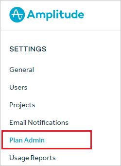
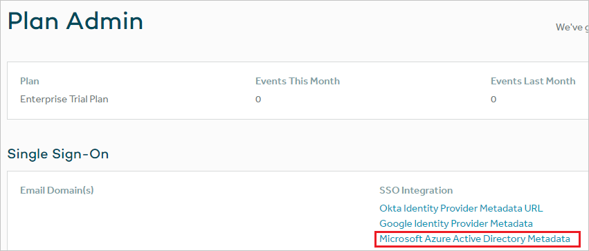
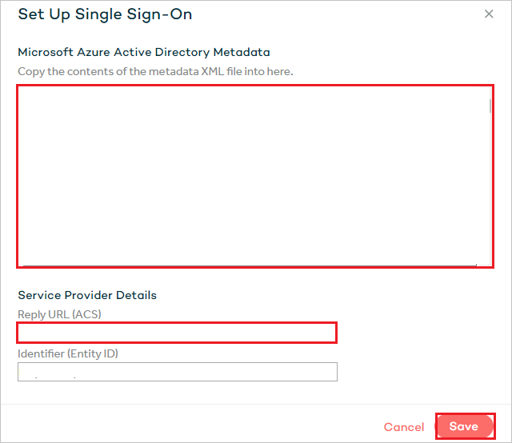

# Configure Amplitude for Single sign-on with Microsoft Entra ID

In this article,  you learn how to integrate Amplitude with Microsoft Entra ID. When you integrate Amplitude with Microsoft Entra ID, you can:

* Control in Microsoft Entra ID who has access to Amplitude.
* Enable your users to be automatically signed-in to Amplitude with their Microsoft Entra accounts.
* Manage your accounts in one central location.

## Prerequisites

The scenario outlined in this article assumes that you already have the following prerequisites:

[!INCLUDE [common-prerequisites.md](~/identity/saas-apps/includes/common-prerequisites.md)]
* Amplitude single sign-on (SSO) enabled subscription.

## Scenario description

In this article,  you configure and test Microsoft Entra SSO in a test environment.

* Amplitude supports **SP and IDP** initiated SSO.
* Amplitude supports **Just In Time** user provisioning.

> [!NOTE]
> Identifier of this application is a fixed string value so only one instance can be configured in one tenant.

## Add Amplitude from the gallery

To configure the integration of Amplitude into Microsoft Entra ID, you need to add Amplitude from the gallery to your list of managed SaaS apps.

1. Sign in to the [Microsoft Entra admin center](https://entra.microsoft.com) as at least a [Cloud Application Administrator](~/identity/role-based-access-control/permissions-reference.md#cloud-application-administrator).
1. Browse to **Entra ID** > **Enterprise apps** > **New application**.
1. In the **Add from the gallery** section, type **Amplitude** in the search box.
1. Select **Amplitude** from results panel and then add the app. Wait a few seconds while the app is added to your tenant.

 [!INCLUDE [sso-wizard.md](~/identity/saas-apps/includes/sso-wizard.md)]

## Configure and test Microsoft Entra SSO for Amplitude

Configure and test Microsoft Entra SSO with Amplitude using a test user called **B.Simon**. For SSO to work, you need to establish a link relationship between a Microsoft Entra user and the related user in Amplitude.

To configure and test Microsoft Entra SSO with Amplitude, perform the following steps:

1. **[Configure Microsoft Entra SSO](#configure-azure-ad-sso)** - to enable your users to use this feature.
    1. **Create a Microsoft Entra test user** - to test Microsoft Entra single sign-on with B.Simon.
    1. **Assign the Microsoft Entra test user** - to enable B.Simon to use Microsoft Entra single sign-on.
1. **[Configure Amplitude SSO](#configure-amplitude-sso)** - to configure the single sign-on settings on application side.
    1. **[Create Amplitude test user](#create-amplitude-test-user)** - to have a counterpart of B.Simon in Amplitude that's linked to the Microsoft Entra representation of user.
1. **[Test SSO](#test-sso)** - to verify whether the configuration works.

## Configure Microsoft Entra SSO

Follow these steps to enable Microsoft Entra SSO.

1. Sign in to the [Microsoft Entra admin center](https://entra.microsoft.com) as at least a [Cloud Application Administrator](~/identity/role-based-access-control/permissions-reference.md#cloud-application-administrator).
1. Browse to **Entra ID** > **Enterprise apps** > **Amplitude** > **Single sign-on**.
1. On the **Select a single sign-on method** page, select **SAML**.
1. On the **Set up single sign-on with SAML** page, select the pencil icon for **Basic SAML Configuration** to edit the settings.

   

1. On the **Basic SAML Configuration** section, if you wish to configure the application in **IDP** initiated mode, perform the following steps:

    a. In the **Identifier** text box, type the URL:
    `https://amplitude.com/saml/sso/metadata`

    b. In the **Reply URL** text box, type a URL using the following pattern:
    `https://analytics.amplitude.com/saml/sso/<UNIQUE_ID>`

    > [!NOTE]
	> The Reply URL value isn't  real. You gets the Reply URL value later in this article.

1. Select **Set additional URLs** and perform the following step if you wish to configure the application in **SP** initiated mode:

    In the **Sign-on URL** text box, type the URL:
    `https://analytics.amplitude.com/sso`

1. On the **Set up single sign-on with SAML** page, in the **SAML Signing Certificate** section,  find **Federation Metadata XML** and select **Download** to download the certificate and save it on your computer.

	

1. On the **Set up Amplitude** section, copy the appropriate URL(s) based on your requirement.

	

[!INCLUDE [create-assign-users-sso.md](~/identity/saas-apps/includes/create-assign-users-sso.md)]

## Configure Amplitude SSO

1. In a different web browser window, sign in to your Amplitude company site as an administrator

1. Select the **Plan Admin** from the left navigation bar.

	

1. Select **Microsoft Entra Metadata** from the **SSO Integration**.

	

1. On the **Set Up Single Sign-On** section, perform the following steps:

	

	a. Open the downloaded **Metadata Xml** from Azure portal in notepad, paste the content into the **Microsoft Entra Metadata** textbox.

	b. Copy the **Reply URL (ACS)** value and paste it into the **Reply URL** textbox of **Basic SAML Configuration**.

	c. Select **Save**

### Create Amplitude test user

In this section, a user called B.Simon is created in Amplitude. Amplitude supports just-in-time user provisioning, which is enabled by default. There's no action item for you in this section. If a user doesn't already exist in Amplitude, a new one is created after authentication.

> [!Note]
> If you need to create a user manually, contact [Amplitude support team](https://amplitude.zendesk.com).

## Test SSO

In this section, you test your Microsoft Entra single sign-on configuration with following options. 

#### SP initiated:

* Select **Test this application**, this option redirects to Amplitude Sign on URL where you can initiate the login flow.  

* Go to Amplitude Sign-on URL directly and initiate the login flow from there.

#### IDP initiated:

* Select **Test this application**, and you should be automatically signed in to the Amplitude for which you set up the SSO. 

You can also use Microsoft My Apps to test the application in any mode. When you select the Amplitude tile in the My Apps, if configured in SP mode you would be redirected to the application sign on page for initiating the login flow and if configured in IDP mode, you should be automatically signed in to the Amplitude for which you set up the SSO. For more information about the My Apps, see [Introduction to the My Apps](https://support.microsoft.com/account-billing/sign-in-and-start-apps-from-the-my-apps-portal-2f3b1bae-0e5a-4a86-a33e-876fbd2a4510).

## Related content

Once you configure Amplitude you can enforce session control, which protects exfiltration and infiltration of your organization’s sensitive data in real time. Session control extends from Conditional Access. [Learn how to enforce session control with Microsoft Defender for Cloud Apps](/cloud-app-security/proxy-deployment-aad).
