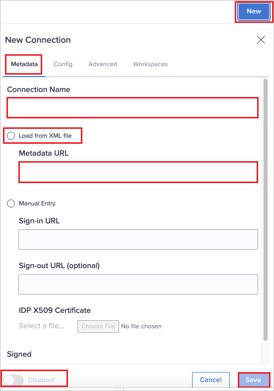
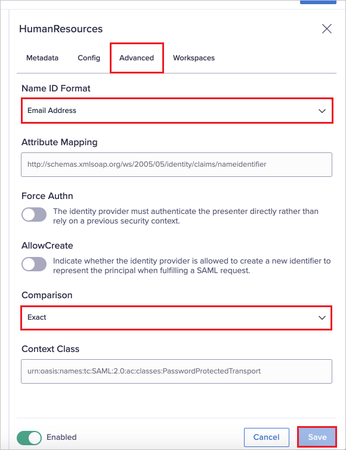
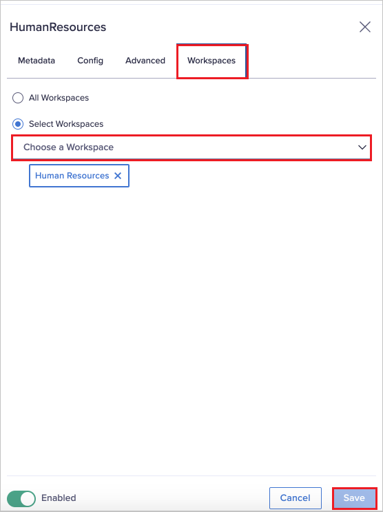

# Configure Anaplan for Single sign-on with Microsoft Entra ID

In this article,  you learn how to integrate Anaplan with Microsoft Entra ID. When you integrate Anaplan with Microsoft Entra ID, you can:

* Control in Microsoft Entra ID who has access to Anaplan.
* Enable your users to be automatically signed-in to Anaplan with their Microsoft Entra accounts.
* Manage your accounts in one central location.

## Prerequisites

The scenario outlined in this article assumes that you already have the following prerequisites:

[!INCLUDE [common-prerequisites.md](~/identity/saas-apps/includes/common-prerequisites.md)]
* Anaplan single sign-on (SSO) enabled subscription.

## Scenario description

In this article,  you configure and test Microsoft Entra single sign-on in a test environment.

* Anaplan supports **SP** initiated SSO.

## Add Anaplan from the gallery

To configure the integration of Anaplan into Microsoft Entra ID, you need to add Anaplan from the gallery to your list of managed SaaS apps.

1. Sign in to the [Microsoft Entra admin center](https://entra.microsoft.com) as at least a [Cloud Application Administrator](~/identity/role-based-access-control/permissions-reference.md#cloud-application-administrator).
1. Browse to **Entra ID** > **Enterprise apps** > **New application**.
1. In the **Add from the gallery** section, type **Anaplan** in the search box.
1. Select **Anaplan** from results panel and then add the app. Wait a few seconds while the app is added to your tenant.

 [!INCLUDE [sso-wizard.md](~/identity/saas-apps/includes/sso-wizard.md)]

## Configure and test Microsoft Entra SSO for Anaplan

Configure and test Microsoft Entra SSO with Anaplan using a test user called **B.Simon**. For SSO to work, you need to establish a link relationship between a Microsoft Entra user and the related user in Anaplan.

To configure and test Microsoft Entra SSO with Anaplan, perform the following steps:

1. **[Configure Microsoft Entra SSO](#configure-azure-ad-sso)** - to enable your users to use this feature.
    1. **Create a Microsoft Entra test user** - to test Microsoft Entra single sign-on with B.Simon.
    1. **Assign the Microsoft Entra test user** - to enable B.Simon to use Microsoft Entra single sign-on.
1. **[Configure Anaplan SSO](#configure-anaplan-sso)** - to configure the single sign-on settings on application side.
    1. **[Create Anaplan test user](#create-anaplan-test-user)** - to have a counterpart of B.Simon in Anaplan that's linked to the Microsoft Entra representation of user.
1. **[Test SSO](#test-sso)** - to verify whether the configuration works.

## Configure Microsoft Entra SSO

Follow these steps to enable Microsoft Entra SSO.

1. Sign in to the [Microsoft Entra admin center](https://entra.microsoft.com) as at least a [Cloud Application Administrator](~/identity/role-based-access-control/permissions-reference.md#cloud-application-administrator).
1. Browse to **Entra ID** > **Enterprise apps** > **Anaplan** > **Single sign-on**.
1. On the **Select a single sign-on method** page, select **SAML**.
1. On the **Set up Single Sign-On with SAML** page, in the **SAML Signing Certificate** section, select the copy icon to copy the **App Federation Metadata URL** and save this to use in the Anaplan SSO configuration.

    

## Configure Anaplan SSO

1. Log in to Anaplan website as an administrator.

1. In the Administration page, navigate to **Security > Single Sign-On**.

1. Select **New**.

1. Perform the following steps in the **Metadata** tab:

    

    a. Enter a **Connection Name**, should match the name of your connection in the identity provider interface.

    b. Select **Load from XML file** and paste the App Federation Metadata URL you into the **Metadata URL** textbox.

    c. Select **Save** to create the connection.
    
    d. Enable the connection by setting the **Enabled** toggle.

1. From the **Config** tab, copy the following values to save them back to the Azure portal:

    a. **Service Provider URL**.
    b. **Assertion Consumer Service URL**.
    c. **Entity ID**.
    

### Complete the Microsoft Entra SSO Configuration

1. On the **Set up single sign-on with SAML** page, select the pencil icon for **Basic SAML Configuration** to edit the settings.

   

1. On the **Basic SAML Configuration** section, perform the following steps:

    a. In the **Identifier (Entity ID)** text box, paste the Entity ID that you copied from above, in the format:
    `https://sdp.anaplan.com/<optional extension>`

    b. In the **Sign on URL** text box, paste the Service Provider URL that you copied from above, in the format:
    `https://us1a.app.anaplan.com/samlsp/<connection name>`
    
    c. In the **Reply URL (Assertion Consumer Service URL)** text box, paste the Assertion Consumer Service URL that you copied from above, in the format:
    `https://us1a.app.anaplan.com/samlsp/login/callback?connection=<connection name>`

### Complete the Anaplan SSO Configuration

1. Perform the following steps in the **Advanced** tab:

    

    a. Select **Name ID Format** as Email Address from the dropdown and keep the remaining values as default.

    b. Select **Save**.

1. In the **Workspaces** tab, specify the workspaces that use the identity provider from the dropdown and Select **Save**. 

    

    > [!NOTE]
    > Workspace connections are unique. If you have another connection already configured with a workspace, you can't associate that workspace with a new connection.
To access the original connection and update it, remove the workspace from the connection and then reassociate it with the new connection.

[!INCLUDE [create-assign-users-sso.md](~/identity/saas-apps/includes/create-assign-users-sso.md)]

### Create Anaplan test user

In this section, you create a user called Britta Simon in Anaplan. Work with [Anaplan support team](mailto:support@anaplan.com) to add the users in the Anaplan platform. Users must be created and activated before you use single sign-on.

## Test SSO

In this section, you test your Microsoft Entra single sign-on configuration with following options. 

* Select **Test this application**, this option redirects to Anaplan Sign-on URL where you can initiate the login flow. 

* Go to Anaplan Sign-on URL directly and initiate the login flow from there.

* You can use Microsoft My Apps. When you select the Anaplan tile in the My Apps, this option redirects to Anaplan Sign-on URL. For more information about the My Apps, see [Introduction to the My Apps](https://support.microsoft.com/account-billing/sign-in-and-start-apps-from-the-my-apps-portal-2f3b1bae-0e5a-4a86-a33e-876fbd2a4510).

## Related content

Once you configure Anaplan you can enforce session control, which protects exfiltration and infiltration of your organization’s sensitive data in real time. Session control extends from Conditional Access. [Learn how to enforce session control with Microsoft Defender for Cloud Apps](/cloud-app-security/proxy-deployment-any-app).
