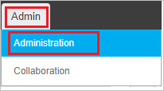

# Configure Andromeda for Single sign-on with Microsoft Entra ID

In this article,  you learn how to integrate Andromeda with Microsoft Entra ID. When you integrate Andromeda with Microsoft Entra ID, you can:

* Control in Microsoft Entra ID who has access to Andromeda.
* Enable your users to be automatically signed-in to Andromeda with their Microsoft Entra accounts.
* Manage your accounts in one central location.

## Prerequisites

The scenario outlined in this article assumes that you already have the following prerequisites:

[!INCLUDE [common-prerequisites.md](~/identity/saas-apps/includes/common-prerequisites.md)]
* Andromeda single sign-on enabled subscription.

## Scenario description

In this article,  you configure and test Microsoft Entra single sign-on in a test environment.

* Andromeda supports **SP and IDP** initiated SSO.
* Andromeda supports **Just In Time** user provisioning.

## Add Andromeda from the gallery

To configure the integration of Andromeda into Microsoft Entra ID, you need to add Andromeda from the gallery to your list of managed SaaS apps.

1. Sign in to the [Microsoft Entra admin center](https://entra.microsoft.com) as at least a [Cloud Application Administrator](~/identity/role-based-access-control/permissions-reference.md#cloud-application-administrator).
1. Browse to **Entra ID** > **Enterprise apps** > **New application**.
1. In the **Add from the gallery** section, type **Andromeda** in the search box.
1. Select **Andromeda** from results panel and then add the app. Wait a few seconds while the app is added to your tenant.

 [!INCLUDE [sso-wizard.md](~/identity/saas-apps/includes/sso-wizard.md)]

## Configure and test Microsoft Entra SSO for Andromeda

Configure and test Microsoft Entra SSO with Andromeda using a test user called **B.Simon**. For SSO to work, you need to establish a link relationship between a Microsoft Entra user and the related user in Andromeda.

To configure and test Microsoft Entra SSO with Andromeda, perform the following steps:

1. **[Configure Microsoft Entra SSO](#configure-azure-ad-sso)** - to enable your users to use this feature.
   1. **Create a Microsoft Entra test user** - to test Microsoft Entra single sign-on with Britta Simon.
   1. **Assign the Microsoft Entra test user** - to enable Britta Simon to use Microsoft Entra single sign-on.
2. **[Configure Andromeda SSO](#configure-andromeda-sso)** - to configure the Single Sign-On settings on application side.
   1. **[Create Andromeda test user](#create-andromeda-test-user)** - to have a counterpart of Britta Simon in Andromeda that's linked to the Microsoft Entra representation of user.
3. **[Test SSO](#test-sso)** - to verify whether the configuration works.

## Configure Microsoft Entra SSO

Follow these steps to enable Microsoft Entra SSO.

1. Sign in to the [Microsoft Entra admin center](https://entra.microsoft.com) as at least a [Cloud Application Administrator](~/identity/role-based-access-control/permissions-reference.md#cloud-application-administrator).
1. Browse to **Entra ID** > **Enterprise apps** > **Andromeda** > **Single sign-on**.
1. On the **Select a single sign-on method** page, select **SAML**.
1. On the **Set up single sign-on with SAML** page, select the pencil icon for **Basic SAML Configuration** to edit the settings.

   

1. On the **Basic SAML Configuration** section, if you wish to configure the application in **IDP** initiated mode, perform the following steps: 

   a. In the **Identifier** text box, type a URL using the following pattern:
   `https://<tenantURL>.ngcxpress.com/`

   b. In the **Reply URL** text box, type a URL using the following pattern:
   `https://<tenantURL>.ngcxpress.com/SAMLConsumer.aspx`

1. Select **Set additional URLs** and perform the following step if you wish to configure the application in **SP** initiated mode:

   In the **Sign-on URL** text box, type a URL using the following pattern:
   `https://<tenantURL>.ngcxpress.com/SAMLLogon.aspx`

   > [!NOTE]
   > These values aren't real. You update the value with the actual Identifier, Reply URL, and Sign-On URL which is explained later in the article.

1. Andromeda application expects the SAML assertions in a specific format. Configure the following claims for this application. You can manage the values of these attributes from the **User Attributes** section on application integration page. On the **Set up Single Sign-On with SAML** page, select **Edit** button to open **User Attributes** dialog.

   

   > [!NOTE]
   > Clear out the NameSpace definitions while setting these up.

1. In the **User Claims** section on the **User Attributes** dialog, edit the claims by using **Edit icon** or add the claims by using **Add new claim** to configure SAML token attribute as shown in the image above and perform the following steps:

   | Name    | Source Attribute  |
   | ------- | ----------------- |
   | role    | App specific role |
   | type    | App Type          |
   | company | CompanyName       |

   > [!NOTE]
   > Andromeda expects roles for users assigned to the application. Please set up these roles in Microsoft Entra ID so that users can be assigned the appropriate roles. To understand how to configure roles in Microsoft Entra ID, see [here](~/identity-platform/howto-add-app-roles-in-apps.md#app-roles-ui).

   a. Select **Add new claim** to open the **Manage user claims** dialog.

   

   

   b. In the **Name** textbox, type the attribute name shown for that row.

   c. Leave the **Namespace** blank.

   d. Select Source as **Attribute**.

   e. From the **Source attribute** list, type the attribute value shown for that row.

   f. Select **Ok**

   g. Select **Save**.

1. On the **Set up Single Sign-On with SAML** page, in the **SAML Signing Certificate** section, select **Download** to download the **Certificate (Base64)** from the given options as per your requirement and save it on your computer.

   

1. On the **Set up Andromeda** section, copy the appropriate URL(s) as per your requirement.

   

[!INCLUDE [create-assign-users-sso.md](~/identity/saas-apps/includes/create-assign-users-sso.md)]

### Configure Andromeda SSO

1. Sign-on to your Andromeda company site as administrator.

2. On the top of the menu bar select **Admin** and navigate to **Administration**.

   

3. On the left side of tool bar under **Interfaces** section, select **SAML Configuration**.

   

4. On the **SAML Configuration** section page, perform the following steps:

   

   a. Check **Enable SSO with SAML**.

   b. Under **Andromeda Information** section, copy the **SP Identity** value and paste it into the **Identifier** textbox of **Basic SAML Configuration** section.

   c. Copy the **Consumer URL** value and paste it into the **Reply URL** textbox of **Basic SAML Configuration** section.

   d. Copy the **Logon URL** value and paste it into the **Sign-on URL** textbox of **Basic SAML Configuration** section.

   e. Under **SAML Identity Provider** section, type your IDP Name.

   f. In the **Single Sign On End Point** textbox, paste the value of **Login URL** which, you copied previously.

   g. Open the downloaded **Base64 encoded certificate** from Azure portal in notepad, paste it into the **X 509 Certificate** textbox.

   h. Map the following attributes with the respective value to facilitate SSO login from Microsoft Entra ID. The **User ID** attribute is required for logging in. For provisioning, **Email**, **Company**, **UserType**, and **Role** are required. In this section, we define attributes mapping (name and values) which correlate to those defined within Azure portal.

   

   i. Select **Save**.

### Create Andromeda test user

In this section, a user called Britta Simon is created in Andromeda. Andromeda supports just-in-time user provisioning, which is enabled by default. There's no action item for you in this section. If a user doesn't already exist in Andromeda, a new one is created after authentication. If you need to create a user manually, contact Andromeda Client support team.

## Test SSO

In this section, you test your Microsoft Entra single sign-on configuration with following options.

#### SP initiated:

* Select **Test this application**, this option redirects to Andromeda Sign on URL where you can initiate the login flow.

* Go to Andromeda Sign-on URL directly and initiate the login flow from there.

#### IDP initiated:

* Select **Test this application**, and you should be automatically signed in to the Andromeda for which you set up the SSO

* You can also use Microsoft My Apps to test the application in any mode. When you select the Andromeda tile in the My Apps, if configured in SP mode you would be redirected to the application sign on page for initiating the login flow and if configured in IDP mode, you should be automatically signed in to the Andromeda for which you set up the SSO. For more information about the My Apps, see [Introduction to the My Apps](https://support.microsoft.com/account-billing/sign-in-and-start-apps-from-the-my-apps-portal-2f3b1bae-0e5a-4a86-a33e-876fbd2a4510).

## Related content

Once you configure Andromeda you can enforce session control, which protects exfiltration and infiltration of your organization’s sensitive data in real time. Session control extends from Conditional Access. [Learn how to enforce session control with Microsoft Defender for Cloud Apps](/cloud-app-security/proxy-deployment-any-app).
