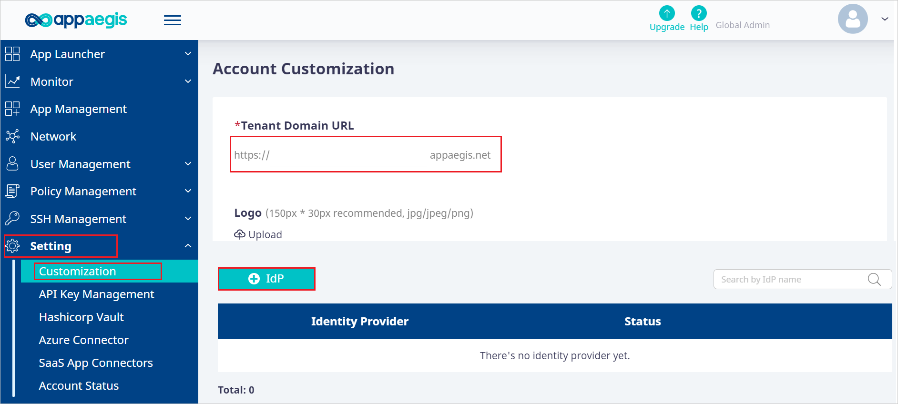
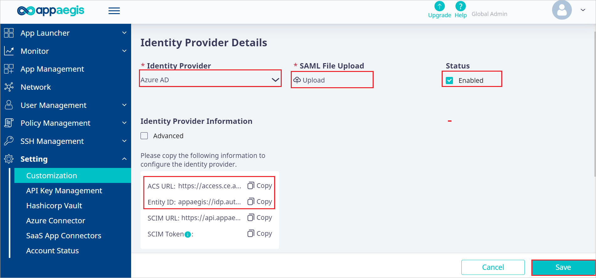

# Configure Appaegis Isolation Access Cloud for Single sign-on with Microsoft Entra ID

In this article,  you learn how to integrate Appaegis Isolation Access Cloud with Microsoft Entra ID. When you integrate Appaegis Isolation Access Cloud with Microsoft Entra ID, you can:

* Control in Microsoft Entra ID who has access to Appaegis Isolation Access Cloud.
* Enable your users to be automatically signed-in to Appaegis Isolation Access Cloud with their Microsoft Entra accounts.
* Manage your accounts in one central location.

## Prerequisites

The scenario outlined in this article assumes that you already have the following prerequisites:

[!INCLUDE [common-prerequisites.md](~/identity/saas-apps/includes/common-prerequisites.md)]
* Appaegis Isolation Access Cloud single sign-on (SSO) enabled subscription.

## Scenario description

In this article,  you configure and test Microsoft Entra SSO in a test environment.

* Appaegis Isolation Access Cloud supports **SP and IDP** initiated SSO.
* Appaegis Isolation Access Cloud supports **Just In Time** user provisioning.

## Adding Appaegis Isolation Access Cloud from the gallery

To configure the integration of Appaegis Isolation Access Cloud into Microsoft Entra ID, you need to add Appaegis Isolation Access Cloud from the gallery to your list of managed SaaS apps.

1. Sign in to the [Microsoft Entra admin center](https://entra.microsoft.com) as at least a [Cloud Application Administrator](~/identity/role-based-access-control/permissions-reference.md#cloud-application-administrator).
1. Browse to **Entra ID** > **Enterprise apps** > **New application**.
1. In the **Add from the gallery** section, type **Appaegis Isolation Access Cloud** in the search box.
1. Select **Appaegis Isolation Access Cloud** from results panel and then add the app. Wait a few seconds while the app is added to your tenant.

 [!INCLUDE [sso-wizard.md](~/identity/saas-apps/includes/sso-wizard.md)]

## Configure and test Microsoft Entra SSO for Appaegis Isolation Access Cloud

Configure and test Microsoft Entra SSO with Appaegis Isolation Access Cloud using a test user called **B.Simon**. For SSO to work, you need to establish a link relationship between a Microsoft Entra user and the related user in Appaegis Isolation Access Cloud.

To configure and test Microsoft Entra SSO with Appaegis Isolation Access Cloud, perform the following steps:

1. **[Configure Microsoft Entra SSO](#configure-azure-ad-sso)** - to enable your users to use this feature.
    1. **Create a Microsoft Entra test user** - to test Microsoft Entra single sign-on with B.Simon.
    1. **Assign the Microsoft Entra test user** - to enable B.Simon to use Microsoft Entra single sign-on.
1. **[Configure Appaegis Isolation Access Cloud SSO](#configure-appaegis-isolation-access-cloud-sso)** - to configure the single sign-on settings on application side.
    1. **[Create Appaegis Isolation Access Cloud test user](#create-appaegis-isolation-access-cloud-test-user)** - to have a counterpart of B.Simon in Appaegis Isolation Access Cloud that's linked to the Microsoft Entra representation of user.
1. **[Test SSO](#test-sso)** - to verify whether the configuration works.

## Configure Microsoft Entra SSO

Follow these steps to enable Microsoft Entra SSO.

1. Sign in to the [Microsoft Entra admin center](https://entra.microsoft.com) as at least a [Cloud Application Administrator](~/identity/role-based-access-control/permissions-reference.md#cloud-application-administrator).
1. Browse to **Entra ID** > **Enterprise apps** > **Appaegis Isolation Access Cloud** > **Single sign-on**.
1. On the **Select a single sign-on method** page, select **SAML**.
1. On the **Set up single sign-on with SAML** page, select the pencil icon for **Basic SAML Configuration** to edit the settings.

   

1. On the **Basic SAML Configuration** section, the user doesn't have to perform any step as the app is already pre-integrated with Azure.

1. Select **Set additional URLs** and perform the following steps if you wish to configure the application in **SP** initiated mode:

    a. In the **Sign-on URL** text box, type a URL using the following pattern:
    `https://<SUBDOMAIN>.appaegis.net`

    b. In the **Relay State** text box, type a value using the following pattern:
    `<RelayState>`

    > [!NOTE]
    > These values aren't real. Update these values with the actual Sign-on URL and Relay State. Contact [Appaegis Isolation Access Cloud Client support team](mailto:support@appaegis.com) to get these values. You can also refer to the patterns shown in the **Basic SAML Configuration** section.

1. Appaegis Isolation Access Cloud application expects the SAML assertions in a specific format, which requires you to add custom attribute mappings to your SAML token attributes configuration. The following screenshot shows the list of default attributes.

	

1. In addition to above, Appaegis Isolation Access Cloud application expects few more attributes to be passed back in SAML response which are shown below. These attributes are also pre-populated but you can review them as per your requirements.
	
	| Name | Source Attribute |
	| ---------| --------- |
	| email | user.userprincipalname |

1. On the **Set up single sign-on with SAML** page, in the **SAML Signing Certificate** section,  find **Federation Metadata XML** and select **Download** to download the certificate and save it on your computer.

	

1. On the **Set up Appaegis Isolation Access Cloud** section, copy the appropriate URL(s) based on your requirement.

	

[!INCLUDE [create-assign-users-sso.md](~/identity/saas-apps/includes/create-assign-users-sso.md)]

## Configure Appaegis Isolation Access Cloud SSO

1. Log in to your Appaegis Isolation Access Cloud company site as an administrator.

1. Go to **Setting** > **Customization**, type a **Tenant Domain URL** in the textbox and select **+IdP** button.

    

1. In the **Identity Provider Details** page, perform the following steps.

     

    1. Select **Microsoft Entra ID** from the dropdown in the **Identity Provider**.

    1. Copy **ACS URL** value, paste this value into the **Reply URL** text box in the **Basic SAML Configuration** section.

    1. Copy **Entity ID** value, paste this value into the **Identifier** text box in the **Basic SAML Configuration** section.

    1. Open the downloaded **Federation Metadata XML** into Notepad and upload the file into the **SAML File Upload**.

    1. Enabled the **Status** checkbox and select **Save**.

### Create Appaegis Isolation Access Cloud test user

In this section, a user called Britta Simon is created in Appaegis Isolation Access Cloud. Appaegis Isolation Access Cloud supports just-in-time user provisioning, which is enabled by default. There's no action item for you in this section. If a user doesn't already exist in Appaegis Isolation Access Cloud, a new one is created after authentication.

## Test SSO 

In this section, you test your Microsoft Entra single sign-on configuration with following options. 

#### SP initiated:

* Select **Test this application**, this option redirects to Appaegis Isolation Access Cloud Sign on URL where you can initiate the login flow.  

* Go to Appaegis Isolation Access Cloud Sign-on URL directly and initiate the login flow from there.

#### IDP initiated:

* Select **Test this application**, and you should be automatically signed in to the Appaegis Isolation Access Cloud for which you set up the SSO. 

You can also use Microsoft My Apps to test the application in any mode. When you select the Appaegis Isolation Access Cloud tile in the My Apps, if configured in SP mode you would be redirected to the application sign on page for initiating the login flow and if configured in IDP mode, you should be automatically signed in to the Appaegis Isolation Access Cloud for which you set up the SSO. For more information, see [Microsoft Entra My Apps](/azure/active-directory/manage-apps/end-user-experiences#azure-ad-my-apps).

## Related content

Once you configure Appaegis Isolation Access Cloud you can enforce session control, which protects exfiltration and infiltration of your organization’s sensitive data in real time. Session control extends from Conditional Access. [Learn how to enforce session control with Microsoft Defender for Cloud Apps](/cloud-app-security/proxy-deployment-aad).
