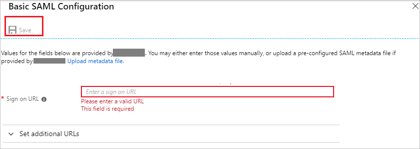

# Configure AppBlade for Single sign-on with Microsoft Entra ID

In this article,  you learn how to integrate AppBlade with Microsoft Entra ID.
Integrating AppBlade with Microsoft Entra ID provides you with the following benefits:

* You can control in Microsoft Entra ID who has access to AppBlade.
* You can enable your users to be automatically signed-in to AppBlade (Single Sign-On) with their Microsoft Entra accounts.
* You can manage your accounts in one central location.

If you want to know more details about SaaS app integration with Microsoft Entra ID, see [What is application access and single sign-on with Microsoft Entra ID](~/identity/enterprise-apps/what-is-single-sign-on.md).
If you don't have an Azure subscription, [create a free account](https://azure.microsoft.com/free/) before you begin.

## Prerequisites

The scenario outlined in this article assumes that you already have the following prerequisites:

[!INCLUDE [common-prerequisites.md](~/identity/saas-apps/includes/common-prerequisites.md)]
* AppBlade single sign-on enabled subscription

## Scenario description

In this article,  you configure and test Microsoft Entra single sign-on in a test environment.

* AppBlade supports **SP** initiated SSO
* AppBlade supports **Just In Time** user provisioning

## Adding AppBlade from the gallery

To configure the integration of AppBlade into Microsoft Entra ID, you need to add AppBlade from the gallery to your list of managed SaaS apps.

**To add AppBlade from the gallery, perform the following steps:**

1. Sign in to the [Microsoft Entra admin center](https://entra.microsoft.com) as at least a [Cloud Application Administrator](~/identity/role-based-access-control/permissions-reference.md#cloud-application-administrator).
1. Browse to **Entra ID** > **Enterprise apps** > **New application**.
1. In the **Add from the gallery** section, type **AppBlade**, select **AppBlade** from result panel then select **Add** button to add the application.

    

## Configure and test Microsoft Entra single sign-on

In this section, you configure and test Microsoft Entra single sign-on with AppBlade based on a test user called **Britta Simon**.
For single sign-on to work, a link relationship between a Microsoft Entra user and the related user in AppBlade needs to be established.

To configure and test Microsoft Entra single sign-on with AppBlade, you need to complete the following building blocks:

1. **[Configure Microsoft Entra Single Sign-On](#configure-azure-ad-single-sign-on)** - to enable your users to use this feature.
2. **[Configure AppBlade Single Sign-On](#configure-appblade-single-sign-on)** - to configure the Single Sign-On settings on application side.
3. **Create a Microsoft Entra test user** - to test Microsoft Entra single sign-on with Britta Simon.
4. **Assign the Microsoft Entra test user** - to enable Britta Simon to use Microsoft Entra single sign-on.
5. **[Create AppBlade test user](#create-appblade-test-user)** - to have a counterpart of Britta Simon in AppBlade that's linked to the Microsoft Entra representation of user.
6. **[Test single sign-on](#test-single-sign-on)** - to verify whether the configuration works.

### Configure Microsoft Entra single sign-on

In this section, you enable Microsoft Entra single sign-on.

To configure Microsoft Entra single sign-on with AppBlade, perform the following steps:

1. Sign in to the [Microsoft Entra admin center](https://entra.microsoft.com) as at least a [Cloud Application Administrator](~/identity/role-based-access-control/permissions-reference.md#cloud-application-administrator).
1. Browse to **Entra ID** > **Enterprise apps** > **AppBlade** application integration page, select **Single sign-on**.

    

1. On the **Select a Single sign-on method** dialog, select **SAML/WS-Fed** mode to enable single sign-on.

    

1. On the **Set up Single Sign-On with SAML** page, select **Edit** icon to open **Basic SAML Configuration** dialog.

    

1. On the **Basic SAML Configuration** section, perform the following steps:

    

    In the **Sign-on URL** text box, type a URL using the following pattern:
    `https://<companyname>.appblade.com/saml/<tenantid>`

    > [!NOTE]
    > The value isn't  real. Update the value with the actual Sign-On URL. Contact [AppBlade Client support team](mailto:support@appblade.com) to get the value. You can also refer to the patterns shown in the **Basic SAML Configuration** section.

1. On the **Set up Single Sign-On with SAML** page, in the **SAML Signing Certificate** section, select **Download** to download the **Federation Metadata XML** from the given options as per your requirement and save it on your computer.

    

1. On the **Set up AppBlade** section, copy the appropriate URL(s) as per your requirement.

    

    a. Login URL

    b. Microsoft Entra Identifier

    c. Logout URL

### Configure AppBlade Single Sign-On

To configure single sign-on on **AppBlade** side, you need to send the downloaded **Federation Metadata XML** and appropriate copied URLs from the application configuration to [AppBlade support team](mailto:support@appblade.com). Also, please ask them to configure the **SSO Issuer URL** as `https://appblade.com/saml`. This setting is required for single sign-on to work.

[!INCLUDE [create-assign-users-sso.md](~/identity/saas-apps/includes/create-assign-users-sso.md)]

### Create AppBlade test user

The objective of this section is to create a user called Britta Simon in AppBlade. AppBlade supports just-in-time provisioning, which is by default enabled. **Make sure that your domain name is configured with AppBlade for user provisioning. After that only the just-in-time user provisioning works.**

If the user has an email address ending with the domain configured by AppBlade for your account, then the user automatically joins the account as a member with the permission level you specify, which is one of "Basic" (a basic user who can only install applications), "Team Member" (a user who can upload new app versions and manage projects), or "Administrator" (full admin privileges to the account). Normally one would choose Basic and then promote users manually via an Admin login (AppBlade needs to configure either an email-based admin login in advance or promote a user on behalf of the customer after login).

There's no action item for you in this section. A new user is created during an attempt to access AppBlade if it doesn't exist yet.

> [!NOTE]
> If you need to create a user manually, you need to contact the [AppBlade support team](mailto:support@appblade.com).

### Test single sign-on

In this section, you test your Microsoft Entra single sign-on configuration using the Access Panel.

When you select the AppBlade tile in the Access Panel, you should be automatically signed in to the AppBlade for which you set up SSO. For more information about the Access Panel, see [Introduction to the Access Panel](https://support.microsoft.com/account-billing/sign-in-and-start-apps-from-the-my-apps-portal-2f3b1bae-0e5a-4a86-a33e-876fbd2a4510).

## Additional Resources

- [List of articles on How to Integrate SaaS Apps with Microsoft Entra ID](./tutorial-list.md)

- [What is application access and single sign-on with Microsoft Entra ID?](~/identity/enterprise-apps/what-is-single-sign-on.md)

- [What is Conditional Access in Microsoft Entra ID?](~/identity/conditional-access/overview.md)
