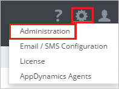
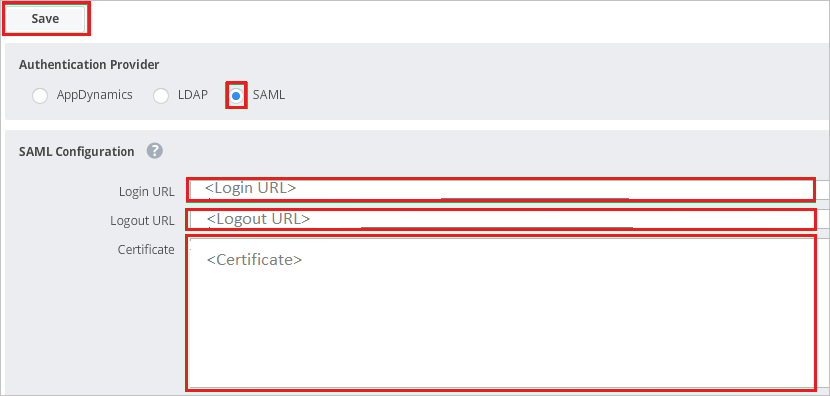

# Configure AppDynamics for Single sign-on with Microsoft Entra ID

In this article,  you learn how to integrate AppDynamics with Microsoft Entra ID. When you integrate AppDynamics with Microsoft Entra ID, you can:

* Control in Microsoft Entra ID who has access to AppDynamics.
* Enable your users to be automatically signed-in to AppDynamics with their Microsoft Entra accounts.
* Manage your accounts in one central location.

## Prerequisites

The scenario outlined in this article assumes that you already have the following prerequisites:

[!INCLUDE [common-prerequisites.md](~/identity/saas-apps/includes/common-prerequisites.md)]
* AppDynamics single sign-on (SSO) enabled subscription.

## Scenario description

In this article,  you configure and test Microsoft Entra single sign-on in a test environment.

* AppDynamics supports **SP** initiated SSO.

* AppDynamics supports **Just In Time** user provisioning.

## Add AppDynamics from the gallery

To configure the integration of AppDynamics into Microsoft Entra ID, you need to add AppDynamics from the gallery to your list of managed SaaS apps.

1. Sign in to the [Microsoft Entra admin center](https://entra.microsoft.com) as at least a [Cloud Application Administrator](~/identity/role-based-access-control/permissions-reference.md#cloud-application-administrator).
1. Browse to **Entra ID** > **Enterprise apps** > **New application**.
1. In the **Add from the gallery** section, type **AppDynamics** in the search box.
1. Select **AppDynamics** from results panel and then add the app. Wait a few seconds while the app is added to your tenant.

 [!INCLUDE [sso-wizard.md](~/identity/saas-apps/includes/sso-wizard.md)]

## Configure and test Microsoft Entra SSO for AppDynamics

Configure and test Microsoft Entra SSO with AppDynamics using a test user called **B.Simon**. For SSO to work, you need to establish a link relationship between a Microsoft Entra user and the related user in AppDynamics.

To configure and test Microsoft Entra SSO with AppDynamics, perform the following steps:

1. **[Configure Microsoft Entra SSO](#configure-azure-ad-sso)** - to enable your users to use this feature.
    1. **Create a Microsoft Entra test user** - to test Microsoft Entra single sign-on with B.Simon.
    1. **Assign the Microsoft Entra test user** - to enable B.Simon to use Microsoft Entra single sign-on.
1. **[Configure AppDynamics SSO](#configure-appdynamics-sso)** - to configure the single sign-on settings on application side.
    1. **[Create AppDynamics test user](#create-appdynamics-test-user)** - to have a counterpart of B.Simon in AppDynamics that's linked to the Microsoft Entra representation of user.
1. **[Test SSO](#test-sso)** - to verify whether the configuration works.

## Configure Microsoft Entra SSO

Follow these steps to enable Microsoft Entra SSO.

1. Sign in to the [Microsoft Entra admin center](https://entra.microsoft.com) as at least a [Cloud Application Administrator](~/identity/role-based-access-control/permissions-reference.md#cloud-application-administrator).
1. Browse to **Entra ID** > **Enterprise apps** > **AppDynamics** > **Single sign-on**.
1. On the **Select a single sign-on method** page, select **SAML**.
1. On the **Set up single sign-on with SAML** page, select the pencil icon for **Basic SAML Configuration** to edit the settings.

   

1. On the **Basic SAML Configuration** section, perform the following steps:

    a. In the **Identifier (Entity ID)** text box, type a URL using the following pattern:
    `https://<companyname>.saas.appdynamics.com/controller`

    b. In the **Reply URL (Assertion Consumer Service URL)** text box, type a URL using the following pattern:
    `https://<companyname>.saas.appdynamics.com/controller/saml-auth?accountName=<companyname>`

    c. In the **Sign on URL** text box, type a URL using the following pattern:
    `https://<companyname>.saas.appdynamics.com/?accountName=<companyname>`

    > [!NOTE]
    > These values aren't real. Update these values with the actual Identifier, Reply URL and Sign on URL. Contact [AppDynamics Client support team](https://www.appdynamics.com/support/) to get these values. You can also refer to the patterns shown in the **Basic SAML Configuration** section.

1. On the **Set up Single Sign-On with SAML** page, in the **SAML Signing Certificate** section, select **Download** to download the **Certificate (Base64)** from the given options as per your requirement and save it on your computer.

    

1. On the **Set up AppDynamics** section, copy the appropriate URL(s) as per your requirement.

    

[!INCLUDE [create-assign-users-sso.md](~/identity/saas-apps/includes/create-assign-users-sso.md)]

## Configure AppDynamics SSO

1. In a different web browser window, log in to your AppDynamics company site as an administrator.

1. In the toolbar on the top, select **Settings**, and then select **Administration**.

    

1. Select the **Authentication Provider** tab.

    

1. In the **Authentication Provider** section, perform the following steps:

    

   a. As **Authentication Provider**, select **SAML**.

   b. In the **Login URL** textbox, paste the value of **Login URL**..

   c. In the **Logout URL** textbox, paste the value of **Logout URL**..

   d. Open your base-64 encoded certificate in notepad, copy the content of it into your clipboard, and then paste it to the **Certificate** textbox

   e. Select **Save**.

### Create AppDynamics test user

In this section, a user called B.Simon is created in AppDynamics. AppDynamics supports just-in-time user provisioning, which is enabled by default. There's no action item for you in this section. If a user doesn't already exist in AppDynamics, a new one is created after authentication.

## Test SSO

In this section, you test your Microsoft Entra single sign-on configuration with following options. 

* Select **Test this application**, this option redirects to AppDynamics Sign-on URL where you can initiate the login flow. 

* Go to AppDynamics Sign-on URL directly and initiate the login flow from there.

* You can use Microsoft My Apps. When you select the AppDynamics tile in the My Apps, this option redirects to AppDynamics Sign-on URL. For more information about the My Apps, see [Introduction to the My Apps](https://support.microsoft.com/account-billing/sign-in-and-start-apps-from-the-my-apps-portal-2f3b1bae-0e5a-4a86-a33e-876fbd2a4510).

## Related content

Once you configure AppDynamics you can enforce session control, which protects exfiltration and infiltration of your organization’s sensitive data in real time. Session control extends from Conditional Access. [Learn how to enforce session control with Microsoft Defender for Cloud Apps](/cloud-app-security/proxy-deployment-any-app).
